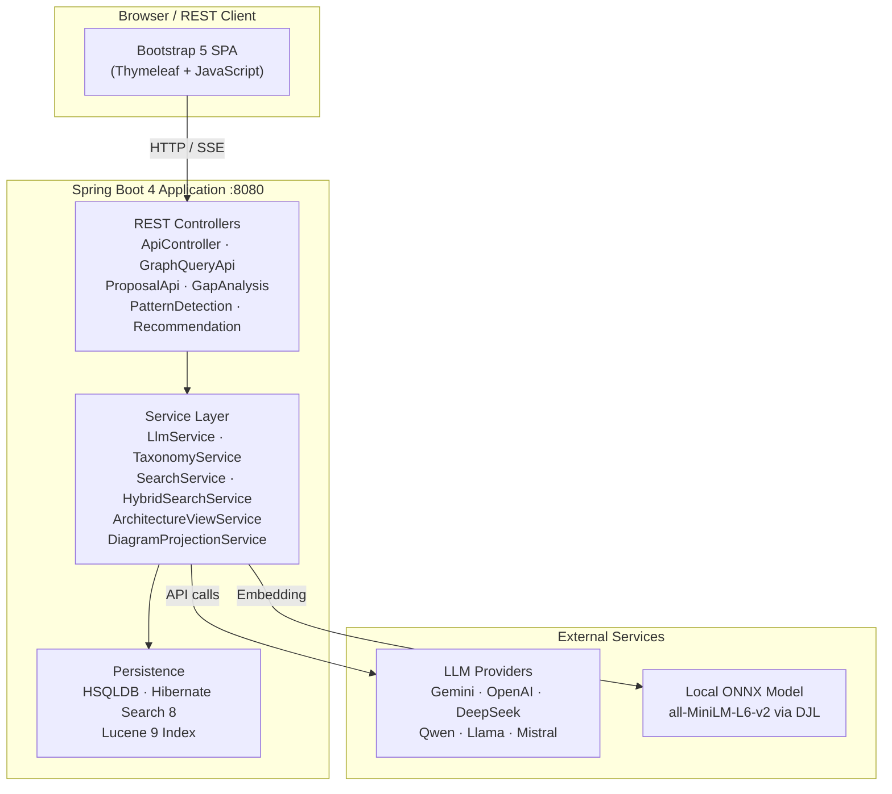
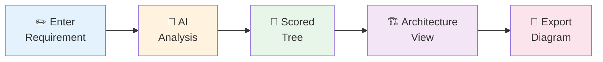

# NATO NC3T Taxonomy Browser

[](https://github.com/carstenartur/Taxonomy/actions/workflows/ci-cd.yml)
[](https://carstenartur.github.io/Taxonomy/coverage/)
[](https://carstenartur.github.io/Taxonomy/tests/surefire-report.html)
[](LICENSE)

**An AI-assisted system that derives architecture insights from requirements.**

The system maps free-text business requirements to the NATO C3 Taxonomy, discovers relationships between architecture elements, and generates architecture views and diagrams — all in one step.

> **Requirement → Taxonomy Matching → Architecture Insight → Architecture Diagram**


### Quick Example

> _"Provide secure voice communications for deployed forces."_

| Category | Matched Taxonomy Element |
|---|---|
| **Capability** | Secure Communications Capability |
| **Service** | Secure Voice Service |
| **Process** | Conduct Operations |
| **Application** | Operations Coordination System |

The system scores every taxonomy node, selects the most relevant elements, propagates relevance through their relations, and generates a complete architecture view — ready for export.

<details>
<summary><strong>Scored taxonomy tree</strong></summary>


</details>

<details>
<summary><strong>Architecture view</strong></summary>


</details>

<details>
<summary><strong>Diagram export</strong></summary>


</details>

---

## Table of Contents

- [Why This Project Exists](#why-this-project-exists)
- [Key Features](#key-features)
- [Architecture Overview](#architecture-overview)
- [Typical Workflow](#typical-workflow)
- [Prerequisites](#prerequisites)
- [Installation & Running](#installation--running)
- [Example Usage](#example-usage)
- [API Overview](#api-overview)
- [Export Formats](#export-formats)
- [Repository Structure](#repository-structure)
- [Documentation](#documentation)
- [Contributing](#contributing)
- [License](#license)

---

## Why This Project Exists

Architecture analysis often starts with vague requirements. The NATO C3 Taxonomy Catalogue (Baseline 7) contains approximately **2,500 nodes** across 8 taxonomy sheets — covering Business Processes, Business Roles, Capabilities, COI Services, Communications Services, Core Services, Information Products, and User Applications. Navigating this hierarchy and mapping a plain-text mission or business requirement to the correct taxonomy elements is time-consuming and error-prone when done manually.

This project bridges the gap between requirements and architecture by automatically identifying relevant architecture elements and their relationships. It does so by:

1. Loading the full catalogue from the bundled Excel workbook into an **embedded HSQLDB** database at startup — no external database required.
2. Providing a **collapsible tree browser** (Bootstrap 5) with five view modes (List, Tabs, Sunburst, Tree, Decision Map).
3. Using an **AI language model** to score every taxonomy node against a user's free-text requirement and overlaying results on the tree with colour-coded match percentages.
4. Automatically generating **architecture views** from scored results, complete with relevance propagation, gap analysis, and exportable diagrams.

---

## Key Features

- **Requirement → Taxonomy mapping** — AI scores every taxonomy node against your free-text requirement
- **Semantic and hybrid search** — full-text (Lucene), semantic (embedding KNN), hybrid (Reciprocal Rank Fusion), and graph-based search
- **Architecture relationship discovery** — automatic architecture views from scored results with relevance propagation
- **Architecture impact analysis** — upstream, downstream, and failure-impact neighbourhood queries
- **Relation proposals and review** — AI-generated relation proposals with human accept/reject workflow
- **Architecture graph exploration** — trace dependencies and discover gaps and patterns
- **Automatic architecture diagrams** — one-click export from scored taxonomy to structured diagrams
- **Export to Visio, ArchiMate, Mermaid and JSON** — industry-standard diagram formats for downstream tools

### Processing Pipeline

```
Requirement  →  Semantic Analysis  →  Taxonomy Matching  →  Architecture Graph  →  Architecture Views  →  Diagram Export
```

---

## Architecture Overview



**Technology stack:** Java 17, Spring Boot 4, HSQLDB, Hibernate Search 8, Lucene 9, Apache POI, DJL/ONNX Runtime, Bootstrap 5, Thymeleaf.

---

## Typical Workflow



1. **Describe your requirement** — enter a free-text business or mission requirement in the analysis panel.
2. **AI scores the taxonomy** — the configured LLM evaluates every taxonomy node and returns match percentages (0–100).
3. **Explore the scored tree** — results are overlaid on the taxonomy tree with green colour intensity proportional to the score. Switch between view modes for different perspectives.
4. **Generate an architecture view** — anchor nodes (score ≥ 70) are selected and relevance propagates through taxonomy relations to build a structured architecture model.
5. **Export a diagram** — one-click export to ArchiMate XML, Visio, Mermaid flowchart, or JSON for integration with downstream tools.

---

## Prerequisites

| Requirement | Notes |
|---|---|
| **Java 17+** | Runtime (JDK for building, JRE for running) |
| **Maven 3.9+** | Build only |
| **LLM API key** _or_ `LLM_PROVIDER=LOCAL_ONNX` | Required for AI analysis; browsing and search work without it |
| **Docker** _(optional)_ | For containerised deployment |

---

## Installation & Running

### Local Development

```bash
# Clone the repository
git clone https://github.com/carstenartur/Taxonomy.git
cd Taxonomy

# Run with Gemini (default LLM provider)
GEMINI_API_KEY=your-key mvn spring-boot:run

# Run with OpenAI
LLM_PROVIDER=OPENAI OPENAI_API_KEY=your-key mvn spring-boot:run

# Run fully offline (no API key required)
LLM_PROVIDER=LOCAL_ONNX mvn spring-boot:run

# Browse-only mode (no AI analysis)
mvn spring-boot:run
```

Open <http://localhost:8080> in your browser.

### Docker

```bash
# Build the image
docker build -t nato-taxonomy .

# Run with a cloud LLM provider
docker run -p 8080:8080 -e GEMINI_API_KEY=your-key nato-taxonomy

# Run fully offline
docker run -p 8080:8080 -e LLM_PROVIDER=LOCAL_ONNX nato-taxonomy

# Production (with admin password and persistent storage)
docker run -d -p 8080:8080 \
  -e GEMINI_API_KEY=your-key \
  -e ADMIN_PASSWORD=your-password \
  -v taxonomy-data:/app/data \
  nato-taxonomy
```

### Pre-Built Image

```bash
docker pull ghcr.io/carstenartur/taxonomy:latest
docker run -p 8080:8080 -e GEMINI_API_KEY=your-key ghcr.io/carstenartur/taxonomy:latest
```

### Build & Test

```bash
mvn compile           # Compile only
mvn test              # Unit + Spring context tests (~370 tests, no Docker needed)
mvn verify            # Unit + integration tests (requires Docker for container tests)
```

---

## Example Usage

### Web Interface

1. Open <http://localhost:8080>
2. Type a business requirement in the text area, for example:

   > _"Provide secure voice and video communications for deployed NATO forces with interoperability across national systems"_

3. Click **Analyze with AI**
4. Explore matching nodes in the scored taxonomy tree
5. Switch to the **Architecture View** tab for a structured model
6. Click an export button to download an ArchiMate XML or Visio diagram

### REST API (curl)

```bash
# Analyze a requirement
curl -X POST http://localhost:8080/api/analyze \
  -d "businessText=Secure+voice+communications+for+deployed+forces" \
  -d "includeArchitectureView=true"

# Stream analysis with real-time progress (SSE)
curl -N http://localhost:8080/api/analyze-stream \
  -d "businessText=Maritime+surveillance+data+sharing"

# Search the taxonomy
curl "http://localhost:8080/api/search?q=voice+communication&mode=hybrid"

# Query upstream dependencies
curl "http://localhost:8080/api/graph/node/CS-4/upstream"

# Check AI provider status
curl http://localhost:8080/api/ai-status

# Export architecture to ArchiMate XML
curl -X POST http://localhost:8080/api/export/archimate \
  -H "Content-Type: application/json" \
  -d '{"scores":{"CS-4":85,"CP-3":72}}' \
  -o architecture.xml
```

---

## API Overview

The application exposes a comprehensive REST API. Interactive documentation is available at [`/swagger-ui.html`](http://localhost:8080/swagger-ui.html) when the application is running.

| Category | Key Endpoints | Description |
|---|---|---|
| **Analysis** | `POST /api/analyze`, `POST /api/analyze-stream` | Score taxonomy nodes against a requirement |
| **Node Analysis** | `POST /api/analyze-node` | Analyse a single node and its children |
| **Justification** | `POST /api/justify-leaf` | Get a natural-language explanation for a leaf score |
| **Architecture** | `POST /api/architecture-view` | Generate an architecture view from scores |
| **Search** | `GET /api/search` | Full-text, semantic, hybrid, and graph search |
| **Graph** | `GET /api/graph/node/{code}/upstream`, `/downstream`, `/failure-impact` | Graph neighbourhood queries |
| **Proposals** | `GET/POST /api/proposals` | AI-generated relation proposals with review workflow |
| **Gap Analysis** | `POST /api/gap/analyze` | Identify missing relations and coverage gaps |
| **Recommendations** | `POST /api/recommend` | Architecture element and relation recommendations |
| **Patterns** | `POST /api/patterns/detect` | Detect standard architecture patterns |
| **Export** | `POST /api/export/archimate`, `/visio`, `/mermaid` | Diagram export in multiple formats |
| **Admin** | `GET /api/diagnostics`, `GET /api/ai-status` | LLM diagnostics and system status |

> For the full API reference with request/response schemas, see [docs/API_REFERENCE.md](docs/API_REFERENCE.md).

---

## Export Formats

| Format | Extension | Use Case |
|---|---|---|
| **ArchiMate 3.x XML** | `.xml` | Import into Archi, BiZZdesign, MEGA, and other ArchiMate-compatible tools |
| **Visio** | `.vsdx` | Microsoft Visio 2013+ diagrams |
| **Mermaid** | `.md` | Text-based diagrams renderable in GitHub, GitLab, Notion, Confluence |
| **JSON** | `.json` | Save and reload analysis scores; integrate with external tooling |

---

## Repository Structure

```
Taxonomy/
├── src/
│   ├── main/
│   │   ├── java/com/nato/taxonomy/
│   │   │   ├── controller/       # REST API controllers
│   │   │   ├── service/          # Business logic (LLM, search, architecture, export)
│   │   │   ├── model/            # JPA entities (TaxonomyNode, TaxonomyRelation, ...)
│   │   │   ├── dto/              # Data transfer objects
│   │   │   ├── archimate/        # ArchiMate model classes
│   │   │   ├── diagram/          # Diagram projection models
│   │   │   ├── visio/            # Visio document model
│   │   │   ├── repository/       # Spring Data JPA repositories
│   │   │   ├── search/           # Hibernate Search configuration
│   │   │   └── config/           # Application configuration
│   │   └── resources/
│   │       ├── data/             # Excel workbook + CSV fallback + JSON taxonomy
│   │       ├── prompts/          # LLM prompt templates
│   │       ├── static/           # CSS and JavaScript (Bootstrap 5 UI)
│   │       ├── templates/        # Thymeleaf HTML templates
│   │       └── application.properties
│   └── test/                     # Unit tests + integration tests (*IT.java)
├── docs/                         # Documentation (architecture, API, deployment, user guide)
│   └── images/                   # Auto-generated UI screenshots
├── Dockerfile                    # Multi-stage Docker build
├── render.yaml                   # Render.com deployment blueprint
├── pom.xml                       # Maven project descriptor (Spring Boot 4, Java 17)
└── README.md
```

---

## Documentation

| Document | Description |
|---|---|
| **[User Guide](docs/USER_GUIDE.md)** | End-user guide for the web interface with screenshots |
| **[Concepts & Glossary](docs/CONCEPTS.md)** | Key terms: Taxonomy Node, Relation, Architecture View, Requirement Impact |
| **[Examples](docs/EXAMPLES.md)** | Worked examples: requirement analysis, failure impact, gap analysis, relation proposals |
| **[Architecture Description](docs/ARCHITECTURE.md)** | System design, generation pipeline, CI/CD, database |
| **[API Reference](docs/API_REFERENCE.md)** | Complete REST API documentation with request/response examples |
| **[Configuration Reference](docs/CONFIGURATION_REFERENCE.md)** | All environment variables: LLM providers, embedding, admin, database |
| **[Deployment Guide](docs/DEPLOYMENT_GUIDE.md)** | Docker, Render.com, health checks, troubleshooting |

---

## Contributing

1. Fork the repository
2. Create a feature branch (`git checkout -b feature/my-feature`)
3. Run tests (`mvn test`)
4. Commit your changes
5. Open a pull request

---

## License

This project is licensed under the [MIT License](LICENSE).

