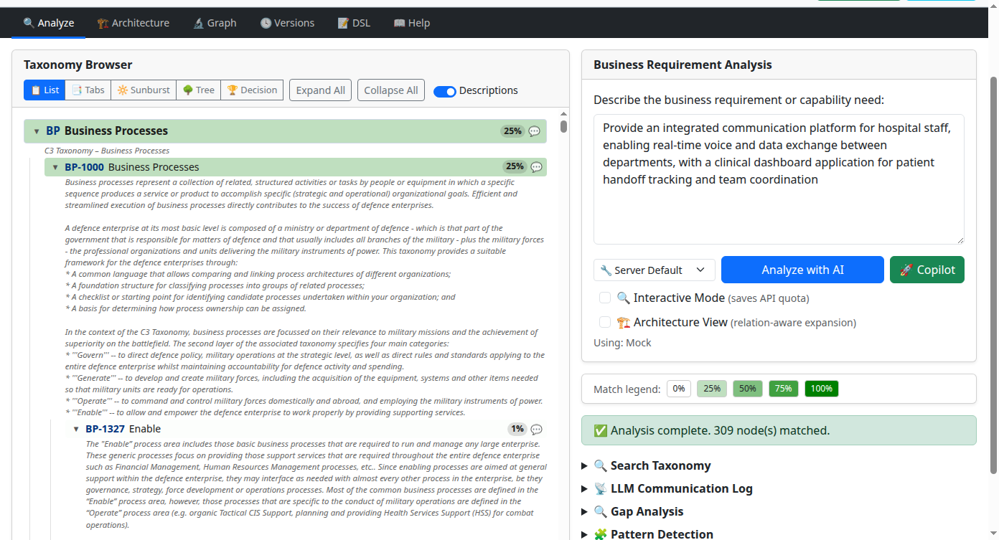
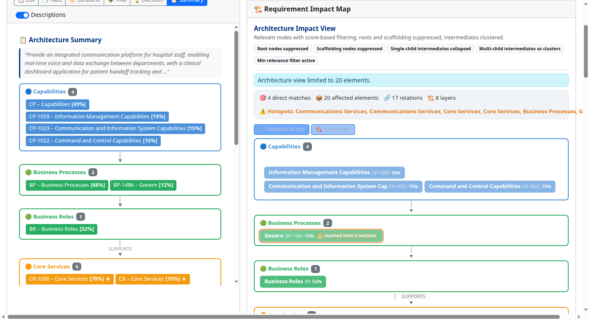
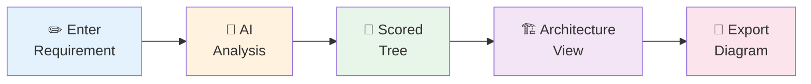
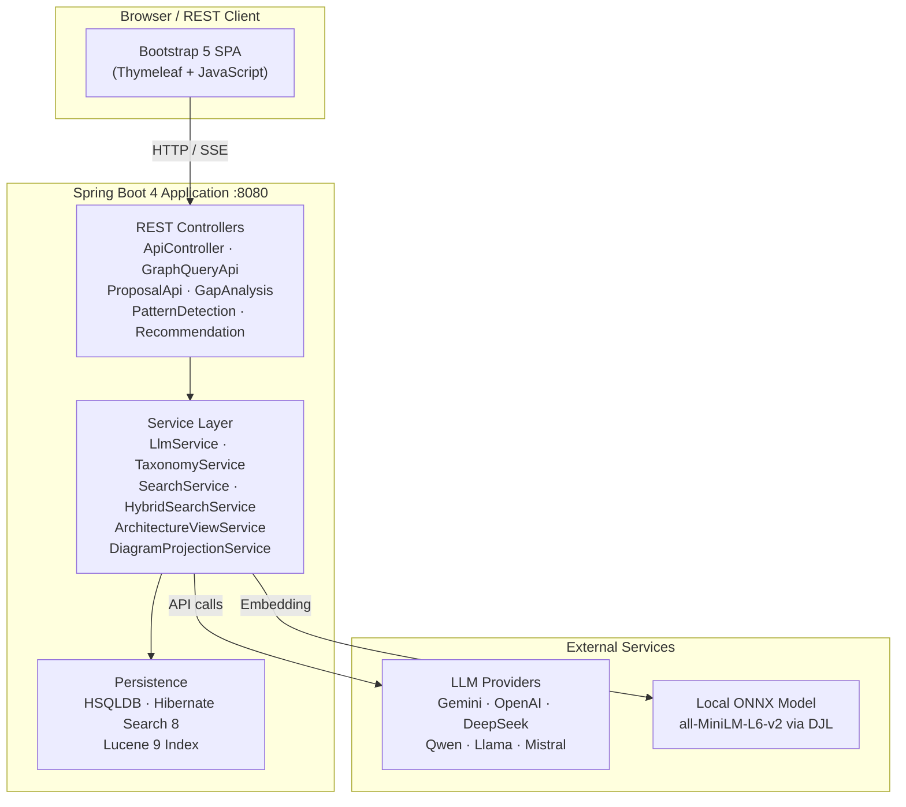
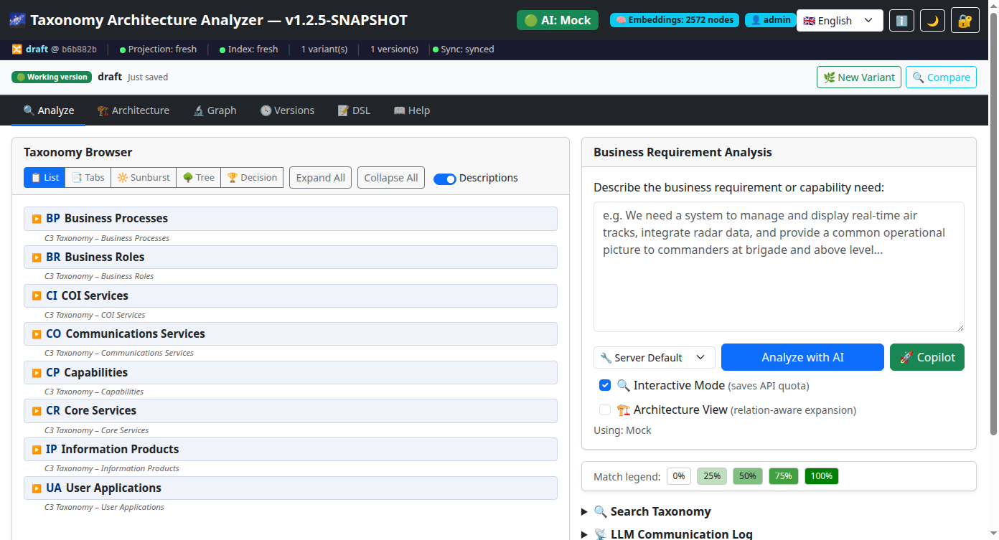
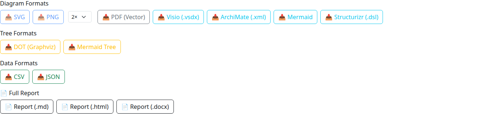

# Taxonomy Architecture Analyzer

[](https://github.com/carstenartur/Taxonomy/actions/workflows/ci-cd.yml)
[](https://carstenartur.github.io/Taxonomy/coverage/)
[](https://carstenartur.github.io/Taxonomy/tests/surefire-report.html)
[](LICENSE)

## 1. Project Overview

The Taxonomy Architecture Analyzer maps free-text business requirements to the C3 Taxonomy Catalogue (~2,500 nodes across 8 sheets) using an AI language model. It scores every taxonomy node against a requirement, propagates relevance through architecture relations, and generates exportable architecture views and diagrams — all in a single step.

**Technology stack:** Java 17 · Spring Boot 4 · HSQLDB · Hibernate Search 8 / Lucene 9 · Apache POI · DJL/ONNX Runtime · Bootstrap 5 · Thymeleaf

---

## 2. Example

**Requirement:**

> _"Provide secure voice communications for deployed forces."_

**Matched taxonomy elements:**

| Category | Matched Element |
|---|---|
| **Capability** | Secure Communications Capability |
| **Service** | Secure Voice Service |
| **Process** | Conduct Operations |
| **Application** | Operations Coordination System |

The system scores every node, selects the most relevant elements, propagates relevance through their relations, and generates an architecture view — ready for export.

<details>
<summary><strong>Scored taxonomy tree</strong></summary>


</details>

<details>
<summary><strong>Architecture view</strong></summary>


</details>

---

## 3. Key Features

- **Requirement → Taxonomy mapping** — AI scores every taxonomy node against a free-text requirement
- **Semantic and hybrid search** — full-text (Lucene), semantic (embedding KNN), hybrid (Reciprocal Rank Fusion), and graph-based search
- **Architecture relationship discovery** — automatic architecture views from scored results with relevance propagation
- **Architecture impact analysis** — upstream, downstream, and failure-impact neighbourhood queries
- **Relation proposals and review** — AI-generated relation proposals with human accept/reject workflow
- **Architecture graph exploration** — trace dependencies and discover gaps and patterns
- **Export to Visio, ArchiMate, Mermaid and JSON** — industry-standard diagram formats for downstream tools

---

## 4. Typical Workflow



1. **Enter a requirement** — type a free-text business or mission requirement in the analysis panel.
2. **AI scores the taxonomy** — the configured LLM evaluates every taxonomy node and returns match percentages (0–100).
3. **Explore the scored tree** — results are overlaid on the tree with colour intensity proportional to the score. Switch between view modes for different perspectives.
4. **Generate an architecture view** — anchor nodes (score ≥ 70) are selected and relevance propagates through taxonomy relations to build a structured architecture model.
5. **Export a diagram** — one-click export to ArchiMate XML, Visio, Mermaid flowchart, or JSON.

---

## 5. System Overview



**Pipeline:**

```
Requirement  →  Semantic Analysis  →  Taxonomy Matching  →  Architecture Graph  →  Architecture Views  →  Diagram Export
```

---

## 6. User Interface

The UI is a single Bootstrap 5 page rendered by Thymeleaf. The left panel shows the taxonomy tree; the right panel holds the analysis input, scored results, and architecture view.



Five view modes are available for the taxonomy tree:

| Mode | Description |
|---|---|
| **List** | Collapsible tree with expand/collapse toggles |
| **Tabs** | Grouped by taxonomy sheet in tabbed panels |
| **Sunburst** | Radial hierarchical chart |
| **Tree** | D3 tree layout |
| **Decision Map** | Force-directed graph layout |

Additional panels: Graph Explorer (upstream/downstream/failure-impact queries), Relation Proposals (AI-generated proposals with accept/reject), and an Admin panel for LLM diagnostics and prompt template editing.

---

## 7. Export Formats

| Format | Extension | Use Case |
|---|---|---|
| **ArchiMate 3.x XML** | `.xml` | Import into Archi, BiZZdesign, MEGA, and other ArchiMate-compatible tools |
| **Visio** | `.vsdx` | Microsoft Visio 2013+ diagrams |
| **Mermaid** | `.md` | Text-based diagrams renderable in GitHub, GitLab, Notion, Confluence |
| **JSON** | `.json` | Save and reload analysis scores; integrate with external tooling |

<details>
<summary><strong>Export buttons</strong></summary>


</details>

---

## 8. REST API

Interactive documentation is available at [`/swagger-ui.html`](http://localhost:8080/swagger-ui.html) when the application is running.

| Category | Key Endpoints | Description |
|---|---|---|
| **Analysis** | `POST /api/analyze`, `POST /api/analyze-stream` | Score taxonomy nodes against a requirement |
| **Node Analysis** | `POST /api/analyze-node` | Analyse a single node and its children |
| **Justification** | `POST /api/justify-leaf` | Natural-language explanation for a leaf score |
| **Architecture** | `POST /api/architecture-view` | Generate an architecture view from scores |
| **Search** | `GET /api/search` | Full-text, semantic, hybrid, and graph search |
| **Graph** | `GET /api/graph/node/{code}/upstream`, `/downstream`, `/failure-impact` | Graph neighbourhood queries |
| **Proposals** | `GET/POST /api/proposals` | Relation proposals with review workflow |
| **Gap Analysis** | `POST /api/gap/analyze` | Identify missing relations and coverage gaps |
| **Recommendations** | `POST /api/recommend` | Architecture element and relation recommendations |
| **Patterns** | `POST /api/patterns/detect` | Detect standard architecture patterns |
| **Export** | `POST /api/export/archimate`, `/visio`, `/mermaid` | Diagram export in multiple formats |
| **Admin** | `GET /api/diagnostics`, `GET /api/ai-status` | LLM diagnostics and system status |

> Full API reference with request/response schemas: [docs/API_REFERENCE.md](docs/API_REFERENCE.md)

---

## 9. Installation

### Prerequisites

| Requirement | Notes |
|---|---|
| **Java 17+** | JDK for building, JRE for running |
| **Maven 3.9+** | Build only |
| **LLM API key** _or_ `LLM_PROVIDER=LOCAL_ONNX` | Required for AI analysis; browsing and search work without it |
| **Docker** _(optional)_ | For containerised deployment |

### Run locally

```bash
git clone https://github.com/carstenartur/Taxonomy.git
cd Taxonomy

# With Gemini (default LLM provider)
GEMINI_API_KEY=your-key mvn spring-boot:run

# With OpenAI
LLM_PROVIDER=OPENAI OPENAI_API_KEY=your-key mvn spring-boot:run

# Fully offline (no API key required)
LLM_PROVIDER=LOCAL_ONNX mvn spring-boot:run

# Browse-only mode (no AI analysis)
mvn spring-boot:run
```

Open <http://localhost:8080> in your browser.

### Docker

```bash
docker build -t taxonomy-analyzer .
docker run -p 8080:8080 -e GEMINI_API_KEY=your-key taxonomy-analyzer

# Or use the pre-built image
docker pull ghcr.io/carstenartur/taxonomy:latest
docker run -p 8080:8080 -e GEMINI_API_KEY=your-key ghcr.io/carstenartur/taxonomy:latest
```

### Build & Test

```bash
mvn compile           # Compile only
mvn test              # Unit + Spring context tests (~370 tests, no Docker needed)
mvn verify            # Unit + integration tests (requires Docker for container tests)
```

---

## 10. Repository Structure

```
Taxonomy/
├── src/
│   ├── main/
│   │   ├── java/com/nato/taxonomy/
│   │   │   ├── controller/       # REST API controllers
│   │   │   ├── service/          # Business logic (LLM, search, architecture, export)
│   │   │   ├── model/            # JPA entities (TaxonomyNode, TaxonomyRelation, ...)
│   │   │   ├── dto/              # Data transfer objects
│   │   │   ├── archimate/        # ArchiMate model classes
│   │   │   ├── diagram/          # Diagram projection models
│   │   │   ├── visio/            # Visio document model
│   │   │   ├── repository/       # Spring Data JPA repositories
│   │   │   ├── search/           # Hibernate Search configuration
│   │   │   └── config/           # Application configuration
│   │   └── resources/
│   │       ├── data/             # Excel workbook + CSV fallback + JSON taxonomy
│   │       ├── prompts/          # LLM prompt templates
│   │       ├── static/           # CSS and JavaScript (Bootstrap 5 UI)
│   │       ├── templates/        # Thymeleaf HTML templates
│   │       └── application.properties
│   └── test/                     # Unit tests + integration tests (*IT.java)
├── docs/                         # Documentation and auto-generated screenshots
├── Dockerfile                    # Multi-stage Docker build
├── render.yaml                   # Render.com deployment blueprint
├── pom.xml                       # Maven project descriptor (Spring Boot 4, Java 17)
└── README.md
```

---

## Documentation

| Document | Description |
|---|---|
| **[User Guide](docs/USER_GUIDE.md)** | End-user guide with screenshots |
| **[Concepts & Glossary](docs/CONCEPTS.md)** | Key terms and definitions |
| **[Examples](docs/EXAMPLES.md)** | Worked examples for analysis, impact, gap analysis, proposals |
| **[Architecture](docs/ARCHITECTURE.md)** | System design, pipeline, CI/CD |
| **[API Reference](docs/API_REFERENCE.md)** | Full REST API documentation |
| **[Configuration](docs/CONFIGURATION_REFERENCE.md)** | Environment variables and settings |
| **[Deployment](docs/DEPLOYMENT_GUIDE.md)** | Docker, Render.com, health checks |

## Contributing

1. Fork the repository
2. Create a feature branch (`git checkout -b feature/my-feature`)
3. Run tests (`mvn test`)
4. Commit your changes
5. Open a pull request

## License

This project is licensed under the [MIT License](LICENSE).

