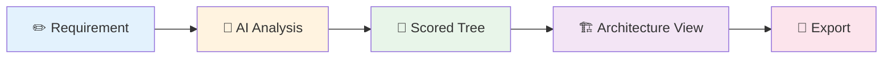

# Taxonomy Architecture Analyzer

[](https://github.com/carstenartur/Taxonomy/actions/workflows/ci-cd.yml)
[](https://carstenartur.github.io/Taxonomy/coverage/)
[](https://carstenartur.github.io/Taxonomy/tests/surefire-report.html)
[](LICENSE)
[](https://github.com/carstenartur/Taxonomy/dependency-graph/sbom)

**Turn a business requirement into a validated architecture view — in one step.**

Describe what you need in plain English. The Taxonomy Architecture Analyzer scores every node in the C3 Taxonomy Catalogue (~2,500 elements across 8 architecture layers) using AI, discovers architecture relations, and generates exportable diagrams — with full names, impact hotspots, and clear layer labels visible at every step.



---

## Quick Example

> _"Provide an integrated communication platform for hospital staff, enabling real-time voice and data exchange between departments and coordinated workflow management for clinical teams."_


The system scores every taxonomy node, selects the most relevant elements (score ≥ 70), propagates relevance through architecture relations, and generates an interactive architecture view. Each element is shown with its **full name** (e.g. "Secure Messaging Service"), **layer label** (e.g. "Communications Services"), and **relevance percentage** — with ★ anchor nodes and ⚠️ hotspots clearly highlighted. Ready for export to ArchiMate, Visio, or Mermaid.

<details>
<summary><strong>Architecture view generated from this requirement</strong></summary>


</details>

---

## Core Workflow (UI)

| Step | What you do | What happens |
|:---:|---|---|
| **1** | Enter a requirement in the analysis panel | Free-text input |
| **2** | Click **Analyze with AI** | AI scores every taxonomy node (0–100) |
| **3** | Explore the scored tree | Colour-coded results across 6 view modes |
| **4** | Review relations and proposals | Accept/reject AI-generated architecture relations |
| **5** | Export | One-click export to ArchiMate XML, Visio, Mermaid, or JSON |


<details>
<summary><strong>Export buttons</strong></summary>


</details>

---

## Key Features

| Area | Capabilities |
|---|---|
| **Analysis** | AI-scored taxonomy mapping · semantic, hybrid, and graph search · relevance propagation · full node names and layer labels |
| **Architecture** | Interactive impact maps with ★ anchors and ⚠️ hotspots · relation proposals with review workflow · gap analysis · pattern detection |
| **Graph** | Upstream/downstream exploration · failure-impact analysis · requirement impact |
| **DSL** | Text-based architecture DSL · JGit-backed versioning with branching and merge |
| **Export** | ArchiMate 3.x XML · Visio `.vsdx` · Mermaid · JSON · Reports (Markdown, HTML, DOCX) |

---

## Installation

### Prerequisites

| Requirement | Notes |
|---|---|
| **Java 17+** | JDK for building, JRE for running |
| **Maven 3.9+** | Build only |
| **LLM API key** _or_ `LLM_PROVIDER=LOCAL_ONNX` | Required for AI analysis; browsing and search work without it |

### Run locally (development only)

```bash
git clone https://github.com/carstenartur/Taxonomy.git
cd Taxonomy

# Build the sibling modules first (required once, or after changes)
mvn install -DskipTests

# Then start the application from the app module
cd taxonomy-app

# With Gemini (default)
GEMINI_API_KEY=your-key mvn spring-boot:run

# Fully offline (no API key)
LLM_PROVIDER=LOCAL_ONNX mvn spring-boot:run

# Browse-only (no AI analysis)
mvn spring-boot:run
```

Open <http://localhost:8080> and log in with `admin` / `admin`.

> ⚠️ **`localhost` only.** The commands above start an unencrypted HTTP server for local
> development. **Never expose port 8080 to the internet.** For any non-local deployment,
> use the Docker + HTTPS setup below.

**→ Now follow the [Core Workflow](#core-workflow-ui) above to run your first analysis.**

### Container Image

The official Docker image is published to **GitHub Container Registry** on every push
to `main`:

```
ghcr.io/carstenartur/taxonomy
```

**Pull and run (quick start):**
```bash
docker pull ghcr.io/carstenartur/taxonomy:latest
docker run -p 8080:8080 ghcr.io/carstenartur/taxonomy:latest
# Open http://localhost:8080 — never expose port 8080 to the internet
```

| Tag | Example | Description |
|---|---|---|
| `latest` | `ghcr.io/carstenartur/taxonomy:latest` | Most recent build from the default branch (`main`) |
| `main` | `ghcr.io/carstenartur/taxonomy:main` | Identical to `latest` (branch-name tag) |
| `sha-<hash>` | `ghcr.io/carstenartur/taxonomy:sha-abc1234` | Pinned to a specific commit — use for reproducible deployments |

> See the [Container Image Guide](docs/en/CONTAINER_IMAGE.md) for Docker Compose usage,
> environment variables, volume mounts, and upgrade notes.

### Docker (production — with HTTPS)

For any deployment beyond `localhost`, use Docker Compose with a reverse proxy that
provides automatic HTTPS. The repository includes a ready-to-use
[`docker-compose.prod.yml`](docker-compose.prod.yml) with [Caddy](https://caddyserver.com)
for automatic TLS certificate provisioning:

```bash
# 1. Clone and configure
git clone https://github.com/carstenartur/Taxonomy.git
cd Taxonomy
cp .env.example .env          # edit .env with your domain and API key

# 2. Start (HTTPS on port 443, automatic Let's Encrypt certificate)
docker compose -f docker-compose.prod.yml up -d
```

Open `https://your-domain.example.com` and log in with the password you set in `.env`.

> See the [Deployment Guide](docs/en/DEPLOYMENT_GUIDE.md) for VPS, Render.com,
> and cloud deployment instructions, alternative reverse proxies (nginx),
> and Spring Boot native SSL.

**Docker without HTTPS (local testing only):**
```bash
docker run -p 8080:8080 -e LLM_PROVIDER=LOCAL_ONNX ghcr.io/carstenartur/taxonomy:latest
# Access at http://localhost:8080 — never expose this to the internet
```

### Build & Test

```bash
mvn compile           # Compile only
mvn test              # Unit + Spring context tests (no Docker needed)
mvn verify            # Unit + integration tests (requires Docker)
```

---

## REST API (for Automation & Integration)

The primary way to use this product is through the **web-based GUI** (see [Core Workflow](#core-workflow-ui) above).

For **scripting, CI pipelines, and system integration**, a REST API is available:

- Interactive documentation: [`/swagger-ui.html`](http://localhost:8080/swagger-ui.html)
- [API Reference](docs/en/API_REFERENCE.md) — endpoint overview
- [Curl Workflow Examples](docs/en/CURL_EXAMPLES.md) — end-to-end automation examples

> **Note:** The REST API is not intended as a replacement for the GUI for end-user workflows.
> All user-facing features are designed to be used through the web interface first.

---

## Repository Structure

```
Taxonomy/
├── taxonomy-domain/     # Pure domain types (DTOs, enums) — no framework dependencies
├── taxonomy-dsl/        # Architecture DSL: parser, serializer, validator, differ
├── taxonomy-export/     # Export formats: ArchiMate, Visio, Mermaid, Diagram
├── taxonomy-app/        # Spring Boot application: REST API, services, persistence, UI
├── docs/                # Documentation and auto-generated screenshots
└── pom.xml              # Parent POM (4 modules, Spring Boot 4, Java 17)
```

---

## Documentation

| Document | Description |
|---|---|
| **[User Guide](docs/en/USER_GUIDE.md)** | End-user guide with screenshots and workflow walkthroughs |
| **[Examples](docs/en/EXAMPLES.md)** | Worked examples for analysis, impact, proposals, export |
| **[Concepts & Glossary](docs/en/CONCEPTS.md)** | Key terms and domain model |
| **[Document Import](docs/en/DOCUMENT_IMPORT.md)** | PDF/DOCX import, candidate extraction, source provenance |
| **[Framework Import](docs/en/FRAMEWORK_IMPORT.md)** | Import APQC, ArchiMate, C4, UAF frameworks |
| **[Workspace Versioning](docs/en/WORKSPACE_VERSIONING.md)** | Context bar, variants, sync, merge, cherry-pick |
| **[AI Providers](docs/en/AI_PROVIDERS.md)** | Supported LLM providers and configuration |
| **[Preferences](docs/en/PREFERENCES.md)** | Runtime preferences (LLM, DSL/Git, size limits) |
| **[API Reference](docs/en/API_REFERENCE.md)** | REST API quick-reference with request/response examples |
| **[Curl Examples](docs/en/CURL_EXAMPLES.md)** | End-to-end automation examples |
| **[Configuration](docs/en/CONFIGURATION_REFERENCE.md)** | Environment variables and settings |
| **[Container Image](docs/en/CONTAINER_IMAGE.md)** | GHCR image, Docker Compose, tags, volumes, upgrades |
| **[Deployment](docs/en/DEPLOYMENT_GUIDE.md)** | Docker, Render.com, health checks |
| **[Deployment Checklist](docs/en/DEPLOYMENT_CHECKLIST.md)** | Pre-deployment verification checklist |
| **[Security](docs/en/SECURITY.md)** | Authentication, roles, permissions, deployment hardening |
| **[Database Setup](docs/en/DATABASE_SETUP.md)** | PostgreSQL, MSSQL, Oracle configuration |
| **[Keycloak & SSO](docs/en/KEYCLOAK_SETUP.md)** | SSO/OIDC/SAML integration with Keycloak |
| **[Keycloak Migration](docs/en/KEYCLOAK_MIGRATION.md)** | Migrating from form-login to Keycloak/OIDC |
| **[Operations Guide](docs/en/OPERATIONS_GUIDE.md)** | Operational procedures and monitoring |
| **[Architecture](docs/en/ARCHITECTURE.md)** | System design, modules, DSL storage, pipelines |
| **[Developer Guide](docs/en/DEVELOPER_GUIDE.md)** | Module architecture, testing, extending the system |
| **[Git Integration](docs/en/GIT_INTEGRATION.md)** | JGit DFS repository, branching, REST endpoints |
| **[Repository Topology](docs/en/REPOSITORY_TOPOLOGY.md)** | Workspace provisioning, topology modes, sync |
| **[Relation Seeds](docs/en/RELATION_SEEDS.md)** | Seed data format, provenance, CSV schema |
| **[Feature Matrix](docs/en/FEATURE_MATRIX.md)** | Feature completeness tracking (GUI, REST, docs, i18n) |
| **[UI Gap Analysis](docs/en/UI_GAP_ANALYSIS.md)** | JavaScript module inventory and workspace UI status |
| **[AI Transparency](docs/en/AI_TRANSPARENCY.md)** | AI/LLM usage transparency documentation |
| **[Data Protection](docs/en/DATA_PROTECTION.md)** | GDPR and data protection compliance |
| **[Knowledge Conservation](docs/en/USE_CASE_WISSENSKONSERVIERUNG.md)** | Use case: architecture knowledge preservation |

## Government Readiness (Behördentauglichkeit)

The Taxonomy Architecture Analyzer includes comprehensive documentation for deployment in German government and public administration environments.
See also: [Security](docs/en/SECURITY.md), [Data Protection](docs/en/DATA_PROTECTION.md), [AI Transparency](docs/en/AI_TRANSPARENCY.md), [Deployment Checklist](docs/en/DEPLOYMENT_CHECKLIST.md), and [Knowledge Conservation](docs/en/USE_CASE_WISSENSKONSERVIERUNG.md) in the Documentation table above.

| Document | Description |
|---|---|
| **[BSI KI Checklist](docs/en/BSI_KI_CHECKLIST.md)** | BSI criteria checklist for AI models in federal administration |
| **[AI Literacy Concept](docs/en/AI_LITERACY_CONCEPT.md)** | Training concept per EU AI Act Art. 4 (AI Literacy) |
| **[Accessibility / BITV 2.0](docs/en/ACCESSIBILITY.md)** | BITV 2.0 / WCAG 2.1 accessibility concept and action plan |
| **[Digital Sovereignty](docs/en/DIGITAL_SOVEREIGNTY.md)** | Digital sovereignty, openCode compatibility, DVC architecture |
| **[Administration Integration](docs/en/VERWALTUNGSINTEGRATION.md)** | FIM / 115 / XÖV integration roadmap |

**Key capabilities for government use:**
- 🔒 **Air-gapped operation** — `LLM_PROVIDER=LOCAL_ONNX` for fully offline deployment
- 🇪🇺 **EU data residency** — Mistral (France/EU) as cloud LLM alternative
- 📋 **SBOM** — CycloneDX Software Bill of Materials generated at build time
- 🏛️ **Open Source** — MIT license, full source code, no vendor lock-in
- 🔐 **SSO/OIDC** — Keycloak integration for government identity providers (see [Keycloak & SSO Setup](docs/en/KEYCLOAK_SETUP.md))

## Contributing

1. Fork the repository
2. Create a feature branch (`git checkout -b feature/my-feature`)
3. Run tests (`mvn test`)
4. Commit your changes
5. Open a pull request

> **Important:** For user-facing features, please read the
> [Definition of Done](docs/en/DEVELOPER_GUIDE.md#definition-of-done--user-facing-features)
> before opening a PR. Features that only add a REST endpoint without GUI support
> are not considered complete.

## License

This project is licensed under the [MIT License](LICENSE).
