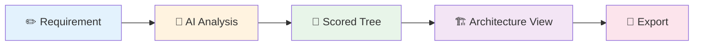

# Taxonomy Architecture Analyzer

[](https://github.com/carstenartur/Taxonomy/actions/workflows/ci-cd.yml)
[](https://carstenartur.github.io/Taxonomy/coverage/)
[](https://carstenartur.github.io/Taxonomy/tests/surefire-report.html)
[](LICENSE)

**Turn a business requirement into a validated architecture view — in one step.**

Describe what you need in plain English. The Taxonomy Architecture Analyzer scores every node in the C3 Taxonomy Catalogue (~2,500 elements) using AI, discovers architecture relations, and generates exportable diagrams.



---

## Quick Example

> _"Provide an integrated communication platform for hospital staff, enabling real-time voice and data exchange between departments and coordinated workflow management for clinical teams."_


The system scores every taxonomy node, selects the most relevant elements (score ≥ 70), propagates relevance through relations, and generates an architecture view — ready for export to ArchiMate, Visio, or Mermaid.

<details>
<summary><strong>Architecture view generated from this requirement</strong></summary>


</details>

---

## Core Workflow (UI)

| Step | What you do | What happens |
|:---:|---|---|
| **1** | Enter a requirement in the analysis panel | Free-text input |
| **2** | Click **Analyze with AI** | AI scores every taxonomy node (0–100) |
| **3** | Explore the scored tree | Colour-coded results across 6 view modes |
| **4** | Review relations and proposals | Accept/reject AI-generated architecture relations |
| **5** | Export | One-click export to ArchiMate XML, Visio, Mermaid, or JSON |


<details>
<summary><strong>Export buttons</strong></summary>


</details>

---

## Key Features

| Area | Capabilities |
|---|---|
| **Analysis** | AI-scored taxonomy mapping · semantic, hybrid, and graph search · relevance propagation |
| **Architecture** | Automatic architecture views · relation proposals with review workflow · gap analysis · pattern detection |
| **Graph** | Upstream/downstream exploration · failure-impact analysis · requirement impact |
| **DSL** | Text-based architecture DSL · JGit-backed versioning with branching and merge |
| **Export** | ArchiMate 3.x XML · Visio `.vsdx` · Mermaid · JSON · Reports (Markdown, HTML, DOCX) |

---

## Installation

### Prerequisites

| Requirement | Notes |
|---|---|
| **Java 17+** | JDK for building, JRE for running |
| **Maven 3.9+** | Build only |
| **LLM API key** _or_ `LLM_PROVIDER=LOCAL_ONNX` | Required for AI analysis; browsing and search work without it |

### Run locally

```bash
git clone https://github.com/carstenartur/Taxonomy.git
cd Taxonomy

# With Gemini (default)
GEMINI_API_KEY=your-key mvn spring-boot:run

# Fully offline (no API key)
LLM_PROVIDER=LOCAL_ONNX mvn spring-boot:run

# Browse-only (no AI analysis)
mvn spring-boot:run
```

Open <http://localhost:8080> and log in with `admin` / `admin`.

**→ Now follow the [Core Workflow](#core-workflow-ui) above to run your first analysis.**

### Docker

```bash
docker build -t taxonomy-analyzer .
docker run -p 8080:8080 -e GEMINI_API_KEY=your-key taxonomy-analyzer
```

### Build & Test

```bash
mvn compile           # Compile only
mvn test              # Unit + Spring context tests (no Docker needed)
mvn verify            # Unit + integration tests (requires Docker)
```

---

## REST API

Interactive documentation: [`/swagger-ui.html`](http://localhost:8080/swagger-ui.html)

All endpoints require HTTP Basic authentication (`-u admin:admin`). For the full reference with request/response examples, see [API Reference](docs/API_REFERENCE.md). For end-to-end curl workflows, see [Curl Workflow Examples](docs/CURL_EXAMPLES.md).

---

## Repository Structure

```
Taxonomy/
├── taxonomy-domain/     # Pure domain types (DTOs, enums) — no framework dependencies
├── taxonomy-dsl/        # Architecture DSL: parser, serializer, validator, differ
├── taxonomy-export/     # Export formats: ArchiMate, Visio, Mermaid, Diagram
├── taxonomy-app/        # Spring Boot application: REST API, services, persistence, UI
├── docs/                # Documentation and auto-generated screenshots
└── pom.xml              # Parent POM (4 modules, Spring Boot 4, Java 17)
```

---

## Documentation

| Document | Description |
|---|---|
| **[User Guide](docs/USER_GUIDE.md)** | End-user guide with screenshots and workflow walkthroughs |
| **[Examples](docs/EXAMPLES.md)** | Worked examples for analysis, impact, proposals, export |
| **[Concepts & Glossary](docs/CONCEPTS.md)** | Key terms and domain model |
| **[API Reference](docs/API_REFERENCE.md)** | REST API quick-reference with request/response examples |
| **[Configuration](docs/CONFIGURATION_REFERENCE.md)** | Environment variables and settings |
| **[Deployment](docs/DEPLOYMENT_GUIDE.md)** | Docker, Render.com, health checks |
| **[Security](docs/SECURITY.md)** | Authentication, roles, permissions, deployment hardening |
| **[Architecture](docs/ARCHITECTURE.md)** | System design, modules, DSL storage, pipelines |
| **[Developer Guide](docs/DEVELOPER_GUIDE.md)** | Module architecture, testing, extending the system |

## Contributing

1. Fork the repository
2. Create a feature branch (`git checkout -b feature/my-feature`)
3. Run tests (`mvn test`)
4. Commit your changes
5. Open a pull request

## License

This project is licensed under the [MIT License](LICENSE).
