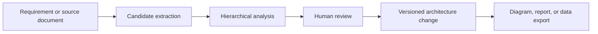

# Taxonomy Architecture Analyzer

[](https://github.com/carstenartur/Taxonomy/actions/workflows/ci-cd.yml)
[](https://carstenartur.github.io/Taxonomy/coverage/)
[](https://carstenartur.github.io/Taxonomy/tests/surefire-report.html)
[](LICENSE)
[](https://github.com/carstenartur/Taxonomy/dependency-graph/sbom)
[](https://zenodo.org/badge/latestdoi/1172765819)
[](https://github.com/carstenartur/Taxonomy/releases/latest)

**Transform requirements, regulations, and architecture knowledge into traceable architecture models.**

Taxonomy Architecture Analyzer combines a hierarchical architecture catalogue, a version-controlled architecture DSL, full-text and vector search, source provenance, architecture relations, and optional LLM-assisted analysis in one Spring Boot application.

The system is intended to reduce the cognitive load of architecture analysis while keeping every accepted change reviewable, attributable, comparable, and reversible.

## What the application provides

| Capability | Description |
|---|---|
| Hierarchical requirement analysis | Scores catalogue roots, intermediate nodes, and leaves instead of treating final nodes as isolated labels |
| Architecture views | Builds cross-layer views from selected elements and typed relations |
| Traceable source import | Extracts bounded candidates from PDF and DOCX sources and links accepted requirements to source versions and fragments |
| Versioned architecture DSL | Stores architecture changes in JGit with branches, history, semantic diffs, merges, reverts, and selective transfer |
| Search | Provides full-text search and optional local ONNX vector search through Hibernate Search and Lucene |
| Multi-user workspaces | Separates personal workspaces from the shared architecture repository |
| Export | Produces machine-readable and presentation-oriented architecture outputs |
| Pluggable AI | Supports cloud providers and a local ONNX option; deterministic browsing remains available without an LLM |

## Typical workflow


```mermaid
flowchart LR
    A[Requirement or source document] --> B[Candidate extraction]
    B --> C[Hierarchical analysis]
    C --> D[Human review]
    D --> E[Versioned architecture change]
    E --> F[Diagram, report, or data export]
```

LLM results are proposals, not authoritative architecture decisions. Users remain responsible for reviewing scores, rationales, relations, and source mappings before accepting them.

## Quick start

### Requirements

- Java 21
- Docker for integration and browser verification profiles
- Git

Use the checked-in Maven Wrapper. A separately installed Maven version is neither required nor recommended.

```bash
git clone https://github.com/carstenartur/Taxonomy.git
cd Taxonomy
./mvnw -pl taxonomy-app -am spring-boot:run
```

Open `http://localhost:8080`.

On a new local database, the application creates the `admin` account with a **random one-time bootstrap password** and prints that value once in the startup log. The password must be replaced at the first login. No reusable password is published in this repository.

To provide the initial password explicitly for local development:

```bash
export TAXONOMY_ADMIN_PASSWORD='use-a-unique-local-development-secret'
./mvnw -pl taxonomy-app -am spring-boot:run
```

To browse without loading or downloading the embedding model:

```bash
export TAXONOMY_EMBEDDING_ENABLED=false
./mvnw -pl taxonomy-app -am spring-boot:run
```

The local command starts plain HTTP on port 8080. Do not expose that port directly to the internet.

## Production deployment

The supported production example places Caddy in front of the application, enables automatic HTTPS, keeps application port 8080 inside the Docker network, and stores application state in named volumes.

```bash
cp .env.example .env
# Configure DOMAIN, TAXONOMY_ADMIN_PASSWORD, and optional provider settings.
docker compose -f docker-compose.prod.yml up -d --build
```

Production startup rejects missing, placeholder, or short administrator passwords. Review the complete deployment and security documentation before exposing an instance outside a trusted development machine.

- [Deployment guide](docs/en/DEPLOYMENT_GUIDE.md)
- [Deployment checklist](docs/en/DEPLOYMENT_CHECKLIST.md)
- [Container image](docs/en/CONTAINER_IMAGE.md)
- [Security](docs/en/SECURITY.md)
- [Configuration reference](docs/en/CONFIGURATION_REFERENCE.md)

## Build and verification

Fast default verification:

```bash
./mvnw verify
```

Authoritative CI-equivalent verification, including integration, browser, quality, coverage, and local ONNX suites:

```bash
./mvnw verify -Pci -DrunOnnxTests=true
```

Focused profiles include:

```bash
./mvnw verify -Parchitecture-tests
./mvnw verify -Pdocument-import-tests
./mvnw verify -Parchimate-import-tests
./mvnw verify -Pdatabase-postgres
./mvnw verify -Ponnx
./mvnw verify -Pui-tests
```

The build generates:

- JUnit and Failsafe reports
- aggregate JaCoCo coverage
- browser and accessibility evidence
- CycloneDX SBOM files
- dependency-alignment and supply-chain policy reports

## Architecture

The Maven reactor separates domain logic, DSL processing, export formats, extension contracts, the Spring application, aggregate coverage, and build policy.

| Module | Responsibility |
|---|---|
| `taxonomy-domain` | Core architecture and analysis domain types |
| `taxonomy-dsl` | DSL syntax, parsing, mapping, semantic diff, and model processing |
| `taxonomy-export` | Export contracts and implementations |
| `taxonomy-extension-api` | Stable extension interfaces |
| `taxonomy-app` | Spring Boot application, persistence, security, UI, search, workspaces, and integrations |
| `taxonomy-coverage` | Reactor-wide coverage aggregation |
| `taxonomy-build` | Authoritative quality gates and browser verification |

Important implementation choices:

- Java 21 and Spring Boot
- Hibernate ORM and Hibernate Search
- Lucene full-text and vector indexes
- JGit-backed architecture history
- database-backed logical Git repositories through `jgit-storage-hibernate`
- DJL and ONNX Runtime for optional local embeddings
- Thymeleaf-based web UI
- Testcontainers for reproducible external-system integration tests
- Playwright for cross-browser and accessibility verification

See [Architecture](docs/en/ARCHITECTURE.md) for component boundaries and [Repository topology](docs/en/REPOSITORY_TOPOLOGY.md) for workspace and shared-repository behavior.

## Architecture history and collaboration

Architecture content is stored as a purpose-built textual DSL rather than as opaque serialized UI state. This enables:

- human-readable review
- semantic and textual comparison
- named variants
- shared and personal workspaces
- merge and conflict detection
- revert and restoration
- selective transfer of individual changes
- traceability from source material to accepted architecture content

External canonical repositories can be integrated through JGit transport. Synchronization uses commit ancestry and three-way merge semantics; rejected pushes and merge conflicts are reported instead of being presented as success.

See [Git integration](docs/en/GIT_INTEGRATION.md) and [Workspace and versioning guide](docs/en/WORKSPACE_VERSIONING.md).

## Document import and provenance

PDF and DOCX processing is bounded by upload size, PDF page count, expanded archive size, extracted text length, and candidate count. ZIP-bomb checks are performed before Apache POI expands DOCX content.

Document registration and candidate confirmation are transactional. A failed operation does not leave a partially created provenance graph, and repeating the same candidate confirmation is idempotent.

## AI and local operation

The application can use Gemini, OpenAI-compatible providers, or a local ONNX embedding model. Provider configuration is optional for catalogue browsing, DSL editing, version navigation, deterministic validation, and many search and export functions.

Local embedding configuration:

```bash
export LLM_PROVIDER=LOCAL_ONNX
export TAXONOMY_EMBEDDING_MODEL_DIR=/absolute/path/to/bge-small-en-v1.5
export TAXONOMY_EMBEDDING_ALLOW_DOWNLOAD=false
```

For deployment provenance and model-policy details, see:

- [AI transparency](docs/en/AI_TRANSPARENCY.md)
- [Digital sovereignty](docs/en/DIGITAL_SOVEREIGNTY.md)
- [Data protection](docs/en/DATA_PROTECTION.md)

## Security model

The application supports local form login and a Keycloak/OIDC profile. Authorization distinguishes read-only users, architects, and administrators. State-changing architecture, provenance, workspace, prompt, and administrative operations are protected independently of UI visibility.

Production deployments should:

- use HTTPS through a trusted reverse proxy;
- use a unique administrator credential or Keycloak;
- keep secrets in deployment secret storage rather than source files;
- disable public Swagger access unless explicitly required;
- restrict database, index, backup, and Git-storage access;
- monitor authentication, authorization, and audit events;
- review generated SBOM and vulnerability-assessment evidence.

Report security issues according to [SECURITY.md](SECURITY.md).

## Accessibility

The UI is tested across roles, browsers, viewport sizes, zoom levels, forced-colour mode, text spacing, dialogs, and representative loading, empty, offline, error, and conflict states.

See [Accessibility](docs/en/ACCESSIBILITY.md) for the evidence matrix, manual checks, and known limitations.

## Documentation

| Document | Purpose |
|---|---|
| [User guide](docs/en/USER_GUIDE.md) | Main workflows and UI concepts |
| [API reference](docs/en/API_REFERENCE.md) | REST endpoints and integration details |
| [Architecture](docs/en/ARCHITECTURE.md) | Components, boundaries, and runtime design |
| [Configuration reference](docs/en/CONFIGURATION_REFERENCE.md) | Environment variables and profiles |
| [Database setup](docs/en/DATABASE_SETUP.md) | Supported database configurations |
| [Repository topology](docs/en/REPOSITORY_TOPOLOGY.md) | Shared repository and workspace routing |
| [Git integration](docs/en/GIT_INTEGRATION.md) | Versioning and external repository behavior |
| [Security](docs/en/SECURITY.md) | Authentication, authorization, and deployment controls |
| [AI transparency](docs/en/AI_TRANSPARENCY.md) | AI usage, limitations, and operator responsibilities |
| [Accessibility](docs/en/ACCESSIBILITY.md) | Accessibility scope and verification |

German documentation is available under [`docs/de`](docs/de/).

## Project status

The project is under active development. Compatibility, persistence, security, and migration behavior should be evaluated against the release notes and the exact version deployed. Do not infer production readiness solely from a successful demonstration or an individual quality badge.

Open defects and planned improvements are tracked in [GitHub Issues](https://github.com/carstenartur/Taxonomy/issues).

## Contributing

Contributions should keep the Maven Wrapper as the reproducible entry point and include tests at the lowest appropriate layer. Changes to security, repository routing, persistence, synchronization, import, or export behavior require integration coverage for failure and recovery paths.

Before opening a pull request:

```bash
./mvnw verify
```

## Citation

Citation metadata is provided in [CITATION.cff](CITATION.cff). Archived releases can be cited through the DOI badge above.

## License

Taxonomy Architecture Analyzer is licensed under the [MIT License](LICENSE). Third-party catalogues, models, imported documents, and external services may have their own terms; operators are responsible for verifying that their intended use is permitted.
