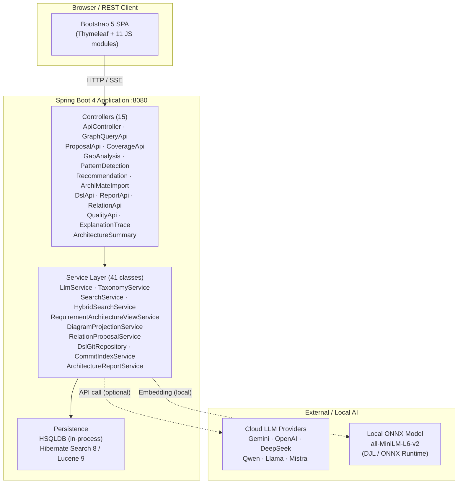
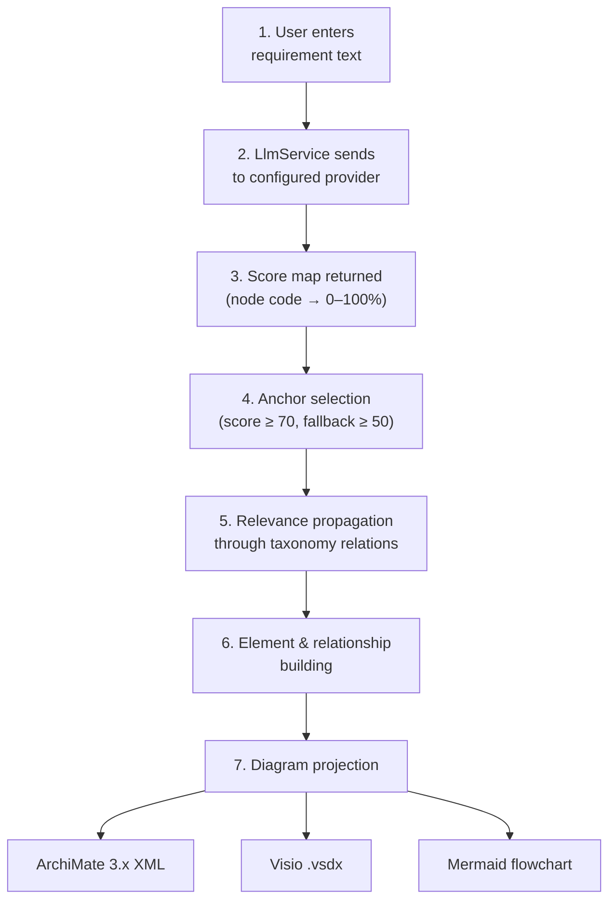
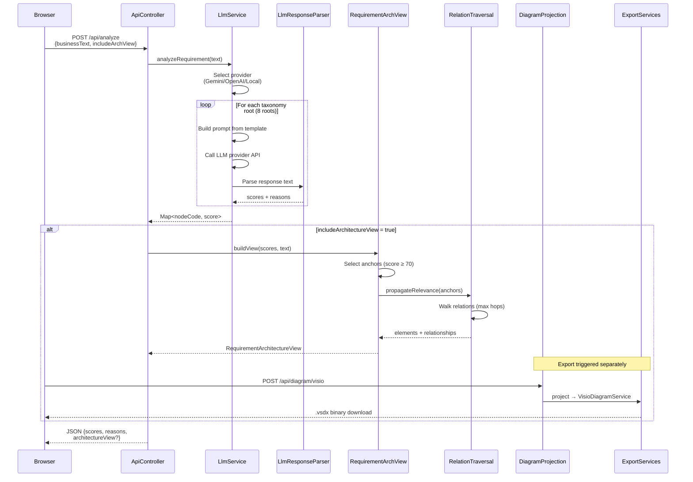
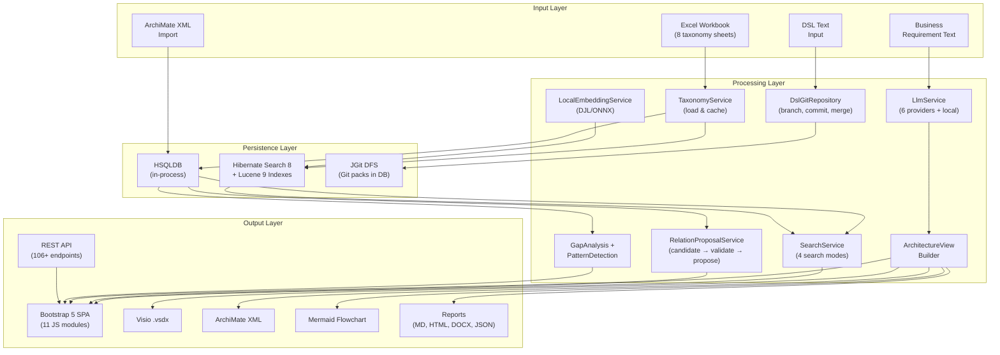
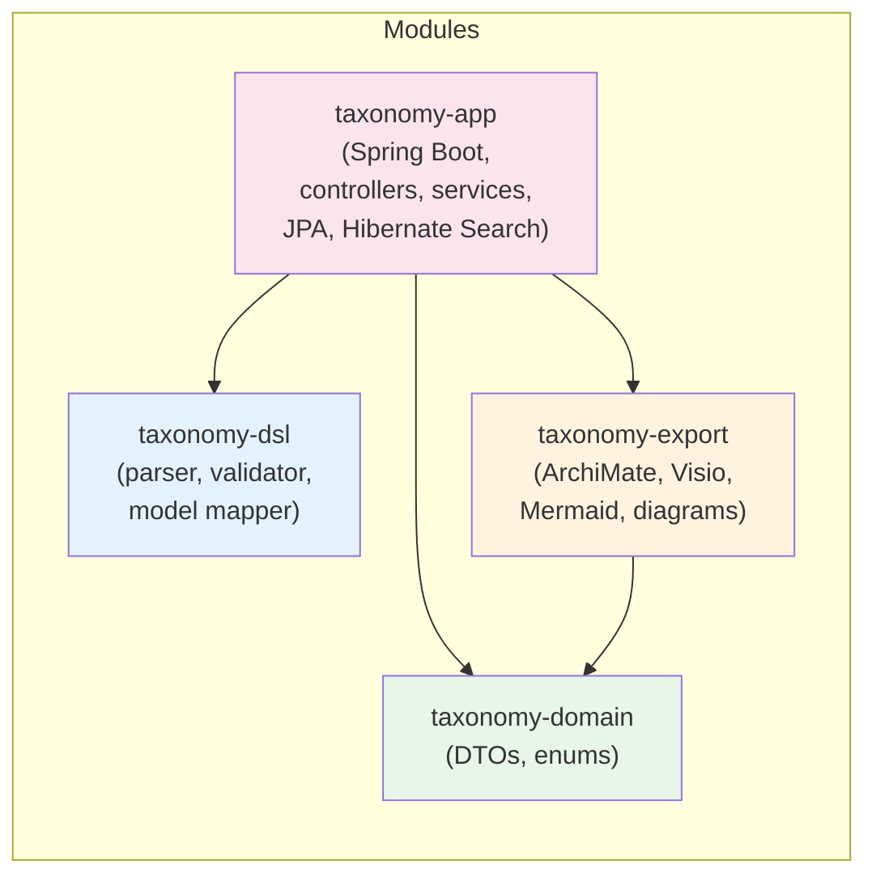

# Architecture Description

This document describes the architecture of the Taxonomy Architecture Analyzer — a Spring Boot web application for browsing, analysing, and visualising C3 Taxonomy data. It is intended for developers and system integrators who need to understand the system design, processing pipelines, and operational setup.

---

## Table of Contents

- [System Overview](#system-overview)
- [High-Level Architecture](#high-level-architecture)
- [Key Components](#key-components)
- [Architecture View Generation Pipeline](#architecture-view-generation-pipeline)
- [Data Loading](#data-loading)
- [CI / CD](#ci--cd)
- [Database](#database)
- [Export Formats](#export-formats)
- [Detailed Architecture Diagrams](#detailed-architecture-diagrams)

---

## System Overview

The application is a single Spring Boot 4 / Java 17 web application with the following main characteristics:

- **In-process HSQLDB** — taxonomy data (~2,500 nodes across 8 sheets from an Excel workbook) is loaded at startup into an embedded HSQLDB database. No external database is required by default.
- **Multi-provider LLM integration** — business requirements can be analysed by any of six supported language model providers (Gemini, OpenAI, DeepSeek, Qwen, Llama, Mistral), or by a local offline model (`all-MiniLM-L6-v2` via DJL / ONNX Runtime) that requires no API key.
- **Taxonomy tree visualisation** — the hierarchy is rendered as a collapsible Bootstrap 5 tree with colour-coded match overlays.
- **Architecture intelligence** — scored analysis results are automatically assembled into architecture views, which can be exported to ArchiMate XML, Visio `.vsdx`, and Mermaid flowcharts.

---

## High-Level Architecture



---

## Key Components

| Service | Role |
|---|---|
| `LlmService` | Multi-provider LLM integration. Dispatches analysis requests to the configured provider (Gemini, OpenAI, DeepSeek, Qwen, Llama, Mistral) or the local DJL/ONNX model. Handles rate-limit exceptions (`LlmRateLimitException` on HTTP 429 / `RESOURCE_EXHAUSTED`). |
| `TaxonomyService` | Loads the taxonomy catalogue from the bundled Excel workbook (Apache POI) or CSV fallback at startup. Manages the 8 taxonomy root categories (BP, BR, CP, CI, CO, CR, IP, UA). |
| `RequirementArchitectureViewService` | Builds architecture views from LLM analysis scores. Selects anchor nodes (score ≥ 70, with fallback to score ≥ 50) and propagates relevance through taxonomy relations to build a structured element/relationship graph. |
| `ArchitectureRecommendationService` | Produces architecture recommendations by combining direct matches, gap analysis, and semantic search results to suggest additional nodes and relations relevant to a given requirement. |
| `ArchitectureGapService` | Identifies missing relations and incomplete architecture patterns in the taxonomy graph relative to a given requirement. |
| `ArchitecturePatternService` | Detects standard architecture patterns (Full Stack, App Chain, Role Chain) in scored taxonomy results. |
| `ArchiMateDiagramService` | Converts architecture views into ArchiMate 3.x Model Exchange File Format XML, suitable for import into tools such as Archi, BiZZdesign, and MEGA. |
| `VisioDiagramService` | Generates Visio `.vsdx` diagram packages from architecture views. |
| `MermaidExportService` | Exports architecture views as Mermaid flowchart code blocks. |
| `DiagramProjectionService` | Projects architecture views into neutral diagram models that can be rendered by multiple exporters. |
| `RelevancePropagationService` | Propagates relevance scores from anchor nodes through taxonomy relations, expanding the architecture view to include indirectly relevant elements. |
| `SearchService` / `HybridSearchService` | Full-text (Lucene), semantic (embedding KNN), hybrid (Reciprocal Rank Fusion), and graph-based search across taxonomy nodes. |
| `LocalEmbeddingService` | Manages the local `all-MiniLM-L6-v2` embedding model via DJL/ONNX Runtime for semantic search and local scoring. |
| `RelationProposalService` | AI-assisted relation proposal pipeline: generates candidate relations and manages the human review workflow. |
| `ArchitectureReportService` | Generates analysis reports in Markdown, standalone HTML, DOCX, and structured JSON formats. |
| `ExplanationTraceService` | Builds explanation traces that describe why a node received a given score, including the LLM reasoning chain. |
| `DslGitRepository` | Versioned DSL document storage backed by JGit DFS, with all Git objects persisted in HSQLDB (no filesystem). Supports branches, commits, cherry-pick, and merge. |
| `CommitIndexService` | Indexes DSL commit history into Hibernate Search / Lucene for full-text search across commit messages and change content. |
| `HypothesisService` | Manages relation hypotheses generated during analysis. Hypotheses can be accepted (creating `TaxonomyRelation`), rejected, or applied for the current session only. |
| `LlmResponseParser` | Stateless parser for LLM responses. Handles Gemini and OpenAI response formats, score extraction (integer and score+reason), score normalisation (largest-remainder method), and JSON extraction. |
| `RateLimitFilter` | In-memory per-IP rate limiter for LLM-backed endpoints (`/api/analyze`, `/api/analyze-stream`, `/api/analyze-node`, `/api/justify-leaf`). Configurable via `TAXONOMY_RATE_LIMIT_PER_MINUTE`. |
| `RelationCompatibilityMatrix` | Defines which relation types are valid between which taxonomy root categories (e.g., `REALIZES` requires CP → CR). Used by the validator and proposal generator. |

---

## Architecture View Generation Pipeline

The following diagram and steps describe how a plain-text business requirement becomes an exportable architecture diagram:



1. **Requirement text** — the user enters a free-text business requirement in the UI.
2. **LLM analysis** — `LlmService` sends the requirement to the configured provider; the response contains a score map (taxonomy node code → match percentage, 0–100).
3. **Anchor selection** — `RequirementArchitectureViewService` selects nodes with score ≥ 70 as primary anchors. If fewer than three anchors are found, the threshold falls back to score ≥ 50 (top 3).
4. **Relevance propagation** — `RelevancePropagationService` follows taxonomy relations from the anchor nodes and assigns derived scores to connected nodes, building a weighted element graph.
5. **Element and relationship building** — architecture elements and their relationships are assembled from the propagated graph, respecting the taxonomy hierarchy.
6. **Diagram projection** — `DiagramProjectionService` converts the architecture model into a neutral representation that can be rendered by multiple exporters.
7. **Export** — the projected model is exported to the chosen format:
   - `ArchiMateDiagramService` → ArchiMate 3.x XML (`.archimate` / `.xml`)
   - `VisioDiagramService` → Visio `.vsdx`
   - `MermaidExportService` → Mermaid flowchart (`.md`)

---

## Module Architecture

The project is a multi-module Maven build with four modules:

```
taxonomy-domain/       Pure domain types (DTOs, enums) — no framework dependencies
taxonomy-dsl/          Architecture DSL (parser, model, validator, differ) — no framework dependencies
taxonomy-export/       Export services (ArchiMate, Visio, Mermaid, Diagram) — no framework dependencies
taxonomy-app/          Spring Boot application (controllers, services, JPA, search, storage)
```

Dependency graph:

```
taxonomy-app  →  taxonomy-domain
taxonomy-app  →  taxonomy-dsl
taxonomy-app  →  taxonomy-export
taxonomy-export  →  taxonomy-domain
```

`taxonomy-domain`, `taxonomy-dsl`, and `taxonomy-export` have **no Spring dependencies** and can be tested and used independently.

---

## DSL Storage Architecture

The application includes a versioned Architecture DSL subsystem backed by JGit DFS (Distributed File System), with all Git objects persisted in the HSQLDB database — no filesystem is used.

```
DSL Text  →  JGit commit  →  HibernateRepository  →  HSQLDB (git_packs & git_reflog tables)
```

| Component | Class | Role |
|---|---|---|
| Repository facade | `DslGitRepository` | High-level API for commit, read, branch, diff operations |
| Git object storage | `HibernateObjDatabase` | Stores blobs, trees, and pack data as BLOBs in `git_packs` table |
| Git ref storage | `HibernateRefDatabase` | Stores refs and reftables in `git_packs` table (as pack extensions) |
| Repository wrapper | `HibernateRepository` | Extends JGit `DfsRepository` with database-backed object and ref databases |
| Pack entity | `GitPackEntity` | JPA entity for the `git_packs` table |
| Reflog entity | `GitReflogEntity` | JPA entity for the `git_reflog` table |
| Configuration | `DslStorageConfig` | Spring `@Configuration` that wires the `DslGitRepository` bean |

DSL documents are stored under the filename `architecture.taxdsl`. The `DslApiController` provides endpoints for commit, history, diff, branching, merge, and cherry-pick operations.

---

## Data Loading

At startup, `TaxonomyService` loads the C3 Taxonomy Catalogue from the bundled Excel workbook (`src/main/resources/data/C3_Taxonomy_Catalogue_25AUG2025.xlsx`) using Apache POI. A CSV fallback (`relations.csv`) is available if the Excel file cannot be read.

The 8 taxonomy root categories are:

| Code | Category |
|---|---|
| **BP** | Business Processes |
| **BR** | Business Roles |
| **CP** | Capabilities |
| **CI** | COI Services |
| **CO** | Communications Services |
| **CR** | Core Services |
| **IP** | Information Products |
| **UA** | User Applications |

Children are identified by hierarchical codes from the workbook (e.g. `BP-1327`, `CP-1022`, `CR-1047`).

## CI / CD

Every push triggers the **CI / CD** GitHub Actions workflow:

| Step | What happens |
|---|---|
| **Build & Test** | `mvn verify` — compiles, runs integration tests |
| **Publish Docker Image** | Pushes to GitHub Container Registry (`ghcr.io`) |
| **Deploy to Render** | Triggers a Render deploy hook (if secret is set) |

📋 **[Test Results Report](https://carstenartur.github.io/Taxonomy/tests/surefire-report.html)**
📈 **[Code Coverage Report](https://carstenartur.github.io/Taxonomy/coverage/)**

## Database

### Default: in-process HSQLDB

The application ships with an embedded HSQLDB database. No installation or external database server is required. All taxonomy data is loaded from the bundled Excel workbook at startup.

Because HSQLDB runs **in-process** (same JVM, no network hop), a JDBC connection pool adds only overhead. The application therefore uses `SimpleDriverDataSource` instead of the Spring Boot default HikariCP. This eliminates HikariPool connection-exhaustion issues and reduces memory usage — particularly important on constrained hosts such as the Render free tier (512 MB RAM).

### MSSQL Compatibility

All entity classes are annotated for correct behaviour on Microsoft SQL Server:

- **`@Nationalized`** on every `String` field → produces `nvarchar` instead of `varchar`,
  preventing corruption of non-ASCII characters (e.g. German umlauts ä, ö, ü, ß).
- **`@Lob`** on text fields that may exceed 4000 characters (`descriptionEn`,
  `descriptionDe`, `reference`) → produces `nvarchar(max)` / `ntext` on MSSQL.
- **`@Lob` + `FloatArrayConverter`** on `semanticEmbedding` fields in `TaxonomyNode`
  and `TaxonomyRelation` → stores embedding vectors as streamable BLOBs using
  little-endian IEEE 754 serialisation.

The application continues to use HSQLDB by default (no MSSQL setup required).

## Rate Limiting

The `RateLimitFilter` enforces per-IP rate limits on LLM-backed endpoints to prevent quota exhaustion on Gemini, OpenAI, and other providers. Protected endpoints:

- `POST /api/analyze`
- `GET /api/analyze-stream`
- `GET /api/analyze-node`
- `POST /api/justify-leaf`

Default: **10 requests per IP per minute** (configurable via `TAXONOMY_RATE_LIMIT_PER_MINUTE`; set to `0` to disable). When the limit is exceeded, the filter returns HTTP 429 Too Many Requests.

## API Versioning

The API is currently **unversioned** — all endpoints use the `/api/` prefix without a version number (e.g., `/api/taxonomy`, `/api/analyze`).

| Aspect | Decision |
|---|---|
| URL scheme | `/api/{resource}` (no version segment) |
| Backwards compatibility | Maintained within each release; breaking changes are documented in the release notes |
| Deprecation policy | Deprecated endpoints return a `Deprecation` header before removal in the next major release |
| Content negotiation | Not used for versioning |

The application is designed for **single-tenant, self-hosted deployment** where the browser UI is always co-deployed with the server, eliminating the multi-client version-skew problem that typically motivates API versioning. The **OpenAPI specification** (`/v3/api-docs`) serves as the machine-readable contract for any external integrations.

If the API needs to support multiple concurrent versions in future, the recommended path is URL-based versioning (`/api/v2/...`) with separate OpenAPI groups per version.

---

## Export Formats

| Format | Description |
|---|---|
| **ArchiMate XML** | ArchiMate 3.x Model Exchange File Format XML, importable into Archi, BiZZdesign, MEGA, and other ArchiMate-compatible tools. |
| **Visio `.vsdx`** | Microsoft Visio diagram package, compatible with Visio 2013 and later. |
| **Mermaid flowchart** | Text-based Mermaid diagram (Markdown code block), renderable in GitHub, GitLab, Notion, Confluence, and most modern documentation platforms. |

---

## Detailed Architecture Diagrams

### Request Lifecycle

The following diagram shows the complete lifecycle of an analysis request, from user input through LLM scoring to diagram export:



### Data Flow Architecture

This diagram shows how data flows between the major subsystems:



### Module Dependency Graph


