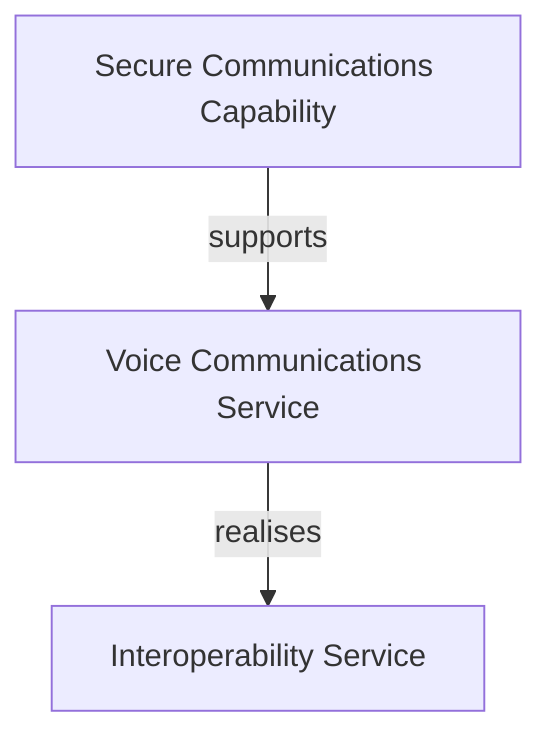

# Examples

This document shows worked examples of common tasks in the Taxonomy Architecture Analyzer.

---

## Table of Contents

- [1. Requirement → Architecture](#1-requirement--architecture)
- [2. Failure Impact Analysis](#2-failure-impact-analysis)
- [3. Architecture Gap Analysis](#3-architecture-gap-analysis)
- [4. Relation Proposals](#4-relation-proposals)
- [5. Architecture Recommendations](#5-architecture-recommendations)
- [6. Diagram Export](#6-diagram-export)

---

## 1. Requirement → Architecture

**Goal:** Map a business requirement to relevant taxonomy elements and generate an architecture view.

> **Note:** The codes below (e.g., `‹CP child›`, `‹CR child›`) are placeholders. Actual codes are defined by the imported C3 Taxonomy Catalogue Excel workbook and vary per catalogue version. Run the application and call `GET /api/taxonomy` to discover the real codes.

### Step 1 — Enter the requirement

Open `http://localhost:8080` and paste into the analysis text area:

> _"Provide secure voice and video communications for deployed forces with interoperability across national systems."_

### Step 2 — Analyze

Click **Analyze with AI**. The system scores every taxonomy node (0–100) and overlays results on the tree:

| Code | Node | Score |
|---|---|---|
| _‹CP child›_ | Secure Communications Capability | 92 |
| _‹CO child›_ | Voice Communications Service | 88 |
| _‹CR child›_ | Interoperability Service | 81 |
| _‹UA child›_ | Operations Coordination System | 74 |
| _‹BP child›_ | Conduct Operations | 71 |

### Step 3 — Generate the architecture view

The system automatically selects nodes with score ≥ 70 as anchors, propagates relevance through taxonomy relations, and builds a structured architecture model:

```
Capability: Secure Communications Capability (‹CP child›)
    ↓ supports
Service: Voice Communications Service (‹CO child›)
    ↓ realises
Service: Interoperability Service (‹CR child›)
    ↓ used by
Application: Operations Coordination System (‹UA child›)
    ↓ enables
Process: Conduct Operations (‹BP child›)
```

### Step 4 — Export

Click an export button to download the architecture as ArchiMate XML, Visio `.vsdx`, or Mermaid flowchart.


### REST API equivalent

```bash
curl -X POST http://localhost:8080/api/analyze \
  -d "businessText=Provide+secure+voice+and+video+communications+for+deployed+forces" \
  -d "includeArchitectureView=true"
```

---

## 2. Failure Impact Analysis

**Goal:** Determine what breaks if a specific taxonomy element fails.

### Web UI

1. Open the **Graph Explorer** panel on the right.
2. Enter a node code (e.g. a Core Service code from your taxonomy).
3. Click **Failure Impact**.
4. The result shows every element that depends on that node, directly or transitively.

### REST API

```bash
# Replace ‹node-code› with an actual code from your taxonomy (e.g. from /api/taxonomy)
curl "http://localhost:8080/api/graph/node/‹node-code›/failure-impact"
```

### Example result

```json
{
  "sourceNode": "‹CR child›",
  "sourceTitle": "Interoperability Service",
  "impactedNodes": [
    { "code": "‹UA child›", "title": "Operations Coordination System", "distance": 1 },
    { "code": "‹BP child›", "title": "Conduct Operations", "distance": 2 }
  ]
}
```

---

## 3. Architecture Gap Analysis

**Goal:** Find missing relations and incomplete architecture patterns in the context of a requirement.

### Web UI

1. Analyze a requirement (see [Example 1](#1-requirement--architecture)).
2. The gap analysis runs automatically alongside the architecture view generation.
3. Missing relations and incomplete patterns are reported in the results.

### REST API

```bash
curl -X POST http://localhost:8080/api/gap/analyze \
  -H "Content-Type: application/json" \
  -d '{
    "businessText": "Maritime surveillance data sharing",
    "scores": {"‹CP child›": 92, "‹CO child›": 88, "‹CR child›": 81}
  }'
```

### Example result

```json
{
  "missingRelations": [
    {
      "source": "‹CO child›",
      "target": "‹IP child›",
      "suggestedType": "produces",
      "reason": "Voice service likely produces communication records"
    }
  ],
  "incompletePatterns": [
    {
      "pattern": "Full Stack",
      "presentElements": ["‹CP child›", "‹CO child›", "‹CR child›"],
      "missingLayers": ["Information Products"]
    }
  ]
}
```

---

## 4. Relation Proposals

**Goal:** Let the AI suggest new relations and review them.

### Step 1 — Generate proposals

In the **Relation Proposals** panel, click **Propose Relations** for a specific node or use the bulk proposal endpoint.

### Step 2 — Review

Each proposal shows:

- **Source** and **Target** nodes
- **Relation type** (e.g., supports, realises, produces)
- **AI justification** — why this relation should exist

### Step 3 — Accept or reject

Click **Accept** to add the relation to the knowledge graph, or **Reject** to discard it.


### REST API

```bash
# Generate proposals for a node (replace ‹node-code› with a real code from /api/taxonomy)
curl -X POST http://localhost:8080/api/proposals/propose \
  -H "Content-Type: application/json" \
  -d '{"sourceCode": "‹node-code›", "relationType": "SUPPORTS"}'

# List pending proposals
curl "http://localhost:8080/api/proposals/pending"

# Accept a proposal
curl -X POST "http://localhost:8080/api/proposals/42/accept"

# Reject a proposal
curl -X POST "http://localhost:8080/api/proposals/42/reject"

# Bulk accept/reject
curl -X POST http://localhost:8080/api/proposals/bulk \
  -H "Content-Type: application/json" \
  -d '{"ids": [42, 43, 44], "action": "ACCEPT"}'

# Revert a decision
curl -X POST "http://localhost:8080/api/proposals/42/revert"
```

---

## 5. Architecture Recommendations

**Goal:** Get AI-driven suggestions for additional architecture elements and relations.

### REST API

```bash
curl -X POST http://localhost:8080/api/recommend \
  -H "Content-Type: application/json" \
  -d '{
    "businessText": "Secure satellite communications for remote operations",
    "scores": {"‹CO child›": 88, "‹CR child›": 81}
  }'
```

### Example result

```json
{
  "recommendedNodes": [
    { "code": "‹CO child›", "title": "Satellite Communications Service", "reason": "Directly relevant to satellite communications requirement" },
    { "code": "‹CP child›", "title": "Remote Operations Capability", "reason": "Supports remote operations as stated in requirement" }
  ],
  "recommendedRelations": [
    { "source": "‹CO child 1›", "target": "‹CO child 2›", "type": "supports", "reason": "Satellite service supports voice communications" }
  ]
}
```

---

## 6. Diagram Export

**Goal:** Export an architecture view to an industry-standard format.

### ArchiMate XML

```bash
# Replace the scores object with real codes and scores from your analysis
curl -X POST http://localhost:8080/api/diagram/archimate \
  -H "Content-Type: application/json" \
  -d '{"scores": {"‹CP child›": 92, "‹CO child›": 88, "‹CR child›": 81}}' \
  -o architecture.xml
```

The resulting XML file can be imported into **Archi**, **BiZZdesign**, **MEGA**, or any ArchiMate 3.x-compatible tool.

### Visio

```bash
curl -X POST http://localhost:8080/api/diagram/visio \
  -H "Content-Type: application/json" \
  -d '{"scores": {"‹CP child›": 92, "‹CO child›": 88, "‹CR child›": 81}}' \
  -o architecture.vsdx
```

### Mermaid

```bash
curl -X POST http://localhost:8080/api/diagram/mermaid \
  -H "Content-Type: application/json" \
  -d '{"scores": {"‹CP child›": 92, "‹CO child›": 88, "‹CR child›": 81}}'
```

The response is a Mermaid flowchart code block that renders in GitHub, GitLab, Notion, and Confluence:


