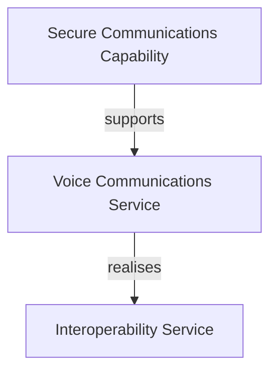

# Examples

This document shows worked examples of common tasks in the Taxonomy Architecture Analyzer.

---

## Table of Contents

- [1. Requirement → Architecture](#1-requirement--architecture)
- [2. Failure Impact Analysis](#2-failure-impact-analysis)
- [3. Architecture Gap Analysis](#3-architecture-gap-analysis)
- [4. Relation Proposals](#4-relation-proposals)
- [5. Architecture Recommendations](#5-architecture-recommendations)
- [6. Diagram Export](#6-diagram-export)

---

## 1. Requirement → Architecture

**Goal:** Map a business requirement to relevant taxonomy elements and generate an architecture view.

### Step 1 — Enter the requirement

Open `http://localhost:8080` and paste into the analysis text area:

> _"Provide secure voice and video communications for deployed forces with interoperability across national systems."_

### Step 2 — Analyze

Click **Analyze with AI**. The system scores every taxonomy node (0–100) and overlays results on the tree:

| Code | Node | Score |
|---|---|---|
| CP-3 | Secure Communications Capability | 92 |
| CO-2 | Voice Communications Service | 88 |
| CR-5 | Interoperability Service | 81 |
| UA-7 | Operations Coordination System | 74 |
| BP-4 | Conduct Operations | 71 |

### Step 3 — Generate the architecture view

The system automatically selects nodes with score ≥ 70 as anchors, propagates relevance through taxonomy relations, and builds a structured architecture model:

```
Capability: Secure Communications Capability (CP-3)
    ↓ supports
Service: Voice Communications Service (CO-2)
    ↓ realises
Service: Interoperability Service (CR-5)
    ↓ used by
Application: Operations Coordination System (UA-7)
    ↓ enables
Process: Conduct Operations (BP-4)
```

### Step 4 — Export

Click an export button to download the architecture as ArchiMate XML, Visio `.vsdx`, or Mermaid flowchart.


### REST API equivalent

```bash
curl -X POST http://localhost:8080/api/analyze \
  -d "businessText=Provide+secure+voice+and+video+communications+for+deployed+forces" \
  -d "includeArchitectureView=true"
```

---

## 2. Failure Impact Analysis

**Goal:** Determine what breaks if a specific taxonomy element fails.

### Web UI

1. Open the **Graph Explorer** panel on the right.
2. Enter the node code, e.g. `CR-5` (Interoperability Service).
3. Click **Failure Impact**.
4. The result shows every element that depends on `CR-5`, directly or transitively.

### REST API

```bash
curl "http://localhost:8080/api/graph/node/CR-5/failure-impact"
```

### Example result

```json
{
  "sourceNode": "CR-5",
  "sourceTitle": "Interoperability Service",
  "impactedNodes": [
    { "code": "UA-7", "title": "Operations Coordination System", "distance": 1 },
    { "code": "BP-4", "title": "Conduct Operations", "distance": 2 }
  ]
}
```

---

## 3. Architecture Gap Analysis

**Goal:** Find missing relations and incomplete architecture patterns in the context of a requirement.

### Web UI

1. Analyze a requirement (see [Example 1](#1-requirement--architecture)).
2. The gap analysis runs automatically alongside the architecture view generation.
3. Missing relations and incomplete patterns are reported in the results.

### REST API

```bash
curl -X POST http://localhost:8080/api/gap/analyze \
  -H "Content-Type: application/json" \
  -d '{
    "businessText": "Maritime surveillance data sharing",
    "scores": {"CP-3": 92, "CO-2": 88, "CR-5": 81}
  }'
```

### Example result

```json
{
  "missingRelations": [
    {
      "source": "CO-2",
      "target": "IP-3",
      "suggestedType": "produces",
      "reason": "Voice service likely produces communication records"
    }
  ],
  "incompletePatterns": [
    {
      "pattern": "Full Stack",
      "presentElements": ["CP-3", "CO-2", "CR-5"],
      "missingLayers": ["Information Products"]
    }
  ]
}
```

---

## 4. Relation Proposals

**Goal:** Let the AI suggest new relations and review them.

### Step 1 — Generate proposals

In the **Relation Proposals** panel, click **Propose Relations** for a specific node or use the bulk proposal endpoint.

### Step 2 — Review

Each proposal shows:

- **Source** and **Target** nodes
- **Relation type** (e.g., supports, realises, produces)
- **AI justification** — why this relation should exist

### Step 3 — Accept or reject

Click **Accept** to add the relation to the knowledge graph, or **Reject** to discard it.


### REST API

```bash
# Generate proposals for a node
curl -X POST http://localhost:8080/api/proposals/propose \
  -H "Content-Type: application/json" \
  -d '{"sourceCode": "CR-5", "relationType": "SUPPORTS"}'

# List pending proposals
curl "http://localhost:8080/api/proposals/pending"

# Accept a proposal
curl -X POST "http://localhost:8080/api/proposals/42/accept"

# Reject a proposal
curl -X POST "http://localhost:8080/api/proposals/42/reject"

# Bulk accept/reject
curl -X POST http://localhost:8080/api/proposals/bulk \
  -H "Content-Type: application/json" \
  -d '{"ids": [42, 43, 44], "action": "ACCEPT"}'

# Revert a decision
curl -X POST "http://localhost:8080/api/proposals/42/revert"
```

---

## 5. Architecture Recommendations

**Goal:** Get AI-driven suggestions for additional architecture elements and relations.

### REST API

```bash
curl -X POST http://localhost:8080/api/recommend \
  -H "Content-Type: application/json" \
  -d '{
    "businessText": "Secure satellite communications for remote operations",
    "scores": {"CO-2": 88, "CR-5": 81}
  }'
```

### Example result

```json
{
  "recommendedNodes": [
    { "code": "CO-4", "title": "Satellite Communications Service", "reason": "Directly relevant to satellite communications requirement" },
    { "code": "CP-8", "title": "Remote Operations Capability", "reason": "Supports remote operations as stated in requirement" }
  ],
  "recommendedRelations": [
    { "source": "CO-4", "target": "CO-2", "type": "supports", "reason": "Satellite service supports voice communications" }
  ]
}
```

---

## 6. Diagram Export

**Goal:** Export an architecture view to an industry-standard format.

### ArchiMate XML

```bash
curl -X POST http://localhost:8080/api/diagram/archimate \
  -H "Content-Type: application/json" \
  -d '{"scores": {"CP-3": 92, "CO-2": 88, "CR-5": 81}}' \
  -o architecture.xml
```

The resulting XML file can be imported into **Archi**, **BiZZdesign**, **MEGA**, or any ArchiMate 3.x-compatible tool.

### Visio

```bash
curl -X POST http://localhost:8080/api/diagram/visio \
  -H "Content-Type: application/json" \
  -d '{"scores": {"CP-3": 92, "CO-2": 88, "CR-5": 81}}' \
  -o architecture.vsdx
```

### Mermaid

```bash
curl -X POST http://localhost:8080/api/diagram/mermaid \
  -H "Content-Type: application/json" \
  -d '{"scores": {"CP-3": 92, "CO-2": 88, "CR-5": 81}}'
```

The response is a Mermaid flowchart code block that renders in GitHub, GitLab, Notion, and Confluence:


