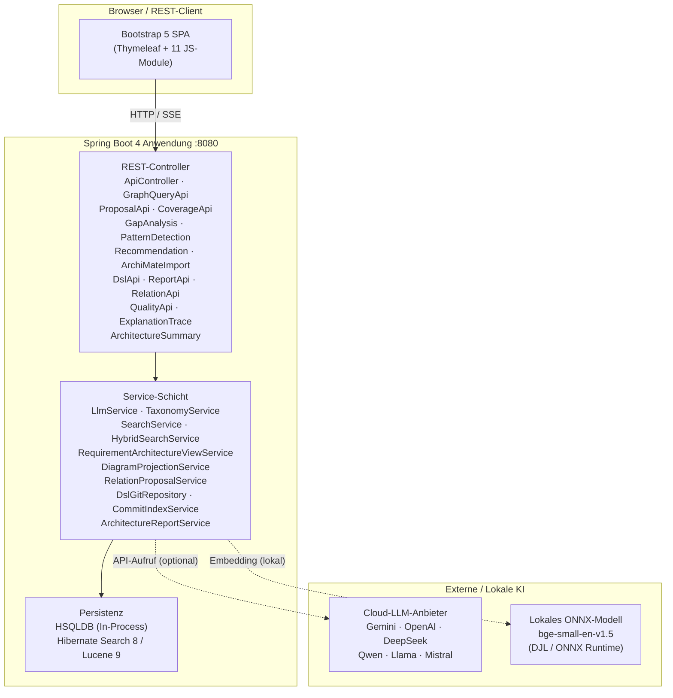
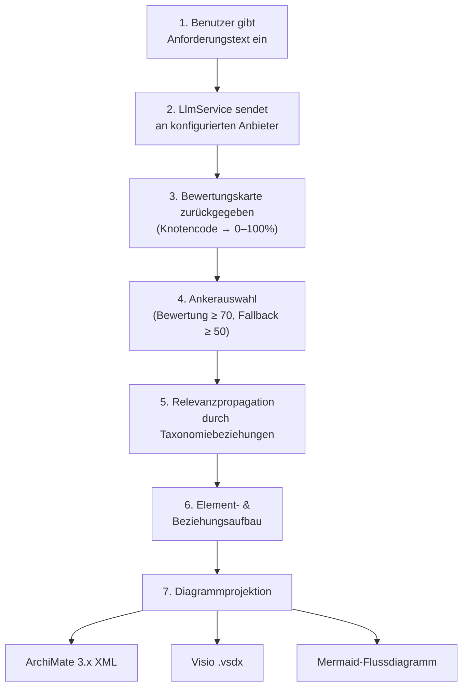
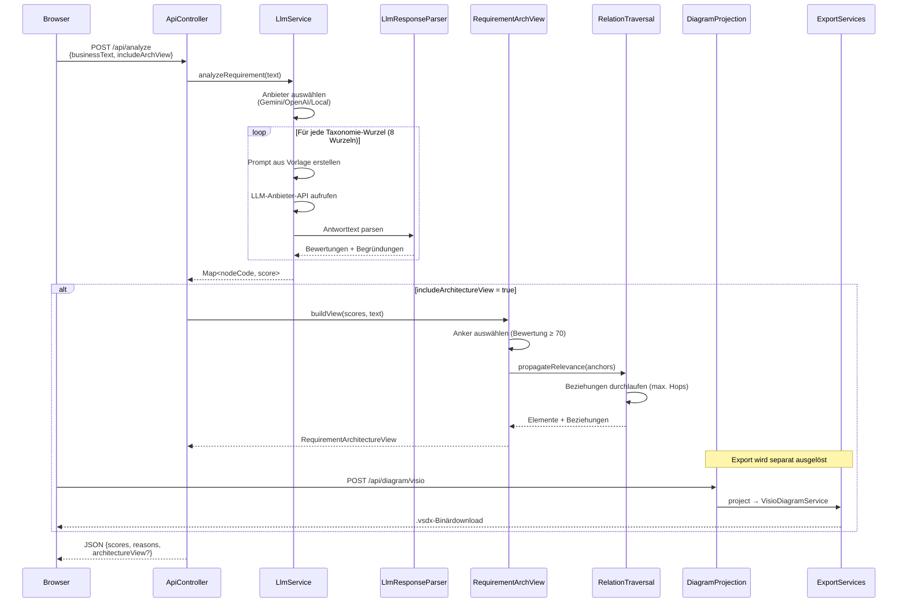
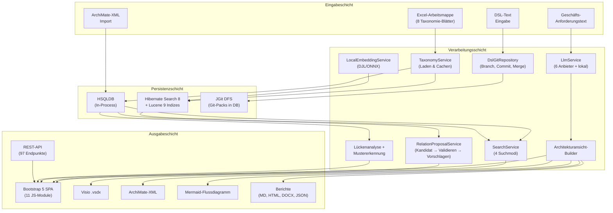
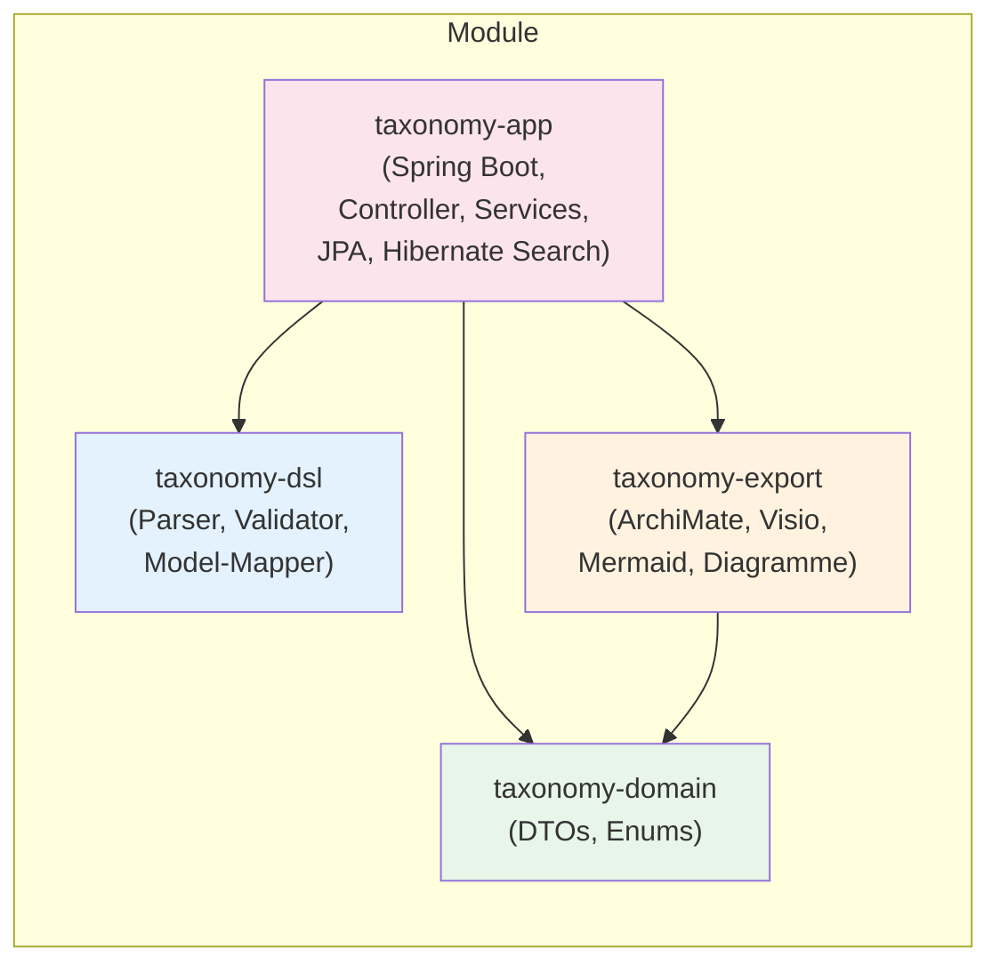

# Architekturbeschreibung

Dieses Dokument beschreibt die Architektur des Taxonomy Architecture Analyzer — einer Spring-Boot-Webanwendung zum Durchsuchen, Analysieren und Visualisieren von C3-Taxonomiedaten. Es richtet sich an Entwickler und Systemintegratoren, die das Systemdesign, die Verarbeitungspipelines und das betriebliche Setup verstehen müssen.

---

## Inhaltsverzeichnis

- [Systemüberblick](#systemüberblick)
- [Architekturprinzipien](#architekturprinzipien)
- [Übergeordnete Architektur](#übergeordnete-architektur)
- [Schlüsselkomponenten](#schlüsselkomponenten)
- [Pipeline zur Generierung der Architekturansicht](#pipeline-zur-generierung-der-architekturansicht)
- [Datenladung](#datenladung)
- [CI / CD](#ci--cd)
- [Datenbank](#datenbank)
- [Sicherheitsarchitektur](#sicherheitsarchitektur)
- [Git-Status als erstklassiges Konzept](#git-status-als-erstklassiges-konzept)
- [ViewContext und Action Guards](#viewcontext-und-action-guards)
- [Framework-Zuordnungsschicht](#framework-zuordnungsschicht)
- [Exportformate](#exportformate)
- [Detaillierte Architekturdiagramme](#detaillierte-architekturdiagramme)

---

## Systemüberblick

Die Anwendung ist eine einzelne Spring Boot 4 / Java 21 Webanwendung mit folgenden Hauptmerkmalen:

- **In-Process HSQLDB** — Taxonomiedaten (~2.500 Knoten über 8 Blätter aus einer Excel-Arbeitsmappe) werden beim Start in eine eingebettete HSQLDB-Datenbank geladen. Standardmäßig ist keine externe Datenbank erforderlich.
- **Multi-Anbieter-LLM-Integration** — Geschäftsanforderungen können von einem der sechs unterstützten Sprachmodellanbieter (Gemini, OpenAI, DeepSeek, Qwen, Llama, Mistral) oder von einem lokalen Offline-Modell (`bge-small-en-v1.5` über DJL / ONNX Runtime) analysiert werden, das keinen API-Schlüssel benötigt.
- **Taxonomiebaum-Visualisierung** — Die Hierarchie wird als zusammenklappbarer Bootstrap-5-Baum mit farbcodierten Übereinstimmungs-Overlays dargestellt.
- **Architekturintelligenz** — Bewertete Analyseergebnisse werden automatisch zu Architekturansichten zusammengestellt, die als ArchiMate-XML, Visio `.vsdx` und Mermaid-Flussdiagramme exportiert werden können.

---

## Architekturprinzipien

Das Systemdesign folgt diesen Leitprinzipien, abgestimmt auf die
[Deutschland-Stack Architekturprinzipien](https://deutschland-stack.gov.de/gesamtbild/#architekturprinzipien):

| Prinzip | Anwendung im Projekt |
|---|---|
| **Offene Standards** | Alle Exporte nutzen offene Formate (ArchiMate 3.x XML, OpenAPI, Mermaid, ONNX, CycloneDX). Keine proprietären Datenformate erforderlich. |
| **Open Source First** | MIT-Lizenz. Vollständiger Quellcode öffentlich. openCode-kompatibel. |
| **Interoperabilität** | REST API mit OpenAPI-Spezifikation. Framework-Import-Pipeline (UAF, APQC, C4). Export in 5+ Formate. |
| **Modularität & Wiederverwendung** | 4 Maven-Module mit minimaler Kopplung. 3 Module sind Spring-frei und unabhängig testbar. |
| **Integration** | Import-Pipelines für UAF/DoDAF, APQC PCF, C4/Structurizr. Keycloak SSO. Externe Git-Synchronisation. |
| **Skalierbarkeit** | Stateless REST API. Austauschbares Datenbank-Backend (HSQLDB, PostgreSQL, MSSQL, Oracle). Container-fähig. |
| **Sicherheit & Vertrauen** | Spring Security 3-Rollen-Modell. HSTS/CSP-Header. Rate Limiting. Air-Gapped-Betrieb. DSGVO-Dokumentation. |
| **Kooperatives Ökosystem** | Öffentliches GitHub-Repository. Docker-Images auf GHCR. CI/CD mit GitHub Actions. CycloneDX SBOM. |

Für die vollständige Konformitätsbewertung siehe [Deutschland-Stack Konformität](DEUTSCHLAND_STACK_CONFORMITY.md).

---

## Übergeordnete Architektur



---

## Schlüsselkomponenten

| Service | Rolle |
|---|---|
| `LlmService` | Multi-Anbieter-LLM-Integration. Leitet Analyseanfragen an den konfigurierten Anbieter (Gemini, OpenAI, DeepSeek, Qwen, Llama, Mistral) oder das lokale DJL/ONNX-Modell weiter. Behandelt Ratenbegrenzungs-Ausnahmen (`LlmRateLimitException` bei HTTP 429 / `RESOURCE_EXHAUSTED`). |
| `TaxonomyService` | Lädt den Taxonomiekatalog aus der mitgelieferten Excel-Arbeitsmappe (Apache POI) oder dem CSV-Fallback beim Start. Verwaltet die 8 Taxonomie-Wurzelkategorien (BP, BR, CP, CI, CO, CR, IP, UA). |
| `RequirementArchitectureViewService` | Erstellt Architekturansichten aus LLM-Analysebewertungen. Wählt Ankerknoten (Bewertung ≥ 70, mit Fallback auf ≥ 50) und propagiert Relevanz durch Taxonomiebeziehungen, um einen strukturierten Element-/Beziehungsgraphen aufzubauen. |
| `ArchitectureRecommendationService` | Erzeugt Architekturempfehlungen durch Kombination direkter Treffer, Lückenanalyse und semantischer Suchergebnisse, um zusätzliche relevante Knoten und Beziehungen vorzuschlagen. |
| `ArchitectureGapService` | Identifiziert fehlende Beziehungen und unvollständige Architekturmuster im Taxonomiegraphen bezüglich einer gegebenen Anforderung. |
| `ArchitecturePatternService` | Erkennt Standard-Architekturmuster (Full Stack, App Chain, Role Chain) in bewerteten Taxonomieergebnissen. |
| `ArchiMateDiagramService` | Konvertiert Architekturansichten in ArchiMate 3.x Model Exchange File Format XML, geeignet für den Import in Tools wie Archi, BiZZdesign und MEGA. |
| `VisioDiagramService` | Generiert Visio-`.vsdx`-Diagrammpakete aus Architekturansichten. |
| `MermaidExportService` | Exportiert Architekturansichten als Mermaid-Flussdiagramm-Codeblöcke. |
| `DiagramProjectionService` | Projiziert Architekturansichten in neutrale Diagrammmodelle, die von mehreren Exportern gerendert werden können. |
| `RelevancePropagationService` | Propagiert Relevanzbewertungen von Ankerknoten durch Taxonomiebeziehungen und erweitert die Architekturansicht um indirekt relevante Elemente. |
| `SearchService` / `HybridSearchService` | Volltextsuche (Lucene), semantische Suche (Embedding-KNN), hybride Suche (Reciprocal Rank Fusion) und graphbasierte Suche über Taxonomieknoten. |
| `LocalEmbeddingService` | Verwaltet das lokale `bge-small-en-v1.5`-Embedding-Modell über DJL/ONNX Runtime für semantische Suche und lokale Bewertung. |
| `RelationProposalService` | KI-gestützte Beziehungsvorschlags-Pipeline: Generiert Kandidatenbeziehungen und verwaltet den menschlichen Überprüfungsworkflow. |
| `ArchitectureReportService` | Generiert Analyseberichte in den Formaten Markdown, eigenständiges HTML, DOCX und strukturiertes JSON. |
| `ExplanationTraceService` | Erstellt Erklärungsspuren, die beschreiben, warum ein Knoten eine bestimmte Bewertung erhalten hat, einschließlich der LLM-Argumentationskette. |
| `DslGitRepository` | Versionierte DSL-Dokumentenspeicherung auf Basis von JGit DFS, wobei alle Git-Objekte in HSQLDB persistiert werden (kein Dateisystem). Unterstützt Branches, Commits, Cherry-Pick und Merge. |
| `CommitIndexService` | Indexiert DSL-Commit-Verlauf in Hibernate Search / Lucene für die Volltextsuche über Commit-Nachrichten und Änderungsinhalte. |
| `HypothesisService` | Verwaltet Beziehungshypothesen, die während der Analyse generiert werden. Hypothesen können akzeptiert (erzeugt `TaxonomyRelation`), abgelehnt oder nur für die aktuelle Sitzung angewendet werden. |
| `LlmResponseParser` | Zustandsloser Parser für LLM-Antworten. Verarbeitet Gemini- und OpenAI-Antwortformate, Bewertungsextraktion (Ganzzahl und Bewertung+Begründung), Bewertungsnormalisierung (Größter-Rest-Methode) und JSON-Extraktion. |
| `DocumentAnalysisService` | KI-gestützte Dokumentenanalyse. Bietet LLM-gestützte Extraktion von Anforderungskandidaten aus Dokumenttext (`extractWithAi`) und direktes Regulation-zu-Architektur-Taxonomie-Mapping (`mapRegulationToArchitecture`). Verwendet spezialisierte Prompt-Templates (`extract-*`, `reg-map-*`). |
| `RateLimitFilter` | In-Memory-Ratenbegrenzer pro IP für LLM-gestützte Endpunkte (`/api/analyze`, `/api/analyze-stream`, `/api/analyze-node`, `/api/justify-leaf`). Konfigurierbar über `TAXONOMY_RATE_LIMIT_PER_MINUTE`. |
| `RelationCompatibilityMatrix` | Definiert, welche Beziehungstypen zwischen welchen Taxonomie-Wurzelkategorien gültig sind (z. B. `REALIZES` erfordert CP → CR). Wird vom Validator und Vorschlagsgenerator verwendet. |

---

## Pipeline zur Generierung der Architekturansicht

Das folgende Diagramm und die Schritte beschreiben, wie eine Freitext-Geschäftsanforderung zu einem exportierbaren Architekturdiagramm wird:



1. **Anforderungstext** — Der Benutzer gibt eine Freitext-Geschäftsanforderung in der Benutzeroberfläche ein.
2. **LLM-Analyse** — `LlmService` sendet die Anforderung an den konfigurierten Anbieter; die Antwort enthält eine Bewertungskarte (Taxonomie-Knotencode → Übereinstimmungsprozentsatz, 0–100).
3. **Ankerauswahl** — `RequirementArchitectureViewService` wählt Knoten mit Bewertung ≥ 70 als primäre Anker. Wenn weniger als drei Anker gefunden werden, fällt der Schwellenwert auf Bewertung ≥ 50 zurück (Top 3).
4. **Relevanzpropagation** — `RelevancePropagationService` folgt den Taxonomiebeziehungen von den Ankerknoten und weist verbundenen Knoten abgeleitete Bewertungen zu, wodurch ein gewichteter Elementgraph entsteht.
5. **Element- und Beziehungsaufbau** — Architekturelemente und deren Beziehungen werden aus dem propagierten Graphen zusammengestellt, unter Berücksichtigung der Taxonomiehierarchie.
6. **Diagrammprojektion** — `DiagramProjectionService` konvertiert das Architekturmodell in eine neutrale Darstellung, die von mehreren Exportern gerendert werden kann.
7. **Export** — Das projizierte Modell wird in das gewählte Format exportiert:
   - `ArchiMateDiagramService` → ArchiMate 3.x XML (`.archimate` / `.xml`)
   - `VisioDiagramService` → Visio `.vsdx`
   - `MermaidExportService` → Mermaid-Flussdiagramm (`.md`)

> 📖 Für eine detaillierte Dokumentation aller Pipeline-Schritte,
> Konstanten, des Propagierungsalgorithmus, der Wirkungsauswahl-Formel,
> des Beziehungslebenszyklus und des Persistenzmodells siehe
> **[Entscheidungspipeline](DECISION_PIPELINE.md)**.

---

## Modularchitektur

Das Projekt ist ein Multi-Modul-Maven-Build mit vier Modulen:

```
taxonomy-domain/       Reine Domänentypen (DTOs, Enums) — keine Framework-Abhängigkeiten
taxonomy-dsl/          Architektur-DSL (Parser, Modell, Validator, Differ); Provenienz-Modell (source, sourceVersion, sourceFragment, requirementSourceLink) — keine Framework-Abhängigkeiten
taxonomy-export/       Export-Services (ArchiMate, Visio, Mermaid, Diagramm) — keine Framework-Abhängigkeiten
taxonomy-app/          Spring-Boot-Anwendung (Controller, Services, JPA, Suche, Speicher)
```

Abhängigkeitsgraph:

```
taxonomy-app  →  taxonomy-domain
taxonomy-app  →  taxonomy-dsl
taxonomy-app  →  taxonomy-export
taxonomy-export  →  taxonomy-domain
```

`taxonomy-domain`, `taxonomy-dsl` und `taxonomy-export` haben **keine Spring-Abhängigkeiten** und können unabhängig getestet und verwendet werden.

---

## DSL-Speicherarchitektur

Die Anwendung enthält ein versioniertes Architektur-DSL-Subsystem auf Basis von JGit DFS (Distributed File System), wobei alle Git-Objekte in der HSQLDB-Datenbank persistiert werden — es wird kein Dateisystem verwendet.

```
DSL-Text  →  JGit-Commit  →  HibernateRepository  →  HSQLDB (git_packs- & git_reflog-Tabellen)
```

| Komponente | Klasse | Rolle |
|---|---|---|
| Repository-Fassade | `DslGitRepository` | Hochrangige API für Commit-, Lese-, Branch- und Diff-Operationen |
| Git-Objektspeicher | `HibernateObjDatabase` | Speichert Blobs, Trees und Pack-Daten als BLOBs in der `git_packs`-Tabelle |
| Git-Ref-Speicher | `HibernateRefDatabase` | Speichert Refs und Reftables in der `git_packs`-Tabelle (als Pack-Erweiterungen) |
| Repository-Wrapper | `HibernateRepository` | Erweitert JGit `DfsRepository` mit datenbankgestützten Objekt- und Ref-Datenbanken |
| Pack-Entität | `GitPackEntity` | JPA-Entität für die `git_packs`-Tabelle |
| Reflog-Entität | `GitReflogEntity` | JPA-Entität für die `git_reflog`-Tabelle |
| Konfiguration | `DslStorageConfig` | Spring-`@Configuration`, die die `DslGitRepository`-Bean verdrahtet |

DSL-Dokumente werden unter dem Dateinamen `architecture.taxdsl` gespeichert. Der `DslApiController` stellt Endpunkte für Commit, Verlauf, Diff, Branching, Merge und Cherry-Pick-Operationen bereit. Provenienz-Blöcke (`source`, `sourceVersion`, `sourceFragment`, `requirementSourceLink`) werden im selben JGit-DFS-Repository zusammen mit Architekturblöcken gespeichert.

---

## Datenladung

Beim Start lädt `TaxonomyService` den C3-Taxonomiekatalog aus der mitgelieferten Excel-Arbeitsmappe (`src/main/resources/data/C3_Taxonomy_Catalogue_25AUG2025.xlsx`) mit Apache POI. Eine CSV-Seed-Datei (`relations.csv`) liefert Standard-Beziehungen, wenn kein Relations-Blatt in der Arbeitsmappe vorhanden ist.

### Beziehungs-Seed-Modell

Die Beziehungs-Seed-CSV (`src/main/resources/data/relations.csv`) unterstützt ein erweitertes Metadatenformat mit den folgenden Spalten:

| Spalte | Pflicht | Beschreibung |
|---|---|---|
| SourceCode | ja | Taxonomie-Code des Quellelements (z. B. CP, CR) |
| TargetCode | ja | Taxonomie-Code des Zielelements |
| RelationType | ja | Ein gültiger `RelationType`-Enum-Wert |
| Description | nein | Menschenlesbare Erklärung |
| SourceStandard | nein | Framework/Standard (z. B. TOGAF, NAF, LOCAL) |
| SourceReference | nein | Spezifische Referenz im Standard (z. B. NCV-2) |
| Confidence | nein | Wert zwischen 0.0 und 1.0 (Standard 1.0) |
| SeedType | nein | TYPE_DEFAULT, FRAMEWORK_SEED oder SOURCE_DERIVED |
| ReviewRequired | nein | Ob menschliche Überprüfung empfohlen wird (Standard false) |
| Status | nein | accepted oder proposed (Standard accepted) |

Seed-Typen unterscheiden drei Kategorien:
- **TYPE_DEFAULT** — Strukturelle Beziehungen, die immer zwischen Taxonomietypen erwartet werden.
- **FRAMEWORK_SEED** — Beziehungen aus einem Framework-Standard (TOGAF, NAF usw.).
- **SOURCE_DERIVED** — Beziehungen aus regulatorischen oder Referenzdokumenten.

Siehe [RELATION_SEEDS.md (EN)](../en/RELATION_SEEDS.md) für die vollständige Dokumentation des Seed-Formats.

Die 8 Taxonomie-Wurzelkategorien sind:

| Code | Kategorie |
|---|---|
| **BP** | Geschäftsprozesse |
| **BR** | Geschäftsrollen |
| **CP** | Fähigkeiten |
| **CI** | COI-Services |
| **CO** | Kommunikationsservices |
| **CR** | Kerndienste |
| **IP** | Informationsprodukte |
| **UA** | Benutzeranwendungen |

Kinder werden durch hierarchische Codes aus der Arbeitsmappe identifiziert (z. B. `BP-1327`, `CP-1022`, `CR-1047`).

## CI / CD

Jeder Push löst den **CI / CD** GitHub Actions Workflow aus:

| Schritt | Was passiert |
|---|---|
| **Build & Test** | `mvn verify` — kompiliert, führt Integrationstests aus |
| **Docker-Image veröffentlichen** | Push in die GitHub Container Registry (`ghcr.io`) |
| **Auf Render deployen** | Löst einen Render-Deploy-Hook aus (falls Secret gesetzt) |

📋 **[Testergebnis-Bericht](https://carstenartur.github.io/Taxonomy/tests/surefire-report.html)**
📈 **[Code-Coverage-Bericht](https://carstenartur.github.io/Taxonomy/coverage/)**

## Datenbank

### Standard: In-Process-HSQLDB

Die Anwendung wird mit einer eingebetteten HSQLDB-Datenbank ausgeliefert. Es ist keine Installation oder ein externer Datenbankserver erforderlich. Alle Taxonomiedaten werden beim Start aus der mitgelieferten Excel-Arbeitsmappe geladen.

Da HSQLDB **in-process** läuft (gleiche JVM, kein Netzwerk-Hop), verursacht ein JDBC-Verbindungspool nur Overhead. Die Anwendung verwendet daher `SimpleDriverDataSource` anstelle des Spring-Boot-Standards HikariCP. Dies eliminiert HikariPool-Verbindungserschöpfungsprobleme und reduziert den Speicherverbrauch — besonders wichtig auf eingeschränkten Hosts wie dem Render Free Tier (512 MB RAM).

### MSSQL-Kompatibilität

Alle Entity-Klassen sind für korrektes Verhalten auf Microsoft SQL Server annotiert:

- **`@Nationalized`** auf jedem `String`-Feld → erzeugt `nvarchar` statt `varchar`,
  verhindert Beschädigung von Nicht-ASCII-Zeichen (z. B. deutsche Umlaute ä, ö, ü, ß).
- **`@Lob`** auf Textfeldern, die 4000 Zeichen überschreiten können (`descriptionEn`,
  `descriptionDe`, `reference`) → erzeugt `nvarchar(max)` / `ntext` auf MSSQL.
- **`@Lob` + `FloatArrayConverter`** auf `semanticEmbedding`-Feldern in `TaxonomyNode`
  und `TaxonomyRelation` → speichert Embedding-Vektoren als streambare BLOBs unter Verwendung
  von Little-Endian-IEEE-754-Serialisierung.

Die Anwendung verwendet standardmäßig weiterhin HSQLDB (kein MSSQL-Setup erforderlich).

## Ratenbegrenzung

Der `RateLimitFilter` erzwingt IP-basierte Ratenbegrenzungen auf LLM-gestützten Endpunkten, um Quota-Erschöpfung bei Gemini, OpenAI und anderen Anbietern zu verhindern. Geschützte Endpunkte:

- `POST /api/analyze`
- `GET /api/analyze-stream`
- `GET /api/analyze-node`
- `POST /api/justify-leaf`

Standard: **10 Anfragen pro IP pro Minute** (konfigurierbar über `TAXONOMY_RATE_LIMIT_PER_MINUTE`; auf `0` setzen zum Deaktivieren). Wenn das Limit überschritten wird, gibt der Filter HTTP 429 Too Many Requests zurück.

## API-Versionierung

Die API ist derzeit **unversioniert** — alle Endpunkte verwenden das `/api/`-Präfix ohne Versionsnummer (z. B. `/api/taxonomy`, `/api/analyze`).

| Aspekt | Entscheidung |
|---|---|
| URL-Schema | `/api/{resource}` (kein Versionssegment) |
| Abwärtskompatibilität | Wird innerhalb jeder Version beibehalten; Breaking Changes werden in den Release Notes dokumentiert |
| Deprecation-Richtlinie | Veraltete Endpunkte geben einen `Deprecation`-Header zurück, bevor sie in der nächsten Hauptversion entfernt werden |
| Content-Negotiation | Wird nicht für Versionierung verwendet |

Die Anwendung ist für **Single-Tenant, Self-Hosted-Deployment** konzipiert, bei dem die Browser-UI immer zusammen mit dem Server bereitgestellt wird, wodurch das Multi-Client-Versionsskew-Problem entfällt, das typischerweise API-Versionierung motiviert. Die **OpenAPI-Spezifikation** (`/v3/api-docs`) dient als maschinenlesbarer Vertrag für externe Integrationen.

Falls die API in Zukunft mehrere gleichzeitige Versionen unterstützen muss, ist der empfohlene Weg die URL-basierte Versionierung (`/api/v2/...`) mit separaten OpenAPI-Gruppen pro Version.

## Sicherheitsarchitektur

Die Anwendung verwendet **Spring Security** mit einem Drei-Rollen-Autorisierungsmodell:

| Rolle | Berechtigungen |
|---|---|
| `ROLE_USER` | Alle API-Endpunkte lesen, Analysen durchführen, Diagramme exportieren, GUI-Zugriff |
| `ROLE_ARCHITECT` | Alles aus USER, plus Schreibzugriff auf Beziehungen, DSL und Git-Operationen |
| `ROLE_ADMIN` | Alles aus ARCHITECT, plus Admin-Endpunkte (`/admin/**`, `/api/admin/**`), Benutzerverwaltung |

**Authentifizierungsmethoden:**

- **Formularanmeldung** — Browser-Sitzungen über die `/login`-Seite (CSRF-geschützt)
- **HTTP Basic** — Zustandslose REST-Clients (CSRF deaktiviert für `/api/**`)

Ein Standard-`admin`-Benutzer (mit allen drei Rollen) wird beim ersten Start über `SecurityDataInitializer` erstellt. Das Passwort ist über `TAXONOMY_ADMIN_PASSWORD` konfigurierbar (Standard: `admin`).

**Öffentliche Endpunkte** (keine Authentifizierung erforderlich): `/login`, `/error`, `/actuator/health/**`, `/v3/api-docs/**` (konfigurierbar), `/swagger-ui/**` (konfigurierbar) und statische Assets.

**Sicherheitshärtungsfunktionen:**

| Funktion | Standard | Konfiguration |
|---|---|---|
| Brute-Force-Schutz bei der Anmeldung | Aktiviert (5 Versuche, 5 Min. Sperrung) | `TAXONOMY_LOGIN_RATE_LIMIT` |
| Sicherheits-Header (HSTS, CSP, X-Frame-Options) | Immer aktiviert | — |
| Swagger-Zugriffskontrolle | Öffentlich | `TAXONOMY_SWAGGER_PUBLIC` |
| Passwortänderungspflicht | Deaktiviert (nur Warnung) | `TAXONOMY_REQUIRE_PASSWORD_CHANGE` |
| Benutzerverwaltungs-API | Immer verfügbar für ADMIN | `/api/admin/users` |
| Sicherheits-Audit-Protokollierung | Deaktiviert | `TAXONOMY_AUDIT_LOGGING` |

Siehe [Sicherheit](SECURITY.md) für vollständige Details.

---

## Git-Status als erstklassiges Konzept

Der Repository-Status wird als erstklassiges Laufzeitkonzept durch drei zusammenarbeitende Services verfolgt und exponiert:

| Komponente | Klasse | Verantwortlichkeit |
|---|---|---|
| **Statusverfolgung** | `RepositoryStateService` | Verfolgt Projektions-Commit, Index-Commit und Veralterung mittels `volatile`-Feldern |
| **Konflikterkennung** | `ConflictDetectionService` | Dry-Run-Merge- und Cherry-Pick-Vorschauen mit Drei-Wege-Merge-Logik |
| **REST-API** | `GitStateController` | Exponiert `/api/git/{state,projection,branches,stale}`-Endpunkte |

**Veralterungsmodell:** Nach der DSL-Materialisierung zeichnet der `RepositoryStateService` den Projektions-Commit-SHA auf. Wenn der HEAD anschließend vorrückt (z. B. durch einen neuen Commit), wird die Projektion als **veraltet** markiert, bis eine erneute Materialisierung erfolgt. Die gleiche Logik gilt für den Hibernate-Search-Index.

Die Benutzeroberfläche pollt `/api/git/state` alle 10 Sekunden (über `taxonomy-git-status.js`) und zeigt einen visuellen Indikator an, wenn die Projektion veraltet ist.

Siehe [Git-Integration](GIT_INTEGRATION.md) für die vollständige REST-API und Nutzungsanleitung.

---

## Mehrbenutzter-Workspace-Architektur

Das System unterstützt gleichzeitige Mehrbenutzer-Bearbeitung durch ein Workspace-Isolationsmodell.
Wenn eine `DslGitRepositoryFactory` konfiguriert ist (Standard in Produktion), erhält jeder
Workspace ein eigenes logisch getrenntes Git-Repository innerhalb der gleichen Datenbank.
Ohne die Factory werden Workspaces über Branches in einem gemeinsamen Repository isoliert.

### Repository-pro-Workspace-Architektur

```
┌─────────────────────────────────────────────────────┐
│                    HSQLDB (git_packs-Tabelle)         │
│                                                       │
│  ┌───────────────┐  ┌──────────────┐  ┌────────────┐ │
│  │ System-Repo   │  │ Alice-Repo   │  │ Bob-Repo   │ │
│  │ Name:         │  │ Name:        │  │ Name:      │ │
│  │ "taxonomy-dsl"│  │ "ws-abc-123" │  │ "ws-def-456│ │
│  │ Branch: draft │  │ Branch: main │  │ Branch: main│ │
│  └───────┬───────┘  └──────┬───────┘  └──────┬─────┘ │
│          │                 │                  │       │
│          │    publish ◄────┘                  │       │
│          │    sync    ────►                   │       │
│          │    publish ◄──────────────────────┘       │
│          │    sync    ──────────────────────►         │
└──────────┼───────────────────────────────────────────┘
           │
           │ fetch/push (EXTERNAL_CANONICAL-Modus)
           ▼
┌──────────────────────┐
│   Gitea / GitHub     │
│   Remote-Repository  │
└──────────────────────┘
```

### Komponenten

| Komponente | Verantwortlichkeit |
|---|---|
| **DslGitRepositoryFactory** | Erstellt und cached workspace-spezifische `DslGitRepository`-Instanzen |
| **WorkspaceManager** | In-Memory-Cache von benutzerspezifischen `UserWorkspaceState`-Instanzen (ConcurrentHashMap) |
| **UserWorkspaceState** | Flüchtiger benutzerspezifischer Status: Kontext, Verlauf, Projektionsverfolgung, Operationsstatus |
| **UserWorkspace** (Entität) | Persistente Workspace-Metadaten: Branch, Zeitstempel, Shared-Flag |
| **WorkspaceProjection** (Entität) | Benutzerspezifischer Projektionsstatus: Commit-SHAs, Zeitstempel, Veralterung |
| **ContextHistoryRecord** (Entität) | Persistenter Navigationsverlauf mit Herkunftsverfolgung |
| **SyncState** (Entität) | Verfolgt den Synchronisierungsstatus zwischen Workspace und gemeinsamem Repository |
| **WorkspaceResolver** | Extrahiert den Benutzernamen aus dem Spring-Security-Kontext |
| **ExternalGitSyncService** | Fetch/Push-Operationen zum externen Git-Remote (EXTERNAL_CANONICAL-Modus) |

### Isolationsmodell

1. **Repository-Isolation** — Bei konfigurierter `DslGitRepositoryFactory` erhält jeder Workspace ein eigenes Git-Repository (gleiche DB, unterschiedlicher Namespace). Ohne die Factory wird Branch-basierte Isolation verwendet.
2. **Status-Isolation** — Navigationskontext, Projektionsverfolgung und Operationsstatus sind benutzerspezifisch.
3. **Synchronisierungs-Workflow** — Benutzer pullen explizit vom gemeinsamen Repository (Sync) und pushen explizit zum gemeinsamen Repository (Veröffentlichen). Cross-Repository-Sync kopiert DSL-Inhalte zwischen Workspace- und System-Repositories.

### Datenisolation

Über Branch- und Status-Isolation hinaus bieten workspace-spezifische Datenentitäten benutzerspezifische Sichten auf veränderliche Daten:

| Entität | Isolation | Mechanismus |
|---|---|---|
| **TaxonomyNode** | Global (geteilt) | Schreibgeschützter Katalog aus Excel — kein Workspace-Filter |
| **TaxonomyRelation** | Pro Workspace | `workspace_id`-Spalte + OR-null JPA/Hibernate-Search-Queries |
| **RelationHypothesis** | Pro Workspace | `workspace_id`-Spalte |
| **RelationProposal** | Pro Workspace | `workspace_id`-Spalte |
| **ArchitectureCommitIndex** | Pro Branch | Vorhandenes `branch` `@KeywordField`, gefiltert nach `currentBranch` |

Der `WorkspaceContextResolver` löst den `WorkspaceContext` (Benutzername, WorkspaceId, aktueller Branch) des aktuellen Benutzers aus dem Spring-Security-Kontext und den persistenten `UserWorkspace`-Metadaten auf. Alle Relation-Queries, Materialisierung und Graph-Suchen verwenden diesen Kontext zur Filterung. Der Branch-Fallback verwendet `SystemRepositoryService.getSharedBranch()` (konfigurierbar, Standard: `"draft"`).

`WorkspaceContext.SHARED` hat `workspaceId = null`, wodurch die Workspace-Filterung übersprungen wird und nicht provisionierte Benutzer sowie Legacy-Aufrufer alle Daten sehen.

Bei der Annahme von Vorschlägen oder Hypothesen wird die Relation im **gespeicherten Workspace der Entität** erstellt (nicht im Workspace des aktuellen Reviewers), um die korrekte Workspace-Zugehörigkeit sicherzustellen.

Legacy-Daten mit `workspace_id = NULL` werden als geteilt behandelt und bleiben für alle Workspaces sichtbar.

### Datenfluss

```
Browser → WorkspaceResolver (Benutzer extrahieren)
       → WorkspaceManager (Status abrufen/erstellen)
       → DslGitRepositoryFactory (Repository für Workspace auflösen)
       → Service (workspace-bewusste Methode mit Benutzername-Parameter)
       → DslGitRepository (branch-beschränkte Git-Operationen)
```

Alle workspace-bewussten Services akzeptieren einen `username`-Parameter zur Statusisolation. Controller lösen den Benutzernamen über `WorkspaceResolver.resolveCurrentUsername()` auf.

Siehe [Konzepte](CONCEPTS.md) für Definitionen von Workspace, Variante, Projektion und Synchronisierung.

---

## ViewContext und Action Guards

Jede API-Antwort, die die DSL modifiziert, enthält ein `ViewContext`-Objekt mit dem aktuellen Repository-Status. Dies ermöglicht dem Frontend die Anzeige genauer Statusinformationen ohne einen zusätzlichen Roundtrip.

Der `RepositoryStateGuard` validiert, ob eine Schreiboperation (Merge, Cherry-Pick, Commit) auf dem Zielbranch sicher durchgeführt werden kann. Er prüft:

- Ob der Branch existiert
- Ob bereits eine Operation läuft (`operationKind`-Feld)
- Ob die Projektion veraltet ist (nur Warnung, blockiert nicht)

Laufende Operationen werden über `beginOperation(kind)` / `endOperation()`-Aufrufe auf dem `RepositoryStateService` verfolgt.

---

## Framework-Zuordnungsschicht

Die Framework-Import-Pipeline konvertiert externe Architekturmodelle (UAF, APQC, C4/Structurizr) in das kanonische Taxonomie-Datenmodell. Die Pipeline ist als eine Reihe von steckbaren Komponenten strukturiert:

```
ExternalParser  →  ExternalModelMapper (MappingProfile)  →  CanonicalArchitectureModel
                →  ModelToAstMapper  →  TaxDslSerializer  →  DslMaterializeService
```

| Komponente | Rolle |
|---|---|
| `ExternalParser` | Liest das native Dateiformat (XML, CSV, XLSX, DSL) in ein `ParsedExternalModel` |
| `MappingProfile` | Ordnet externe Element-/Beziehungstypen Taxonomie-Wurzelcodes und Beziehungstypen zu |
| `ExternalModelMapper` | Wendet das Profil an, um ein `CanonicalArchitectureModel` zu erzeugen |
| `ModelToAstMapper` | Konvertiert das kanonische Modell in den DSL-AST |
| `TaxDslSerializer` | Serialisiert den AST zu `.taxdsl`-Text |
| `DslMaterializeService` | Erstellt Datenbankentitäten aus der DSL |

Vier Zuordnungsprofile sind registriert:

| Profil | Framework | Format | Elementtypen | Beziehungstypen |
|---|---|---|---|---|
| `uaf` | UAF / DoDAF | XMI/XML | 11 Typen → 8 Wurzeln | 9 Typen |
| `apqc` | APQC PCF | CSV | 5 Ebenen → 5 Wurzeln | 4 Typen |
| `apqc-excel` | APQC PCF | XLSX | 5 Ebenen → 5 Wurzeln | 4 Typen |
| `c4` | C4 / Structurizr | DSL | 7 Typen → 5 Wurzeln | 7 Typen |

Importierte Elemente tragen ein `x-source-framework`-Erweiterungsattribut für die Rückverfolgbarkeit. Siehe [Framework-Import](FRAMEWORK_IMPORT.md) für detaillierte Zuordnungstabellen.

---

## Exportformate

| Format | Beschreibung |
|---|---|
| **ArchiMate-XML** | ArchiMate 3.x Model Exchange File Format XML, importierbar in Archi, BiZZdesign, MEGA und andere ArchiMate-kompatible Tools. |
| **Visio `.vsdx`** | Microsoft Visio-Diagrammpaket, kompatibel mit Visio 2013 und höher. |
| **Mermaid-Flussdiagramm** | Textbasiertes Mermaid-Diagramm (Markdown-Codeblock), renderbar in GitHub, GitLab, Notion, Confluence und den meisten modernen Dokumentationsplattformen. |

---

## Detaillierte Architekturdiagramme

### Anfrage-Lebenszyklus

Das folgende Diagramm zeigt den vollständigen Lebenszyklus einer Analyseanfrage, von der Benutzereingabe über die LLM-Bewertung bis zum Diagrammexport:



### Datenfluss-Architektur

Dieses Diagramm zeigt, wie Daten zwischen den Hauptsubsystemen fließen:



### Modul-Abhängigkeitsgraph


