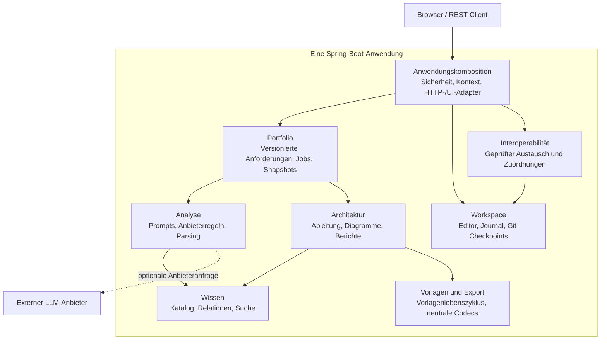
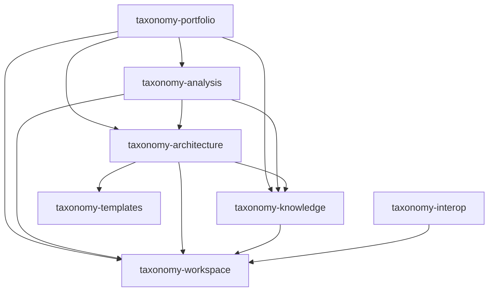
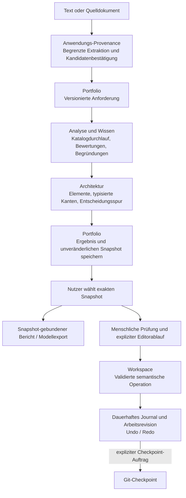
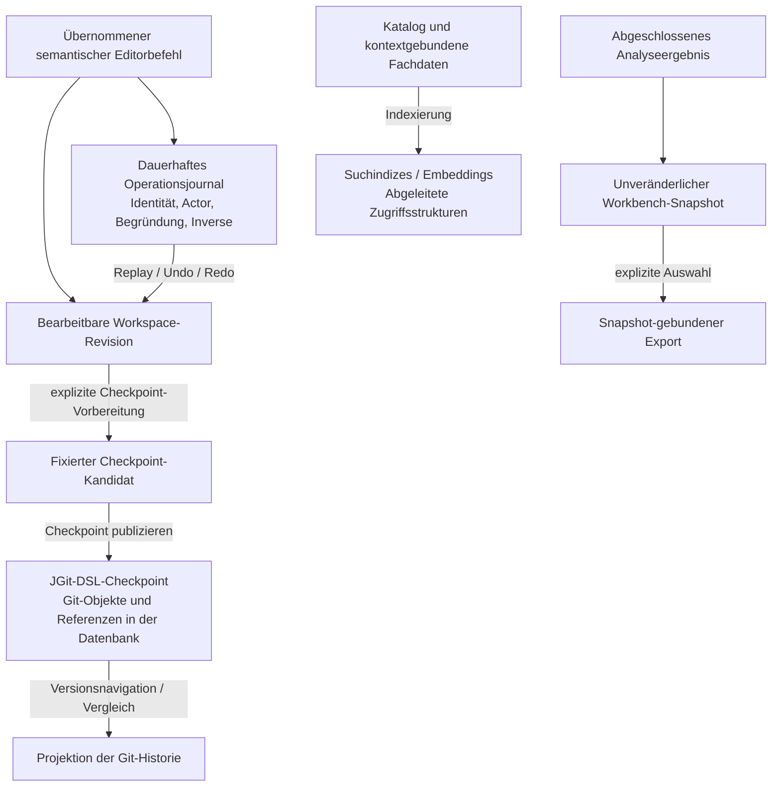

# Architekturbeschreibung

Taxonomy erzeugt aus Anforderungen und Quellmaterial mit KI-Unterstützung und
menschlicher Prüfung plausible, nachvollziehbare Architekturprototypen. Dieses
Dokument erklärt **die dafür eingesetzte Applikation**, nicht die Architektur
eines mit ihr erzeugten Modells.

Beschrieben wird die implementierte Architektur dieses Branches, keine Roadmap.
Taxonomy ist ein **modularer Monolith mit genau einer deploybaren Spring-Boot-Anwendung**.
Der Reactor umfasst fünfzehn Untermodule: vier frameworkfreie Grundlagen, sieben
Laufzeit-Fachbibliotheken, ein Kompositionsmodul und drei Build-/Werkzeugmodule.
Inventar und aktuelle Zuständigkeiten stehen in [Modulgrenzen](MODULE_BOUNDARIES.md).
[English](../en/ARCHITECTURE.md).

## Inhalt

- [Systemüberblick](#systemüberblick) und [Architekturprinzipien](#architekturprinzipien)
- [Übergeordnete Architektur](#übergeordnete-architektur) und [Modularchitektur](#modularchitektur)
- [Schlüsselkomponenten](#schlüsselkomponenten) und [Anforderungsablauf](#pipeline-zur-generierung-der-architekturansicht)
- [Persistenzzuständigkeiten](#dsl-speicherarchitektur) und [Git-Status](#git-status-als-erstklassiges-konzept)
- [Kontext und Schreibschutz](#viewcontext-und-action-guards)
- [Datenladung](#datenladung), [Datenbank](#datenbank) und [Sicherheit](#sicherheitsarchitektur)
- [Import](#framework-zuordnungsschicht), [Export](#exportformate) und [Verifikation](#ci--cd)

## Systemüberblick

`taxonomy-app` setzt die Fachbibliotheken zusammen und enthält Spring-Verdrahtung,
kontextübergreifende HTTP-/UI-Adapter, Sicherheit, Observability, Deployment-Konfiguration
und Datenbankmigrationen. Ein Maven-Modul ist kein separat deployter Dienst.
Fachbibliotheken hängen nicht von `taxonomy-app` ab; ihr produktiver Modulgraph ist
azyklisch. Das behauptet weder die Auflösung aller Package-Kopplungen noch die
Beseitigung sämtlicher historischer Ausnahmen.

Der Browser nutzt die Anwendungs-APIs und Streaming-Antworten. Die Analyse kann einen
konfigurierten entfernten LLM-Anbieter verwenden. Kataloganzeige und viele deterministische
Bearbeitungs-, Validierungs-, Such- und Exportfunktionen benötigen keinen Anbieter.
Lokale ONNX-Embeddings unterstützen semantische Suche und Scoring; sie belegen kein
lokales generatives Sprachmodell mit allen Fähigkeiten entfernter Anbieter.

## Architekturprinzipien

| Prinzip | Implementierungsgrenze |
|---|---|
| Eindeutige Zuständigkeit | Fachmodule besitzen ihre Fachlogik und Tests; kontextübergreifende Komposition bleibt in der Anwendung. |
| Menschliche Kontrolle | KI-Ausgaben sind Vorschläge. Prüfung, übernommene Änderungen, Identitäten und Herkunft bleiben explizit. |
| Getrennte Historien | Semantische Operationen, bearbeitbarer Workspace-Zustand, Git-Checkpoints und Analysesnapshots sind verschiedene Konzepte. |
| Stabile Verträge | Frameworkfreie Grundlagen und schmale fachliche Ports vermeiden Abhängigkeiten von Implementierungsklassen der Anwendung. |
| Reproduzierbare Prüfung | Modulzuständigkeit, Abhängigkeitsrichtung, Packaging, Wiederanlauf und Browserverhalten haben eigene Prüfungen. |
| Begrenzte Interoperabilität | Unterstützte Zuordnungen und Informationsverluste sind explizit; eine erzeugte Datei ist keine Desktop-Zertifizierung. |

## Übergeordnete Architektur

Die Grafik zeigt **logisches Zusammenwirken zur Laufzeit**, nicht jeden Java-Aufruf
und nicht die Maven-Abhängigkeiten. Benötigt ein Fachmodul einen anderen Kontext über
einen Port, stellt die Anwendung den Adapter bereit. Alle Bestandteile innerhalb
der Anwendungsgrenze laufen in einem Prozess.

```mermaid
flowchart TB
    Client["Browser / REST-Client"] --> HTTP
    subgraph Application["Eine Spring-Boot-Anwendung"]
        HTTP["Anwendungskomposition<br/>Sicherheit, Kontext, HTTP-/UI-Adapter"]
        Portfolio["Portfolio<br/>Versionierte Anforderungen, Jobs, Snapshots"]
        Analysis["Analyse<br/>Prompts, Anbieterregeln, Parsing"]
        Knowledge["Wissen<br/>Katalog, Relationen, Suche"]
        Architecture["Architektur<br/>Ableitung, Diagramme, Berichte"]
        Workspace["Workspace<br/>Editor, Journal, Git-Checkpoints"]
        Interop["Interoperabilität<br/>Geprüfter Austausch und Zuordnungen"]
        Templates["Vorlagen und Export<br/>Vorlagenlebenszyklus, neutrale Codecs"]
        HTTP --> Portfolio
        HTTP --> Workspace
        HTTP --> Interop
        Portfolio --> Analysis
        Portfolio --> Architecture
        Analysis --> Knowledge
        Architecture --> Knowledge
        Architecture --> Templates
        Interop --> Workspace
    end
    Analysis -.->|optionale Anbieteranfrage| LLM["Externer LLM-Anbieter"]
```

Persistenz folgt bewusst in einer eigenen Darstellung: Laufzeitaufruf,
Maven-Abhängigkeit und Speichervorgang dürfen nicht dieselbe mehrdeutige Pfeilbedeutung haben.

## Modularchitektur

Dieser Graph enthält **alle direkten produktiven POM-Abhängigkeiten zwischen den
sieben extrahierten Fachbibliotheken**. `A --> B` bedeutet eine deklarierte produktive
Abhängigkeit von A nach B, nicht einen ausschließlich in diese Richtung laufenden Datenfluss.

<!-- architecture-feature-graph:start -->

```mermaid
flowchart TB
    taxonomy-portfolio["taxonomy-portfolio"]
    taxonomy-analysis["taxonomy-analysis"]
    taxonomy-architecture["taxonomy-architecture"]
    taxonomy-knowledge["taxonomy-knowledge"]
    taxonomy-interop["taxonomy-interop"]
    taxonomy-workspace["taxonomy-workspace"]
    taxonomy-templates["taxonomy-templates"]
    taxonomy-portfolio --> taxonomy-analysis
    taxonomy-portfolio --> taxonomy-architecture
    taxonomy-portfolio --> taxonomy-knowledge
    taxonomy-portfolio --> taxonomy-workspace
    taxonomy-analysis --> taxonomy-architecture
    taxonomy-analysis --> taxonomy-knowledge
    taxonomy-analysis --> taxonomy-workspace
    taxonomy-architecture --> taxonomy-knowledge
    taxonomy-architecture --> taxonomy-templates
    taxonomy-architecture --> taxonomy-workspace
    taxonomy-knowledge --> taxonomy-workspace
    taxonomy-interop --> taxonomy-workspace
```
<!-- architecture-feature-graph:end -->

Abhängigkeiten der Anwendung auf Bibliotheken sowie der Grundlagenmodule sind in
dieser fokussierten Grafik absichtlich ausgeblendet. Die vier Grundlagen heißen
`taxonomy-domain`, `taxonomy-dsl`, `taxonomy-export` und `taxonomy-extension-api`.
Die separate Build-Gruppe besteht aus `taxonomy-tooling`, `taxonomy-coverage` und
`taxonomy-build`; sie bildet keine Laufzeit-Fachkontexte. Das vollständige Inventar
steht in [Modulgrenzen](MODULE_BOUNDARIES.md); das bestehende Modul-Gate schreibt
umfassende Zuständigkeits- und Abhängigkeitsnachweise nach
`taxonomy-build/target/architecture-module-graph.txt`.

Insbesondere hängt `taxonomy-templates` von keiner anderen Fachbibliothek ab.
`taxonomy-interop` hängt nicht von `taxonomy-portfolio` ab: Die Portfolioanbindung
verwendet einen fachlichen Port und einen anwendungsseitigen Adapter statt einer
umgekehrten Modulreferenz. Provenance und Preferences bleiben anwendungslokal.
Die Aufteilung erfindet keine separaten Dienste oder zusätzlich abgeschlossenen Extraktionen.

## Schlüsselkomponenten

| Zuständiger Bereich | Aufgabe und Grenze |
|---|---|
| Portfolio | Projekte, versionierte Anforderungen, dauerhafte Analysejobs/-ergebnisse/-reviews, Wiederanlauf und unveränderliche Workbench-Snapshots; koordiniert Fach-APIs. |
| Analyse | Anforderungsanalyse, Anbieterauswahl und -regeln, Prompts, Antwort-Parsing und Sitzungen; zustandsbehaftete Fremdzugriffe über Ports. |
| Wissen | Katalogladung, Relationen/Hypothesen, Volltext- und semantische Suche, Indizes und Embedding-Lebenszyklus. |
| Architektur | Ableitung, Scoring, Relevanzfortpflanzung, Lücken, Muster, Empfehlungen, neutrale Diagrammvorbereitung und Berichte; HTTP-Komposition und aktuelle Einstellungen über Anwendungsadapter. |
| Workspace | Repository-/Workspace-Identität, bearbeitbarer Modellzustand, dauerhafte semantische Operationen, Undo/Redo, explizite Checkpoints und JGit-Speicher. |
| Vorlagen | Versionierte Dokumentvorlagen, OOXML-Validierung, Materialisierung, WebDAV und Administration; Vorlagenhistorie ist keine Architekturhistorie. |
| Interoperabilität | Geprüfter Austausch, Zuordnungen, Konnektorprofile, Verlustnachweise, Integrationsoperationen und Synchronisationscheckpoints. |
| Anwendungskomposition | Kontextübergreifende HTTP-Abläufe, Berechtigungs-/Kontextauflösung, Quellenherkunft, Einstellungen, Verdrahtung, Migrationen und Packaging. |

Die genaue Package-Zuordnung steht in der [Kontextdatei](../../.github/architecture-contexts.json).
Historische Abhängigkeitszahlen belegen ihren jeweiligen Umbauzustand, keine aktuelle
Laufzeitmessung; siehe [Extraktionshistorie](MODULE_BOUNDARIES_HISTORY.md).

## Pipeline zur Generierung der Architekturansicht

Dies ist eine **Ablauf- und Zuständigkeitsdarstellung**. Nicht jeder Kasten entspricht
einem HTTP-Aufruf; das Speichern eines Snapshots bearbeitet nicht automatisch einen
Workspace. Eine Anforderung kann beispielsweise zivile Kommunikationsbedürfnisse
eines Krankenhauses beschreiben. Maßgeblich bleiben der echte Katalog und die Quellenverknüpfungen.

```mermaid
flowchart TB
    Input["Text oder Quelldokument"] --> Provenance["Anwendungs-Provenance<br/>Begrenzte Extraktion und Kandidatenbestätigung"]
    Provenance --> Requirement["Portfolio<br/>Versionierte Anforderung"]
    Requirement --> Analyse["Analyse und Wissen<br/>Katalogdurchlauf, Bewertungen, Begründungen"]
    Analyse --> Derive["Architektur<br/>Elemente, typisierte Kanten, Entscheidungsspur"]
    Derive --> Snapshot["Portfolio<br/>Ergebnis und unveränderlichen Snapshot speichern"]
    Snapshot --> Select["Nutzer wählt exakten Snapshot"]
    Select --> Export["Snapshot-gebundener Bericht / Modellexport"]
    Select --> Review["Menschliche Prüfung und expliziter Editorablauf"]
    Review --> Edit["Workspace<br/>Validierte semantische Operation"]
    Edit --> Revision["Dauerhaftes Journal und Arbeitsrevision<br/>Undo / Redo"]
    Revision -->|expliziter Checkpoint-Auftrag| Checkpoint["Git-Checkpoint"]
```

Hierarchische Analyse und Relevanzfortpflanzung liefern prüfbare Vorschläge.
Die Bewertungs- und Entscheidungsstufen beschreibt die [Entscheidungspipeline](DECISION_PIPELINE.md).
Der private Editor kann ein ausgewähltes Modell verbessern, ohne dessen unveränderlichen
Analysesnapshot umzuschreiben. Checkpoints entstehen explizit, nicht als Nebeneffekt jedes Edits.

Nur ein tatsächlich an einen ausgewählten gespeicherten Snapshot gebundener
Exportendpunkt besitzt dessen Verbindlichkeit. Ein Diagramm aus flüchtigen Bewertungen
oder einer Editorrevision darf nicht als dasselbe Artefakt ausgegeben werden.
Siehe [Exportgrenzen](FEATURE_MATRIX.md) und [Architektureditor](ARCHITECTURE_EDITOR.md).

## DSL-Speicherarchitektur

Die Grafik trennt **maßgebliche Zustände und explizite Persistenzübergänge**.
Logische Speicher können dieselbe physische Datenbank verwenden, ohne dadurch eine
einzige Historie oder eine gemeinsame Transaktion über alle Abläufe zu bilden.

```mermaid
flowchart TB
    Command["Übernommener semantischer Editorbefehl"] --> Journal["Dauerhaftes Operationsjournal<br/>Identität, Actor, Begründung, Inverse"]
    Command --> Working["Bearbeitbare Workspace-Revision"]
    Journal -->|Replay / Undo / Redo| Working
    Working -->|explizite Checkpoint-Vorbereitung| Frozen["Fixierter Checkpoint-Kandidat"]
    Frozen -->|Checkpoint publizieren| Git["JGit-DSL-Checkpoint<br/>Git-Objekte und Referenzen in der Datenbank"]
    Result["Abgeschlossenes Analyseergebnis"] --> Snapshot["Unveränderlicher Workbench-Snapshot"]
    Snapshot -->|explizite Auswahl| Report["Snapshot-gebundener Export"]
    Git -->|Versionsnavigation / Vergleich| GitView["Projektion der Git-Historie"]
    Catalogue["Katalog und kontextgebundene Fachdaten"] -->|Indexierung| Index["Suchindizes / Embeddings<br/>Abgeleitete Zugriffsstrukturen"]
```

| Zustand | Zuständigkeit | Bedeutung |
|---|---|---|
| Übernommene Editoroperation | Workspace | Dauerhafte semantische Revision mit Audit-/Undo-Daten; Git-Commits sind nicht ihr Protokoll. |
| Arbeitsmodell | Workspace | Aktuelle bearbeitbare Revision; der Editor prüft die zu ändernde Revision. |
| Git-Checkpoint | Workspace | Stabiler versionierter DSL-Inhalt, Branches, Vergleiche, Merges und explizite Veröffentlichung. |
| Analyse-/Workbench-Snapshot | Portfolio | Gespeichertes Analyseergebnis für schreibgeschützte Ansicht oder Snapshot-Export; kein Alias für Arbeitsrevision oder Git-Head. |
| Vorlagenversion | Vorlagen | Separat versionierte Dokumentvorlage mit Validierung und Materialisierung. |
| Suchindex/Cache | Wissen oder jeweiliger Fachkontext | Abgeleiteter Zugriffszustand, keine maßgebliche semantische Historie; Wiederanlauf und Isolation bleiben kontextspezifisch. |

JGit verwendet `jgit-storage-hibernate` als Datenbankadapter. Git-Objekte und Referenzen
liegen darüber in der konfigurierten relationalen Datenbank. HSQLDB ist der Standard,
nicht das einzig mögliche Backend. Quellenverknüpfungen und DSL-Modellinhalte behalten
in ihrem jeweiligen Persistenzweg ihre Identitäten.

## Git-Status als erstklassiges Konzept

Übernommene semantische Operation, Git-Commit und unveränderlicher Analysesnapshot
haben verschiedene Identitäten und Lebenszyklen. Undo/Redo gehört zum dauerhaften
semantischen Journal, explizite stabile Checkpoints zu Git. Externe Git-Synchronisation
verwendet Repository-Identitäten, Commit-Abstammung und Merge-/Konfliktbehandlung;
ein abgewiesener Push wird nicht stillschweigend als Erfolg behandelt.

Details zur Auswahl sowie zu gemeinsamen und persönlichen Repositories stehen in
[Repository-Topologie](REPOSITORY_TOPOLOGY.md), [Git-Integration](GIT_INTEGRATION.md)
und [Workspace/Versionierung](WORKSPACE_VERSIONING.md).

## ViewContext und Action Guards

Kontextübergreifende HTTP-Adapter lösen authentifizierte Identität und gewähltes
Repository beziehungsweise Workspace auf. Befehle benötigen ihre eigenen Berechtigungs-,
Revisions- und Konfliktprüfungen; ein versteckter Button ist keine Autorisierung.
Die Auswahl eines schreibgeschützten Snapshots ist ein anderer Weg als die Auswahl
eines bearbeitbaren Workspaces.

Ein Diagramm belegt weder vollständige Mandanten-/Branch-Isolation noch die Beseitigung
aller Wiederanlaufgrenzen. Diese Verträge müssen an den tatsächlichen Lese-/Schreibgrenzen
geprüft werden, nicht aus der Maven-Aufteilung abgeleitet. Kontextausnahmen und
Abhängigkeiten bleiben in den bestehenden Architekturrichtlinien sichtbar.

## Datenladung

Wissen besitzt Katalog-/Seed-Ressourcen, Katalog-Overlay, Relationen und Embedding-Lebenszyklus.
Der Katalog hat acht Wurzeln. Normaler Neustart mit Abgleich unterscheidet sich vom
expliziten Neuladen; er darf nicht als Löschen und Neuimport sämtlicher Wissensdaten
bei jedem Start beschrieben werden.

Dokumentimport hat eigene Upload-/Extraktionsgrenzen und Herkunftsverknüpfungen zu
Quellversionen und Fragmenten. Er ist nicht mit dem Laden des Katalogs gleichzusetzen.
Siehe [Entscheidungspipeline](DECISION_PIPELINE.md) und [Modulgrenzen](MODULE_BOUNDARIES.md).

## Datenbank

Das Standardprofil nutzt eingebettete HSQLDB. PostgreSQL, SQL Server und Oracle haben
eigene Konfiguration und Prüfläufe. Hibernate ORM persistiert Fachdaten;
Hibernate Search/Lucene liefern Indizes. Migrationen und abschließende Schema-Komposition
bleiben anwendungseigen, auch wenn ein Fachmodul seine Entities besitzt.

Konkrete Einstellungen stehen in [Datenbank-Setup](DATABASE_SETUP.md) und
[Konfigurationsreferenz](CONFIGURATION_REFERENCE.md). Diese Komponentenübersicht
ersetzt keine Betriebsanleitung.

## Sicherheitsarchitektur

Die Anwendung bietet lokale Anmeldung und ein Keycloak-/OIDC-Profil. Authentifizierung,
Anfrageidentität, Autorisierung und gewählter Repository-/Workspace-Kontext werden durch
Anwendungskomposition und fachspezifische Lese-/Schreibprüfungen umgesetzt.
Betriebsmaßnahmen, Geheimnisse, Reverse-Proxy-TLS und Transportbeschränkungen beschreibt
[Sicherheit](SECURITY.md) zusammen mit dem [Deployment-Leitfaden](DEPLOYMENT_GUIDE.md).

Der modulare Monolith schafft keine Netzwerkisolation zwischen Fachbibliotheken.
Sensible kontextübergreifende Funktionen benötigen Integrations-/Wiederanlauftests
zusätzlich zu Compile-Zeit-Grenzen. Quelldokumente, Prompts und Exporte haben eigene
Datenverarbeitungsgrenzen.

## Framework-Zuordnungsschicht

Framework-Parser und Zuordnungsprofile übersetzen unterstützte externe Darstellungen
in neutrale Modell-/DSL-Konzepte. Anwendungseigene Materialisierungsadapter überbrücken
die Kontextgrenze. Geprüfte Interoperabilität verfolgt zusätzlich externe Identitäten,
Reviewentscheidungen, Verlustnachweise und Synchronisationscheckpoints. Unterschiedliche
Importwege dürfen nicht mit identischen Review- oder Roundtrip-Garantien beworben werden.

Der gelieferte Sparx-Weg mit Profilversion 2 ergänzt neutrale Paketorganisation und
kanonische Anforderungszuordnungen über geprüfte Integrationsoperationen. Er verwendet
die bestehende DSL, das Workspace-Journal und die Portfoliozuständigkeit statt eines
zweiten Modellspeichers oder eines Git-Commits pro übernommenem Edit. Das zertifiziert
weder uneingeschränkte Enterprise-Architect-/Pro-Cloud-Server-Kompatibilität noch
bedingungslose entfernte Veröffentlichung.

Siehe [Framework-Import](FRAMEWORK_IMPORT.md) und [Sparx-Austausch](../features/sparx-integration-de.md).
Der Konnektorleitfaden beschreibt die unterstützte Version dieses Branches; zukünftige
Profile oder native Editorfähigkeiten sind damit nicht vorweggenommen.

## Exportformate

| Ausgabe | Grenze |
|---|---|
| Mermaid / neutrale Diagramme | Text-/Diagrammprojektionen des ausdrücklich ausgewählten Modells; das README-Beispiel ist ein erzeugtes Fachmodell, nicht der Modulgraph dieser Anwendung. |
| Berichte einschließlich Word | Berichtserzeugung gehört zur Architektur, Vorlagenlebenszyklus zum Vorlagenmodul und kontextübergreifende HTTP-/Einstellungsverdrahtung zur Anwendung. Verfügbare Vorlagenfunktionen hängen vom konkreten Berichtspfad ab. |
| ArchiMate / Visio | Begrenzte Formatimplementierungen mit Identitäts-, Mapping- und Verlustverträgen; erzeugte Dateien oder Paketprüfungen sind keine allgemeine unabhängige Werkzeugzertifizierung. |
| Geprüfter externer Austausch | Konnektor-/profilspezifische Semantik mit ausdrücklicher Prüfung und Kompatibilitätsgrenzen, kein uneingeschränkter bidirektionaler Modelleditor. |

Die [Funktionsmatrix](FEATURE_MATRIX.md) definiert Unterstützungsgrenzen. Detaillierte
Konnektor- und Editorleitfäden beschreiben die weiterentwickelte Semantik. Die Übersicht
übernimmt keine Versprechen aus offenen PRs und macht ein geschlossenes Issue nicht zum
Kompatibilitätsnachweis.

## CI / CD

Der eingecheckte Maven Wrapper wird vom Repository-Root aus verwendet. Unterstützte
Prüfläufe stehen in der [README](../../README.md#build-and-verification) und im
[Maven-Verifikationsleitfaden](../dev/MAVEN_VERIFICATION.md).

`taxonomy-build` besitzt die Reactor-weiten Architekturprüfungen. Das bestehende Gate
prüft physische Zuständigkeit, produktive POM-Abhängigkeiten und kompilierte Abhängigkeitsnachweise.
Die normale Reactor-weite Surefire-Suite führt zusätzlich `ArchitectureDocumentationTest`
aus: Mit dem Reactor-/POM-Leser des Gates gleicht er die drei aktuellen Modulinventare
und beide Sprachfassungen des markierten Fachmodulgraphen mit dem Code ab. Parserregressionen
weisen fehlende, zusätzliche, doppelte oder umgekehrte Einträge zurück. Der feste
Selektor des Profils `architecture-tests` bleibt unverändert; der neue Dokumentationstest
läuft im normalen Gesamt-Reactor-Test, nicht allein durch diesen engeren Selektor.

Das verhindert strukturelle Dokumentationsabweichungen, belegt aber weder den Laufzeitablauf
noch Kompatibilität zu Fremdwerkzeugen. Dafür bleiben Anwendungs-, Browser-, Datenbank-
und Interoperabilitätstests erforderlich. Die Applikationsdiagramme sind versionierter
Mermaid-Quelltext; keine erzeugte Architekturmodell-Fixture wird ersetzt.

## Detaillierte Architekturdiagramme

### Anfragelebenszyklus

Der [Anforderungsablauf](#pipeline-zur-generierung-der-architekturansicht) benennt die
Zuständigkeit jeder Stufe und trennt Ergebnisablage, menschliche Prüfung, Bearbeitung
und Checkpoint-Erzeugung. Endpunktverträge stehen in der [API-Referenz](API_REFERENCE.md).

### Datenflussarchitektur

Die [Persistenzgrafik](#dsl-speicherarchitektur) trennt maßgebliche Zustände von abgeleiteten
Indizes. Der [Fachmodulgraph](#modularchitektur) beantwortet dagegen, welche Bibliothek
auf welche andere zugreift. Bei Erweiterungen dürfen diese Pfeilbedeutungen nicht vermischt werden.
