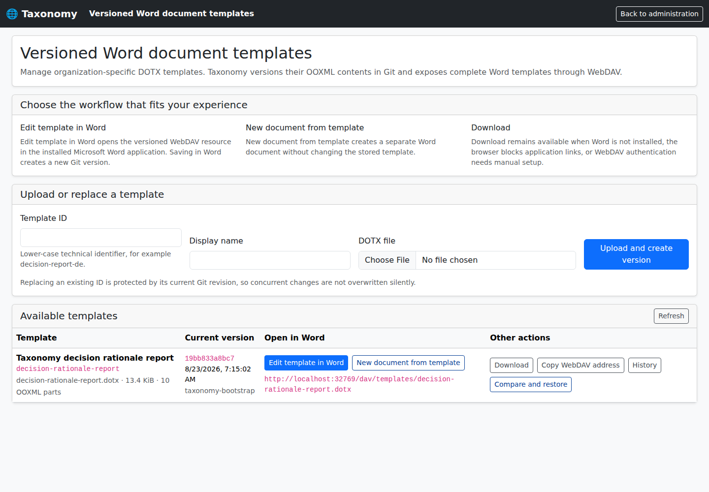
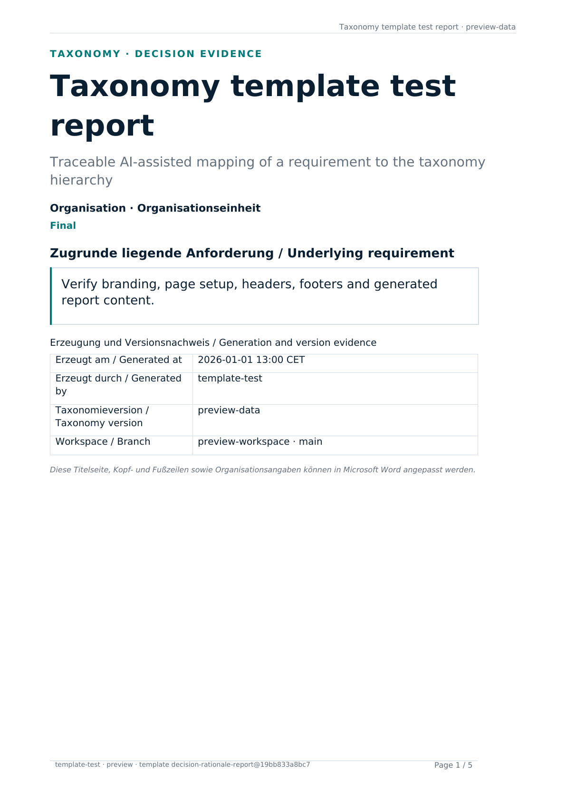

# Versionierte Word-Vorlagen

Taxonomy verwaltet Word-Vorlagen als entpackte OOXML-Paketbäume im logischen
JGit-/Hibernate-Repository `taxonomy-document-templates`. WebDAV und Downloads
stellen daraus vollständige `.dotx`-Dateien zusammen.

## Oberfläche und automatisierter Downloadtest

Die Administrationsseite `/admin/document-templates` zeigt die beim Erststart
angelegte Berichtsvorlage, ihre Git-Version, den vollständigen WebDAV-Pfad sowie die
Aktionen **Vorlage in Word bearbeiten**, **Neues Dokument aus Vorlage**,
**Herunterladen**, **Historie** und **Vergleichen und wiederherstellen**. Die folgende
Aufnahme stammt aus dem automatisierten Browsertest und zeigt insbesondere den
`ms-word:ofe`-Link an der tatsächlich initialisierten Vorlage.

[](../images/document-template-management.png)

Der GitHub-Workflow `Document Template Report E2E` startet die paketierte Taxonomy-
Anwendung über Testcontainers. Playwright meldet sich als Administrator an, wartet auf
die idempotent erzeugte Standardvorlage, prüft den sichtbaren Word- und WebDAV-Link,
öffnet die Detailansicht und lädt dort einen datenfreien DOCX-Testbericht herunter.
Der Test verlangt HTTP 200, den DOCX-Medientyp, den erwarteten Dateinamen in
`Content-Disposition`, eine plausible ZIP-/DOCX-Signatur und eine Mindestgröße.
Anschließend rendert LibreOffice den tatsächlich heruntergeladenen Bericht als PDF;
`pdftoppm` erzeugt daraus die folgende Aufnahme der ersten Seite.

[](../images/decision-rationale-template-test-report.png)

Das Testartefakt enthält zusätzlich die heruntergeladene DOCX-Datei, das gerenderte
PDF, beide Screenshots, den Playwright-Log sowie einen JSON-Nachweis mit URL,
Medientyp, Dateiname, Dateigröße und SHA-256-Prüfsumme. Dieser Test belegt den
Containerstart, die Erstanlage der Vorlage, die Browseroberfläche und den
Berichtsdownload. Er ersetzt nicht die getrennte Abnahme mit einer real installierten
Microsoft-Word-Version über öffentliches HTTPS und WebDAV.

## Standardvorlage für den Bewertungsbericht

Die Anwendung liefert die erforderliche Vorlage

```text
decision-rationale-report
```

im Container beziehungsweise JAR mit. Beim ersten erfolgreichen Start wird sie
idempotent als erster Git-Commit importiert. Existiert die Vorlage bereits, wird sie
weder beim Neustart noch bei einem Softwareupdate überschrieben. Eigene Logos,
Organisationsangaben und Layoutänderungen bleiben daher erhalten.

Der DOCX-Bewertungsbericht wird tatsächlich aus der jeweils aktuellen Git-Version
dieser Vorlage erzeugt. Taxonomy verwendet insbesondere:

```text
{{taxonomy.report.title}}
{{taxonomy.report.subtitle}}
{{taxonomy.report.status}}
{{taxonomy.report.requirement}}
{{taxonomy.report.generatedAt}}
{{taxonomy.report.generatedBy}}
{{taxonomy.report.taxonomyVersion}}
{{taxonomy.report.applicationVersion}}
{{taxonomy.report.workspace}}
{{taxonomy.report.branch}}
{{taxonomy.template.id}}
{{taxonomy.template.commit}}
{{taxonomy.report.body}}
```

`{{taxonomy.report.body}}` muss genau einmal als eigener Absatz vorkommen und der
letzte nicht leere Inhaltsblock des Dokuments sein. Taxonomy entfernt ihn beim Export
und fügt dort Kurzfassung, Entscheidungskapitel, Diagramme und Anhang ein. Titelseite,
Bilder, Kopf- und Fußzeilen, Seitenformat und Word-Formatvorlagen bleiben Bestandteil
der bearbeitbaren DOTX-Vorlage.

Uploads und Wiederherstellungen der Standardvorlage werden zusätzlich zum
allgemeinen OOXML-Sicherheitscheck gegen diesen Vertrag validiert. Der
Actuator-Health-Check `decisionRationaleTemplate` meldet `DOWN`, wenn die Pflichtvorlage
fehlt oder strukturell ungültig ist.

## Versions- und Konkurrenzmodell

Jede Vorlage verwendet den letzten Git-Commit, der ihren eigenen OOXML-Unterbaum
geändert hat, als Version und HTTP-ETag. Eine Änderung an einer anderen Vorlage macht
deshalb keinen geöffneten Editor ungültig und erzeugt keinen falschen Konflikt. Die
Erstanlage ist ausschließlich create-only; Ersetzen und Wiederherstellen benötigen das
aktuelle Vorlagen-ETag. `If-Match` verwendet starke HTTP-Entity-Tags, akzeptiert mehrere
Alternativen in einer kommaseparierten Liste und legt niemals eine fehlende Ressource
an.

WebDAV-Sperren verbessern die Bearbeitung in Word. Sie werden bewusst pro Prozess
gehalten; das unterstützte Helm-Profil bleibt deshalb bei genau einer Replik. Die
atomare Git-Prüfung der erwarteten Vorlagenversion bleibt auch nach einem
Prozessneustart oder dem Ablauf einer Sperre der dauerhafte Schutz vor verlorenen
Änderungen. Für mehrere Repliken wäre zunächst ein gemeinsamer Lock-Speicher nötig,
damit Word-Sperren ohne Unterbrechung zwischen Instanzen funktionieren.

## Zugriff und Transport

Angemeldete Benutzer dürfen vollständige Vorlagen lesen und daraus ein neues Dokument
erzeugen. Nur Administratoren dürfen Vorlagen hochladen, wiederherstellen, sperren oder
speichern. Direkte Desktop-Word-Links benötigen HTTPS; ausgenommen sind lokale
Loopback-Adressen für die Entwicklung. Der normale HTTPS-Download und eine kopierbare
WebDAV-Adresse bleiben als Rückfallwege verfügbar.

Im Keycloak-Profil sind direkte `ms-word:`-Links standardmäßig deaktiviert. Desktop-
Word kann die OIDC-Sitzung des Browsers nicht übernehmen und erhält den erforderlichen
Bearer-Token nicht. Die Links dürfen erst wieder aktiviert werden, wenn der Betrieb
einen WebDAV-kompatiblen, begrenzten Zugang wie ein App-Passwort implementiert und
getestet hat. WebDAV-Clients mit Bearer-Token-Unterstützung können den Endpunkt weiter
verwenden.

Taxonomy-App-Zugangsdaten haben genau ein 71 Zeichen langes ASCII-Format. Der
WebDAV-Filter weist zu große Basic-Header, ungültiges UTF-8, zu lange decodierte
Benutzernamen oder Passwörter sowie fehlerhafte `taxdav_`-Kandidaten vor
Repository-Zugriff oder BCrypt zurück. Normale Kontopasswörter, die nicht mit
`taxdav_` beginnen, laufen weiterhin durch den gewöhnlichen HTTP-Basic-Pfad von
Spring Security.

Fehlgeschlagene App-Anmeldungen werden über einen SHA-256-Digest fester Länge aus dem
vom Framework aufgelösten Peer und dem normalisierten übermittelten Benutzernamen
gezählt; rohe Identitäten bleiben nicht in der Sperrtabelle. Zehn Fehlversuche innerhalb
einer Minute sperren diese Identität. Die reguläre Tabelle ist pro Anwendungsinstanz
hart auf 10.000 Schlüssel begrenzt. Nicht mehr aufnehmbare Identitäten teilen ein
fehlgeschlossenes Überlaufkontingent, statt bestehende Sperren zu löschen. Eine
gesperrte Anfrage erhält UTF-8-JSON mit HTTP 429, `Retry-After` und
`Cache-Control: no-store`. Die Verarbeitung von Weiterleitungs-Headern darf nur hinter
einem vertrauenswürdigen Ingress aktiviert werden, weil der Filter bewusst das
Framework-Ergebnis `getRemoteAddr()` verwendet und Weiterleitungs-Header niemals
selbst auswertet.

Taxonomy weist Makros, ActiveX, eingebettete OLE-Objekte, Signaturen, unsichere
ZIP-Pfade, nur in Groß-/Kleinschreibung kollidierende Paketbestandteile, fehlerhaftes
XML, externe Beziehungen außer Hyperlinks, fehlende interne Beziehungsziele, Pakete
ohne genau eine Root-`officeDocument`-Beziehung auf `word/document.xml` sowie
OOXML-Bestandteile namens `template.json` zurück. Dieser Name ist dem internen
Taxonomy-Manifest vorbehalten.
