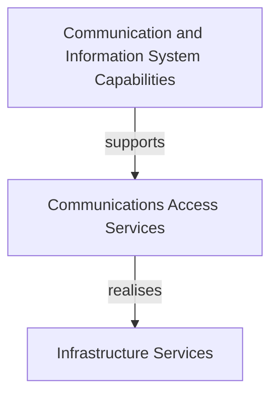

# Beispiele

Dieses Dokument zeigt ausgearbeitete Beispiele für häufige Aufgaben im Taxonomy Architecture Analyzer.

---

## Inhaltsverzeichnis

- [1. Anforderung → Architektur](#1-anforderung--architektur)
- [2. Ausfallauswirkungsanalyse](#2-ausfallauswirkungsanalyse)
- [3. Architektur-Lückenanalyse](#3-architektur-lückenanalyse)
- [4. Beziehungsvorschläge](#4-beziehungsvorschläge)
- [5. Architekturempfehlungen](#5-architekturempfehlungen)
- [6. Diagramm-Export](#6-diagramm-export)
- [7. Feldservice-Überwachung — Ende-zu-Ende](#7-feldservice-überwachung--ende-zu-ende)
- [8. Architektur-DSL-Workflow](#8-architektur-dsl-workflow)

---

## 1. Anforderung → Architektur

**Ziel:** Eine geschäftliche Anforderung auf relevante Taxonomie-Elemente abbilden und eine Architekturansicht generieren.

### Schritt 1 — Anforderung eingeben

Öffnen Sie `http://localhost:8080` und fügen Sie folgenden Text in das Analyse-Textfeld ein:

> _„Bereitstellung einer integrierten Kommunikationsplattform für Krankenhauspersonal, die Echtzeit-Sprach- und Datenaustausch zwischen Abteilungen sowie koordiniertes Workflow-Management für klinische Teams ermöglicht."_

### Schritt 2 — Analysieren

Klicken Sie auf **Analyze with AI**. Das System bewertet jeden Taxonomie-Knoten (0–100) und überlagert die Ergebnisse im Baum:


| Code | Knoten | Bewertung |
|---|---|---|
| CP-1023 | Communication and Information System Capabilities | 92 |
| CO-1011 | Communications Access Services | 88 |
| CR-1047 | Infrastructure Services | 81 |
| UA-1015 | Air Applications | 74 |
| BP-1327 | Enable | 71 |

### Schritt 3 — Architekturansicht generieren

Das System wählt automatisch Knoten mit einer Bewertung ≥ 70 als Anker aus, propagiert die Relevanz über Taxonomie-Beziehungen und erstellt ein strukturiertes Architekturmodell:

```
Capability: Communication and Information System Capabilities (CP-1023)
    ↓ supports
Service: Communications Access Services (CO-1011)
    ↓ realises
Service: Infrastructure Services (CR-1047)
    ↓ used by
Application: Air Applications (UA-1015)
    ↓ enables
Process: Enable (BP-1327)
```

### Schritt 4 — Exportieren

Klicken Sie auf eine Export-Schaltfläche, um die Architektur als ArchiMate XML, Visio `.vsdx` oder Mermaid-Flussdiagramm herunterzuladen.


<details>
<summary>🔧 REST-API-Äquivalent (für Automatisierung)</summary>

```bash
curl -u admin:admin -X POST http://localhost:8080/api/analyze \
  -d "businessText=Provide+integrated+communication+platform+for+hospital+staff" \
  -d "includeArchitectureView=true"
```

</details>

---

## 2. Ausfallauswirkungsanalyse

**Ziel:** Bestimmen, was ausfällt, wenn ein bestimmtes Taxonomie-Element nicht funktioniert.

### Web-Oberfläche

1. Öffnen Sie das **Graph Explorer**-Panel auf der rechten Seite.
2. Geben Sie den Knoten-Code ein, z. B. `CR-1047` (Infrastructure Services).
3. Klicken Sie auf **Failure Impact**.
4. Das Ergebnis zeigt jedes Element, das direkt oder transitiv von `CR-1047` abhängt.

Siehe auch [Benutzerhandbuch](USER_GUIDE.md) für Details zur Graph-Explorer-Oberfläche.

<details>
<summary>🔧 REST-API-Äquivalent (für Automatisierung)</summary>

```bash
curl -u admin:admin "http://localhost:8080/api/graph/node/CR-1047/failure-impact"
```

</details>

### Beispielergebnis

```json
{
  "sourceNode": "CR-1047",
  "sourceTitle": "Infrastructure Services",
  "impactedNodes": [
    { "code": "UA-1015", "title": "Air Applications", "distance": 1 },
    { "code": "BP-1327", "title": "Enable", "distance": 2 }
  ]
}
```

---

## 3. Architektur-Lückenanalyse

**Ziel:** Fehlende Beziehungen und unvollständige Architekturmuster im Kontext einer Anforderung finden.

### Web-Oberfläche (empfohlen)

1. Analysieren Sie eine Anforderung (siehe [Beispiel 1](#1-anforderung--architektur)).
2. Wechseln Sie zum Reiter **Lücken** im Ergebnisbereich.
3. Klicken Sie auf **🔍 Lückenanalyse starten**.
4. Die Ergebnistabelle zeigt fehlende Beziehungen und unvollständige Architekturmuster.


<details>
<summary>🔧 REST-API-Äquivalent (für Automatisierung)</summary>

```bash
curl -u admin:admin -X POST http://localhost:8080/api/gap/analyze \
  -H "Content-Type: application/json" \
  -d '{
    "businessText": "Patient data sharing across hospital departments",
    "scores": {"CP-1023": 92, "CO-1011": 88, "CR-1047": 81}
  }'
```

</details>

### Beispielergebnis

```json
{
  "missingRelations": [
    {
      "source": "CO-1011",
      "target": "IP-1659",
      "suggestedType": "produces",
      "reason": "Communications service likely produces situation reports"
    }
  ],
  "incompletePatterns": [
    {
      "pattern": "Full Stack",
      "presentElements": ["CP-1023", "CO-1011", "CR-1047"],
      "missingLayers": ["Information Products"]
    }
  ]
}
```

---

## 4. Beziehungsvorschläge

**Ziel:** Die KI neue Beziehungen vorschlagen lassen und diese überprüfen.

### Schritt 1 — Vorschläge generieren

Klicken Sie im Panel **Relation Proposals** auf **Propose Relations** für einen bestimmten Knoten oder verwenden Sie den Massenvorschlags-Endpunkt.


### Schritt 2 — Überprüfen

Jeder Vorschlag zeigt:

- **Quell-** und **Zielknoten**
- **Beziehungstyp** (z. B. supports, realises, produces)
- **KI-Begründung** — warum diese Beziehung existieren sollte

### Schritt 3 — Akzeptieren oder ablehnen

Klicken Sie auf **Accept**, um die Beziehung zum Wissensgraphen hinzuzufügen, oder auf **Reject**, um sie zu verwerfen.


<details>
<summary>🔧 REST-API-Äquivalent (für Automatisierung)</summary>

```bash
# Vorschläge für einen Knoten generieren
curl -u admin:admin -X POST http://localhost:8080/api/proposals/propose \
  -H "Content-Type: application/json" \
  -d '{"sourceCode": "CR-1047", "relationType": "SUPPORTS"}'

# Ausstehende Vorschläge auflisten
curl -u admin:admin "http://localhost:8080/api/proposals/pending"

# Einen Vorschlag akzeptieren
curl -u admin:admin -X POST "http://localhost:8080/api/proposals/42/accept"

# Einen Vorschlag ablehnen
curl -u admin:admin -X POST "http://localhost:8080/api/proposals/42/reject"

# Massenweise akzeptieren/ablehnen
curl -u admin:admin -X POST http://localhost:8080/api/proposals/bulk \
  -H "Content-Type: application/json" \
  -d '{"ids": [42, 43, 44], "action": "ACCEPT"}'

# Eine Entscheidung zurücknehmen
curl -u admin:admin -X POST "http://localhost:8080/api/proposals/42/revert"
```

</details>

---

## 5. Architekturempfehlungen

**Ziel:** KI-gesteuerte Vorschläge für zusätzliche Architekturelemente und Beziehungen erhalten.

### Web-Oberfläche (empfohlen)

1. Analysieren Sie eine Anforderung (siehe [Beispiel 1](#1-anforderung--architektur)).
2. Wechseln Sie zum Reiter **Empfehlungen** im Ergebnisbereich.
3. Klicken Sie auf **💡 Empfehlungen generieren**.
4. Die Ergebniskarten zeigen empfohlene zusätzliche Architekturelemente und Beziehungen.

Siehe auch [Benutzerhandbuch](USER_GUIDE.md) für Details zur Empfehlungs-Oberfläche.

<details>
<summary>🔧 REST-API-Äquivalent (für Automatisierung)</summary>

```bash
curl -u admin:admin -X POST http://localhost:8080/api/recommend \
  -H "Content-Type: application/json" \
  -d '{
    "businessText": "Reliable remote access and coordination services for distributed field teams",
    "scores": {"CO-1056": 88, "CR-1047": 81}
  }'
```

</details>

### Beispielergebnis

```json
{
  "recommendedNodes": [
    { "code": "CO-1063", "title": "Transport Services", "reason": "Directly relevant to remote access and coordination services requirement" },
    { "code": "CP-1023", "title": "Communication and Information System Capabilities", "reason": "Supports distributed field team coordination as stated in requirement" }
  ],
  "recommendedRelations": [
    { "source": "CO-1056", "target": "CO-1011", "type": "supports", "reason": "Transmission services support communications access" }
  ]
}
```

---

## 6. Diagramm-Export

**Ziel:** Eine Architekturansicht in ein branchenübliches Format exportieren.

### Web-Oberfläche (empfohlen)

Klicken Sie in der **Architekturansicht** auf die gewünschte Export-Schaltfläche:

- **📦 ArchiMate** — Exportiert als ArchiMate 3.x XML (kompatibel mit Archi, BiZZdesign, MEGA)
- **📊 Visio** — Exportiert als `.vsdx`-Datei
- **📝 Mermaid** — Exportiert als Mermaid-Flussdiagramm-Code


<details>
<summary>🔧 REST-API-Äquivalent (für Automatisierung)</summary>

### ArchiMate XML

```bash
curl -u admin:admin -X POST http://localhost:8080/api/diagram/archimate \
  -H "Content-Type: application/json" \
  -d '{"scores": {"CP-1023": 92, "CO-1011": 88, "CR-1047": 81}}' \
  -o architecture.xml
```

Die resultierende XML-Datei kann in **Archi**, **BiZZdesign**, **MEGA** oder jedes ArchiMate 3.x-kompatible Werkzeug importiert werden.

### Visio

```bash
curl -u admin:admin -X POST http://localhost:8080/api/diagram/visio \
  -H "Content-Type: application/json" \
  -d '{"scores": {"CP-1023": 92, "CO-1011": 88, "CR-1047": 81}}' \
  -o architecture.vsdx
```

### Mermaid

```bash
curl -u admin:admin -X POST http://localhost:8080/api/diagram/mermaid \
  -H "Content-Type: application/json" \
  -d '{"scores": {"CP-1023": 92, "CO-1011": 88, "CR-1047": 81}}'
```

</details>

Die Antwort ist ein Mermaid-Flussdiagramm-Codeblock, der in GitHub, GitLab, Notion und Confluence gerendert wird:



---

## 7. Feldservice-Überwachung — Ende-zu-Ende

**Ziel:** Einen vollständigen Workflow durchlaufen — von der Anforderung bis zur exportierten Architektur.

### Anforderung

> _„Aufbau einer Feldservice-Überwachungsplattform zur Koordination von Wartungsteams, Echtzeit-Verfolgung des Asset-Status und Verwaltung von Arbeitsaufträgen über regionale Servicegebiete hinweg."_

### Schritt 1 — Analysieren

Fügen Sie die Anforderung in das Analyse-Panel ein und klicken Sie auf **Analyze with AI**.

Das System bewertet alle ca. 2.500 Taxonomie-Knoten. Top-Übereinstimmungen könnten folgende sein:

| Code | Knoten | Bewertung |
|---|---|---|
| CP-1022 | Intelligence Capabilities | 89 |
| CI-1023 | Surveillance Services | 85 |
| CR-1047 | Infrastructure Services | 78 |
| BP-1481 | Protect | 72 |

### Schritt 2 — Architekturansicht überprüfen

Die Architekturansicht gruppiert bewertete Knoten nach Schicht (Capability → Service → Process) und zeigt die Beziehungen zwischen ihnen.

### Schritt 3 — Auf Lücken prüfen

Die Lückenanalyse (automatisch im Reiter **Lücken**) kann folgende Ergebnisse liefern:
- Fehlende Verbindung zwischen Intelligence Capabilities und Surveillance Services
- Unvollständiges „Full Stack"-Muster (keine Information Product-Schicht)

### Schritt 4 — Beziehungsvorschläge generieren

Klicken Sie im Panel „Relation Proposals" auf **Propose Relations**. Die KI könnte vorschlagen:
- `CI-1023 REALIZES CP-1022` — „Überwachungsdienste realisieren die Aufklärungsfähigkeit"
- `CR-1047 SUPPORTS CI-1023` — „Infrastrukturdienste unterstützen die Feldüberwachung"

Akzeptieren Sie die sinnvollen Vorschläge; lehnen Sie die übrigen ab.

### Schritt 5 — Exportieren

Klicken Sie auf **ArchiMate**, um die Architektur als XML herunterzuladen. Importieren Sie die Datei in Archi oder BiZZdesign zur weiteren Verfeinerung.

---

## 8. Architektur-DSL-Workflow

**Ziel:** Die textbasierte DSL verwenden, um Architekturelemente zu definieren und zu versionieren.

### Web-Oberfläche (empfohlen)

1. Öffnen Sie den **DSL-Editor** über den Reiter **DSL** im rechten Panel.
2. Bearbeiten Sie die Architektur-DSL direkt im Editor.
3. Klicken Sie auf **💾 Speichern**, um die Änderungen zu committen.
4. Nutzen Sie den **Versionsverlauf** (Reiter **Versionen → Verlauf**), um Änderungen zu vergleichen.
5. Führen Sie Branches über das **Varianten-Panel** zusammen (siehe [Beispiel in der Git-Integration](GIT_INTEGRATION.md#merge)).


<details>
<summary>🔧 REST-API-Äquivalent (für Automatisierung)</summary>

### Schritt 1 — Aktuellen Zustand als DSL exportieren

```bash
curl -u admin:admin "http://localhost:8080/api/dsl/export"
```

Gibt DSL-Text zurück wie:

```
meta {
  language: "taxdsl";
  version: "2.0";
  namespace: "field-service-monitoring";
}

element CP-1022 type Capability {
  title: "Intelligence Capabilities";
}

element CI-1023 type Service {
  title: "Surveillance Services";
}

relation CI-1023 REALIZES CP-1022 {
  status: accepted;
  provenance: AI_PROPOSED;
}
```

### Schritt 2 — Bearbeiten und committen

Ändern Sie die DSL (Elemente, Beziehungen, Nachweise hinzufügen) und committen Sie:

```bash
curl -u admin:admin -X POST "http://localhost:8080/api/dsl/commit?branch=draft&message=add+field+monitoring+relations" \
  -H "Content-Type: text/plain" \
  -d @architecture.taxdsl
```

### Schritt 3 — Änderungen überprüfen

Zeigen Sie den Diff zwischen zwei Commits an:

```bash
curl -u admin:admin "http://localhost:8080/api/dsl/diff/semantic/{beforeId}/{afterId}"
```

### Schritt 4 — In accepted zusammenführen

```bash
curl -u admin:admin -X POST "http://localhost:8080/api/dsl/merge?fromBranch=draft&intoBranch=accepted"
```

Die zusammengeführten Änderungen werden in die Beziehungsdatenbank materialisiert und werden im Graphen und in den Architekturansichten sichtbar.

</details>
