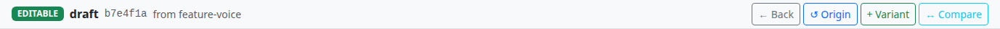
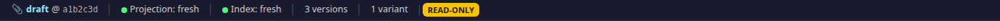
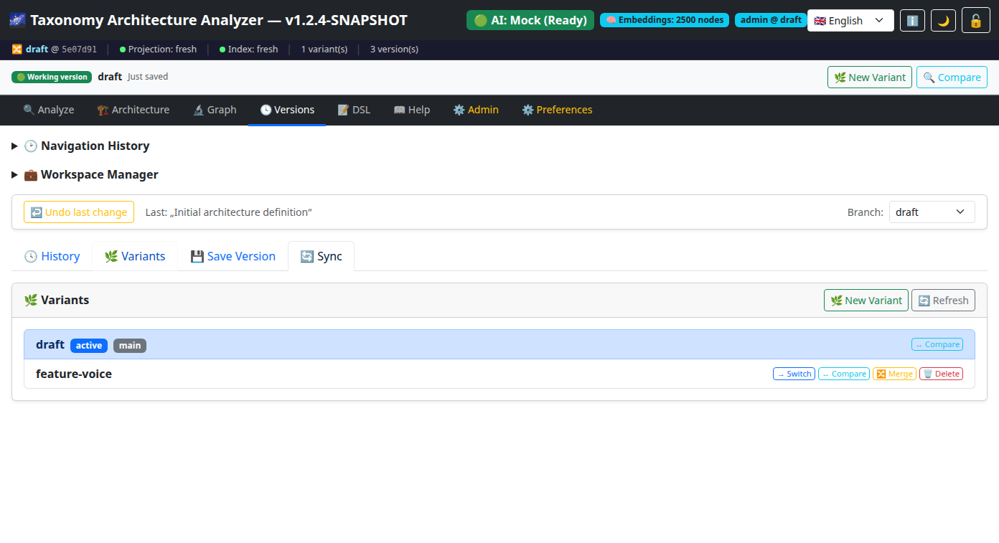
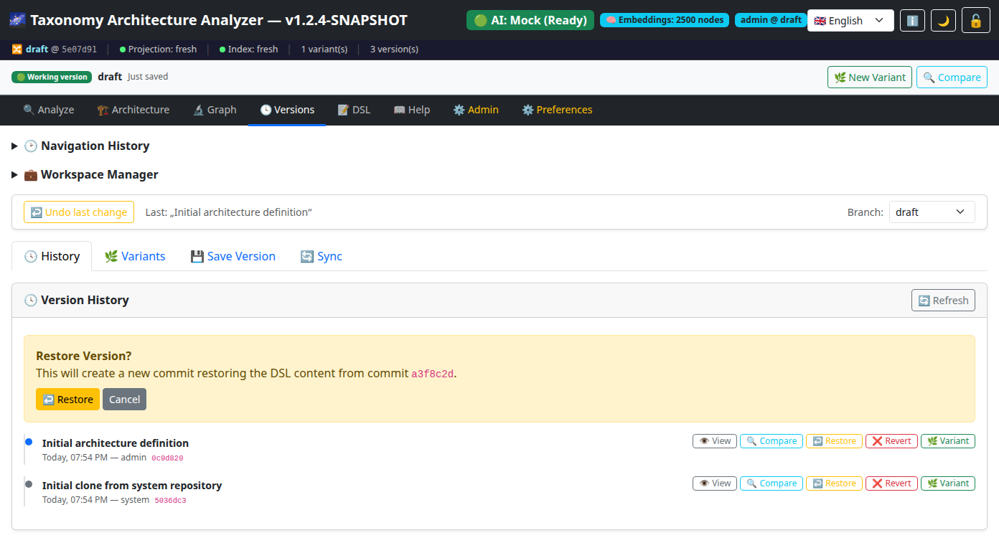
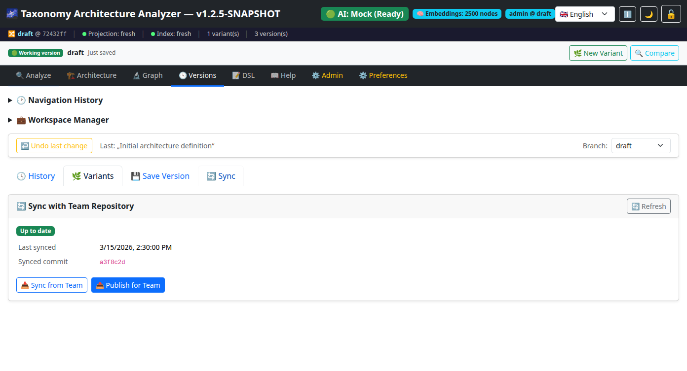
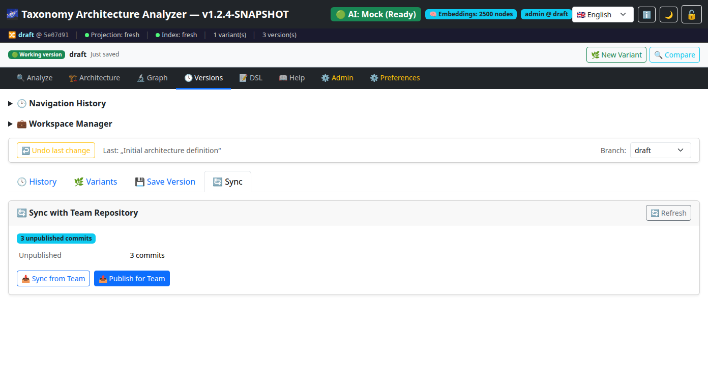
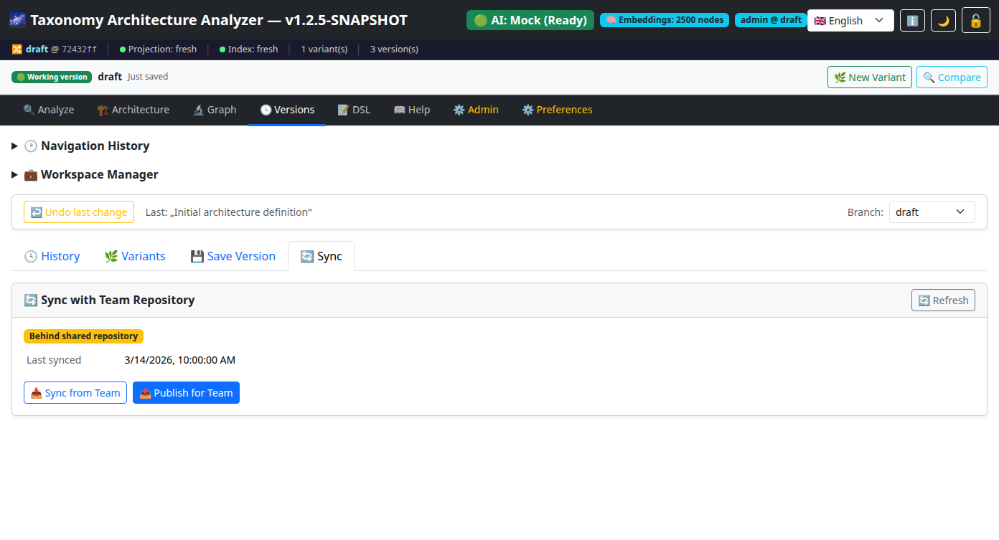
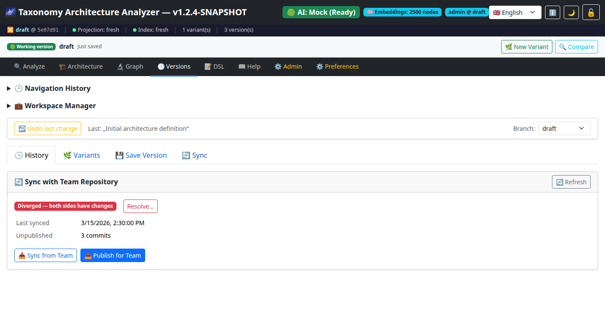
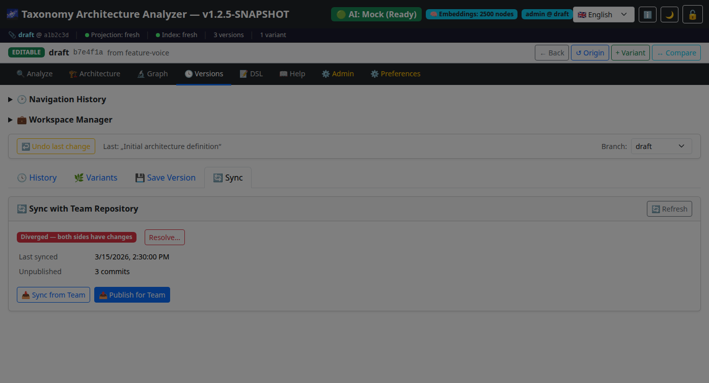

# Arbeitsbereich & Versionierung

## Überblick

Das **Arbeitsbereich- & Versionierungssystem** bietet eine benutzerfreundliche Oberfläche zur Verwaltung von Architekturvarianten, Versionshistorie und Team-Synchronisierung innerhalb des Taxonomy Architecture Analyzers.

Alle Funktionen sind über den Reiter **Versionen** in der Hauptnavigation erreichbar. Das System basiert auf Git für eine robuste Versionskontrolle, bietet aber eine vereinfachte, nicht-technische Oberfläche, die für Architekten, Analysten und Fachexperten geeignet ist.

---

## Inhaltsverzeichnis

1. [Arbeitsbereich-Kontextleiste](#1-arbeitsbereich-kontextleiste)
2. [Versionsverlauf](#2-versionsverlauf)
3. [Varianten (Zweige)](#3-varianten-zweige)
4. [Versionen vergleichen](#4-versionen-vergleichen)
5. [Wiederherstellen & Rückgängig](#5-wiederherstellen--rückgängig)
6. [Versionen speichern](#6-versionen-speichern)
7. [Team-Synchronisierung](#7-team-synchronisierung)
8. [Tastatur & Barrierefreiheit](#8-tastatur--barrierefreiheit)

---

## 1. Arbeitsbereich-Kontextleiste

Die **Arbeitsbereich-Kontextleiste** wird unterhalb der Navigationsleiste angezeigt, sobald ein Kontext aktiv ist. Sie zeigt:

| Element | Beschreibung |
|---|---|
| **Modus-Badge** | 🟢 Arbeitsversion (bearbeitbar), 🟡 Nur ansehen, ⚪ Entwurf |
| **Zweigname** | Der aktuelle Variantenname (oder „Hauptversion" für den Hauptzweig) |
| **Relativer Zeitstempel** | Wie lange die letzte Speicherung her ist (z.B. „Gespeichert vor 5 Min.") |
| **Breadcrumb** | Zeigt den Navigationspfad bei der Ansicht einer abgeleiteten Variante |
| **Ungespeicherte Änderungen** | Ein pulsierendes rotes Badge bei noch nicht gespeicherten Änderungen |
| **Sync-Status** | Inline-Badge mit ausstehenden Veröffentlichungen oder verfügbaren Aktualisierungen |

Beim Anzeigen einer Variante oder historischen Version enthält die Kontextleiste einen Herkunftsindikator:

Im Nur-Lesen-Modus ändert sich das Badge, um anzuzeigen, dass der Arbeitsbereich nicht bearbeitbar ist:

### Aktionen in der Kontextleiste

- **↩ Zurück** — Zum vorherigen Kontext zurückkehren
- **🏠 Zum Ursprung** — Zum ursprünglichen Kontext zurückkehren
- **📤 Zurückkopieren** — Elemente aus der Nur-Lesen-Ansicht in die Arbeitsversion kopieren
- **🌿 Neue Variante** — Eine neue Architekturvariante erstellen
- **🔍 Vergleichen** — Den Vergleichsdialog öffnen

---

## 2. Versionsverlauf

Navigieren Sie zu **Versionen → Verlauf**, um die vollständige Zeitleiste aller Architekturänderungen zu sehen.

Jeder Zeitleisteneintrag zeigt:
- Die Commit-Nachricht
- Zeitstempel und Autor
- Abgekürzten Commit-Hash
- Spezielle Markierungen für Wiederherstellungs- und Rückgängig-Operationen (🔄-Icons)

### Zeitleisten-Aktionen

Jeder Versionseintrag hat die folgenden Aktionsschaltflächen:

| Schaltfläche | Aktion |
|---|---|
| **👁 Ansehen** | Den DSL-Inhalt dieser Version anzeigen |
| **🔍 Vergleichen** | Diese Version mit dem aktuellen Stand vergleichen |
| **↩ Zurücksetzen** | Die Architektur auf diese Version zurücksetzen (mit Vorschau) |
| **❌ Rückgängig** | Die Änderungen dieses spezifischen Commits rückgängig machen |
| **🌿 Variante** | Eine neue Variante aus dieser Version erstellen |

---

## 3. Varianten (Zweige)

Navigieren Sie zu **Versionen → Varianten**, um alle Architekturvarianten als Karten zu sehen.

Jede Variantenkarte zeigt:
- Den Variantennamen mit einem 🌿-Icon
- Ob es die aktive Variante ist (✓ Aktiv-Badge)
- Ob es die Hauptversion ist (🏠 Haupt-Badge)
- Metadaten über die Beziehung der Variante zur Hauptversion

### Varianten-Aktionen

| Schaltfläche | Aktion |
|---|---|
| **➡ Öffnen** | Zu dieser Variante wechseln |
| **🔍 Vergleichen** | Diese Variante mit der aktuellen Version vergleichen |
| **🔀 Integrieren** | Änderungen dieser Variante in die aktuelle Version übernehmen (mit Vorschau) |
| **🗑 Löschen** | Diese Variante löschen (mit Bestätigungsdialog) |

### Eine Variante erstellen

Klicken Sie auf **🌿 Neue Variante** entweder in der Kontextleiste oder im Varianten-Panel. Geben Sie einen Namen mit Kleinbuchstaben, Zahlen und Bindestrichen ein.

### Varianten zusammenführen

Beim Integrieren einer Variante zeigt das System eine Vorschau der Änderungen an, die übernommen werden, einschließlich der Anzahl hinzugefügter, geänderter und entfernter Elemente. Sie müssen die Integration in einem modalen Dialog bestätigen, bevor sie ausgeführt wird.

Bei Fast-Forward-Merges (ohne Konflikte) ist die Vorschau einfacher:

Nach einer erfolgreichen Zusammenführung wird ein Bestätigungs-Toast angezeigt:

Bei einem Merge-Konflikt wird der Konfliktlösungs-Dialog angezeigt (siehe auch [Benutzerhandbuch §12](USER_GUIDE.md#12-versions-tab)):

### Variante löschen

Durch Klicken auf **🗑 Löschen** bei einer Variantenkarte wird ein Bestätigungsdialog angezeigt:

---

## 4. Versionen vergleichen

Navigieren Sie zu **Versionen → Verlauf** und klicken Sie auf **🔍 Vergleichen**, oder verwenden Sie die Vergleichsschaltfläche der Kontextleiste, um den Vergleichsdialog zu öffnen.

Die Vergleichsansicht hat drei Ebenen:

### Ebene 1: Zusammenfassungskarte
Zeigt einen Überblick mit Anzahlen:
- 🟢 Hinzugefügte Elemente
- 🔴 Entfernte Elemente
- 🟡 Geänderte Elemente
- Relationsänderungen

### Ebene 2: Drei-Spalten-Raster
Änderungen werden in drei farbcodierten Spalten angezeigt:
- **Grüne Spalte** — Hinzugefügte Elemente
- **Gelbe Spalte** — Geänderte Elemente
- **Rote Spalte** — Entfernte Elemente

### Ebene 3: DSL-Diff (Expertenmodus)
Ein aufklappbarer Bereich, der den rohen DSL-Textunterschied mit farbcodierten Zeilen anzeigt:
- Grüne Zeilen für Hinzufügungen
- Rote Zeilen für Entfernungen
- Blaue Zeilen für Diff-Header

---

## 5. Wiederherstellen & Rückgängig

### Wiederherstellen
Das Wiederherstellen einer Version erstellt einen neuen Commit mit dem Inhalt der ausgewählten Version. Die Versionsgeschichte bleibt erhalten — keine Daten gehen verloren.

Vor der Bestätigung zeigt das System eine **Vorschau** der Änderungen an:
- Anzahl der hinzugefügten, entfernten und geänderten Elemente
- Einen Bestätigungsdialog mit detaillierten Informationen

### Rückgängig machen
Das Rückgängigmachen macht die Änderungen eines bestimmten Commits rückgängig. Anders als beim Wiederherstellen werden nur die Änderungen dieses einen Commits zurückgenommen, nicht alle nachfolgenden Änderungen.

Beide Operationen verwenden modale Bestätigungsdialoge anstelle von Browser-Alerts für eine bessere Benutzererfahrung.

### Letzte Änderung rückgängig machen
Die **Rückgängig**-Schaltfläche am oberen Rand des Versionen-Reiters entfernt den letzten Commit aus der Zweighistorie. Diese Aktion erfordert ebenfalls eine Bestätigung.

---

## 6. Versionen speichern

Navigieren Sie zu **Versionen → Version speichern**, um einen benannten Snapshot zu erstellen.

1. Geben Sie einen **Titel** für die Version ein (Pflichtfeld)
2. Fügen Sie optional eine **Beschreibung** hinzu
3. Klicken Sie auf **💾 Version speichern**

Die Version wird als Git-Commit gespeichert und erscheint sofort in der Zeitleiste.

---

## 7. Team-Synchronisierung

Navigieren Sie zu **Versionen → Synchronisieren**, um die Synchronisierung mit dem gemeinsamen Team-Repository zu verwalten.

### Sync-Status

Der Synchronisierungsstatus wird an mehreren Stellen angezeigt:
- In der **Kontextleiste** als Inline-Badge
- In der **Git-Statusleiste** am oberen Seitenrand
- Im **Synchronisieren-Reiter** mit detaillierten Informationen

| Status | Bedeutung |
|---|---|
| **Auf dem neuesten Stand** | Ihr Arbeitsbereich stimmt mit dem gemeinsamen Repository überein |
| **Aktualisierungen verfügbar** | Das Team hat Änderungen veröffentlicht, die Sie noch nicht synchronisiert haben |
| **Unveröffentlichte Änderungen** | Sie haben lokale Änderungen, die noch nicht mit dem Team geteilt wurden |
| **Abweichend** | Sowohl Sie als auch das Team haben Änderungen vorgenommen |

Der Synchronisieren-Reiter zeigt den aktuellen Status mit visuellen Indikatoren:

Wenn sowohl Sie als auch das Team Änderungen vorgenommen haben, zeigt der Status „Abweichend":

Bei einem Sync-Konflikt wird ein Lösungsdialog angezeigt:

### Sync-Aktionen

- **📥 Vom Team aktualisieren** — Die neuesten Änderungen vom gemeinsamen Repository übernehmen
- **📤 Für Team veröffentlichen** — Ihre Änderungen an das gemeinsame Repository senden

---

## 8. Tastatur & Barrierefreiheit

Alle Arbeitsbereich- und Versionierungsfunktionen sind per Tastatur bedienbar:
- Modale Dialoge können mit **Escape** geschlossen werden
- Tab-Navigation funktioniert durch alle Aktionsschaltflächen
- Statusänderungen werden über ARIA-Live-Regionen angekündigt
- Farbe ist nie der einzige Indikator — Textbeschriftungen begleiten alle Status-Badges

---

## Verwandte Dokumentation

- [GIT_INTEGRATION](GIT_INTEGRATION.md) — technische Details der JGit-gestützten DSL-Speicherung, Repository-Architektur und Konfliktlösung
- [REPOSITORY_TOPOLOGY](REPOSITORY_TOPOLOGY.md) — Workspace-Provisionierungsmodell, Topologiemodi und Datenisolation
- [CONCEPTS](CONCEPTS.md) — Glossar der Workspace-, Varianten- und Sync-Terminologie
