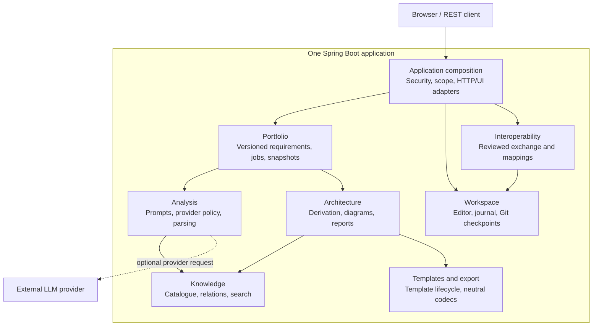
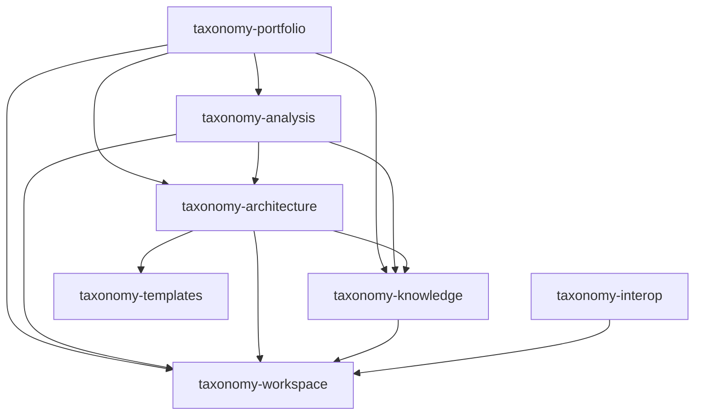
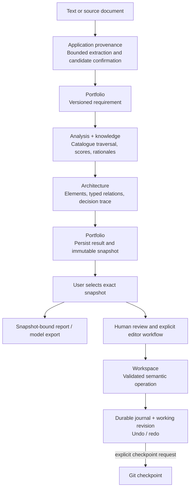
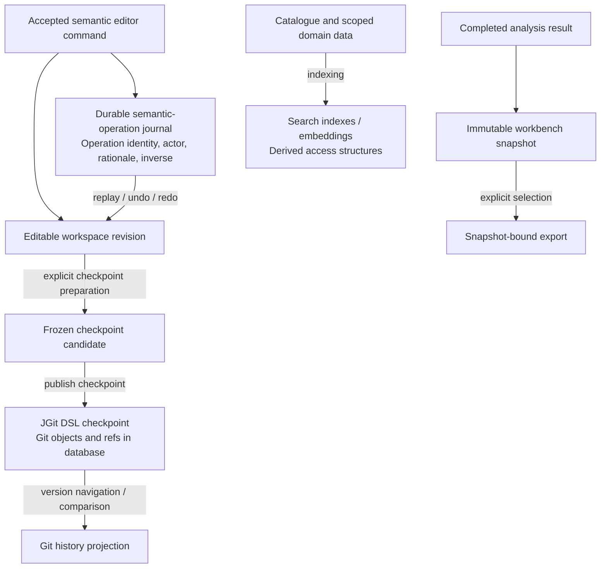

# Architecture Description

Taxonomy turns requirements and source material into plausible, traceable architecture
prototypes with AI assistance and human review. This document explains **the application
that does that work**, not the architecture of a model generated by it.

This is the implemented architecture on this branch, not a roadmap. Taxonomy is a
**modular monolith with one deployable Spring Boot application**. The reactor has
fifteen child modules: four framework-free foundations, seven runtime feature
libraries, one application composition root, and three build/tooling modules.
The inventory and current ownership contracts are in [Module boundaries](MODULE_BOUNDARIES.md).
[Deutsch](../de/ARCHITECTURE.md).

## Contents

- [System overview](#system-overview) and [architecture principles](#architecture-principles)
- [High-level architecture](#high-level-architecture) and [module architecture](#module-architecture)
- [Key components](#key-components) and [requirement workflow](#architecture-view-generation-pipeline)
- [Persistence responsibilities](#dsl-storage-architecture) and [Git state](#git-state-as-first-class-concept)
- [Scope and write guards](#viewcontext-and-action-guards)
- [Data loading](#data-loading), [database](#database), and [security](#security-architecture)
- [Imports](#framework-mapping-layer), [exports](#export-formats), and [verification](#ci--cd)

## System Overview

`taxonomy-app` assembles the feature libraries, Spring wiring, cross-context HTTP/UI
adapters, security, observability, deployment configuration, and database migrations.
A Maven module is not a separately deployed service. Feature libraries do not depend
back on `taxonomy-app`; their production dependency graph is acyclic. This does not
claim that all package-level coupling or every historical exception has disappeared.

The browser uses the application APIs and streaming responses. Analysis can use a
configured remote LLM provider; catalogue browsing and many deterministic editing,
validation, search, and export operations do not require one. Local ONNX embeddings
support semantic search/scoring; they are not evidence of a local generative LLM with
all remote-provider capabilities.

## Architecture Principles

| Principle | Implementation boundary |
|---|---|
| Explicit ownership | Feature modules own their domain behavior and tests; cross-context composition stays in the application. |
| Human control | AI output is a proposal. Review, accepted changes, identities, and provenance remain explicit. |
| Separate histories | Semantic operations, editable workspace state, Git checkpoints, and analysis snapshots are different concepts. |
| Stable contracts | Framework-free foundations and narrow feature-owned ports prevent dependencies on application implementation classes. |
| Reproducible verification | Module ownership, dependency direction, packaging, recovery, and browser behavior have distinct checks. |
| Bounded interoperability | Supported mappings and losses are explicit; file generation is not desktop-tool certification. |

## High-Level Architecture

This diagram shows **logical collaboration at runtime**, not every Java invocation
or Maven dependency. The application supplies adapters where a feature needs another
context through a port. All boxes inside the application boundary run in one process.

Persistence is deliberately shown separately below: a runtime call, a Maven
dependency, and a storage write must not share an ambiguous arrow meaning.

## Module Architecture

The following graph shows **all direct production POM dependencies between the
seven extracted feature libraries**. `A --> B` means that A declares a production
dependency on B; it does not mean that data only flows from A to B.

<!-- architecture-feature-graph:start -->

<!-- architecture-feature-graph:end -->

Application-to-library and foundation dependencies are intentionally omitted from
this focused graph. The four foundations are `taxonomy-domain`, `taxonomy-dsl`,
`taxonomy-export`, and `taxonomy-extension-api`. The separate build group is
`taxonomy-tooling`, `taxonomy-coverage`, and `taxonomy-build`; these are not runtime
feature contexts. The complete reactor inventory is in [Module boundaries](MODULE_BOUNDARIES.md),
and the existing module gate writes full ownership/dependency evidence to
`taxonomy-build/target/architecture-module-graph.txt`.

In particular, `taxonomy-templates` has no dependency on another feature library.
`taxonomy-interop` does not depend on `taxonomy-portfolio`: portfolio integration
crosses a feature-owned port with an application-side adapter, not a reverse module
reference. Shared provenance and preferences remain application-local; the module
split does not invent separate services or promise additional completed extractions.

## Key Components

| Owner | Responsibility and boundary |
|---|---|
| Portfolio | Projects, versioned requirements, persisted analysis jobs/results/reviews, recovery, and immutable workbench snapshots. Coordinates feature APIs. |
| Analysis | Requirement analysis, provider selection/policy, prompts, response parsing, and sessions. Stateful cross-context access uses ports. |
| Knowledge | Catalogue loading, relations/hypotheses, full-text and semantic search, indexes, and embedding lifecycle. |
| Architecture | Derivation, scoring, relevance propagation, gaps, patterns, recommendations, neutral diagram preparation, and reports. Report HTTP composition and live preferences enter through application adapters. |
| Workspace | Repository/workspace identity, editable model state, durable semantic operations, undo/redo, explicit checkpoints, and JGit storage. |
| Templates | Versioned document templates, OOXML validation, materialization, WebDAV, and administration. Template history is not architecture history. |
| Interoperability | Reviewed exchange, mappings, connector profiles, loss evidence, integration operations, and synchronization checkpoints. |
| Application composition | HTTP workflows spanning contexts, authorization/scope resolution, source provenance, preferences, wiring, migrations, and packaging. |

Exact package ownership is recorded in [the context map](../../.github/architecture-contexts.json).
Historical dependency counts are evidence about their named migration step, not current
runtime measurements; see [the extraction history](MODULE_BOUNDARIES_HISTORY.md).

## Architecture View Generation Pipeline

This is a **workflow/ownership view**, not a claim that every box is one HTTP request
or that saving a snapshot automatically edits a workspace. A requirement might, for
example, describe a civilian hospital's communication needs; the real catalogue and
source links remain the input authority.

Hierarchical analysis and relevance propagation produce inspectable proposals.
For the detailed scoring and decision stages, see [Decision pipeline](DECISION_PIPELINE.md).
The private editor can refine a selected model without rewriting its immutable
analysis snapshot. Checkpoint creation is explicit, not a side effect of every edit.

Only an export endpoint actually bound to a selected persisted snapshot carries
that snapshot's authority. A diagram produced from transient scores or an editor
revision must not be presented as the same artifact. See [the export support boundary](FEATURE_MATRIX.md#architecture-export-support-boundary)
and [Architecture editor](ARCHITECTURE_EDITOR.md).

## DSL Storage Architecture

The following diagram separates **state authorities and explicit persistence
transitions**. Logical stores may share a physical database without becoming one
history or one transaction across every workflow.

| State | Owner | Meaning |
|---|---|---|
| Accepted editor operation | Workspace | Durable semantic revision with audit/undo data. Git commits are not its log. |
| Working model | Workspace | Current editable revision; the editor guards the revision it changes. |
| Git checkpoint | Workspace | Stable versioned DSL content, branches, comparisons, merges, and explicit publication. |
| Analysis/workbench snapshot | Portfolio | Persisted analysis result selected for read-only inspection or snapshot-bound export. It is not an alias for a working revision or Git head. |
| Template version | Templates | A separate versioned document-template resource with validation and materialization. |
| Search index/cache | Knowledge or owning context | Derived lookup state, not the authoritative semantic history. Recovery and isolation rules remain context-specific. |

JGit's database backend uses `jgit-storage-hibernate`. Git objects/refs are stored
through that adapter in the configured relational database; HSQLDB is the default,
not the only possible backend. Document provenance links and DSL model content must
retain their identities through the relevant persistence route.

## Git State as First-Class Concept

An accepted semantic operation, a Git commit, and an immutable analysis snapshot
have different identities and lifecycles. Undo/redo belongs to the durable semantic
journal. Explicit stable checkpoints belong to Git. External Git synchronization
uses repository identities, commit ancestry, and merge/conflict handling rather
than silently treating a rejected push as success.

See [Repository topology](REPOSITORY_TOPOLOGY.md), [Git integration](GIT_INTEGRATION.md),
and [Workspace/versioning](WORKSPACE_VERSIONING.md) for repository selection and
shared/personal collaboration details.

## ViewContext and Action Guards

Cross-context HTTP adapters resolve the authenticated identity and selected
repository/workspace. Commands must use their own authorization, expected-revision,
and conflict checks; hiding a button is not authorization. Read-only snapshot
selection and editable workspace selection are distinct routes.

A diagram does not establish complete tenant/branch isolation or eliminate every
recovery limitation. Those contracts must be verified at the actual read/write
boundary, not inferred from the Maven split. Context-local exceptions and dependencies
remain visible in the existing architecture policies.

## Data Loading

Knowledge owns the bundled catalogue/seed resources, catalogue overlay handling,
relation data, and embedding lifecycle. The catalogue has eight roots. Normal
restart/reconciliation is distinct from explicit reload; it must not be described
as deleting and reimporting all knowledge on every startup.

Document ingestion has separate upload/extraction limits and source-version/fragment
provenance. It is not the same operation as loading the catalogue. See
[Decision pipeline](DECISION_PIPELINE.md) and [Module boundaries](MODULE_BOUNDARIES.md).

## Database

The default profile uses embedded HSQLDB. PostgreSQL, SQL Server, and Oracle have
separate configuration and verification lanes. Hibernate ORM persists domain state;
Hibernate Search/Lucene provide indexes. Database migrations and final schema
composition remain application-owned even where a feature owns its entities.

Use [Database setup](DATABASE_SETUP.md) and [Configuration reference](CONFIGURATION_REFERENCE.md)
for concrete deployment settings rather than treating this component overview as an
operational installation guide.

## Security Architecture

The application provides local login and a Keycloak/OIDC profile. Authentication,
request identity, authorization, and selected repository/workspace scope enter via
application composition and feature-specific write/read guards. Deployment controls,
secrets, reverse-proxy TLS, and external transport restrictions are described in
[Security](SECURITY.md) and [Deployment guide](DEPLOYMENT_GUIDE.md).

The modular monolith does not provide network isolation between feature libraries.
Sensitive cross-context behavior requires integration/recovery tests in addition to
compile-time boundaries. Source documents, prompts, and exports also have their own
data-handling constraints.

## Framework Mapping Layer

Framework parsers and mapping profiles convert supported external representations
to neutral model/DSL concepts; application-owned materialization adapters cross the
context boundary. Reviewed interoperability additionally tracks external identities,
review decisions, loss evidence, and synchronization checkpoints. Different import
routes must not be advertised as having identical review or round-trip guarantees.

The delivered version-2 Sparx path adds neutral package organization and canonical
requirement mappings through reviewed integration operations. These use the existing
DSL, workspace journal, and portfolio authorities rather than a second model store
or one Git commit per accepted edit. This does not certify unrestricted Enterprise
Architect/Pro Cloud Server interoperability or unconditional remote publication.

See [Framework import](FRAMEWORK_IMPORT.md) and [Sparx exchange](../features/sparx-integration.md).
The connector guide describes the supported version on this branch; proposed future
profiles and native editor capabilities are not implied by this overview.

## Export Formats

| Output | Boundary |
|---|---|
| Mermaid / neutral diagrams | Text or diagram projections of the explicitly selected source model. The README showcase is a generated model example, not this application's module graph. |
| Reports, including Word | Report generation belongs to architecture; template lifecycle belongs to templates, and cross-context HTTP/preferences wiring belongs to the application. Available template features depend on the concrete report path. |
| ArchiMate / Visio | Bounded format implementations with identity/mapping/loss contracts. A generated file or automated package check is not broad independent-tool certification. |
| Reviewed external exchange | Connector- and profile-specific semantics with explicit review and compatibility limits, not an unrestricted bidirectional model editor. |

[The feature matrix](FEATURE_MATRIX.md) defines support boundaries. Detailed connector
and editor guides own evolving semantics; this overview deliberately does not duplicate
a pending PR's feature claims or turn a closed issue into compatibility evidence.

## CI / CD

Use the checked-in Maven Wrapper from the repository root. The [README](../../README.md#build-and-verification)
and [Maven verification guide](../dev/MAVEN_VERIFICATION.md) describe the supported lanes.

`taxonomy-build` owns whole-reactor architecture enforcement. The existing gate checks
physical ownership, production POM dependencies, and compiled dependency evidence.
The ordinary full-reactor Surefire suite also runs `ArchitectureDocumentationTest`:
it reuses the gate's reactor/POM reader to compare the three current module inventories
and both language versions of the marked feature graph with the code. Its parser
regression tests reject missing, extra, duplicate, or reversed entries. The fixed
`architecture-tests` profile selector is unchanged; the new documentation test is
covered by ordinary full-reactor testing, not by that narrower selector alone.

This prevents structural documentation drift, but does not prove the runtime workflow
or third-party tool compatibility. Those need their existing application, browser,
database, and interoperability checks. Source-controlled Mermaid is used for the
application diagrams; no generated architecture-model fixture is replaced.

## Detailed Architecture Diagrams

### Request Lifecycle

The [requirement workflow](#architecture-view-generation-pipeline) identifies the owner
of each step and separates result persistence, human review, editing, and checkpoint
creation. Exact endpoint contracts remain in [API reference](API_REFERENCE.md).

### Data Flow Architecture

The [persistence diagram](#dsl-storage-architecture) separates authoritative states
from derived indexes. The [feature graph](#module-architecture) answers a different
question: which libraries may reference one another. Do not combine the two arrow
meanings when extending these diagrams.
