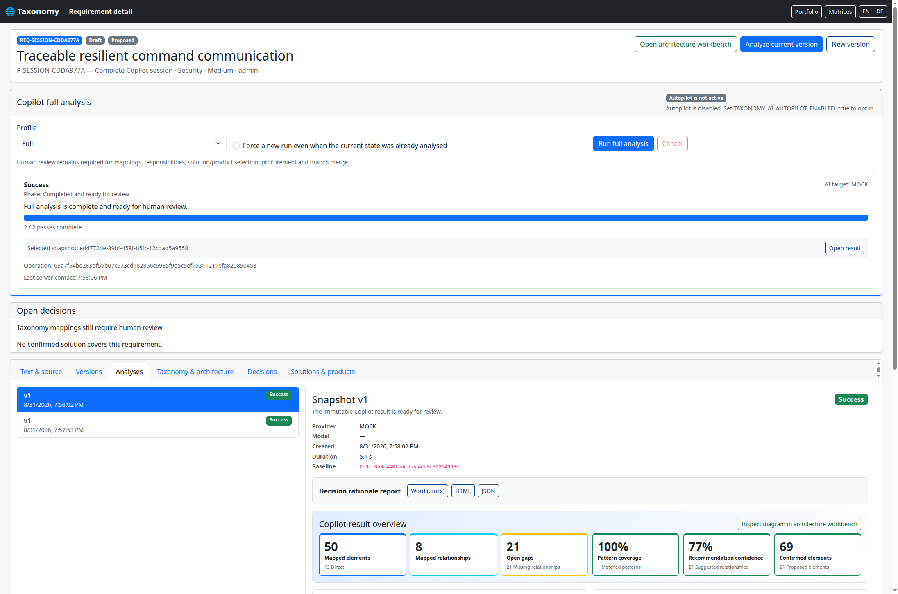

# Copilot and Autopilot

Taxonomy distinguishes an explicitly requested **Copilot full analysis** from unattended **Autopilot** execution. Both use persistent, tenant-, repository- and branch-bound portfolio analysis jobs. Reloading or navigating away does not lose an operation.

The canonical inventory for all application settings is [CONFIGURATION_REFERENCE.md](CONFIGURATION_REFERENCE.md). This page explains the AI-automation settings in their workflow context.

## Manual Copilot full analysis

A saved immutable requirement version is processed through one or more bounded verification passes. A completed operation produces taxonomy scoring and reasons, a relation-aware architecture view, gap and pattern analysis, an architecture recommendation, immutable snapshots, and—when enabled—deterministic solution and product proposals.

```text
POST /api/projects/{projectId}/requirements/{requirementId}/copilot
GET  /api/projects/{projectId}/requirements/{requirementId}/copilot/latest
GET  /api/projects/{projectId}/copilot-operations/{operationId}
POST /api/projects/{projectId}/copilot-operations/{operationId}/cancel
```

Profiles have these meanings:

| Profile | Minimum passes | Solution/product proposals |
|---|---:|---|
| `STANDARD` | 1 | disabled |
| `FULL` | configured Copilot default, at least 1 | enabled unless the request disables them |
| `EXHAUSTIVE` | at least 2 | enabled unless the request disables them |

All configured or request-supplied verification-pass counts must be between 1 and 3. Passes of one operation execute sequentially. Identical input state and settings reuse the persistent operation unless the caller deliberately requests `force=true`.

Manual Copilot requires a ready provider but does **not** require `TAXONOMY_AI_COST_POLICY=UNMETERED`; the user explicitly starts every run.

## Complete-run result

A successful Copilot full analysis opens the selected immutable snapshot directly in the **Analyses** tab. The result surface summarizes mapped elements and relationships, open gaps, pattern coverage, recommendation confidence and confirmed elements before showing the supporting evidence.



The five highest-priority missing relationships remain visible. Longer gap, pattern and relation lists are collapsed by default and open into bounded, scrollable tables. The full provider-neutral payload remains available through the JSON report and the collapsed technical snapshot section; it is no longer dumped into the normal reading flow. The architecture workbench, decision review and solution/product tabs remain explicit next steps because Copilot output is not a binding human decision.

## Architecture-node limits

`TAXONOMY_AI_AUTOPILOT_MAX_ARCHITECTURE_NODES` keeps its historical name for compatibility, but its Spring property is `taxonomy.ai.max-architecture-nodes` and it applies to **both manual Copilot and Autopilot**. It is the operator ceiling for the architecture view built in every AI-automation pass. A manual API request may select a lower value but cannot exceed it.

A second setting, `TAXONOMY_LIMITS_MAX_ARCHITECTURE_NODES`, is the general portfolio-analysis ceiling. The effective limit is therefore the lower of both values. Keep them aligned unless a deliberately smaller AI-automation view is wanted:

```text
TAXONOMY_AI_AUTOPILOT_MAX_ARCHITECTURE_NODES=50
TAXONOMY_LIMITS_MAX_ARCHITECTURE_NODES=50
```

Increasing the value can retain more relevant nodes, but also enlarges pipeline work, snapshots, relation generation and diagrams. It does not change the number of project requirements processed in one Autopilot batch.

## Explicit Autopilot opt-in

Taxonomy never assumes that a custom OpenAI-compatible endpoint is free. Unattended execution requires all three deliberate settings:

```text
TAXONOMY_AI_COST_POLICY=UNMETERED
TAXONOMY_AI_AUTOPILOT_ENABLED=true
TAXONOMY_AI_AUTOPILOT_PROVIDER=CUSTOM_OPENAI
```

The selected provider must also be fully configured. For `CUSTOM_OPENAI`, set `CUSTOM_LLM_URL` and `CUSTOM_LLM_MODEL`; the API key is optional for a trusted unauthenticated local server.

`TAXONOMY_AI_AUTOPILOT_ON_REQUIREMENT_SAVE=false` disables the automatic save hook without disabling explicitly requested project-wide runs.

## Project-wide execution

```text
GET  /api/projects/{projectId}/autopilot
POST /api/projects/{projectId}/autopilot/run
```

The POST body may contain `requirementIds` and `maxRequirements`. The server never silently truncates a project. If the selection exceeds the effective request/operator batch limit, it rejects the call and requires a smaller explicit selection or a deliberate operator-limit change.

## Configuration table

| Environment variable | Default / validation | Effect |
|---|---|---|
| `TAXONOMY_AI_COST_POLICY` | `METERED`; enum | Operator cost declaration. Autopilot requires `UNMETERED`; manual Copilot does not. |
| `TAXONOMY_AI_COPILOT_PROFILE` | `FULL` | Default profile for a manually initiated operation. |
| `TAXONOMY_AI_AUTOPILOT_PROFILE` | `EXHAUSTIVE` | Profile used by unattended operations. |
| `TAXONOMY_AI_COPILOT_VERIFICATION_PASSES` | `1`; valid 1–3 | Manual default before the profile minimum is applied. |
| `TAXONOMY_AI_AUTOPILOT_VERIFICATION_PASSES` | `2`; valid 1–3 | Unattended default; `EXHAUSTIVE` still requires at least 2. |
| `TAXONOMY_AI_AUTOPILOT_MAX_ARCHITECTURE_NODES` | `50`; minimum 1 | Node ceiling for architecture views from both manual Copilot and Autopilot. Also bounded by `TAXONOMY_LIMITS_MAX_ARCHITECTURE_NODES`. |
| `TAXONOMY_AI_AUTOPILOT_ENABLED` | `false` | First explicit opt-in for unattended execution. |
| `TAXONOMY_AI_AUTOPILOT_PROVIDER` | empty | Explicit provider for Autopilot; it must be configured and match the operator's unmetered declaration. |
| `TAXONOMY_AI_AUTOPILOT_ON_REQUIREMENT_SAVE` | `true` | Starts an unattended operation for a newly saved immutable requirement version when Autopilot is otherwise ready. |
| `TAXONOMY_AI_AUTOPILOT_PROPOSE_SOLUTIONS` | `true` | Enables deterministic `PROPOSED` solution links for non-`STANDARD` Autopilot runs. |
| `TAXONOMY_AI_AUTOPILOT_PROPOSE_PRODUCTS` | `true` | Enables deterministic `CANDIDATE` product proposals for non-`STANDARD` Autopilot runs. |
| `TAXONOMY_AI_AUTOPILOT_MAX_PROJECT_REQUIREMENTS` | `50`; valid 1–500 | Maximum project-wide selection; oversized requests fail rather than being truncated. |
| `TAXONOMY_AI_PRODUCT_PROPOSALS_MINIMUM_COVERAGE` | `25`; clamped to 0–100 | Minimum overlapping confirmed taxonomy coverage for a deterministic product proposal. |
| `TAXONOMY_AI_PRODUCT_PROPOSALS_MINIMUM_CONFIDENCE` | `0.25`; clamped to 0–1 | Minimum fraction of a solution's confirmed nodes covered by the product. |
| `TAXONOMY_AI_MAXIMUM_RUNTIME_SECONDS` | `1800`; minimum effective 60 | Maximum coordinator wait per pass. The persistent job remains recoverable after the wait ends. |
| `TAXONOMY_AI_COORDINATOR_MAX_CONCURRENT_OPERATIONS` | `4`; valid 1–64 | Number of different Copilot/Autopilot operations coordinated in parallel. It does not parallelize passes within one operation. |
| `TAXONOMY_AI_COORDINATOR_QUEUE_CAPACITY` | `100`; valid 1–10000 | In-memory coordination queue. Persisted operations can be resumed after capacity rejection. |

The portfolio analysis worker is a separate execution pool. Its settings are `TAXONOMY_PORTFOLIO_ANALYSIS_WORKER_CONCURRENCY`, `TAXONOMY_PORTFOLIO_ANALYSIS_WORKER_QUEUE_CAPACITY`, and `TAXONOMY_PORTFOLIO_ANALYSIS_WORKER_SHUTDOWN_SECONDS`. Raising only the coordinator limit cannot make an individual provider call faster and may increase rate-limit pressure.

The effective readiness and reason are available at:

```text
GET /api/ai-automation
```

## Human review boundary

Autopilot prepares evidence and proposals. It does not:

- confirm taxonomy or relation mappings;
- assign binding organizational responsibility;
- select a product or authorize procurement;
- overwrite an approved architecture;
- merge a draft into an approved branch.

Generated solutions remain `PROPOSED`; products remain `CANDIDATE`. A human reviewer must approve every binding decision.
