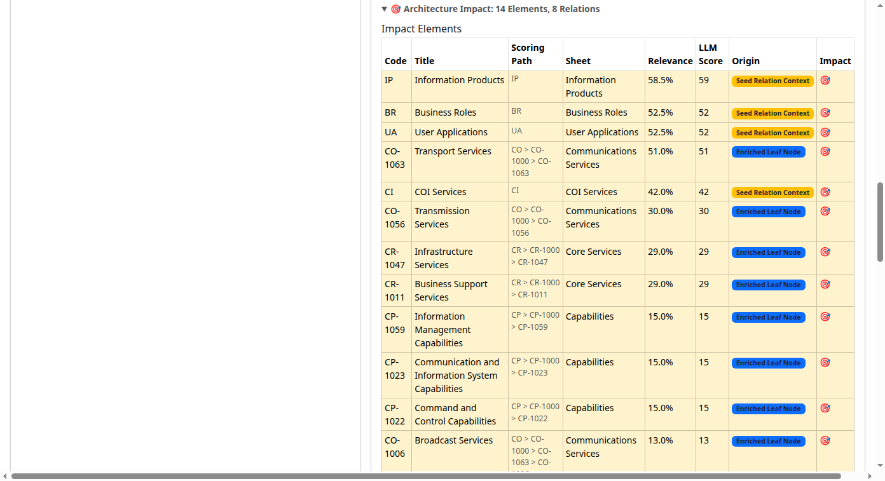
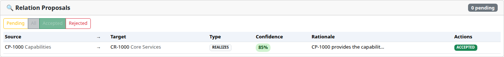
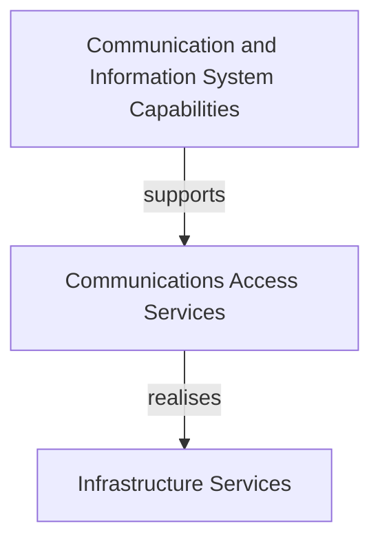

# Examples

This document shows worked examples of common tasks in the Taxonomy Architecture Analyzer.

---

## Table of Contents

- [1. Requirement → Architecture](#1-requirement--architecture)
- [2. Failure Impact Analysis](#2-failure-impact-analysis)
- [3. Architecture Gap Analysis](#3-architecture-gap-analysis)
- [4. Relation Proposals](#4-relation-proposals)
- [5. Architecture Recommendations](#5-architecture-recommendations)
- [6. Diagram Export](#6-diagram-export)
- [7. Field Service Monitoring — End-to-End](#7-field-service-monitoring--end-to-end)
- [8. Architecture DSL Workflow](#8-architecture-dsl-workflow)

---

## 1. Requirement → Architecture

**Goal:** Map a business requirement to relevant taxonomy elements and generate an architecture view.

### Step 1 — Enter the requirement

Open `http://localhost:8080` and paste into the analysis text area:

> _"Provide an integrated communication platform for hospital staff, enabling real-time voice and data exchange between departments and coordinated workflow management for clinical teams."_

### Step 2 — Analyze

Click **Analyze with AI**. The system scores every taxonomy node (0–100) and overlays results on the tree:

| Code | Node | Score |
|---|---|---|
| CP-1023 | Communication and Information System Capabilities | 92 |
| CO-1011 | Communications Access Services | 88 |
| CR-1047 | Infrastructure Services | 81 |
| UA-1015 | Air Applications | 74 |
| BP-1327 | Enable | 71 |

### Step 3 — Generate the architecture view

The system automatically selects nodes with score ≥ 70 as anchors, propagates relevance through taxonomy relations, and builds a structured architecture model:

```
Capability: Communication and Information System Capabilities (CP-1023)
    ↓ supports
Service: Communications Access Services (CO-1011)
    ↓ realises
Service: Infrastructure Services (CR-1047)
    ↓ used by
Application: Air Applications (UA-1015)
    ↓ enables
Process: Enable (BP-1327)
```

### Step 4 — Export

Click an export button to download the architecture as ArchiMate XML, Visio `.vsdx`, or Mermaid flowchart.



### REST API equivalent

```bash
curl -u admin:admin -X POST http://localhost:8080/api/analyze \
  -d "businessText=Provide+integrated+communication+platform+for+hospital+staff" \
  -d "includeArchitectureView=true"
```

---

## 2. Failure Impact Analysis

**Goal:** Determine what breaks if a specific taxonomy element fails.

### Web UI

1. Open the **Graph Explorer** panel on the right.
2. Enter the node code, e.g. `CR-1047` (Infrastructure Services).
3. Click **Failure Impact**.
4. The result shows every element that depends on `CR-1047`, directly or transitively.

### REST API

```bash
curl -u admin:admin "http://localhost:8080/api/graph/node/CR-1047/failure-impact"
```

### Example result

```json
{
  "sourceNode": "CR-1047",
  "sourceTitle": "Infrastructure Services",
  "impactedNodes": [
    { "code": "UA-1015", "title": "Air Applications", "distance": 1 },
    { "code": "BP-1327", "title": "Enable", "distance": 2 }
  ]
}
```

---

## 3. Architecture Gap Analysis

**Goal:** Find missing relations and incomplete architecture patterns in the context of a requirement.

### Web UI

1. Analyze a requirement (see [Example 1](#1-requirement--architecture)).
2. The gap analysis runs automatically alongside the architecture view generation.
3. Missing relations and incomplete patterns are reported in the results.

### REST API

```bash
curl -u admin:admin -X POST http://localhost:8080/api/gap/analyze \
  -H "Content-Type: application/json" \
  -d '{
    "businessText": "Patient data sharing across hospital departments",
    "scores": {"CP-1023": 92, "CO-1011": 88, "CR-1047": 81}
  }'
```

### Example result

```json
{
  "missingRelations": [
    {
      "source": "CO-1011",
      "target": "IP-1659",
      "suggestedType": "produces",
      "reason": "Communications service likely produces situation reports"
    }
  ],
  "incompletePatterns": [
    {
      "pattern": "Full Stack",
      "presentElements": ["CP-1023", "CO-1011", "CR-1047"],
      "missingLayers": ["Information Products"]
    }
  ]
}
```

---

## 4. Relation Proposals

**Goal:** Let the AI suggest new relations and review them.

### Step 1 — Generate proposals

In the **Relation Proposals** panel, click **Propose Relations** for a specific node or use the bulk proposal endpoint.

### Step 2 — Review

Each proposal shows:

- **Source** and **Target** nodes
- **Relation type** (e.g., supports, realises, produces)
- **AI justification** — why this relation should exist

### Step 3 — Accept or reject

Click **Accept** to add the relation to the knowledge graph, or **Reject** to discard it.



### REST API

```bash
# Generate proposals for a node
curl -u admin:admin -X POST http://localhost:8080/api/proposals/propose \
  -H "Content-Type: application/json" \
  -d '{"sourceCode": "CR-1047", "relationType": "SUPPORTS"}'

# List pending proposals
curl -u admin:admin "http://localhost:8080/api/proposals/pending"

# Accept a proposal
curl -u admin:admin -X POST "http://localhost:8080/api/proposals/42/accept"

# Reject a proposal
curl -u admin:admin -X POST "http://localhost:8080/api/proposals/42/reject"

# Bulk accept/reject
curl -u admin:admin -X POST http://localhost:8080/api/proposals/bulk \
  -H "Content-Type: application/json" \
  -d '{"ids": [42, 43, 44], "action": "ACCEPT"}'

# Revert a decision
curl -u admin:admin -X POST "http://localhost:8080/api/proposals/42/revert"
```

---

## 5. Architecture Recommendations

**Goal:** Get AI-driven suggestions for additional architecture elements and relations.

### REST API

```bash
curl -u admin:admin -X POST http://localhost:8080/api/recommend \
  -H "Content-Type: application/json" \
  -d '{
    "businessText": "Reliable remote access and coordination services for distributed field teams",
    "scores": {"CO-1056": 88, "CR-1047": 81}
  }'
```

### Example result

```json
{
  "recommendedNodes": [
    { "code": "CO-1063", "title": "Transport Services", "reason": "Directly relevant to remote access and coordination services requirement" },
    { "code": "CP-1023", "title": "Communication and Information System Capabilities", "reason": "Supports distributed field team coordination as stated in requirement" }
  ],
  "recommendedRelations": [
    { "source": "CO-1056", "target": "CO-1011", "type": "supports", "reason": "Transmission services support communications access" }
  ]
}
```

---

## 6. Diagram Export

**Goal:** Export an architecture view to an industry-standard format.

### ArchiMate XML

```bash
curl -u admin:admin -X POST http://localhost:8080/api/diagram/archimate \
  -H "Content-Type: application/json" \
  -d '{"scores": {"CP-1023": 92, "CO-1011": 88, "CR-1047": 81}}' \
  -o architecture.xml
```

The resulting XML file can be imported into **Archi**, **BiZZdesign**, **MEGA**, or any ArchiMate 3.x-compatible tool.

### Visio

```bash
curl -u admin:admin -X POST http://localhost:8080/api/diagram/visio \
  -H "Content-Type: application/json" \
  -d '{"scores": {"CP-1023": 92, "CO-1011": 88, "CR-1047": 81}}' \
  -o architecture.vsdx
```

### Mermaid

```bash
curl -u admin:admin -X POST http://localhost:8080/api/diagram/mermaid \
  -H "Content-Type: application/json" \
  -d '{"scores": {"CP-1023": 92, "CO-1011": 88, "CR-1047": 81}}'
```

The response is a Mermaid flowchart code block that renders in GitHub, GitLab, Notion, and Confluence:



---

## 7. Field Service Monitoring — End-to-End

**Goal:** Walk through a complete workflow — from requirement to exported architecture.

### Requirement

> _"Establish a field service monitoring platform for coordinating maintenance teams, tracking asset status in real time, and managing work orders across regional service areas."_

### Step 1 — Analyze

Paste the requirement into the analysis panel and click **Analyze with AI**.

The system scores all ~2,500 taxonomy nodes. Top matches might include:

| Code | Node | Score |
|---|---|---|
| CP-1022 | Intelligence Capabilities | 89 |
| CI-1023 | Surveillance Services | 85 |
| CR-1047 | Infrastructure Services | 78 |
| BP-1481 | Protect | 72 |

### Step 2 — Review the architecture view

The architecture view groups scored nodes by layer (Capability → Service → Process) and shows relations between them.

### Step 3 — Check for gaps

The gap analysis (automatic or via `POST /api/gap/analyze`) may identify:
- Missing link between Intelligence Capabilities and Surveillance Services
- Incomplete "Full Stack" pattern (no Information Product layer)

### Step 4 — Generate relation proposals

Click **Propose Relations** in the Relation Proposals panel. The AI might suggest:
- `CI-1023 REALIZES CP-1022` — "Monitoring services realize the intelligence capability"
- `CR-1047 SUPPORTS CI-1023` — "Infrastructure services support field monitoring"

Accept the proposals that make sense; reject the rest.

### Step 5 — Export

Click **ArchiMate** to download the architecture as XML. Import into Archi or BiZZdesign for further refinement.

---

## 8. Architecture DSL Workflow

**Goal:** Use the text-based DSL to define and version architecture elements.

### Step 1 — Export current state as DSL

```bash
curl -u admin:admin "http://localhost:8080/api/dsl/export"
```

Returns DSL text like:

```
meta {
  language: "taxdsl";
  version: "2.0";
  namespace: "field-service-monitoring";
}

element CP-1022 type Capability {
  title: "Intelligence Capabilities";
}

element CI-1023 type Service {
  title: "Surveillance Services";
}

relation CI-1023 REALIZES CP-1022 {
  status: accepted;
  provenance: AI_PROPOSED;
}
```

### Step 2 — Edit and commit

Modify the DSL (add elements, relations, evidence) and commit:

```bash
curl -u admin:admin -X POST "http://localhost:8080/api/dsl/commit?branch=draft&message=add+field+monitoring+relations" \
  -H "Content-Type: text/plain" \
  -d @architecture.taxdsl
```

### Step 3 — Review changes

View the diff between two commits:

```bash
curl -u admin:admin "http://localhost:8080/api/dsl/diff/semantic/{beforeId}/{afterId}"
```

### Step 4 — Merge to accepted

```bash
curl -u admin:admin -X POST "http://localhost:8080/api/dsl/merge?fromBranch=draft&intoBranch=accepted"
```

The merged changes are materialized into the relation database and become visible in the graph and architecture views.
