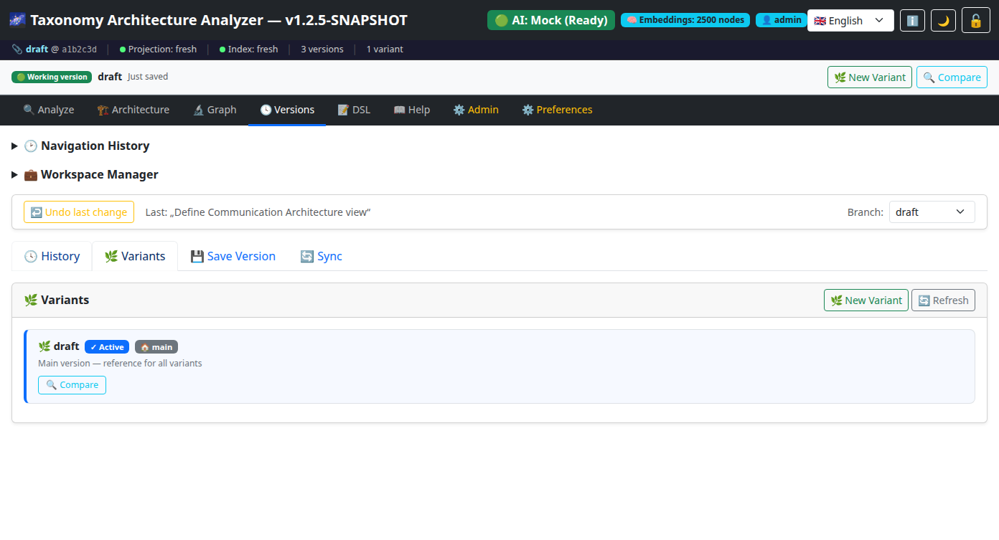
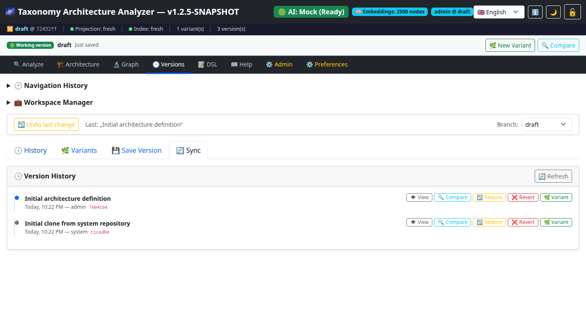
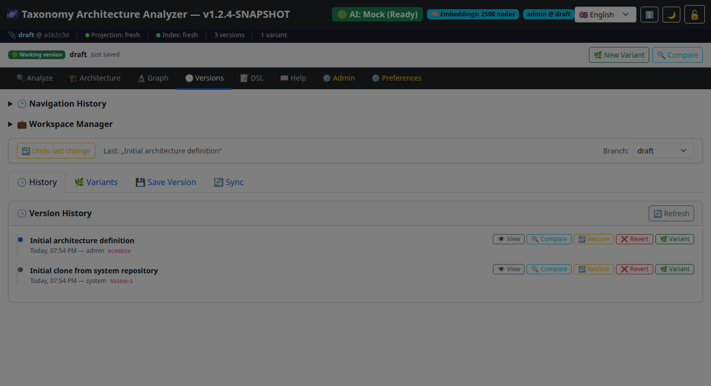
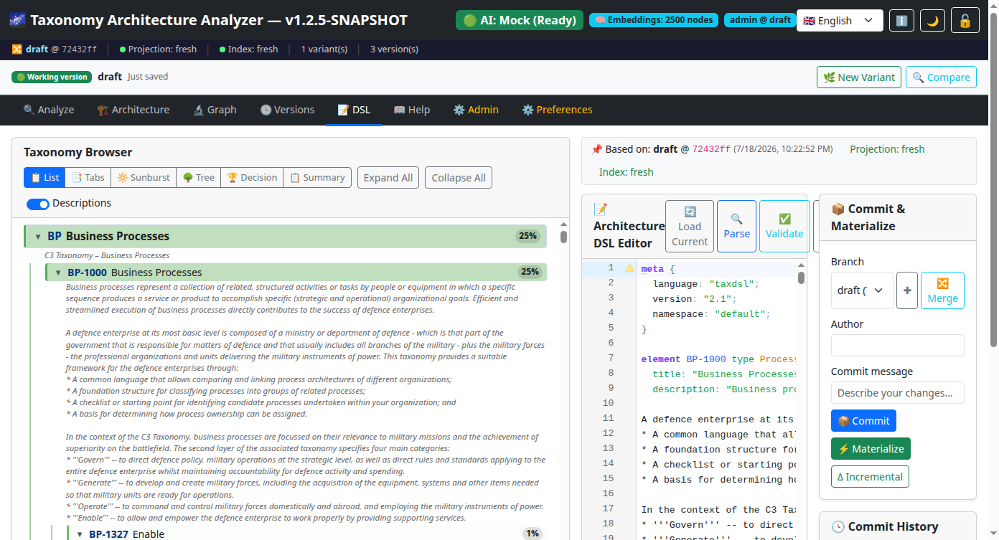
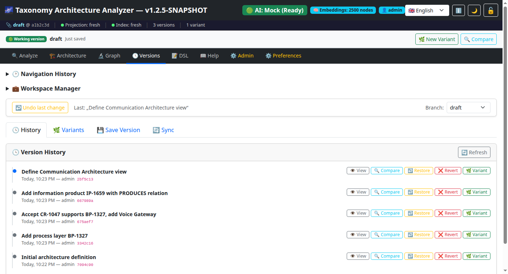
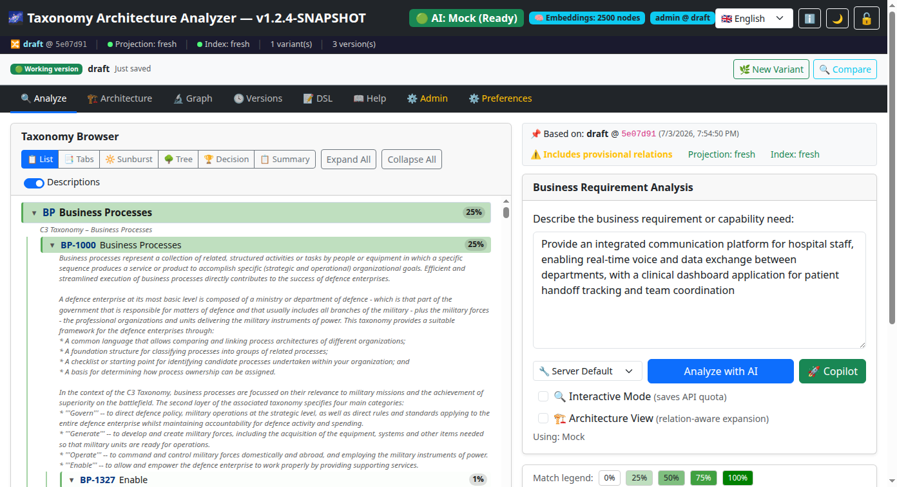
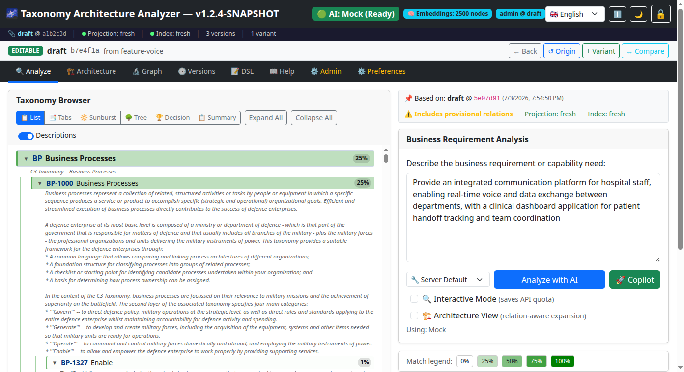

# Git Integration

The Taxonomy Architecture Analyzer uses **JGit** to provide full Git version control for Architecture DSL documents. The Git repository is stored in the application database (no filesystem required), giving you branching, commit history, diff, merge, and cherry-pick capabilities for your architecture models.

> **📌 For GUI-based guidance** on variants, merge, and version history, see [Workspace & Versioning](WORKSPACE_VERSIONING.md).

## Table of Contents

- [Overview](#overview)
- [Data Model Layers](#data-model-layers)
- [Repository Architecture](#repository-architecture)
- [Branching](#branching)
- [Commit History](#commit-history)
- [Diff and Comparison](#diff-and-comparison)
- [Cherry-Pick](#cherry-pick)
- [Merge](#merge)
- [Conflict Detection](#conflict-detection)
- [Realistic Workflow Examples](#realistic-workflow-examples)
- [Materialization](#materialization)
- [Staleness Tracking](#staleness-tracking)
- [Hypotheses Lifecycle](#hypotheses-lifecycle)
- [Commit History Search](#commit-history-search)
- [Taxonomy Maintenance](#taxonomy-maintenance)
- [REST API Reference (for Developers & Automation)](#rest-api-reference-for-developers--automation)
- [Related Documentation](#related-documentation)

---

## Overview

Architecture DSL documents (`.taxdsl` files) are stored in a JGit DFS (Distributed File System) repository backed by HSQLDB tables (`git_packs`, `git_reflog`). Every change to the DSL creates a Git commit with author, timestamp, and commit message — providing a complete audit trail.

The Git state is exposed through the UI status bar and REST API, allowing you to monitor repository health, detect stale projections, and preview merge/cherry-pick operations before executing them.


---

## Data Model Layers

The system distinguishes between **imported canonical taxonomy data** (read-only in normal workflows) and **user-managed architecture overlays** (freely editable). Understanding this separation is essential for productive use.

### Layer 1 — Imported Taxonomy Baseline (read-only)

| Attribute | Description |
|---|---|
| **Node codes** | Hierarchical identifiers from the C3 Taxonomy Catalogue (e.g. `CP-1023`, `CR-1047`) |
| **Titles** | Official English names as published in the catalogue |
| **Descriptions** | Official descriptions from the catalogue |
| **Hierarchy** | Parent–child structure and level assignments |

These attributes are loaded from the Excel workbook at application startup. **Normal user workflows do not modify them.** When taxonomy elements appear in DSL documents, their titles and descriptions reflect the canonical catalogue values.

### Layer 2 — Architecture Relations, Mappings, Views, Evidence (user-mutable)

| Block type | Purpose | Example |
|---|---|---|
| `relation` | Directed links between elements | `relation CP-1023 REALIZES CR-1047 { status: accepted; }` |
| `mapping` | Requirement-to-element links | `mapping REQ-001 -> CP-1023 { score: 92; }` |
| `view` | Named subsets for diagrams | `view "CIS Overview" { include: CP-1023, CR-1047; }` |
| `evidence` | Justification for a relation | `evidence E-001 { relation: CP-1023 REALIZES CR-1047; text: "..."; }` |

These are the primary objects that users create, modify, and version-control in their daily architecture work.

### Layer 3 — Local Extensions and Annotations (user-mutable)

Extension attributes prefixed with `x-` can be added to any element or relation block. They are preserved during round-trip serialization but not validated by the system.

```
element CP-1023 type Capability {
  title: "Secure Voice";                // ← canonical (do not modify)
  x-alias: "SecVoice";                  // ← local annotation (user-defined)
  x-owner: "CIS Division";             // ← local metadata (user-defined)
  x-criticality: "high";               // ← local metadata (user-defined)
}
```

Common uses: project-specific aliases, ownership annotations, criticality ratings, review notes.

### Layer 4 — Taxonomy Maintenance (restricted)

Modifying canonical taxonomy data (titles, descriptions, hierarchy) is a privileged operation reserved for taxonomy administrators. See [Taxonomy Maintenance](#taxonomy-maintenance) for details.

---

## Repository Architecture

```
┌─────────────────────┐
│  DslGitRepository    │   JGit DFS repository
│  (database-backed)   │   Tables: git_packs, git_reflog
├─────────────────────┤
│  Branches            │   draft (default), main, feature/*
│  Commits             │   Full SHA, author, message, timestamp
│  Objects             │   Git blobs, trees, commits stored in DB
└─────────────────────┘
         │
         ▼
┌─────────────────────┐
│  RepositoryStateService  │   Tracks projection/index staleness
│  ConflictDetectionService│   Previews merge/cherry-pick
│  GitStateController      │   REST API for state queries
└─────────────────────┘
```

Key methods on `DslGitRepository`:

| Method | Purpose |
|---|---|
| `commitDsl(content, message, author)` | Create a new commit |
| `getDslAtHead(branch)` | Read current DSL content |
| `getDslAtCommit(sha)` | Read DSL at a specific commit |
| `getDslHistory(branch, limit)` | List commit history |
| `listBranches()` | List all branch names |
| `createBranch(name, startPoint)` | Create a new branch |
| `diffBetween(fromSha, toSha)` | Semantic diff between commits |
| `diffBranches(from, to)` | Diff between branch HEADs |
| `textDiff(fromSha, toSha)` | Unified text diff |
| `cherryPick(commitId, targetBranch)` | Port a single commit |
| `merge(fromBranch, intoBranch)` | Three-way merge |

---

## Branching

The default branch is `draft`. You can create feature branches to experiment with architecture changes without affecting the main branch.

Navigate to **Versions → Variants** and click **🌿 New Variant**. Enter the name (e.g. `feature/new-service`) and confirm with **Create**.


The variants panel shows all existing variants as cards:


As the project grows, multiple branches coexist — feature branches, review branches, and hotfix branches — each with their own commit history:



<details>
<summary>🔧 REST API equivalent (for automation)</summary>

```
POST /api/dsl/branches
{
  "name": "feature/new-service",
  "startPoint": "draft"
}
```

</details>

The active branch for materialization is configured via the `dsl.default-branch` preference (see [Preferences](PREFERENCES.md)).

---

## Commit History

Every DSL change creates a Git commit with:

- **SHA** — Unique commit identifier
- **Author** — Authenticated user who made the change
- **Message** — Description of the change
- **Timestamp** — When the commit was created

Navigate to **Versions → History**. The timeline shows all commits with message, author, timestamp, and hash.



In a real project, the timeline grows as the architecture evolves — with commits from multiple team members across different branches. The screenshot below shows a realistic timeline with dozens of commits spanning architecture refinement, relation reviews, and feature branches:


<details>
<summary>🔧 REST API equivalent (for automation)</summary>

```
GET /api/dsl/history?branch=draft&limit=20
```

</details>

---

## Diff and Comparison

Two diff modes are available:

Click **🔍 Compare** in the context bar or history view. The comparison view shows three levels: summary, three-column grid, and DSL diff.





<details>
<summary>🔧 REST API equivalent (for automation)</summary>

| Mode | Endpoint | Output |
|---|---|---|
| **Semantic** | `GET /api/dsl/diff?from={sha}&to={sha}` | Structured JSON showing added, removed, and changed elements and relations |
| **Unified text** | `GET /api/dsl/text-diff?from={sha}&to={sha}` | Standard unified diff format (patch) |

You can also diff between branches:

```
GET /api/dsl/diff-branches?from=draft&to=main
```

</details>

---

## Cherry-Pick

Port a specific commit from one branch to another:

In the **Version History**, select the desired commit and click the transfer action. The system shows a preview with conflict checking.

### Step-by-step: Cherry-picking a commit

**1. Before** — The draft branch has its own history. You want to bring a specific reviewed commit from the `review` branch:


**2. Preview** — Click the transfer action on the desired commit. The preview modal shows what will change:


**3. After** — Once confirmed, the cherry-picked commit appears as a new commit on the draft branch:



<details>
<summary>🔧 REST API equivalent (for automation)</summary>

```
POST /api/dsl/cherry-pick
{
  "commitId": "abc1234...",
  "targetBranch": "draft"
}
```

</details>

The operation uses three-way merge logic internally. Use the preview endpoint first to check for conflicts (see [Conflict Detection](#conflict-detection)).

---

## Merge

Combine two branches using three-way merge:

In the **Variants Panel**, click **🔀 Integrate** on the desired variant. A preview modal shows the change summary.


After a successful merge, a confirmation toast is displayed:



<details>
<summary>🔧 REST API equivalent (for automation)</summary>

```
POST /api/dsl/merge
{
  "fromBranch": "feature/new-service",
  "intoBranch": "draft"
}
```

</details>

The merge strategy is RECURSIVE (standard Git behaviour). Fast-forward merges are performed when the target branch is a direct ancestor of the source.

---

## Conflict Detection

Before executing a merge or cherry-pick, you can preview the operation to check for conflicts:

During merge, the system automatically checks for conflicts. If conflicts are found, the conflict resolution dialog opens with a side-by-side view of the diverging content.




### Merge Preview

<details>
<summary>🔧 REST API equivalent (for automation)</summary>

```
GET /api/dsl/merge/preview?from=feature/new-service&into=draft
```

Response:

```json
{
  "canMerge": true,
  "fromBranch": "feature/new-service",
  "intoBranch": "draft",
  "fromCommit": "abc1234...",
  "intoCommit": "def5678...",
  "alreadyMerged": false,
  "fastForwardable": true,
  "warnings": []
}
```

</details>

### Cherry-Pick Preview

<details>
<summary>🔧 REST API equivalent (for automation)</summary>

```
GET /api/dsl/cherry-pick/preview?commitId=abc1234&branch=draft
```

Response:

```json
{
  "canCherryPick": true,
  "commitId": "abc1234...",
  "targetBranch": "draft",
  "targetCommit": "def5678...",
  "warnings": []
}
```

</details>

### Operation Safety Check

<details>
<summary>🔧 REST API equivalent (for automation)</summary>

```
GET /api/dsl/operation/check?branch=draft
```

</details>

The `RepositoryStateGuard` checks whether a write operation is safe to proceed on the given branch.

---

## Realistic Workflow Examples

The following examples show typical user workflows. Notice that **canonical taxonomy titles remain unchanged** — users modify relations, mappings, views, local extensions, and relation statuses.

### Example: Feature Branch with New Relations

A user creates a feature branch to propose new architecture relations:

**Base (draft branch):**
```
element CP-1023 type Capability {
  title: "Secure Voice";
  description: "Encrypted voice communication";
}

element CR-1047 type CoreService {
  title: "Core Communication Services";
}

relation CP-1023 REALIZES CR-1047 {
  status: accepted;
}
```

**Feature branch (feature/voice-gateway):**
```
element CP-1023 type Capability {
  title: "Secure Voice";
  description: "Encrypted voice communication";
  x-alias: "SecVoice";
}

element CR-1047 type CoreService {
  title: "Core Communication Services";
}

element CO-1011 type Component {
  title: "Voice Gateway";
  description: "SIP/RTP gateway for voice traffic";
}

relation CP-1023 REALIZES CR-1047 {
  status: accepted;
}

relation CO-1011 USES CR-1047 {
  status: proposed;
}
```

**What changed** (typical diff output):
- ✅ Added local alias `x-alias: "SecVoice"` to CP-1023
- ✅ Added new element CO-1011 (Voice Gateway)
- ✅ Added new relation CO-1011 → CR-1047
- ❌ No canonical titles or descriptions were modified

### Example: Cherry-Pick a Relation Status Change

A reviewer accepts a proposed relation on the `review` branch. The change is cherry-picked to `draft`:

The reviewer opens the **Version History** of the review branch, finds commit `a3f8c2d`, and transfers it to the `draft` branch using the transfer action.


The cherry-picked commit changes only the relation status:
```diff
 relation CO-1011 USES CR-1047 {
-  status: proposed;
+  status: accepted;
 }
```

### Example: Merge with Conflict on Relation Status

When two branches modify the same relation status, a conflict occurs:

- **Ours (draft):** `status: proposed;`
- **Theirs (feature-voice):** `status: accepted;`

The conflict resolution UI lets the user choose which status to keep, or manually compose the final content. Canonical taxonomy element titles are never part of such conflicts in normal workflows.

### Example: View and Mapping Changes

Users commonly modify architecture views and requirement mappings:

```diff
+view "CIS Architecture" {
+  include: CP-1023, CR-1047, CO-1011;
+  layout: hierarchical;
+}
+
+mapping REQ-001 -> CP-1023 {
+  score: 92;
+  rationale: "Core secure voice capability";
+}
```

---

## Materialization

DSL documents are **materialized** into the application database. This creates `TaxonomyRelation` entities from DSL relations, making them visible in the Graph Explorer, Relation Proposals, and Architecture View.

After changes, the **Git status bar** shows the status 'Projection stale'. Click **Materialize** in the status bar to update the database.

<details>
<summary>🔧 REST API equivalent (for automation)</summary>

Two materialization modes are available:

| Mode | Endpoint | Description |
|---|---|---|
| **Full** | `POST /api/dsl/materialize` | Replaces all relations with DSL content |
| **Incremental** | `POST /api/dsl/materialize-incremental` | Applies only the delta between two versions |

</details>

After materialization, the `RepositoryStateService` records the projection commit to track whether the database is in sync with the Git HEAD.

---

## Staleness Tracking

The system tracks whether the database projection and search index are in sync with the Git HEAD:

The Git status bar at the top automatically shows the synchronization status. When stale, a warning indicator appears.


| Field | Meaning |
|---|---|
| `projectionStale` | Database relations differ from Git HEAD |
| `indexStale` | Search index differs from Git HEAD |

**Staleness logic:** If the last materialized commit SHA matches the current HEAD commit SHA, the projection is **not stale**. Otherwise, it is stale and should be re-materialized.

<details>
<summary>🔧 REST API equivalent (for automation)</summary>

Query staleness:

```
GET /api/git/stale?branch=draft
```

Response:

```json
{
  "projectionStale": false,
  "indexStale": false
}
```

</details>

The UI polls `/api/git/state` every 10 seconds to display a status indicator when the projection is stale.

---

## Hypotheses Lifecycle

Relations generated during LLM analysis are stored as **hypotheses** — provisional relations that require human review before becoming permanent:

```
PENDING  →  ACCEPTED  (creates TaxonomyRelation)
         →  REJECTED  (marked as rejected)
         →  APPLIED   (session-only, not persisted)
```

The Hypotheses API (`/api/dsl/hypotheses`) allows querying, accepting, and rejecting hypotheses, with supporting evidence available for each.

---

## Taxonomy Maintenance

Modifying canonical taxonomy data (node titles, descriptions, hierarchy structure) is a **privileged administrative operation** that is separate from normal architecture work.

### When Taxonomy Maintenance is Needed

- Correcting an error in an imported catalogue title
- Updating descriptions to match a new catalogue revision
- Adding locally-defined extension nodes not present in the published catalogue

### How it Differs from Normal Workflows

| Aspect | Normal Architecture Work | Taxonomy Maintenance |
|---|---|---|
| **What changes** | Relations, mappings, views, evidence, local extensions | Node titles, descriptions, hierarchy |
| **Who performs it** | Any architect or analyst | Taxonomy administrator |
| **Frequency** | Daily | Rare (per catalogue revision) |
| **Review process** | Standard branch/merge workflow | Administrative review required |
| **Scope** | User workspace or feature branch | Shared baseline for all users |

### Recommended Process

1. Create a dedicated branch (e.g. `taxonomy-update/2026-q2`)
2. Modify element titles or descriptions in the DSL
3. Review changes with the taxonomy governance team
4. Merge into the shared branch after approval
5. Re-materialize to propagate changes to all workspaces

> **Important:** Normal user workflows should use `x-` extension attributes (e.g. `x-alias`, `x-note`) for local customizations rather than modifying canonical titles directly.

---

## Commit History Search

Commit history is indexed into Hibernate Search for full-text search. You can:

- Search across all commit messages and change content
- Find all commits that affected a specific element
- Find all commits that affected a specific relation
- View aggregated change history for an element

---

## REST API Reference (for Developers & Automation)

The following endpoints are intended for programmatic integration and automation. For daily work, use the graphical user interface (see [Workspace & Versioning](WORKSPACE_VERSIONING.md)).

### Git State

| Method | Endpoint | Description |
|---|---|---|
| `GET` | `/api/git/state?branch=draft` | Full repository state snapshot |
| `GET` | `/api/git/projection?branch=draft` | Projection/index freshness |
| `GET` | `/api/git/branches?branch=draft` | All branches with HEAD commits |
| `GET` | `/api/git/stale?branch=draft` | Quick staleness check |

### DSL Operations

| Method | Endpoint | Description |
|---|---|---|
| `POST` | `/api/dsl/materialize` | Full materialization |
| `POST` | `/api/dsl/materialize-incremental` | Incremental materialization |
| `POST` | `/api/dsl/merge` | Merge branches |
| `POST` | `/api/dsl/cherry-pick` | Cherry-pick a commit |
| `GET` | `/api/dsl/merge/preview` | Preview merge result |
| `GET` | `/api/dsl/cherry-pick/preview` | Preview cherry-pick result |
| `GET` | `/api/dsl/operation/check` | Safety check for write operations |
| `GET` | `/api/dsl/merge/conflicts?from=X&into=Y` | Merge conflict details (DSL content from both sides) |
| `POST` | `/api/dsl/merge/resolve?fromBranch=X&intoBranch=Y` | Commit manually resolved merge content |
| `GET` | `/api/dsl/cherry-pick/conflicts?commitId=X&targetBranch=Y` | Cherry-pick conflict details |
| `POST` | `/api/dsl/cherry-pick/resolve?commitId=X&targetBranch=Y` | Commit manually resolved cherry-pick content |
| `DELETE` | `/api/dsl/branch?name=X` | Delete a branch (protected branches: draft, accepted, main) |

### Workspace Sync

| Method | Endpoint | Description |
|---|---|---|
| `POST` | `/api/workspace/sync-from-shared?userBranch=X` | Merge shared branch into user branch (pull) |
| `POST` | `/api/workspace/publish?userBranch=X` | Merge user branch into shared branch (push) |
| `GET` | `/api/workspace/sync-state` | Get sync status (UP_TO_DATE, BEHIND, AHEAD, DIVERGED) |
| `POST` | `/api/workspace/resolve-diverged?strategy=X&userBranch=Y` | Resolve diverged state (strategies: MERGE, KEEP_MINE, TAKE_SHARED) |

See [API Reference](API_REFERENCE.md) for full request/response schemas.

---

## Related Documentation

- [Workspace & Versioning Guide](WORKSPACE_VERSIONING.md) — user-facing guide for the workspace UI (context bar, history, variants, sync)
- [Repository Topology](REPOSITORY_TOPOLOGY.md) — workspace provisioning model, topology modes, and data isolation
- [User Guide](USER_GUIDE.md) — Architecture DSL section (§11g)
- [Architecture](ARCHITECTURE.md) — DSL storage architecture
- [Concepts](CONCEPTS.md) — DSL, hypotheses, and the canonical model
- [Preferences](PREFERENCES.md) — Configuring `dsl.default-branch` and remote push settings
- [Framework Import](FRAMEWORK_IMPORT.md) — How imported files are stored as DSL documents
