# Taxonomy Architecture Analyzer — User Guide

> **This guide covers the primary way to use the Taxonomy Architecture Analyzer: the web-based GUI.**
> All major features described here are designed to be used interactively through the browser.
> For automation and scripting, see the [API Reference](API_REFERENCE.md).

## Fastest Path — Your First Analysis in 5 Steps

| Step | Action | Where |
|:---:|---|---|
| **1** | Log in with `admin` / `admin` | Login page at `http://localhost:8080` |
| **2** | Type your requirement | Right panel → "Business Requirement Analysis" text area |
| **3** | Click **Analyze with AI** | Button below the text area |
| **4** | Explore the scored tree and architecture view | Left panel (tree) + right panel (architecture view card) |
| **5** | Export your diagram | Left panel → ArchiMate / Visio / Mermaid / JSON buttons |

> **Example requirement:** _"Provide an integrated communication platform for hospital staff, enabling real-time voice and data exchange between departments."_

The system scores every taxonomy node (0–100), highlights the most relevant elements with colour-coded scores, generates an architecture view showing how they relate, and lets you export the result.


**Ready for more?** Continue reading for the full guide, or jump to [Architecture View](#7-architecture-view) to understand how the architecture is generated.

> 💡 **New users:** Start with the core workflow (Analyze → Architecture → Export).
> Advanced features like Graph Explorer, DSL Editor, and Gap Analysis are described in later sections.

---

## Table of Contents

1. [Overview](#1-overview)
2. [Getting Started](#2-getting-started)
3. [Understanding the Interface](#3-understanding-the-interface)
4. [Analyzing a Business Requirement](#4-analyzing-a-business-requirement)
5. [Exploring the Taxonomy](#5-exploring-the-taxonomy)
6. [Working with Analysis Results](#6-working-with-analysis-results)
7. [Architecture View](#7-architecture-view)
8. [Using the Graph Explorer](#8-using-the-graph-explorer)
9. [Working with Relation Proposals](#9-working-with-relation-proposals)
10. [Exporting Results](#10-exporting-results)
    - [Generating Reports (MD/HTML/DOCX)](#10a-generating-reports-mdhtmldocx)
11. [Search](#11-search)
    - [Quality Dashboard](#11a-quality-dashboard)
    - [Relations Browser](#11b-relations-browser)
    - [Requirement Coverage](#11c-requirement-coverage)
    - [Architecture Gap Analysis](#11d-architecture-gap-analysis)
    - [Architecture Recommendation](#11e-architecture-recommendation)
    - [Architecture Pattern Detection](#11f-architecture-pattern-detection)
    - [Architecture DSL](#11g-architecture-dsl)
12. [Versions Tab](#12-versions-tab)
13. [Git Status and Context Bar](#13-git-status-and-context-bar)
14. [Administration](#14-administration)
15. [Relation Types Reference](#15-relation-types-reference)
16. [Tips and Best Practices](#16-tips-and-best-practices)
17. [Glossary](#17-glossary)
18. [Troubleshooting](#18-troubleshooting)

---

## 1. Overview

The **Taxonomy Architecture Analyzer** is a web application that helps Architects, Analysts, and Requirements Engineers map free-text mission and business requirements to the C3 Taxonomy catalogue. You describe what you need in plain English, and the application finds the most relevant taxonomy nodes, shows you how they relate to each other, and lets you export structured diagrams.

**Who is this guide for?**

- **Requirements Engineers** who need to classify and map requirements to architecture elements.
- **Architects and Capability Planners** who use the taxonomy to design or assess C3 systems.
- **Analysts** exploring the taxonomy structure and reviewing AI-generated relation proposals.

**What you can do with the application:**

| Task | Where to find it |
|---|---|
| Analyze a requirement and see matching taxonomy nodes | Right panel → Business Requirement Analysis card |
| Browse the taxonomy in different visual layouts | Left panel → view switcher buttons |
| Drill into why a node scored highly | Click 📋 on any scored node |
| Search for taxonomy nodes (full-text, semantic, hybrid, graph) | Right panel → 🔍 Search Taxonomy panel |
| Find semantically similar nodes | Click 🔍 Similar on any taxonomy node |
| Trace upstream/downstream dependencies | Right panel → Graph Explorer |
| Run requirement impact analysis | Graph Explorer → 🎯 Req. Impact button |
| Identify architecture gaps | API: `POST /api/gap/analyze` (§11d) |
| Get architecture recommendations | API: `POST /api/recommend` (§11e) |
| Detect architecture patterns | API: `GET /api/patterns/detect` (§11f) |
| Enriched failure impact with requirement correlation | API: `GET /api/graph/node/{code}/enriched-failure-impact` (§8) |
| Review and accept or reject AI-generated relation proposals | Right panel → Relation Proposals panel |
| View quality metrics for relation proposals | Right panel → 📊 Quality Dashboard panel |
| Record and analyse requirement coverage | Right panel → 📋 Requirement Coverage panel |
| Browse, create, or delete taxonomy relations | Right panel → 🔗 Relations Browser panel |
| Export a diagram or scoresheet | Left panel → export buttons (appear after analysis) |
| Save analysis as JSON | Left panel → export buttons → 📥 JSON |
| Load a saved analysis | Left panel → 📤 Load Scores button |
| Manage LLM settings and prompt templates | Unlock admin mode via 🔒 in the navigation bar |

> For the REST API reference used by developers and integrators, see [API Reference](API_REFERENCE.md).

---

## 2. Getting Started

### Opening the Application

Open your web browser and navigate to the application URL (for example `http://localhost:8080` when running locally, or the deployed URL provided by your administrator).

The application loads as a single page. A login page is presented on first access — sign in with the default credentials (`admin` / `admin`) or with the password configured via the `TAXONOMY_ADMIN_PASSWORD` environment variable. After login, all standard features are available; administrator features additionally require unlocking admin mode (see [Section 14](#14-administration)).

**First-time users** will see a **Welcome overlay** with a 3-step guide explaining how to get started:
1. Describe your requirement in the text area
2. Click **Analyze with AI**
3. Explore the results

Click **Got it — let's start!** to dismiss the overlay. The overlay will not appear again on subsequent visits (stored in your browser's localStorage). To reset the onboarding, open the browser console and run `TaxonomyOnboarding.reset()`.


### Checking AI Availability

Look at the navigation bar at the top of the page. There is an **AI Status** indicator:

- 🟢 **Green badge** — an LLM provider is connected and analysis is available.
- 🔴 **Red badge** — no LLM provider is configured; analysis is unavailable. Contact your administrator.

---

## 3. Understanding the Interface

The application is divided into two main panels side by side.

### Left Panel — Taxonomy Tree

The left panel (wider column) displays the **Taxonomy Tree**. This is the full catalogue of C3 capabilities, services, roles, and information products.

At the top of the left panel you will find:

- **View switcher buttons:** 📋 List | 📑 Tabs | 🔆 Sunburst | 🌳 Tree | 🏆 Decision | 📋 Summary — switch between different visualisations of the taxonomy.
- **Export buttons** (appear only after a successful analysis): 📥 SVG | 📥 PNG | 📥 PDF | 📥 CSV | 📥 JSON | 📥 Visio | 📥 ArchiMate | 📥 Mermaid
- **Load Scores button** (always visible): 📤 Load Scores — imports a previously saved JSON analysis file
- **Expand All / Collapse All** — expand or collapse all nodes in the current view.
- **Taxonomy root selector** (Tree view only) — choose which taxonomy root to display.
- **Descriptions toggle switch** — show or hide the description text for each node.

Each taxonomy node row shows:
- The **node name** and its hierarchical code.
- A **score bar** and percentage (visible after analysis).
- **Per-node action buttons:** 🔗 (Propose Relations) | 📋 (Request Justification) | 🔎 (Graph Explorer)

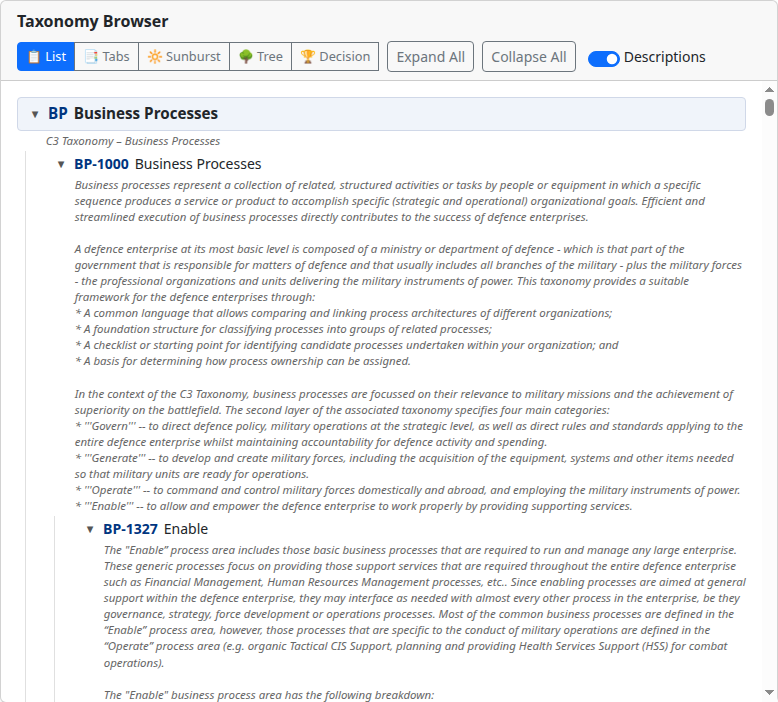

### Right Panel — Analysis and Tools

The right panel (narrower column) contains all interactive tools:

- **Business Requirement Analysis card** — the main textarea where you type a requirement and run the analysis.
- **Match Legend** — colour scale from 0 % to 100 % showing what each green shade means.

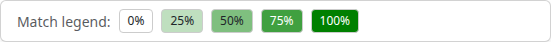

- **Status Area** — messages and warnings about the current operation.
- **Analysis Log** (collapsible) — step-by-step log of the scoring process.
- **Architecture View Panel** — appears after analysis when the Architecture View checkbox is enabled.
- **Graph Explorer Panel** — enter a node code and run upstream, downstream, or failure-impact queries.
- **Relation Proposals Panel** — review, accept, or reject AI-generated relation proposals.
- **LLM Communication Log** (admin only, collapsible) — raw prompt and response log.
- **LLM Diagnostics Panel** (admin only, collapsible) — connection test and statistics.
- **Prompt Templates Editor** (admin only, collapsible) — view and edit the LLM prompt templates.

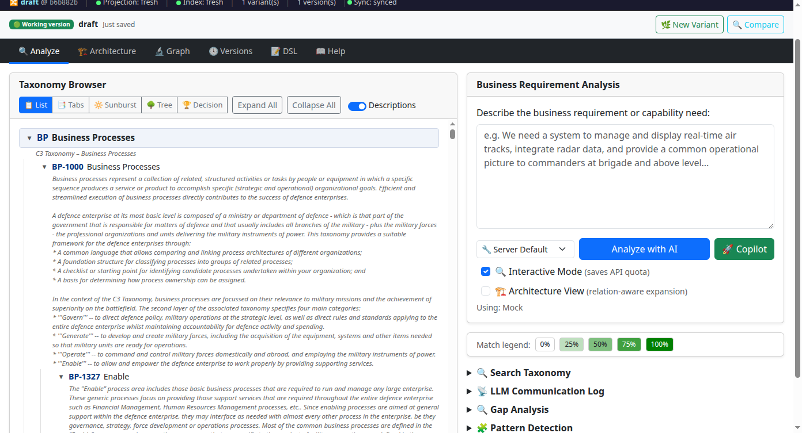

### Navigation Bar

The navigation bar at the top of the page contains:

- **Application title / logo**
- **AI Status badge** (🟢 green or 🔴 red)
- **🔒 Admin mode button** — click to open the Admin Mode password modal

### Dark Mode

Click the **🌙** (moon) button in the navigation bar to switch to dark mode. Click **☀️** (sun) to switch back to light mode. Your preference is saved in your browser and persists across sessions.

---

## 4. Analyzing a Business Requirement

### Writing a Good Requirement

In the **Business Requirement Analysis** card on the right panel, you will see a large textarea labelled something like *"Enter your business requirement…"*.

Type your requirement as a clear, imperative sentence. For example:

> *"Provide an integrated communication platform for hospital staff, enabling real-time voice and data exchange between departments."*

Tips for good requirements:
- Use domain vocabulary: capability, service, information product, communications, command, control.
- Be specific about the function or outcome you need.
- Keep the text under 500 words; longer text does not improve accuracy.

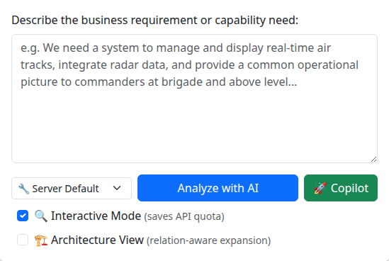

### Standard Analysis

1. Type your requirement in the textarea.
2. Make sure the **Interactive Mode** checkbox is **unchecked** for a standard (full-tree) analysis.
3. Click the **Analyze with AI** button.
4. A progress indicator appears in the Status Area. The taxonomy tree in the left panel will start showing colour-coded score bars as results arrive.
5. When analysis is complete, the Status Area shows a summary message and the export buttons become available.


The fully expanded tree shows scores at every level, making it easy to identify which branches are most relevant:

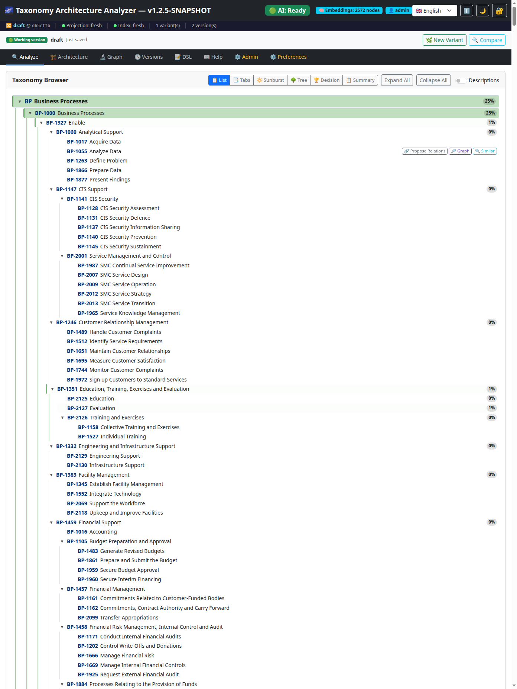

### Interactive Mode

Tick the **Interactive Mode** checkbox before clicking **Analyze with AI** to use level-by-level exploration instead of scoring the whole tree at once.

In Interactive Mode:
- Only the top-level nodes are scored first.
- A **▶ Analyze Node** button appears next to each top-level node.
- Click **▶ Analyze Node** on a node to score its children.
- Continue expanding the tree level by level.

This mode is useful for very large taxonomies or when you want to focus on one branch.

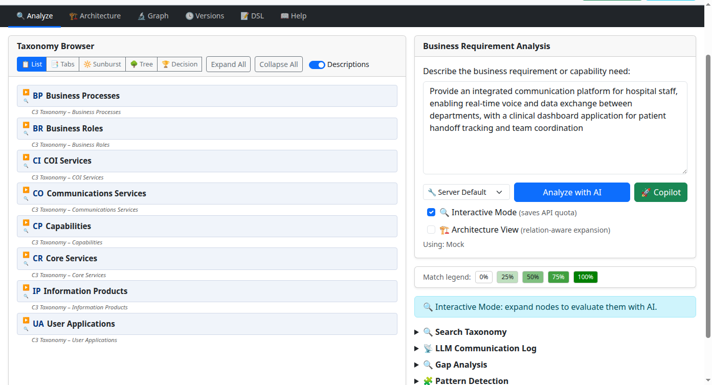

### Architecture View Checkbox

Tick the **Architecture View** checkbox before running analysis to also build an architecture view after the scores are computed. The Architecture View traces how the highest-scoring nodes relate to each other through confirmed architecture relationships. See [Section 7](#7-architecture-view) for details.

### Understanding Scores and the Colour Legend

The **Match Legend** (below the analysis card) shows the colour scale:

| Colour | Score range | Meaning | Text Colour |
|---|---|---|---|
| Transparent | 0 % | No match | Dark (default) |
| Very light green | 1 % – 24 % | Very low match | Dark (default) |
| Light green | 25 % – 49 % | Low match | Dark (default) |
| Medium green | 50 % – 59 % | Moderate match | Dark (default) |
| Dark green | 60 % – 99 % | Good match | **White** (for readability) |
| Solid green | 100 % | Perfect match | **White** |

The colour is computed as `rgba(0, 128, 0, score/100)` — a pure green whose **opacity** (alpha channel) increases linearly with the score percentage. At 60 % and above, the text colour switches to white for readability against the darker background.

Nodes with a score of 0 % have no highlight at all. Hover over any legend box to see a tooltip describing its match level.

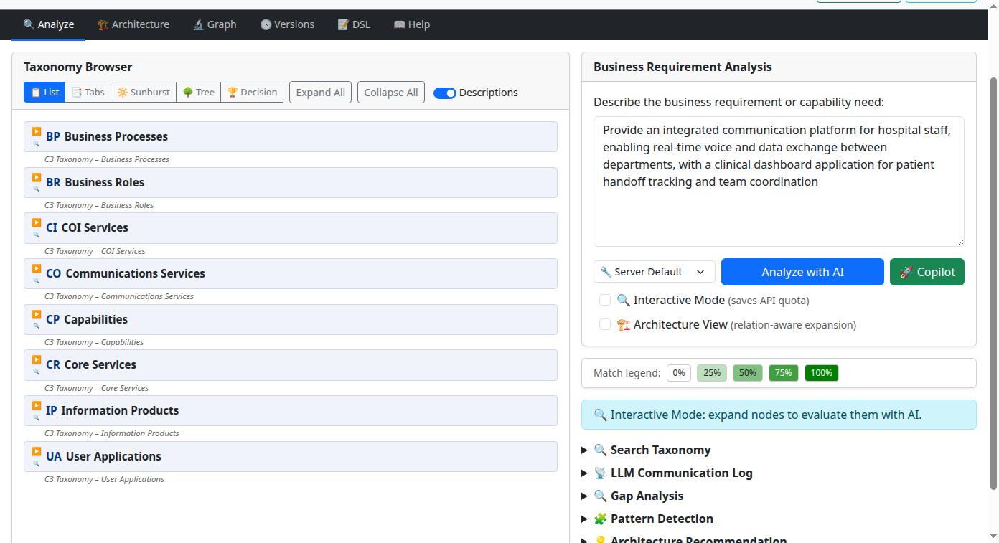

### The Analysis Log

Below the Status Area, a collapsible **Analysis Log** section records each step of the scoring process: which LLM phases ran, how many nodes were scored, and any warnings. Click the log header to expand or collapse it.

### Streaming Progress Indicator

During analysis (especially in Interactive Mode), the status area shows real-time progress messages. Each message corresponds to a phase in the LLM processing pipeline:

| Phase Message | Meaning |
|---|---|
| *"Analyzing root taxonomies…"* | The LLM is scoring the top-level taxonomy categories |
| *"Expanding [Name]…"* | The LLM is drilling into the children of a matched node |
| *"Scoring level N…"* | The LLM is processing taxonomy nodes at depth N |
| *"Building architecture view…"* | The relation-aware architecture view is being assembled |
| *"Analysis complete"* | All levels have been processed successfully |

A progress percentage bar may also appear, indicating approximately how far through the taxonomy levels the analysis has progressed.

### Error Handling During Analysis

If the LLM encounters an error during analysis, the application handles it gracefully:

| Error | What You See | What to Do |
|---|---|---|
| **Connection timeout** | Status shows "LLM connection timed out" with partial scores | Retry — the LLM server may be temporarily overloaded |
| **Rate limit (HTTP 429)** | Status shows "Rate limit exceeded" | Wait 60 seconds and retry |
| **Invalid API key** | Status shows "Authentication failed" | Check your API key in environment variables |
| **Partial failure** | Some roots scored, others show warnings | Review the warnings in the Analysis Log; scores for completed roots are still valid |

Partial results are preserved when possible — if 7 of 10 roots were scored before a timeout, those scores are displayed and only the failed roots are flagged with warnings.

### Export Button Visibility

The export buttons (SVG, PNG, PDF, CSV, JSON, Visio, ArchiMate, Mermaid) only appear when there are analysis scores greater than 0. If no analysis has been run, or if all scores are 0, the export buttons are hidden and a hint text **"📋 Analyze first to enable exports"** is shown instead. The **📤 Load Scores** button is always visible and can be used to restore a previous analysis.

---

## 5. Exploring the Taxonomy

The left panel displays the taxonomy in six different views. Switch between them using the buttons at the top: **📋 List | 📑 Tabs | 🔆 Sunburst | 🌳 Tree | 🏆 Decision | 📋 Summary**.

### List View (Default)

The default view shows all taxonomy nodes as a flat, indented list. Each row contains the node name, its code, and — after analysis — a score bar and percentage.

- Click any node name to expand or collapse its children.
- Use **Expand All** to open the entire tree, or **Collapse All** to close it.
- Toggle the **Descriptions** switch to show or hide the description text beneath each node name.

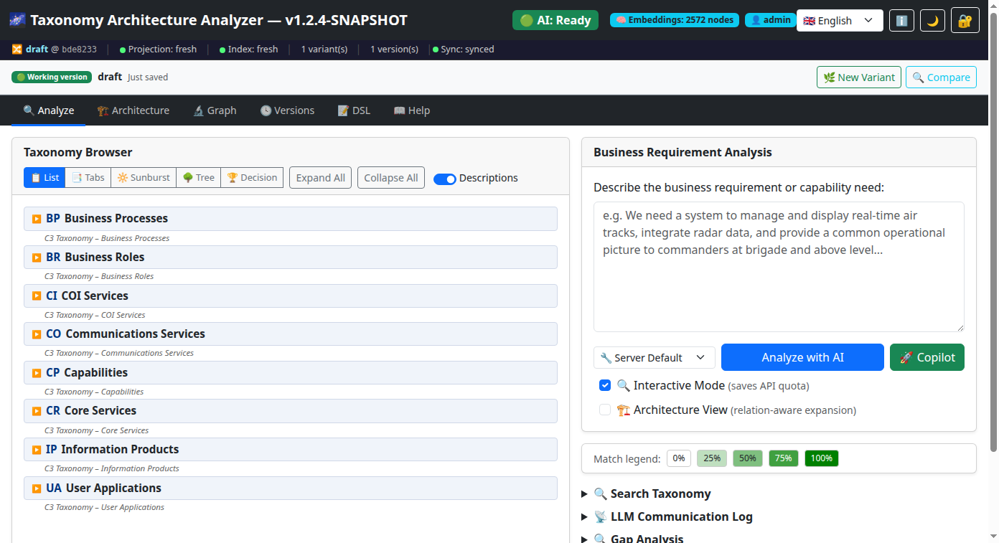

### Tabs View

The Tabs view groups taxonomy nodes under tab headers for each top-level category. Click a tab to display only the nodes in that branch.

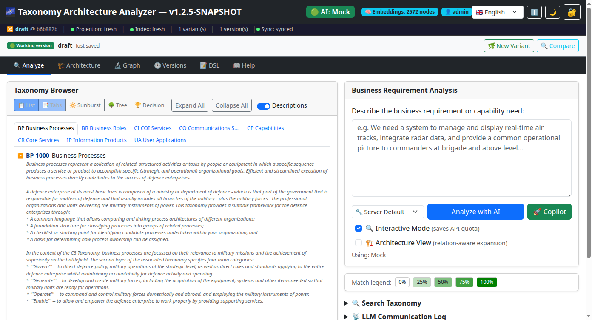

### Sunburst View

The Sunburst view renders the taxonomy as a radial sunburst chart where the centre is the root and each ring is a deeper level. After analysis, segments are coloured by their score.

- Hover over a segment to see the node name and score.
- Click a segment to zoom into that subtree.

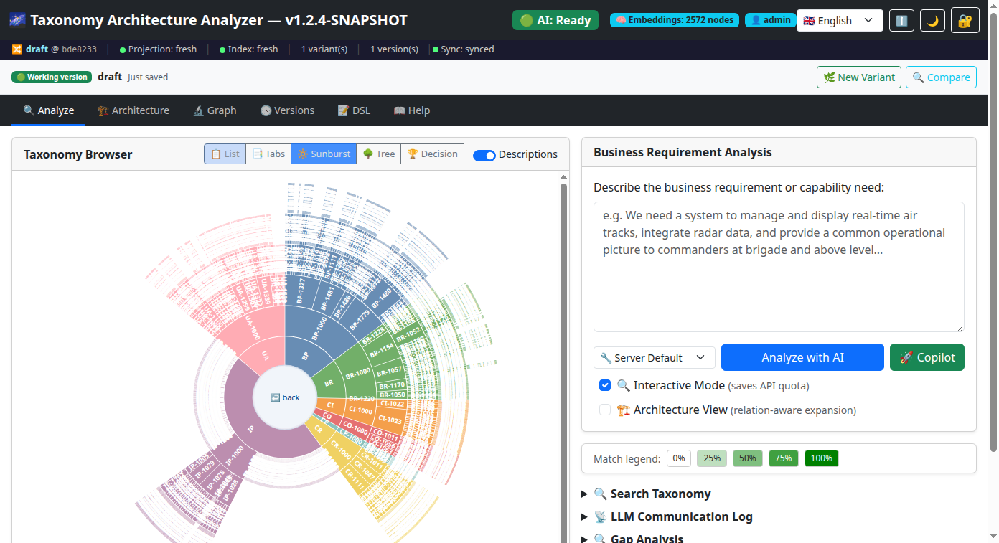

After running an analysis, the sunburst chart displays heat-mapped colour gradients reflecting the scores:

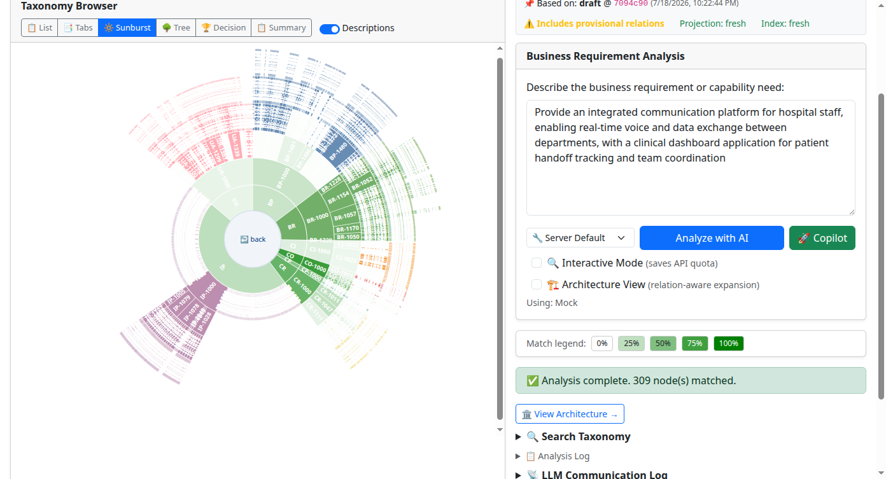

### Tree View

The Tree view renders the taxonomy as an interactive node-link diagram. Use the **Taxonomy root selector** dropdown to choose which root to display when there are multiple taxonomy roots.

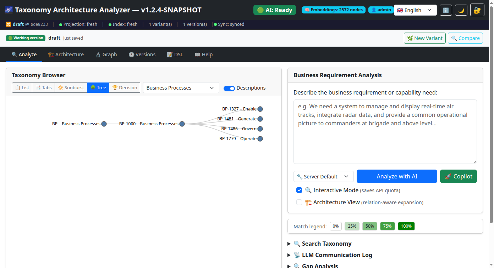

### Decision Map View

The Decision Map view shows the taxonomy as a decision-tree style layout optimised for selecting relevant nodes based on the analysis scores.

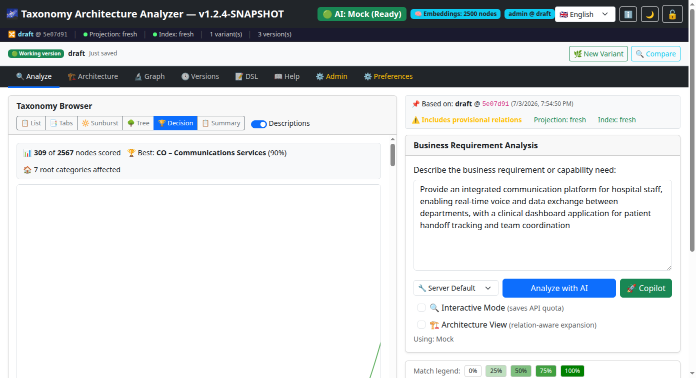

> **Note:** Before running an analysis, the Decision Map shows an empty state prompting you to run an analysis first.
>
> 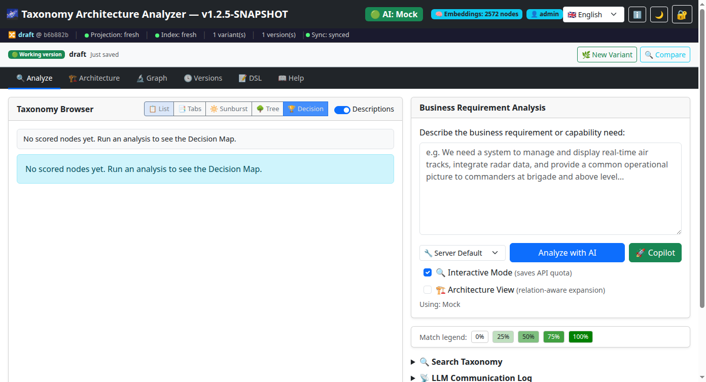

### Summary View (📋 Summary)

The Summary view appears automatically after running an analysis with the **Architecture View** checkbox enabled. It presents a layered architecture overview of your analysis results, grouping elements by their taxonomy category:

- **🔵 Capabilities** — Top-level capability nodes
- **🟢 Business Processes / Business Roles** — Operational processes and organisational roles
- **🟠 Services** — Core, COI, and general service nodes
- **🟣 Applications** — User-facing application elements
- **🔷 Information Products** — Data and information artefacts
- **🔴 Communications Services** — Network and communications infrastructure

Each element shows its node code, name, relevance percentage, and an anchor marker (★) if it was a direct match. Arrows between layers indicate the predominant relationship types (e.g., SUPPORTS, REALIZES).

**Clicking any element** in the Summary view switches to the List view and scrolls to that node, highlighting it briefly.

The Summary button appears in the view switcher only after a successful analysis with Architecture View enabled.

### Switching Between Views

Click any of the view switcher buttons (📋 List | 📑 Tabs | 🔆 Sunburst | 🌳 Tree | 🏆 Decision | 📋 Summary) at any time. Your analysis scores are preserved across view switches.

### Using Expand All / Collapse All

The **Expand All** and **Collapse All** buttons are only active in views that support hierarchical expansion (List and Tabs). They open or close all nodes simultaneously.

### Showing/Hiding Descriptions

The **Descriptions** toggle switch (above the tree, below the view buttons) controls whether the description text is shown beneath each node name. Turn it on to read what each taxonomy element covers; turn it off for a more compact view.

---

## 6. Working with Analysis Results

### Reading the Score Colours

After analysis completes, every taxonomy node shows a coloured score bar. Refer to the **Match Legend** on the right panel:

- **No colour** — score is 0 %, not relevant.
- **Light green → dark green** — increasing relevance.
- **Bright/full green** — maximum relevance.

Focus your attention on nodes with dark green highlights; these are the best matches for your requirement.

### Requesting a Leaf Justification (📋 button)

For any leaf node (a node with no children) that has a non-zero score, you can ask the AI to explain in plain English **why** that node matched your requirement.

1. Find the node in the taxonomy tree.
2. Click the **📋** button on that node's row.
3. A **Leaf Justification Modal** opens, displaying the LLM-generated explanation.
4. Read the explanation and close the modal when done.

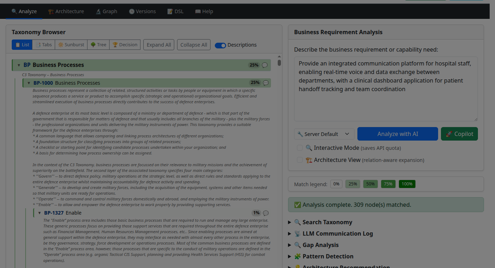

### Stale Results Warning

If you edit your requirement text after a completed analysis, the application detects that the displayed scores no longer match the current text and shows a **stale-results warning**:

1. The **textarea** gets a **yellow border** with a soft yellow glow.
2. A **warning message** appears in the status area: *"⚠️ Business text has changed — previous results are no longer valid."*
3. A **Reset Results** button appears, allowing you to clear the stale scores.

The warning triggers after a 300 ms debounce when you type in the business text area — it does not trigger immediately to avoid flickering.

**To resolve the warning:**
- Click **Reset Results** to clear the old scores, then re-run the analysis, or
- Click **Analyze with AI** again to replace the stale scores with fresh results.

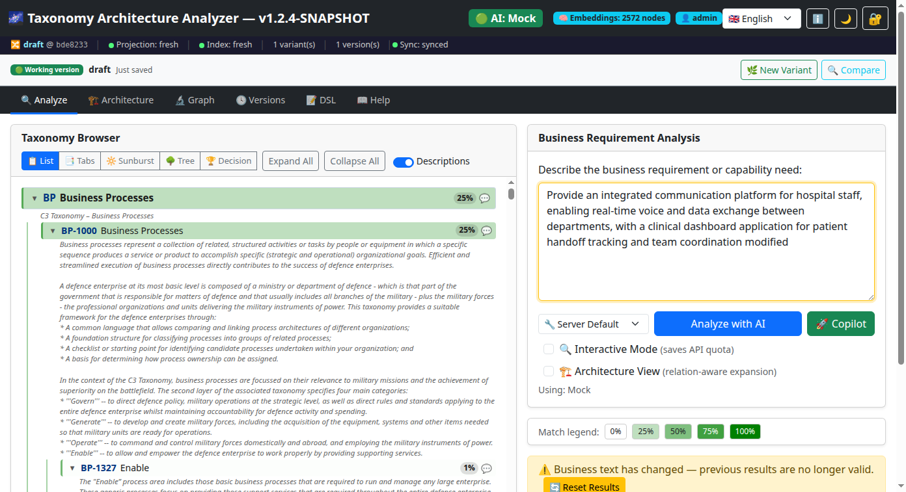

---

## 7. Architecture View — Requirement Impact Map

The Architecture View shows how the highest-scoring taxonomy nodes relate to each other through confirmed architecture relationships (stored in the knowledge base). It provides a **Requirement Impact Map** — a layered visualization of the architecture elements that are relevant to your requirement.

### Enabling the Architecture View Checkbox

Before running analysis, tick the **Architecture View** checkbox in the Business Requirement Analysis card. After analysis completes, the **Requirement Impact Map** will appear in the right panel.

### What Appears in the Impact Map

The panel shows three areas:

| Area | Contents |
|---|---|
| **Impact Summary Bar** | A compact KPI row: direct matches, affected elements, relations, layers, and change hotspots |
| **Layered Impact Map** | A swimlane visualization grouping elements by architecture layer, with edges showing relationship types between layers |
| **Detail Tables** | Collapsible tables listing all elements and relationships with full metadata (expand via the 📋 summary line) |

### Understanding the Visualization

- **Anchors** (★) are your direct hits — the nodes the AI considers the best answer to your requirement. They appear with a bold border and their score percentage.
- **Propagated elements** (↳) extend the picture: if an anchor node *realizes* a capability, that capability also appears as an element with its hop distance shown.
- **Change hotspots** (⚠️) highlight nodes that are either anchors with multiple outgoing relationships, or nodes reached from multiple different anchors — they indicate areas of high change impact.
- **Layer edges** show the relationship types (e.g., REALIZES, SUPPORTS) connecting different architecture layers.


---

## 8. Using the Graph Explorer

The Graph Explorer lets you trace the network of confirmed architecture relationships around any taxonomy node, regardless of whether you have run an analysis.

### Selecting a Node

In the **Graph Explorer Panel** (right panel, below the Architecture View Panel):

1. Type a node code in the **Node Code** field, or click the **🔎 Graph** button on any taxonomy node in the left panel to pre-fill the field.
2. Set the **Max Hops** value to control how many relationship steps to traverse (default: 2).

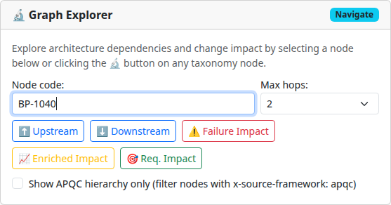

### Upstream Query — "What feeds into this?"

Click **⬆️ Upstream** to find all nodes that feed into the selected node: the nodes it depends on or that realise it. The results appear as a table listing each related node, its relation type, and a relevance indicator.

### Downstream Query — "What depends on this?"

Click **⬇️ Downstream** to find all nodes that depend on the selected node.

### Failure Impact Query — "What breaks if this fails?"

Click **⚠️ Failure Impact** to find all nodes that would be disrupted if the selected node failed or was removed. This is useful for change-impact analysis and risk assessment.

### Enriched Failure Impact — "Which requirements are affected?"

The **enriched failure impact** extends the standard failure impact analysis by correlating each affected node with its requirement coverage data. For every impacted element, you can see:

- **Which requirements** cover that element (by requirement ID)
- **How many requirements** are affected
- An aggregated **risk score** that combines the number of affected requirements with the relevance of each element

This is available via the REST API at `GET /api/graph/node/{code}/enriched-failure-impact?maxHops=3`. See the [API Reference](API_REFERENCE.md#85-enriched-failure-impact) for full details.

> **Tip:** Use enriched failure impact together with the Requirement Coverage panel (§11c) to prioritise which failures carry the highest business risk.

### Understanding the Results Table

The results are presented with a **Graph/Table toggle**:

- **🔗 Graph view** (default) — an interactive force-directed node-link diagram built with D3.js. Nodes are coloured by taxonomy category, and the origin node is highlighted with a thick border. You can drag nodes to rearrange the layout, hover for details, and click a node to select it for further queries.
- **📊 Table view** — the traditional tabular display with sortable columns.

The table/graph shows:

| Column | Meaning |
|---|---|
| Node code | The unique identifier of the related node |
| Node name | Human-readable label |
| Relation type | The type of relationship (e.g., REALIZES, DEPENDS_ON) |
| Hops | Distance from the starting node |
| Relevance | Impact score or similarity indicator |


> **Failure Impact example:** The screenshot below shows the result of a *Failure Impact* query (⚠️ button). It highlights all nodes that would be affected if the selected node failed.

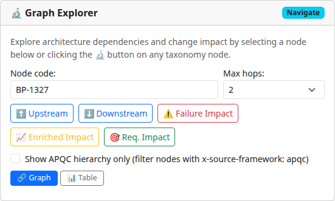

Accepted proposals also appear as graph edges. After accepting a proposal (see [Section 9](#9-working-with-relation-proposals)), the new relation is immediately visible in the Graph Explorer:

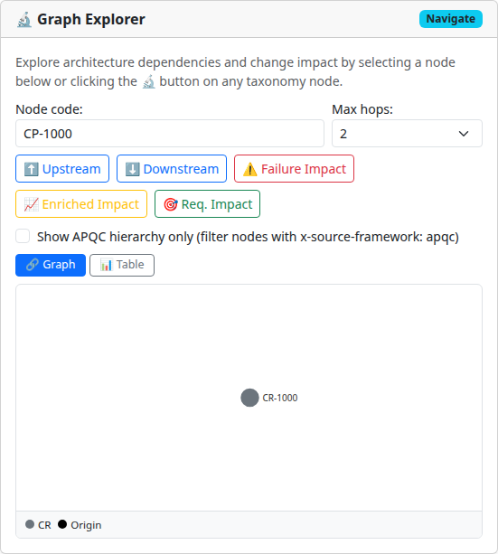

---

## 9. Working with Relation Proposals

The system can automatically propose new relations between taxonomy nodes using AI. These proposals are stored in a review queue where you can accept or reject them.

### Triggering Proposals (🔗 button on a Node)

1. Find a taxonomy node in the left panel that you believe should be related to other nodes.
2. Click the **🔗** (Propose Relations) button on that node's row.
3. The **Propose Relations Modal** opens.

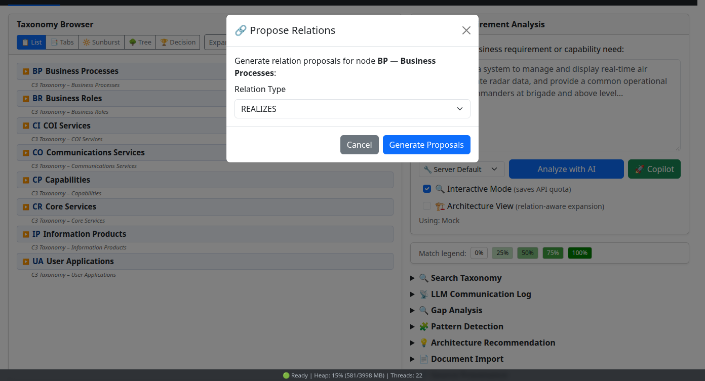

### Choosing a Relation Type

In the Propose Relations Modal:

1. Confirm or note the **Node Code** displayed at the top.
2. Use the **Relation Type** dropdown to select the type of relation you want the AI to propose (e.g., REALIZES, SUPPORTS, DEPENDS_ON).
3. Click **Generate Proposals**.
4. The system will search for candidate nodes and create PENDING proposals. Close the modal when the operation completes.

### Reviewing Proposals (Pending / All / Accepted / Rejected Filters)

Open the **Relation Proposals Panel** in the right panel. Use the filter buttons to view proposals by status:

- **Pending** — proposals awaiting your decision.
- **All** — all proposals regardless of status.
- **Accepted** — proposals you have already approved.
- **Rejected** — proposals you have declined.

The proposals table shows:
- Source node and target node (with names and codes)
- Proposed relation type
- Confidence score (0–100 %) — how confident the AI is in the proposal
- AI-generated rationale explaining why this relation was suggested

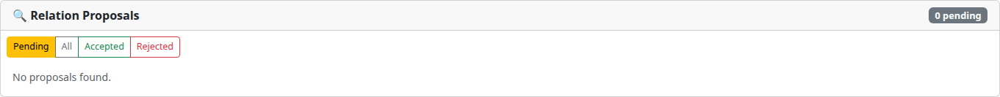

The Proposal Review Queue shows all proposals with filtering by status. Use the **Pending**, **All**, **Accepted**, and **Rejected** filter buttons to focus on specific proposal states:

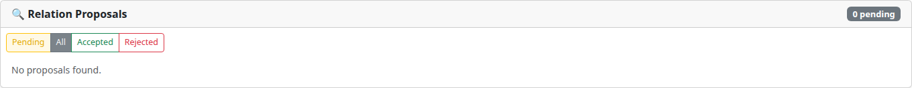

### Accepting or Rejecting a Proposal

For each row in the proposals table:

- Click **Accept** to approve the relation. A confirmed `TaxonomyRelation` is created in the knowledge base and the proposal status changes to ACCEPTED.
- Click **Reject** to decline the relation. The proposal status changes to REJECTED.

Once accepted, the proposal displays a green **Accepted** badge. The accepted relation is immediately visible in the Graph Explorer:


After each accept or reject action, an **Undo toast notification** appears in the bottom-right corner for 8 seconds. Click **↩️ Undo** to revert the proposal back to PENDING status (and, if it was accepted, delete the created relation).

### Bulk Actions

When viewing pending proposals, a **checkbox column** appears on the left and a **bulk actions bar** appears above the table:

1. Use the **Select All** checkbox in the header to toggle all proposals, or select individual rows.
2. Click **✅ Accept Selected** to accept all selected proposals at once.
3. Click **❌ Reject Selected** to reject all selected proposals at once.
4. The undo toast after a bulk action lets you revert all affected proposals in one click.

### Understanding Confidence Scores and Rationale

The **Confidence** column shows how strongly the AI believes the proposed relation is correct. A higher score means a more confident proposal. The **Rationale** column shows the AI's reasoning in plain text. Use both together to decide whether to accept or reject.

---

## 10. Exporting Results

After a successful analysis, export buttons appear at the top of the left panel. These buttons are only visible when analysis scores are present.


The Export tab provides a dedicated panel with all available export formats organised by category (diagrams, data, reports) and import options:

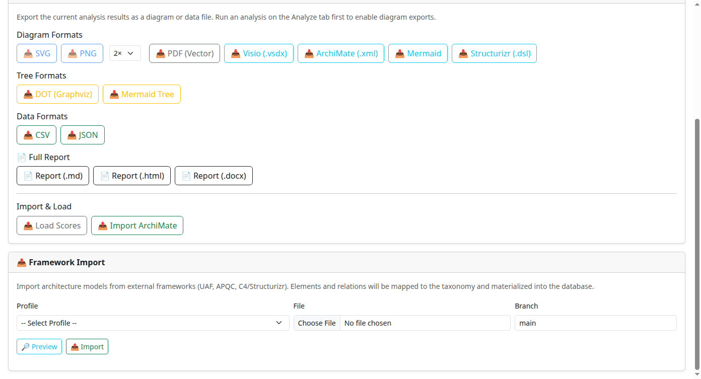

### SVG Export

Click **📥 SVG** to download the current taxonomy view as a scalable vector graphics (SVG) file. Suitable for embedding in documents or further editing in vector graphics software.

### PNG Export

Click **📥 PNG** to download a rasterised screenshot of the current taxonomy view as a PNG image.

### PDF (Print)

Click **📥 PDF** to trigger the browser's print dialogue, pre-configured to print the current view as a PDF.

### CSV (Scores)

Click **📥 CSV** to download a comma-separated file containing all node codes, names, and their analysis scores. Open in a spreadsheet application for further analysis or reporting.

### Visio (.vsdx) Architecture Diagram

Click **📥 Visio** to download a structured Microsoft Visio file (`.vsdx`) representing the Architecture View. The diagram includes the anchor nodes, related elements, and labelled relationships.

> **Requires:** The Architecture View checkbox must have been enabled before running the analysis.

### ArchiMate XML Architecture Diagram

Click **📥 ArchiMate** to download an ArchiMate 3.x XML file suitable for import into tools such as Archi or Sparx EA.

> **Requires:** The Architecture View checkbox must have been enabled before running the analysis.

### Mermaid Flowchart Export

Click **📥 Mermaid** to download the Architecture View as a Mermaid flowchart text file (`.mmd`). The generated diagram uses:

- **Subgraphs** for each taxonomy layer (Capabilities, Processes, Services, etc.)
- **Colour-coded class definitions** matching the layer colour scheme
- **Labelled edges** showing relationship types (REALIZES, SUPPORTS, etc.)
- **Anchor markers** (★) and relevance percentages

The Mermaid file can be embedded directly in GitHub READMEs, Confluence pages, and any Markdown renderer that supports Mermaid syntax. Simply paste the content inside a ` ```mermaid ` code block.

> **Requires:** The Architecture View checkbox must have been enabled before running the analysis.

### JSON Scores Export

Click **📥 JSON** (in the export group, visible after a successful analysis) to download the current analysis result as a `SavedAnalysis` JSON file. The file contains:

- The business requirement text
- All scored node codes and their scores (0–100)
- The reasons/explanations for each scored node
- The LLM provider name and a timestamp

This file can be shared with colleagues or loaded back at a later time using the **📤 Load Scores** button, without re-running the AI analysis.

> **Semantic distinction:** A score of `0` in the JSON means the node was _evaluated and found not relevant_. A node code that is _absent_ from the JSON was never evaluated.

### Loading a Saved Analysis (Import)

Click **📤 Load Scores** (always visible in the toolbar, next to the export buttons) to load a previously exported `SavedAnalysis` JSON file. After selecting the file:

1. The business requirement text is restored in the text area.
2. The taxonomy tree is rendered with the imported scores.
3. The export buttons become visible.
4. A status message confirms how many nodes were scored and reports any warnings (e.g. node codes not present in the current taxonomy version).

This enables **offline review** and **reproducibility** — you can share a scored result with a colleague who can open it without needing an API key.

> 📖 For importing architecture models from external frameworks (UAF, APQC, C4/Structurizr), see **[Framework Import](FRAMEWORK_IMPORT.md)**.

### When Export Buttons Appear

The export buttons only appear after analysis has been run and at least one taxonomy node has a score greater than 0. If you navigate away or refresh the page, scores are lost and the buttons disappear. A hint message **"📋 Analyze first to enable exports"** is shown when exports are unavailable. Re-run the analysis or use **📤 Load Scores** to restore the export buttons.

---

### 10a. Generating Reports (MD/HTML/DOCX)

The Export tab includes a **📄 Full Report** section with three buttons that generate a comprehensive architecture analysis report in different formats:


| Button | Format | Output |
|---|---|---|
| **📄 Report (.md)** | Markdown | A `.md` file viewable in any Markdown editor or repository (GitHub, GitLab) |
| **📄 Report (.html)** | HTML | A self-contained `.html` file that opens in any browser |
| **📄 Report (.docx)** | Word | A `.docx` file for Microsoft Word or LibreOffice Writer |

#### How to Generate a Report

1. Run an analysis on the **Analyze** tab (scores must be present).
2. Switch to the **Export** tab.
3. Scroll to **📄 Full Report** and click the desired format button.
4. The report is generated server-side and downloaded automatically.

#### What the Report Contains

Each report includes:

- The original **business requirement** text.
- A scored taxonomy tree showing all nodes with a score ≥ 20.
- **Architectural recommendations** derived from the analysis.
- Summary statistics (total nodes scored, top categories).

> **Note:** The report buttons only appear when analysis scores are available — the same condition as the other export buttons (see [When Export Buttons Appear](#when-export-buttons-appear)).

---

## 11. Search

The **Search Taxonomy** panel (right column, collapsible) provides four search modes to find taxonomy nodes. Open it by clicking the **🔍 Search Taxonomy** summary.

### Search Modes

| Mode | Description | Requires Embeddings? |
|---|---|---|
| **Full-text** | Lucene-based keyword search across node names and descriptions | No |
| **Semantic** | KNN vector similarity using sentence embeddings | Yes |
| **Hybrid** | Reciprocal Rank Fusion combining full-text and semantic results | Yes |
| **Graph** | Graph-semantic search including relation-aware results | Yes |

### Using the Search Panel

1. Type your query into the **search input** field.
2. Select a **search mode** from the dropdown.
3. Choose the **max results** count (10, 20, or 50).
4. Click **🔍 Search** or press Enter.
5. Results appear as a clickable list. Click any result to highlight the node in the taxonomy tree.

Screenshots of each search mode in action:

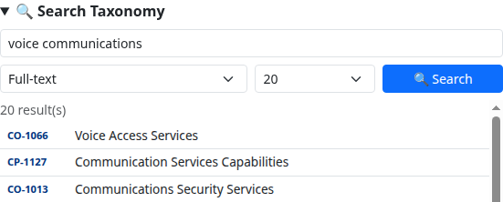

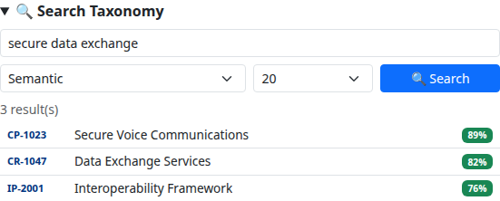

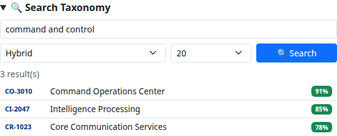

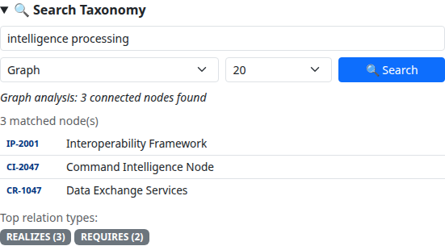

### Embedding Status

The **🧠 Embeddings** badge in the navigation bar shows whether semantic embeddings are available:

- **🧠 Embeddings: N nodes** (blue) — embeddings are loaded; Semantic, Hybrid, and Graph modes are enabled.
- **🧠 Embeddings: unavailable** (grey) — embeddings not loaded; only Full-text search is available.

When embeddings are unavailable, the Semantic, Hybrid, and Graph options are greyed out in the mode selector.

### Find Similar Nodes

Each taxonomy node row includes a **🔍 Similar** button. Clicking it opens the Search Panel and lists the 10 most semantically similar nodes (requires embeddings).

---

## 11a. Quality Dashboard

The **📊 Quality Dashboard** panel (right column, collapsible) displays metrics about relation proposal quality. Open it by clicking the summary; metrics are loaded automatically.

### Summary Metrics

| Metric | Description |
|---|---|
| **Total** | Total number of proposals generated |
| **Accepted** | Proposals accepted and converted to relations |
| **Rejected** | Proposals rejected by a reviewer |
| **Pending** | Proposals awaiting review |
| **Rate** | Acceptance rate (accepted ÷ total, as a percentage) |

### By Relation Type

A breakdown table shows how many proposals of each relation type were proposed, accepted, rejected, and the acceptance rate for that type.

### Top Rejected

The table lists the most-confident proposals that were rejected (highest confidence false positives). Hover over a row to see the rejection rationale.

Click **🔄 Refresh** to reload the dashboard at any time.

---

## 11b. Relations Browser

The **🔗 Relations Browser** panel (right column, collapsible) lets you browse, create, and delete confirmed taxonomy relations.

### Browsing Relations

1. Open the **🔗 Relations Browser** panel.
2. Optionally filter by relation type using the dropdown.
3. A table lists all matching relations showing source, target, type, and provenance.

### Creating a Relation

1. Click **➕ New Relation** to open the Create Relation modal.
2. Enter the **Source Node Code** and **Target Node Code**.
3. Select the **Relation Type**.
4. Optionally add a **Description**.
5. Click **Create**.

### Deleting a Relation

Click the **✖** button on any relation row and confirm the deletion.

### Requirement Impact Analysis

The **🎯 Req. Impact** button in the Graph Explorer panel runs a transitive impact analysis based on the current analysis scores. It shows which taxonomy elements are indirectly affected through the relation graph.

1. First, run an analysis (see [Section 4](#4-analyzing-a-business-requirement)).
2. Click **🎯 Req. Impact** in the Graph Explorer.
3. The results show impacted elements and the relationships traversed.

---

## 11c. Requirement Coverage

The **📋 Requirement Coverage** panel (right column, collapsible) tracks which taxonomy
nodes are covered by your recorded requirements, and highlights nodes that have not yet
been covered by any requirement (gap candidates).

### Opening the Panel

Click the **📋 Requirement Coverage** summary in the right column. Coverage statistics
are loaded automatically from the database.

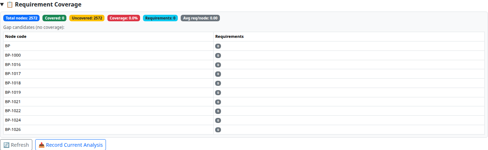

### Summary Metrics

| Metric | Description |
|---|---|
| **Total nodes** | Total number of taxonomy nodes |
| **Covered** | Nodes covered by at least one requirement |
| **Uncovered** | Nodes with no requirement coverage (gap candidates) |
| **Coverage %** | Percentage of nodes that have coverage |
| **Requirements** | Distinct requirement IDs that have been recorded |
| **Avg req/node** | Average number of requirements per covered node |

### Top Covered Nodes

A table showing the 10 nodes covered by the most requirements. Click a node code to
view the list of requirements that cover it, together with scores and analysis timestamps.

### Gap Candidates

A table showing up to 10 nodes with no requirement coverage. These are prime candidates
for architecture gaps — no existing requirement addresses these elements.

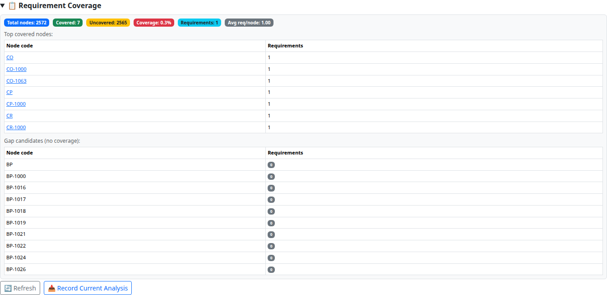

### Recording an Analysis

1. Run a requirement analysis in the main panel (enter your business text and click **Analyse**).
2. Open the **📋 Requirement Coverage** panel.
3. Click **📥 Record Current Analysis**.
4. Enter a short requirement identifier (e.g. `REQ-101`) when prompted.
5. The analysis scores are sent to the server; nodes scoring ≥ 50 are recorded as covered
   by that requirement.

Click **🔄 Refresh** to reload coverage statistics after recording new analyses.

> **Tip:** Use descriptive requirement IDs (e.g. `REQ-001-COMMS`, `SPRINT-3-SEC`) to
> build up a requirement register over time and track architecture coverage per sprint or
> release.

---

## 11d. Architecture Gap Analysis

The **Architecture Gap Analysis** identifies missing architectural relations by comparing
what *should* exist (according to the compatibility matrix) with what *actually* exists in
the knowledge base.

### What It Does

For each high-scoring node from a requirement analysis, the gap analysis checks:

1. **Expected outgoing relations** — which relation types should this node's taxonomy root have? (e.g., a Capability should `REALIZES` a Core Service)
2. **Actual relations** — which of those expected relations actually exist in the knowledge base?
3. **Missing relations** — the difference: expected minus actual.

### Using the API

Send a `POST` request to `/api/gap/analyze` with the scores from a requirement analysis:

```json
{
  "scores":       { "CP": 85, "BP": 72 },
  "businessText": "Secure voice communications",
  "minScore":     50
}
```

The response contains:

| Field | Description |
|---|---|
| **Missing relations** | Expected but absent relations (e.g., "CP has no REALIZES to any CR node") |
| **Incomplete patterns** | Relation chains with at least one missing step |
| **Coverage gaps** | Nodes with high scores but missing expected architectural neighbours |

### Interpreting Results

- **Missing relations** tell you *what links need to be created* in the knowledge base to complete the architecture.
- **Incomplete patterns** show *which chain of relations is broken* and where.
- **Coverage gaps** highlight nodes that are important for the requirement but architecturally isolated.

> **Tip:** After running a gap analysis, use the Relation Proposals feature (§9) to propose new relations that fill the identified gaps.

See the [API Reference](API_REFERENCE.md#13-architecture-gap-analysis) for full request/response documentation.

---

## 11e. Architecture Recommendation

The **Architecture Recommendation** feature combines requirement scoring, gap analysis, and semantic search into an automated pipeline that produces architecture recommendations for a business requirement.

### What It Does

The recommendation pipeline executes four steps:

1. **Confirm elements** — nodes with high scores (≥ 70) are confirmed as relevant architecture elements.
2. **Gap analysis** — identifies missing architectural links (see §11d).
3. **Candidate proposal** — for each gap, proposes candidate nodes from the missing taxonomy root, ranked by semantic similarity to the business requirement when the embedding model is available.
4. **Relation suggestion** — suggests relations that would fill the identified gaps.

### Using the API

Send a `POST` request to `/api/recommend`:

```json
{
  "scores":       { "CP": 85, "BP": 72 },
  "businessText": "Secure voice communications",
  "minScore":     50
}
```

The response contains:

| Field | Description |
|---|---|
| **Confirmed elements** | High-confidence matched nodes (score ≥ 70) |
| **Proposed elements** | AI-suggested nodes to fill gaps |
| **Suggested relations** | Relations that would complete the architecture |
| **Confidence** | Overall confidence percentage |
| **Reasoning** | Step-by-step log of the recommendation pipeline |

### Interpreting Results

- **Confidence** reflects how complete the existing architecture is for the given requirement: `confirmed / (confirmed + gaps) × 100%`.
- **Proposed elements** are suggestions — they should be reviewed by an architect before being accepted.
- **Suggested relations** can be created manually via the Relations Browser (§11b) or by accepting proposals (§9).

> **Tip:** Use the recommendation pipeline after an initial analysis to get a comprehensive view of what exists, what is missing, and what to do about it.

See the [API Reference](API_REFERENCE.md#14-architecture-recommendation) for full request/response documentation.

---

## 11f. Architecture Pattern Detection

The **Architecture Pattern Detection** feature checks whether standard architecture patterns
are present (complete or partially complete) in the relation graph.

### Pre-defined Patterns

The system checks the following architecture patterns:

| Pattern | Chain | Description |
|---|---|---|
| **Full Stack** | CP → REALIZES → CR → SUPPORTS → BP → CONSUMES → IP | A capability fully realised through services, processes, and information products |
| **App Chain** | UA → USES → CR → SUPPORTS → BP | A user application consuming services that support business processes |
| **Role Chain** | BR → ASSIGNED_TO → BP → CONSUMES → IP | A business role assigned to a process that consumes information products |

### Using the API

**For a specific node:**

```
GET /api/patterns/detect?nodeCode=CP
```

**For scored nodes from an analysis:**

```json
POST /api/patterns/detect
{
  "scores": { "CP": 85, "BP": 72 },
  "minScore": 50
}
```

### Interpreting Results

The response shows:

| Field | Description |
|---|---|
| **Matched patterns** | Patterns that are 100% complete |
| **Incomplete patterns** | Patterns where at least one step is present but some are missing |
| **Pattern coverage** | Percentage of detected patterns that are fully matched |

For each pattern, you can see:
- **Expected steps** — all the steps the pattern requires
- **Present steps** — steps that exist in the graph
- **Missing steps** — steps that are absent
- **Completeness** — percentage of steps present (0–100%)

> **Tip:** Incomplete patterns reveal specific architectural gaps. Use the missing steps
> to guide which relations to create next — either manually or via the Relation Proposals pipeline (§9).

See the [API Reference](API_REFERENCE.md#15-architecture-pattern-detection) for full request/response documentation.

---

## 11g. Architecture DSL

The **Architecture DSL** is a text-based domain-specific language for describing architecture models as versionable, diff-friendly source files. It serves as the **single source of truth** for architecture definitions — changes are committed to a Git-backed repository, can be reviewed in pull requests, and are materialized into the application database.

### Why DSL?

| Traditional approach | DSL approach |
|---|---|
| Architecture stored in database only | Architecture stored as readable text files |
| Changes are invisible until compared | Changes are visible as Git diffs |
| No review process for architecture changes | Changes can be reviewed before merging |
| Hard to reproduce past states | Full version history via Git |
| Database-dependent | Portable text format |

### DSL Format Overview

DSL documents use the `.taxdsl` format. A document consists of an optional `meta` block followed by brace-delimited blocks for elements, relations, requirements, mappings, views, and evidence. Blocks use `{` `}` delimiters and properties use `key: value;` syntax.

**Example document:**

```
meta {
  language: "taxdsl";
  version: "2.0";
  namespace: "mission.hospital-comms";
}

element CP-1023 type Capability {
  title: "Communication and Information System Capabilities";
  description: "Ability to provide communication and information systems";
  taxonomy: "Capabilities";

  x-owner: "CIS";
  x-criticality: "high";
}

element BP-1327 type Process {
  title: "Enable";
  description: "Enablement of operations";
  taxonomy: "Business Processes";
}

relation CP-1023 REALIZES BP-1327 {
  status: accepted;
  confidence: 0.83;
  provenance: "manual";
}

requirement REQ-001 {
  title: "Integrated communication platform for clinical staff";
  text: "Provide integrated communication and information services for hospital staff across all departments";
}

mapping REQ-001 -> CP-1023 {
  score: 0.92;
  source: "llm";
}

view hospital-comms-overview {
  title: "Hospital Communications Architecture Overview";
  include: CP-1023;
  include: BP-1327;
  layout: layered;
}
```

### Block Types

| Block | Header syntax | Description |
|---|---|---|
| `meta` | `meta {` | Document metadata: language, version, namespace |
| `element` | `element <ID> type <TypeName> {` | Architecture element; ID must be a valid taxonomy code from the workbook |
| `relation` | `relation <SourceID> <RelType> <TargetID> {` | Directed relation between two elements |
| `requirement` | `requirement <ID> {` | Business requirement text |
| `mapping` | `mapping <ReqID> -> <ElementID> {` | Requirement-to-element mapping with score |
| `view` | `view <ID> {` | Named subset of elements for diagram generation |
| `evidence` | `evidence <ID> {` | Supporting evidence for a relation; target specified via `for-relation` property |
| `source` | `source <ID> {` | Source artifact identity (regulation, document, etc.) |
| `sourceVersion` | `sourceVersion <ID> {` | Concrete version/snapshot of a source |
| `sourceFragment` | `sourceFragment <ID> {` | Traceable fragment within a source version |
| `requirementSourceLink` | `requirementSourceLink <ID> {` | Links a requirement to its source(s) |

### Element Types

| Type name | Taxonomy root | Description |
|---|---|---|
| `Capability` | CP | A bounded, outcome-oriented ability |
| `Process` | BP | Business process |
| `CoreService` | CR | Core service (SOA) |
| `COIService` | CI | Community of Interest service |
| `CommunicationsService` | CO | Communications infrastructure |
| `UserApplication` | UA | User-facing application |
| `InformationProduct` | IP | Structured information output |
| `BusinessRole` | BR | Organisational role |

### Relation Types

See [§15 Relation Types Reference](#15-relation-types-reference) for the full list of 10 relation types and their compatibility rules.

### Source Provenance in the DSL

Requirements can be linked to their origin using provenance blocks.  This
enables traceability from architecture decisions back to the original source
material.

#### Source Artifact

```text
source SRC-001 {
  type: "REGULATION";
  title: "Verwaltungsvorschrift Beispiel";
  canonicalIdentifier: "VV-2026-001";
  canonicalUrl: "https://example.gov/vv/2026/001";
  originSystem: "gov-portal";
  language: "de";
}
```

Supported `type` values: `BUSINESS_REQUEST`, `REGULATION`, `FIM_ENTRY`,
`UPLOADED_DOCUMENT`, `EMAIL`, `MEETING_NOTE`, `WEB_RESOURCE`, `MANUAL_ENTRY`,
`LEGACY_IMPORT`.

#### Source Version

```text
sourceVersion SRCV-001 {
  source: "SRC-001";
  versionLabel: "2026-04-01";
  retrievedAt: "2026-04-15T09:32:00Z";
  effectiveDate: "2026-04-01";
  mimeType: "application/pdf";
  contentHash: "sha256:abc123...";
}
```

#### Source Fragment

```text
sourceFragment SFR-001 {
  sourceVersion: "SRCV-001";
  sectionPath: "Kapitel 2 > Abschnitt 2.1";
  paragraphRef: "§ 4 Abs. 2";
  pageFrom: 3;
  pageTo: 3;
  text: "Die Behörde muss sicherstellen, dass ...";
  fragmentHash: "sha256:def456...";
}
```

#### Requirement Source Link

```text
requirementSourceLink RSL-001 {
  requirement: "REQ-001";
  source: "SRC-001";
  sourceVersion: "SRCV-001";
  sourceFragment: "SFR-001";
  linkType: "EXTRACTED_FROM";
  confidence: 0.91;
  note: "Automatically extracted from administrative regulation parser";
}
```

Supported `linkType` values: `IMPORTED_FROM`, `EXTRACTED_FROM`, `QUOTED_FROM`,
`DERIVED_FROM`, `CONFIRMED_BY`, `REFERENCES`.

### Extension Attributes

Any property starting with `x-` is treated as an **extension attribute**. Extensions are preserved across round-trips and are not validated — they provide a user-defined extensibility mechanism:

```
element CP-1023 type Capability {
  title: "Communication and Information System Capabilities";

  x-owner: "CIS";
  x-criticality: "high";
  x-lifecycle: "target";
}
```

### Serialization Guarantees

The DSL serializer produces **deterministic, Git-diff-friendly** output:

| Property | Guarantee |
|---|---|
| **Block ordering** | Sorted by kind (elements → relations → requirements → mappings → views → evidence), then by primary ID within each kind |
| **Property ordering** | Canonical order per block kind (e.g., title → description → taxonomy for elements) |
| **Extension ordering** | Alphabetically sorted after known properties, separated by a blank line |
| **Escape sequences** | `\"` and `\\` in quoted values for special characters |
| **Round-trip stability** | `parse → serialize → parse → serialize` always produces identical output |

These guarantees mean that **the same architecture always serializes to the same text**, regardless of the order in which elements were added. Git diffs show only actual semantic changes.

### DSL Editor Panel

The DSL Editor tab in the application provides a full-featured code editing experience powered by **CodeMirror 6**:

1. **Syntax highlighting** — DSL keywords (`element`, `relation`, `meta`, `view`), taxonomy codes, relation types, and property names are colour-coded for readability
2. **Autocompletion** — Context-aware suggestions appear as you type: block keywords, element types, relation types, and taxonomy codes
3. **Live validation** — Errors and warnings from the server-side validator are displayed inline with red/yellow markers in the gutter
4. **Load Current** — Export the current architecture state as DSL text
5. **Edit** — Modify the DSL text directly in the editor
6. **Validate** — Check the DSL for errors and warnings
7. **Format** — Reformat DSL to canonical style (Shift+Alt+F)
8. **Commit** — Save changes to the Git-backed repository with a commit message
9. **Branch management** — Create branches, cherry-pick, and merge

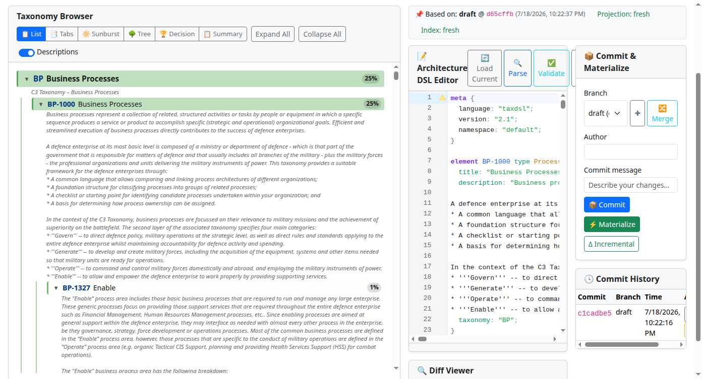

After accepting proposals, the exported DSL includes `relation` blocks alongside `element` blocks, showing the full architecture data model:

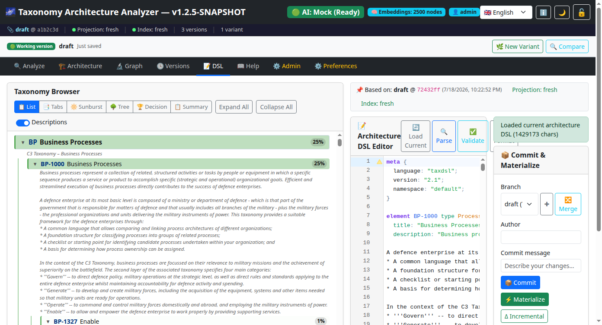

### Version Control

The DSL is stored in a **Git repository** managed entirely inside the application — no external Git server or filesystem is required. This means every change you make is tracked automatically.

You interact with version control through the GUI — there is no need to use Git commands. The key concepts:

- **Branches** — Use branches to experiment with architecture changes without affecting the main version. You can switch branches, create new ones, and merge them.
- **Commits** — Every time you save a version or commit in the DSL Editor, a snapshot is recorded. You can browse, compare, restore, or undo commits at any time.
- **Undo / Restore** — Made a mistake? Use the **Undo** button to remove the last change, or **Restore** to go back to any previous version.

For details on how to use these features step by step, see [§12 Versions Tab](#12-versions-tab) below.

> 📖 For a comprehensive guide to branching, merge previews, conflict detection, staleness tracking, and the full Git REST API, see **[Git Integration](GIT_INTEGRATION.md)**.

### Materialization

When you edit the DSL and commit changes, the architecture model in your DSL text needs to be **materialized** (applied) to the application database so that other parts of the application — the Graph Explorer, Relations Browser, and Architecture View — reflect those changes.

- **Full materialization** replaces all relations in the database with the content from the DSL.
- **Incremental materialization** applies only the differences (delta) between the current database state and the DSL, which is faster for large models.

Both options are available in the DSL Editor panel. After materializing, the Git Status Bar at the top of the page will update to show the projection is **fresh** (in sync).

### Hypotheses

When the AI analyses a business requirement, it generates **hypotheses** — provisional relations that need your review before becoming permanent:

1. The AI proposes a relation (e.g., "CP-1023 REALIZES BP-1327").
2. You review it in the **Relations** tab using the Accept / Reject buttons.
3. **Accepted** hypotheses become real architecture relations and appear in the Graph Explorer and DSL.
4. **Rejected** hypotheses are marked as rejected and excluded from future exports.

### Commit History Search

You can search through the full commit history directly in the Versions Tab. The search covers:

- **Commit messages** — Find commits by description (e.g., "review round 2").
- **Changed elements** — Find all commits that affected a specific element or relation.

See [§12 Versions Tab](#12-versions-tab) for how to use the search in the GUI.

---

## 12. Versions Tab

The **🕓 Versions** tab provides a visual interface for browsing, managing, and reverting architecture versions. Click **🕓 Versions** in the top navigation bar to open it.

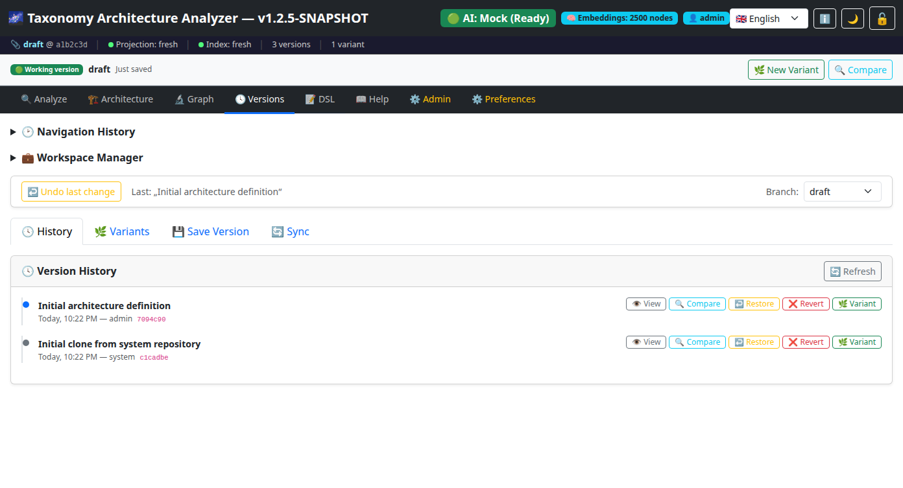

### Branch Selector

At the top-right of the Versions tab, you will see a **Branch** dropdown. This shows all available branches in the architecture repository.

- **Select a branch** to view its commit history.
- The default branch is `draft` — this is where new architecture changes are saved.
- If you have created variant branches (e.g., for experimentation), you can switch between them here.

### History Timeline

The **🕓 History** sub-tab displays a timeline of all commits on the selected branch. Each entry shows:

- **Commit message** — What was changed (e.g., "Baseline after review round 2").
- **Timestamp and author** — When and by whom the change was made.
- **Short commit ID** — A 7-character identifier for the commit (e.g., `a3f8c2d`).

Each timeline entry has four action buttons:

| Button | Action |
|---|---|
| **👁 View** | Opens a modal showing the full DSL text at that version |
| **🔍 Compare** | Shows a diff between that version and the current HEAD |
| **↩ Restore** | Replaces the current state with that version (creates a new commit) |
| **❌ Revert** | Creates a new commit that undoes the changes introduced by that specific commit |

### Undo Last Change

At the top of the Versions tab, the **↩ Undo last change** button removes the most recent commit from the branch history. This is useful when you made a mistake and want to quickly go back one step.

- The text next to the button shows the message of the last commit, so you know what you are undoing.
- A confirmation dialog appears before the undo is executed.

### Saving a Named Version

Click the **💾 Save Version** sub-tab to create a named snapshot of the current architecture state.

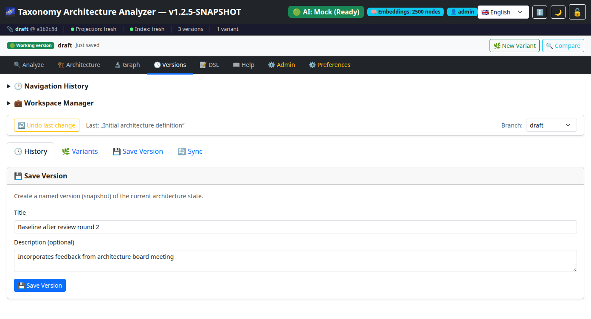

1. Enter a **Title** (required) — for example, "Baseline after review round 2".
2. Optionally add a **Description** with more detail about what changed.
3. Click **💾 Save Version**.
4. A success message with the commit ID confirms that the version was saved.

This is equivalent to making a Git commit with a descriptive message. You can later find this version in the History timeline and restore it if needed.

### Refreshing the Timeline

Click the **🔄 Refresh** button in the History card header to reload the timeline. This is useful if another user or process has made changes.

### Variants Browser

Click the **🔀 Variants** sub-tab to see all architecture variant branches. Each variant shows:

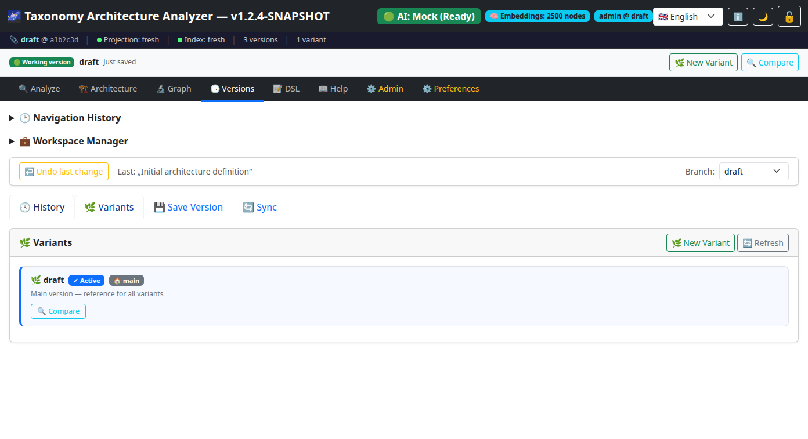

- **Branch name** — The name of the variant (e.g., `feature-voice-services`)
- **Latest commit** — The most recent change on that variant
- **Commit count** — How many commits exist on the variant

Available actions for each variant:

| Button | Action |
|---|---|
| **Switch** | Switch to that variant for editing (opens a new context) |
| **Compare** | Compare the variant with another branch (semantic diff) |
| **Merge** | Merge changes from that variant into the current branch |
| **🗑 Delete** | Delete the variant branch (protected branches `draft`, `accepted`, `main` cannot be deleted) |

To create a new variant, click **+ New Variant** in the card header. This opens a modal where you enter the variant name. The new variant is forked from the current branch.

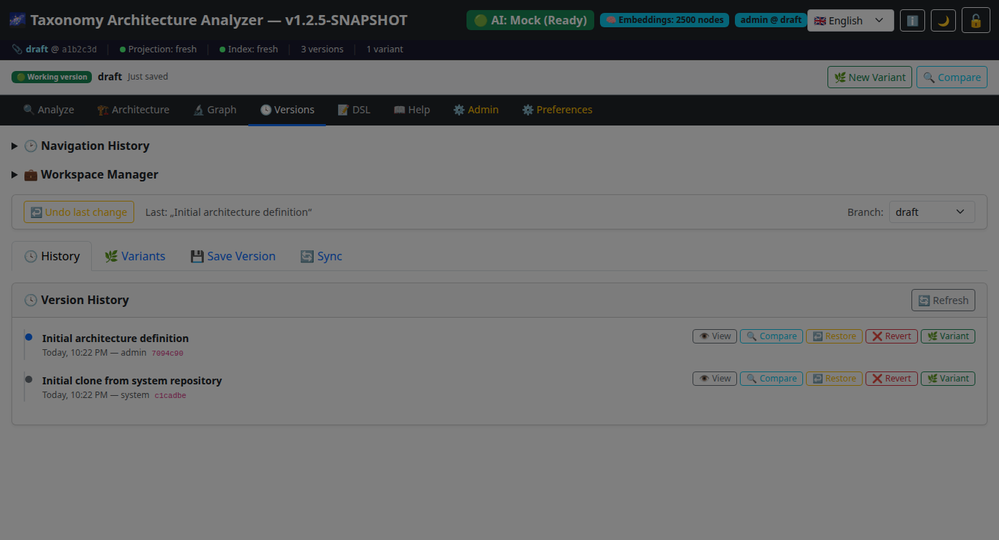

### Deleting Variants

Non-protected variant branches can be deleted using the **🗑 Delete** button. A confirmation dialog appears before deletion. Protected branches (`draft`, `accepted`, `main`) cannot be deleted — the delete button does not appear for these.

### Copy Back (Read-Only Contexts)

When viewing a variant in **READ-ONLY** mode, a **📤 Copy Back** button appears in the Context Bar. This allows you to selectively transfer elements and relations from the read-only variant back to your editable workspace — useful for cherry-picking ideas from experimental branches.

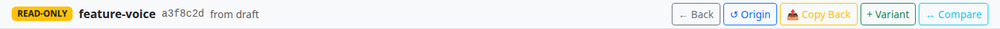

### Merge Preview

Before any merge operation is executed, a **Merge Preview Modal** is displayed. This modal shows:
- The **source** and **target** branches
- Whether the merge would be a **fast-forward** (no conflicts possible)
- Whether **conflicts** are expected
- A **Proceed** button (if merge is safe) or a message explaining the conflict

This replaces the previous browser `confirm()` dialogs with a more informative Bootstrap modal.

### Cherry-Pick Preview

Similarly, before cherry-picking a commit, a **Cherry-Pick Preview Modal** shows:
- The **commit** being cherry-picked and the **target branch**
- Whether the operation would succeed cleanly
- A **Proceed** button or conflict warning

### Resolving Merge Conflicts

When a merge or cherry-pick cannot be completed automatically (both sides modified the same DSL content), the **Merge Conflict Resolution Modal** opens. It provides:

- **Side-by-side view**: "Ours" (target branch content) and "Theirs" (source branch/commit content)
- **Quick actions**: "Use Ours" and "Use Theirs" buttons to accept one side entirely
- **Manual editing**: A textarea where you compose the final resolved content
- **Resolve & Commit**: Commits the resolved content to the target branch


Cherry-pick conflicts use the same modal with a cherry-pick-specific title:

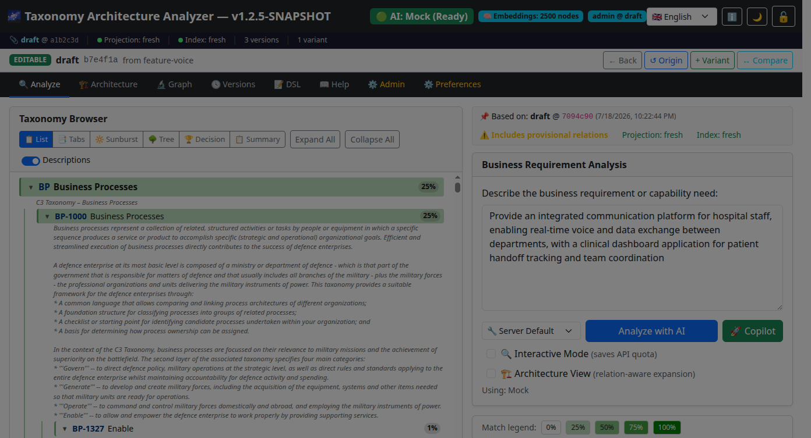

After resolution, a success toast notification confirms the operation.

### Sync with Shared Repository

Click the **🔄 Sync** sub-tab to manage synchronization between your workspace and the shared team repository:

- **Sync from Shared** — Pulls the latest changes from the shared `draft` branch into your workspace branch. This is equivalent to `git merge` from the shared branch.
- **Publish to Shared** — Pushes your workspace changes to the shared branch. This is equivalent to `git merge` into the shared branch.

The sync state panel shows:
- **Sync status** — `UP_TO_DATE` (in sync), `BEHIND` (shared has newer changes), `AHEAD` (you have unpublished changes), or `DIVERGED` (both have changed)
- **Unpublished commit count** — Number of your commits not yet published to shared
- **Last sync/publish timestamps** — When you last synced or published

### Resolving Diverged State

When the sync status shows **DIVERGED**, a **Resolve…** button appears next to the status badge. Clicking it opens the **Sync Diverged Resolution Modal** with three strategies:

| Strategy | Description |
|---|---|
| **🔀 Merge** | Attempt to merge shared changes into your branch. May fail if conflicts exist. |
| **📤 Keep Mine** | Publish your version to shared, overwriting shared changes. |
| **📥 Take Shared** | Replace your branch with the shared version, discarding your changes. |

### Operation Result Notifications

All Git operations (merge, cherry-pick, publish, sync, branch delete) produce a **toast notification** in the bottom-right corner of the screen:
- **✅ Green** — Operation succeeded, with a summary message
- **❌ Red** — Operation failed, with error details
- **⚠️ Yellow** — Warning (e.g., conflict detected)

The toast automatically disappears after 5 seconds.

### Workspace User Badge

In the navbar (top-right), the **workspace badge** shows your username and current branch. The badge colour changes to indicate state:

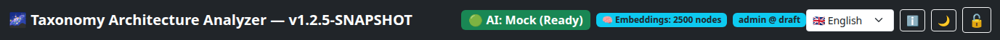

- **Blue** — Normal, workspace is clean
- **Yellow** — Workspace has unsaved/unpublished changes (dirty state)

---

## 13. Git Status and Context Bar

Two horizontal bars at the top of the page provide at-a-glance information about the current architecture state.

### Git Status Bar

The **Git Status Bar** appears just below the navigation bar. It displays:

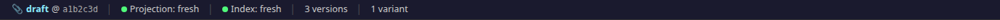

| Indicator | Meaning |
|---|---|
| **🔀 Branch name** | The currently active branch (e.g., `draft`) |
| **Commit SHA** | The short ID of the latest commit (e.g., `a3f8c2d`) |
| **Projection: fresh / STALE** | Whether the database relations match the latest Git commit. A green dot means **fresh** (in sync); a red dot means **STALE** (you need to materialize). |
| **Index: fresh / STALE** | Whether the search index matches the latest Git commit |
| **N variants** | How many branches exist |
| **N versions** | Total number of commits on the current branch |
| **Sync: status** | Synchronisation state with the shared repository (synced / behind / ahead / diverged) |

When the projection shows **STALE**, it means the DSL has been changed but not yet materialized into the database. Go to the DSL Editor and click **Materialize** to bring the database up to date.

### Context Navigation Bar

The **Context Bar** appears below the Git Status Bar when you are navigating between different architecture contexts (e.g., viewing a historical version, exploring a variant branch, or comparing branches).

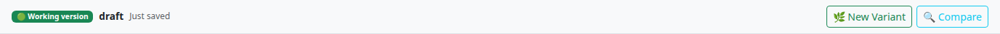

The Context Bar shows:

- **Mode badge** — `EDITABLE` (green), `READ-ONLY` (yellow), or `TEMPORARY` (grey)
- **Branch name** and **commit ID** — Which version you are currently viewing
- **Origin indicator** — If you navigated from another context, shows where you came from

Navigation buttons in the Context Bar:

| Button | Action |
|---|---|
| **← Back** | Go back to the previous context (like browser back, but for architecture versions) |
| **↺ Origin** | Jump directly back to where you started navigating |
| **📤 Copy Back** | Copy elements from a read-only context back to your editable workspace (only shown in READ-ONLY mode) |
| **+ Variant** | Create a new branch from the current context |
| **↔ Compare** | Open a comparison dialog to diff two branches or commits |

---

## 14. Administration

Administration features are hidden behind a password-protected admin mode. A standard user does not need to access these features.

> 📖 For a comprehensive guide to all AI providers, per-request provider override, mock mode, diagnostics API, and rate limiting, see **[AI Providers](AI_PROVIDERS.md)**.
> For runtime preference management (LLM settings, DSL config, size limits), see **[Preferences](PREFERENCES.md)**.

### AI Status Indicator (🟢 / 🔴 in Navbar)

The badge in the navigation bar shows whether an LLM provider is connected:

| Badge | State | Meaning |
|---|---|---|
| 🟢 **AI: [Provider Name]** | Available (green) | AI analysis and justification features are active. The badge shows the active provider (e.g. "Google Gemini"). |
| 🔴 **AI: Unavailable** | Unavailable (red) | No LLM API key is configured. The **Analyze with AI** button is disabled. An inline warning below the button explains which environment variables to set. |
| ⚠️ **AI: Unknown** | Error (yellow) | The status check failed (network error or server starting up). The badge refreshes automatically every 30 seconds. |

If you see a red badge, either:
- Set one of the LLM API keys (`GEMINI_API_KEY`, `OPENAI_API_KEY`, etc.) and restart the application, or
- Set `LLM_PROVIDER=LOCAL_ONNX` for offline analysis without any API key.

When AI is unavailable, an **inline warning message** appears below the Analyze button listing the required environment variables.

### Unlocking Admin Mode (🔒 button → Password Modal)

1. Click the **🔒** button in the navigation bar.
2. The **Admin Mode Modal** opens with a password input field.
3. Enter the administrator password.
4. Click **Unlock**.
5. The padlock icon changes to indicate admin mode is active, and the admin-only panels become visible in the right panel.

To lock admin mode again, click the lock button and choose **Lock**.

### LLM Communication Log

Once admin mode is unlocked, the **LLM Communication Log** panel is visible in the right panel. It records the full prompt sent to the LLM and the raw response received for each analysis operation. Expand the panel to view the log entries. This is useful for debugging unexpected scoring results.

### LLM Diagnostics Panel

The **LLM Diagnostics Panel** (admin only, collapsible) shows statistics about LLM usage:

- Provider name and model version
- Total number of API calls
- Error count and error rate
- Average response latency

Click **Refresh** to update the statistics. Click **Test Connection** to send a test request to the LLM provider and confirm it is responding correctly.

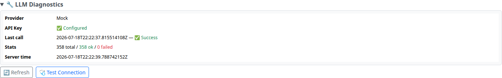

### Prompt Template Editor

The **Prompt Templates Editor** (admin only, collapsible) allows you to customise the instructions sent to the LLM without redeploying the application.

1. Use the **taxonomy selector** dropdown to choose the prompt template you want to edit.
2. The current template text appears in the **template textarea**.
3. Edit the text as needed.
4. Click **Save** to save your changes, or **Reset** to restore the built-in default.

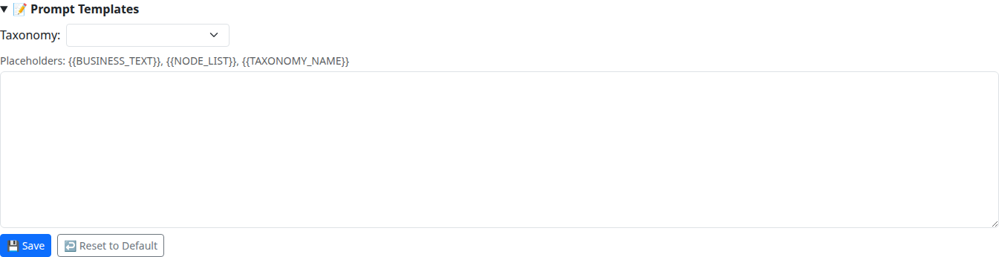

---

## 15. Relation Types Reference

The system uses 10 relation types, each corresponding to a specific relationship in the NATO Architecture Framework (NAF) or The Open Group Architecture Framework (TOGAF).

| Relation Type | Plain-Language Meaning | Standard |
|---|---|---|
| **REALIZES** | A capability is made real by a service | NAF NCV-2, TOGAF SBB |
| **SUPPORTS** | A service supports a business process | TOGAF Business Architecture |
| **CONSUMES** | A business process consumes an information product | TOGAF Data Architecture |
| **USES** | A user application uses a core service | NAF NSV-1 |
| **FULFILLS** | A COI service fulfills a capability | NAF NCV-5 |
| **ASSIGNED_TO** | A business role is assigned to a business process | TOGAF Org mapping |
| **DEPENDS_ON** | One service depends on another service to function | Technical dependency |
| **PRODUCES** | A business process produces an information product | Data flow |
| **COMMUNICATES_WITH** | A communications service communicates with a core service | NAF NSOV |
| **RELATED_TO** | A general relationship when no specific type applies | Generic fallback |

---

## 15a. Document Import & Source Provenance

### Import Modes

The Document Import panel offers three modes:

| Mode | Icon | Best For | Uses AI? |
|------|------|----------|----------|
| **Extract Candidates** | 📝 | Quick paragraph extraction | ❌ Rule-based |
| **AI-Assisted Extraction** | 🤖 | Intelligent requirement detection | ✅ LLM |
| **Direct Architecture Mapping** | 🏛️ | Known regulations → architecture | ✅ LLM |

### Importing Documents

You can import requirements directly from PDF or DOCX documents:

1. In the **Analyze** tab, expand the **📄 Document Import** panel
2. Select an import mode using the radio buttons
3. Select a PDF or DOCX file (e.g. an administrative regulation)
4. Optionally set a title and source type
5. Click **📄 Upload & Extract** to process the document

#### Extract Candidates (Default)

Rule-based paragraph splitting. Fast, no API cost.
Best for exploring unfamiliar documents.

#### AI-Assisted Extraction

Uses a specialized LLM prompt to identify actual requirements.
Filters out boilerplate, headers, and non-requirement content.
Best when you want cleaner, fewer, more precise candidates.

#### Direct Architecture Mapping

Sends the regulation directly to the LLM along with the taxonomy.
Returns architecture node matches with confidence and paragraph references.
Best for well-known regulations where you want immediate architecture impact.

### Reviewing Extracted Candidates

After upload, the system shows extracted requirement candidates:

- Review each candidate paragraph
- Use **Select All** / **Deselect All** for batch operations
- Deselect irrelevant content (headers, footers, table of contents)
- Click **🔍 Analyze Selected** to transfer candidates to the analysis workflow

### Source Provenance

Every requirement tracks where it came from.  After importing a document, the
**🔗 Source Provenance** panel shows:

- Source document name and type
- Unique artifact identifier
- Number of candidates selected

For full details, see the [Document Import guide](DOCUMENT_IMPORT.md).

---

## 16. Tips and Best Practices

### Writing Effective Requirements

- **Be specific:** Instead of *"communications"*, write *"integrated communication services for hospital staff enabling real-time data exchange between departments"*.
- **Use domain vocabulary:** Terms like *capability*, *service*, *information product*, *command*, *control* help the AI find better matches.
- **One requirement at a time:** Analyze one requirement per session for cleaner, more focused results.
- **Keep it concise:** Aim for 1–3 sentences. Very long paragraphs do not improve accuracy.

### Interpreting Results

- Focus on nodes with scores above 50 % as your primary matches.
- Nodes scoring 25–50 % are secondary matches — they may be relevant but less directly.
- Nodes below 25 % can usually be ignored unless you have domain knowledge suggesting otherwise.
- Use **Leaf Justification** (📋) to understand *why* a specific node scored highly before including it in your architecture.

### Working with Proposals

- Run proposals soon after analysis while the context is fresh.
- Review the AI rationale before accepting; high confidence does not always mean correct.
- Reject proposals where the rationale does not make architectural sense, even if the confidence score is high.
- Accepted proposals become confirmed relations in the knowledge base and affect future Graph Explorer results.

### Exporting

- Use **CSV** to share scores with colleagues who do not have access to the application.
- Use **JSON** to save a complete snapshot of the analysis result (scores + reasons + requirement text) that can be loaded back later with **📤 Load Scores**.
- Use **Visio** or **ArchiMate** export to integrate results into your enterprise architecture tooling.
- Always enable the **Architecture View** checkbox before analysis if you intend to export Visio or ArchiMate files.

---

## 17. Glossary

| Term | Definition |
|---|---|
| **Anchor node** | A high-scoring leaf node that directly satisfies a business requirement; the starting point for the Architecture View |
| **Architecture DSL** | A text-based domain-specific language (`.taxdsl` format) for describing architecture models as versionable, diff-friendly source files |
| **Architecture gap** | An expected relation (per the compatibility matrix) that is absent from the knowledge base |
| **Architecture pattern** | A predefined chain of relation types through the taxonomy (e.g. Full Stack, App Chain, Role Chain) |
| **Architecture recommendation** | An automated proposal combining confirmed elements, gap analysis, and candidate suggestions for a business requirement |
| **Architecture View** | A filtered subgraph of the taxonomy showing only the elements and relationships relevant to a given requirement |
| **ArchiMate** | An open standard modelling language for enterprise architecture, maintained by The Open Group |
| **C3** | Command, Control and Communications — the NATO functional area covered by this taxonomy |
| **Capability** | A bounded, outcome-oriented ability of an organisation or system (NAF, TOGAF) |
| **COI** | Community of Interest — a group that shares information under a common governance framework |
| **Compatibility matrix** | A rule set defining which relation types are valid between taxonomy root pairs |
| **Confidence score** | A 0–100 % value indicating how strongly the AI believes a proposed relation is correct |
| **Coverage gap** | A node that has requirement coverage but lacks expected architectural neighbours |
| **Enriched failure impact** | Failure impact analysis that includes requirement coverage data and risk scoring |
| **Graph Explorer** | The right-panel tool for running upstream, downstream, and failure-impact queries on the relation graph |
| **Hybrid search** | A retrieval strategy combining full-text and semantic search rankings (available via API) |
| **Hypothesis** | A provisional relation generated during LLM analysis, awaiting human review before becoming permanent |
| **Information Product** | A specific, structured output of a business process (TOGAF Data Architecture) |
| **Interactive Mode** | An analysis mode that scores one tree level at a time instead of the whole tree at once |
| **Leaf node** | A taxonomy node with no children; the most specific level of the taxonomy |
| **LLM** | Large Language Model — the AI component used for scoring, justification, and proposal generation |
| **Materialization** | The process of converting DSL text into database entities (TaxonomyRelation, etc.) |
| **Match Legend** | The colour scale on the right panel showing what each shade of green corresponds to in terms of score |
| **NAF** | NATO Architecture Framework — the standard for describing NATO architectures |
| **Pattern detection** | Checking whether predefined architecture patterns are complete or partially present in the relation graph |
| **Projection** | A per-user materialized snapshot of the DSL model; becomes "stale" when HEAD advances beyond the snapshot commit |
| **Proposal** | An AI-generated candidate relation awaiting human review in the Relation Proposals panel |
| **Publish** | Merge your workspace branch into the shared integration branch, making your changes available to the team |
| **Relation** | A confirmed, directed link between two taxonomy nodes stored in the knowledge base |
| **Risk score** | An aggregated metric combining requirement count and relevance for failure-impact analysis |
| **Shared branch** | The canonical team-wide branch (called `draft` by default) that all users synchronize with |
| **Stale results** | Analysis scores that no longer correspond to the current requirement text (shown with a yellow warning) |
| **Sync** | Pull the latest changes from the shared branch into your workspace branch; the opposite of "Publish" |
| **Taxonomy node** | A single element in the C3 Taxonomy Catalogue (capability, service, role, information product, etc.) |
| **TOGAF** | The Open Group Architecture Framework — a widely used enterprise-architecture methodology |
| **Variant** | A named branch in the version-controlled DSL repository, used to explore alternative architecture designs without affecting the shared branch |
| **Workspace** | An isolated editing environment for each user, providing independent context navigation, projection tracking, and branch-level isolation |

---

## 18. Troubleshooting

### The "Analyze with AI" button is disabled or greyed out

**Cause:** No LLM provider is configured or available. The AI Status badge in the navigation bar will be 🔴 red.

**Action:** Contact your administrator to verify the LLM provider configuration (`GEMINI_API_KEY`, `OPENAI_API_KEY`, or `LLM_PROVIDER=LOCAL_ONNX`).

### Analysis runs but all scores are 0 %

**Cause:** The requirement text may not match any taxonomy nodes, or there may be a problem with the LLM response.

**Action:**
1. Check the **Analysis Log** (right panel, collapsible) for error messages.
2. Try rephrasing the requirement using more specific C3 domain terminology.
3. If admin mode is available, check the **LLM Communication Log** to see what the LLM returned.

### Export buttons are not visible

**Cause:** Export buttons only appear after a completed analysis with non-zero scores.

**Action:** Run an analysis first, or use **📤 Load Scores** to import a previously saved JSON analysis file. If scores are present but buttons are still missing, try refreshing the page and re-running the analysis.

### The Visio or ArchiMate export file is empty or has no elements

**Cause:** The **Architecture View** checkbox was not enabled before running the analysis.

**Action:** Re-run the analysis with the **Architecture View** checkbox ticked.

### The taxonomy tree is not loading

**Cause:** The application server may be unavailable, or a network error occurred.

**Action:**
1. Refresh the browser page.
2. Check the browser console (F12) for error messages.
3. Verify the application URL is correct.
4. Contact your administrator if the problem persists.

### Scores from a previous analysis are still showing after I changed my requirement

**Cause:** Scores are not automatically cleared when you edit the requirement text.

**Action:** Click **Analyze with AI** again after editing your requirement to get fresh scores. The stale-results warning (yellow border) reminds you when displayed scores may be out of date.

### I cannot see the admin panels (LLM Diagnostics, Prompt Editor, etc.)

**Cause:** Admin mode is not unlocked.

**Action:** Click the **🔒** button in the navigation bar and enter the administrator password. If you do not know the password, contact your administrator.
