# Taxonomy Architecture Analyzer — User Guide

This guide follows browser tasks from an initial requirement to reviewed decisions and versioned results. Detailed API syntax, deployment settings and model contracts live in the linked specialist references; an API capability does not imply a corresponding GUI button.

## Fastest Path — Your First Analysis in 5 Steps

| Step | Action | Where |
|---|---|---|
| 1 | Sign in with your assigned account. | Your application login page |
| 2 | Enter a requirement and its important conditions. | Business Requirement Analysis |
| 3 | Select scope and start the supported analysis. | Analysis or Copilot controls |
| 4 | Inspect results, reasons, progress and unresolved work. | Taxonomy and architecture views |
| 5 | Save/review the intended result and export it within its support boundary. | Projects, workbench or the corresponding export action |

There is no reusable default password. Initial local-administrator bootstrap is a separate operator task; Keycloak/OIDC follows its own setup. See [Security](SECURITY.md).

The existing screenshots below illustrate product surfaces; retaining them is not a claim that new screenshots or a fresh end-to-end browser acceptance were produced for this documentation change. Role, language, viewport and selected mode affect visible controls.

## Table of Contents
- [1. Overview](#guide-section-1)
- [2. Getting Started](#guide-section-2)
- [3. Understanding the Interface](#guide-section-3)
- [4. Analyzing a Business Requirement](#guide-section-4)
- [5. Exploring the Taxonomy](#guide-section-5)
- [6. Working with Analysis Results](#guide-section-6)
- [7. Architecture View — Requirement Impact Map](#guide-section-7)
- [8. Using the Graph Explorer](#guide-section-8)
- [9. Working with Relation Proposals](#guide-section-9)
- [10. Exporting Results](#guide-section-10)
- [11. Search](#guide-section-11)
- [11a. Quality Dashboard](#guide-section-12)
- [11b. Relations Browser](#guide-section-13)
- [11c. Requirement Coverage](#guide-section-14)
- [11d. Architecture Gap Analysis](#guide-section-15)
- [11e. Architecture Recommendation](#guide-section-16)
- [11f. Architecture Pattern Detection](#guide-section-17)
- [11g. Architecture DSL](#guide-section-18)
- [12. Versions Tab](#guide-section-19)
- [13. Git Status and Context Bar](#guide-section-20)
- [14. Administration](#guide-section-21)
- [15. Relation Types Reference](#guide-section-22)
- [15a. Document Import & Source Provenance](#guide-section-23)
- [16. Tips and Best Practices](#guide-section-24)
- [17. Glossary](#guide-section-25)
- [18. Troubleshooting](#guide-section-26)
- [Saved reformulation offers and decision questions](#guide-section-27)

## 1. Overview

Taxonomy supports architects, analysts and requirements engineers in public administration and enterprises. It connects natural-language requirements with a hierarchical catalogue, architecture proposals, evidence-linked questions and explicitly accepted changes. Catalogue references are not automatically concrete installed systems; relevance is not proof of necessity or availability.

**The complete clarification loop:** select a saved requirement version and analysis snapshot; create a separate wording proposal; review the architecture context and answer or defer questions; inspect and explicitly confirm adoption as a requirement draft; request another analysis separately. Earlier source material, answers and snapshots remain distinguishable. The model neither answers for you nor approves the architecture.

**Illustrative example, not a recorded model result:** mobile time capture may need decisions about offline use and correction rights. The value is the connection between a question, its architectural reason and your recorded decision, not a guarantee that every model will discover these particular questions.

Use the [portfolio walkthrough](PROJECT_REQUIREMENT_PORTFOLIO.md) for that saved workflow and the [architecture editor](ARCHITECTURE_EDITOR.md) for reviewed model changes. Start with analysis and viewing; continue into decisions, versions and export when the task requires them.

Existing interface illustrations

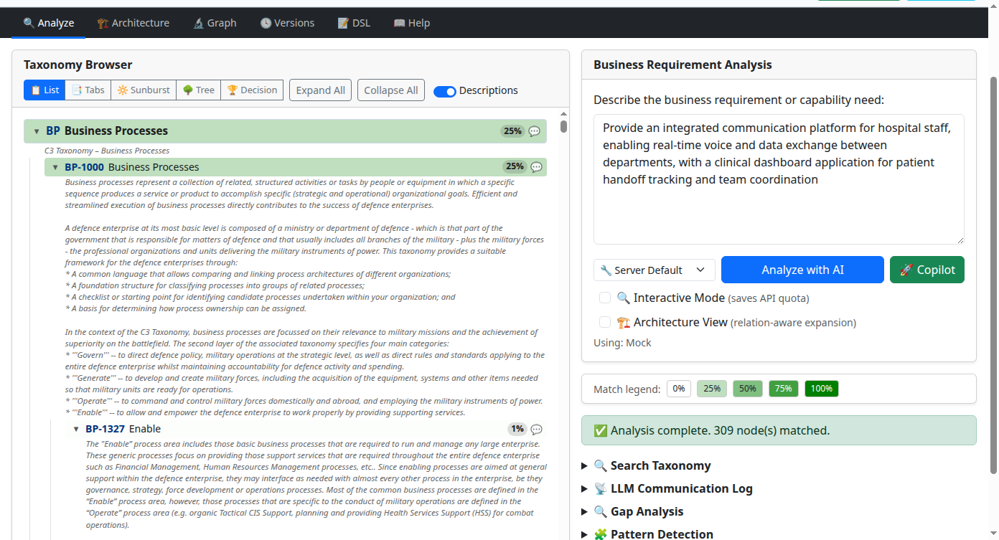

## 2. Getting Started

Open the application address supplied by your operator and sign in with your assigned account. Do not share an administrator account for ordinary work. Initial local administration uses the configured password or an owner-only one-time bootstrap file; there is no reusable default password. Keycloak/OIDC uses a separate identity-provider setup. See [Security](SECURITY.md) and [Keycloak setup](KEYCLOAK_SETUP.md).

The welcome overlay introduces requirement entry, analysis and results. Dismissing it does not create a project, approve a model or save an analysis. The AI status indicator reports provider availability, not the correctness or completeness of a result. Browsing and deterministic operations can remain usable without a generative provider. Local ONNX supports embeddings/search/scoring, not generative relation assessment or wording synthesis.

Existing interface illustrations

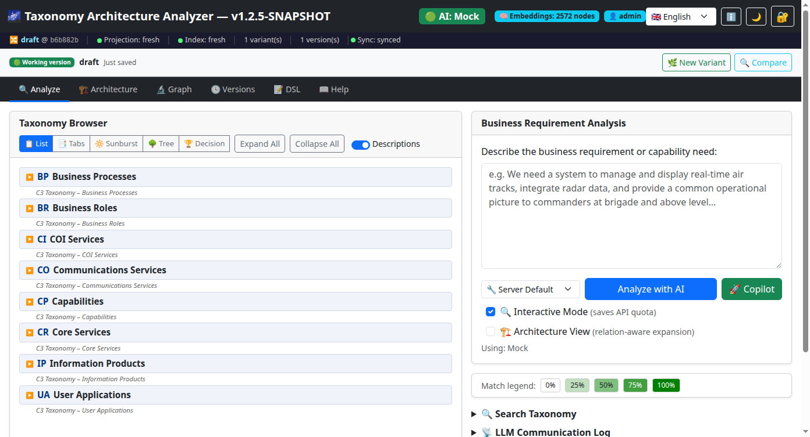

## 3. Understanding the Interface

The analysis surface combines a taxonomy tree with requirement entry and result tools. The view switcher offers List, Tabs, Sunburst, Tree, Decision and Summary views. Expand/collapse and description controls change the presentation, not the underlying requirement or its scores. Search or focus can reach elements outside the displayed graph viewport.

Use the analysis log for current work and warnings, the architecture view for selected elements and typed relationships, and Graph Explorer for dependency queries. Projects provide saved requirements and snapshots. Versions and the architecture editor have their own working context: check repository, workspace, branch and revision before editing. Administration and Preferences require the corresponding role; showing or hiding a panel is not authorization.

Dark mode and interface language are presentation settings. They do not establish equivalent model quality across languages. Do not infer a new analysis from changing a view or a preference. [Concepts](CONCEPTS.md) explains the different states; [Accessibility](ACCESSIBILITY.md) records tested interactions and remaining limitations.

Existing interface illustrations

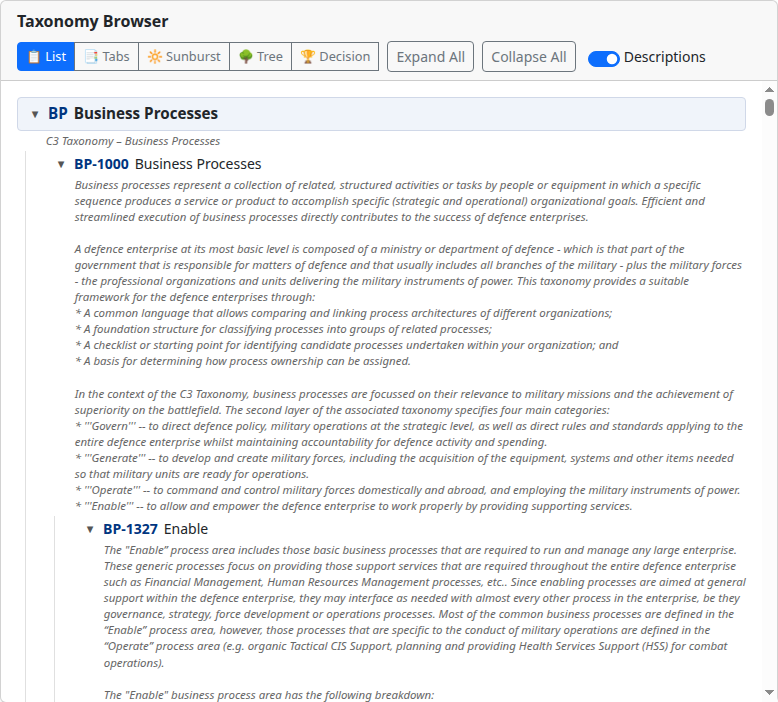

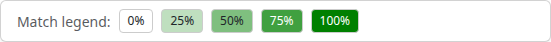

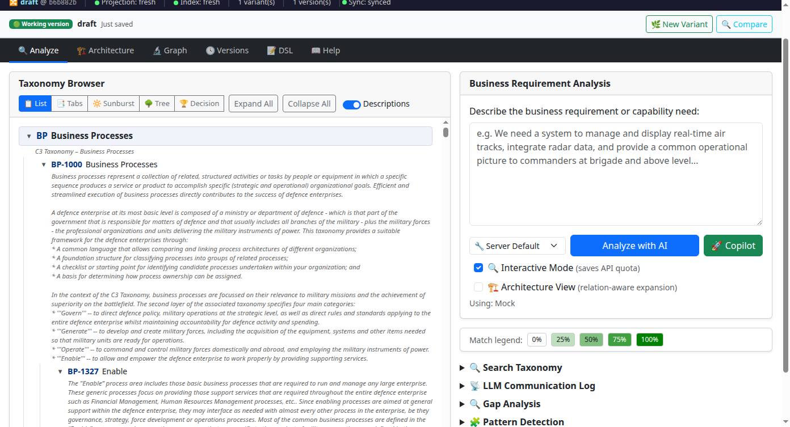

## 4. Analyzing a Business Requirement

Enter a requirement in its own terms, including the intended outcome and important conditions. Do not silently omit negations, optional features, constraints or dates merely to get shorter prompts. Use separate saved requirement objects for independently managed needs; multiple users or jobs do not require sharing one analysis context.

Before automatic analysis or Copilot, select the taxonomy roots and choose full analysis or **Taxonomies only**. Selected roots bound scoring and relation sources. In full mode, compatible relation targets in other taxonomies remain reachable. Taxonomies-only mode skips relation discovery and relation-dependent architecture derivation; it is not a completed full architecture analysis. An empty browser selection is invalid.

Start the analysis and inspect current work, not just the percentage. Direct assessments, descendants excluded by a valid zero assessment, open nodes and unselected nodes have different meanings. Failed answers do not complete work. Limits can leave a partial result even when useful evidence already exists. The frozen scope belongs to the result; later control changes concern the next run.

Interactive mode evaluates one level at a time through **Analyze Node**. Its individual assessments are distinct from a complete automatic run. The Architecture View option controls the corresponding derivation where supported; it does not replace relation evaluation.

For a paused or failed supported run, use **Retry**, **Continue** or **Cancel** according to the offered action and inspect what remains unresolved. Compatible continuation reuses validated evidence rather than treating every earlier call as new work. Skipping an unanswered query does not assert a negative finding. Save a working draft before leaving or starting over where that action is offered; a draft, an analysis snapshot and a Git checkpoint are different records. [Copilot and Autopilot](COPILOT_AUTOPILOT.md) explains persisted jobs and recovery; [multi-user analysis](MULTIUSER_ANALYSIS.md) explains admission and queue limits.

For an HTTP 429 quota response, wait the number of seconds given by the `Retry-After` response header before retrying; do not assume a fixed delay. The incoming LLM quota is counted per stable authenticated identity and application instance, separately from the model provider's quota and authentication/WebDAV brute-force lockouts. For authentication errors, ask the administrator to check configuration without sharing keys. For malformed responses or timeouts, retain the diagnosis and completed evidence; do not interpret fallback zeros as genuine model decisions. Completion means completion of the configured work plan, not that every possible relationship has been found.

Existing interface illustrations

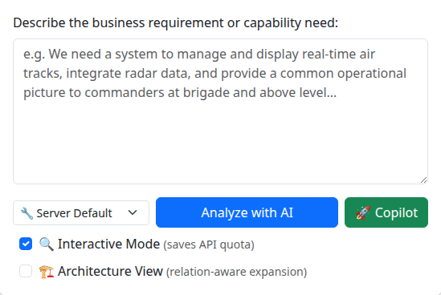

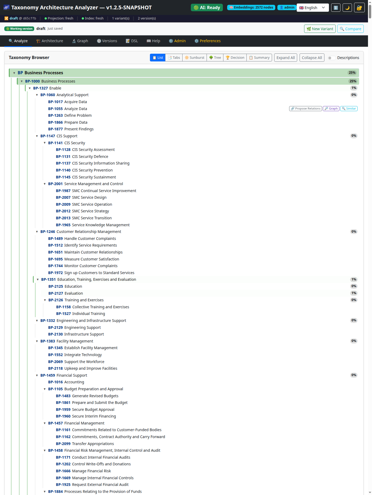

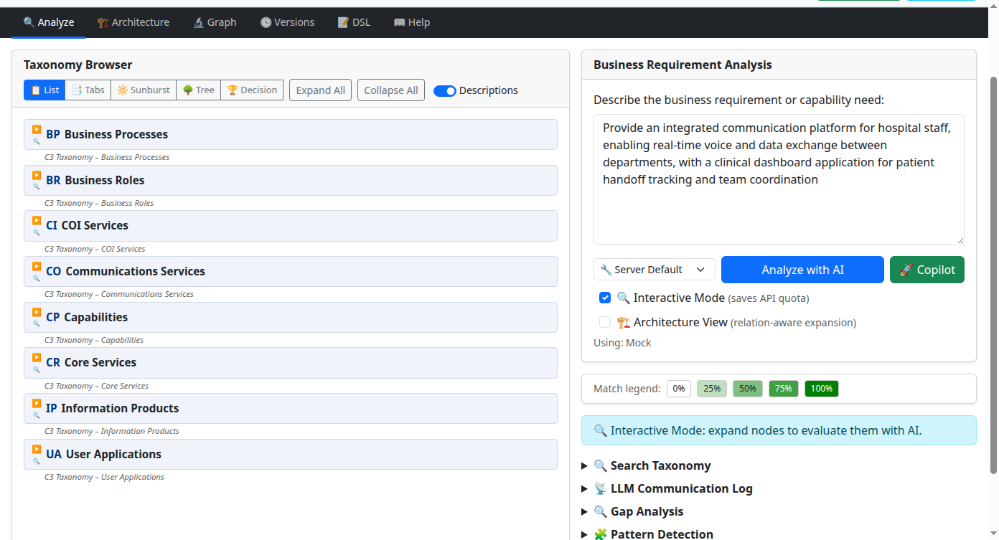

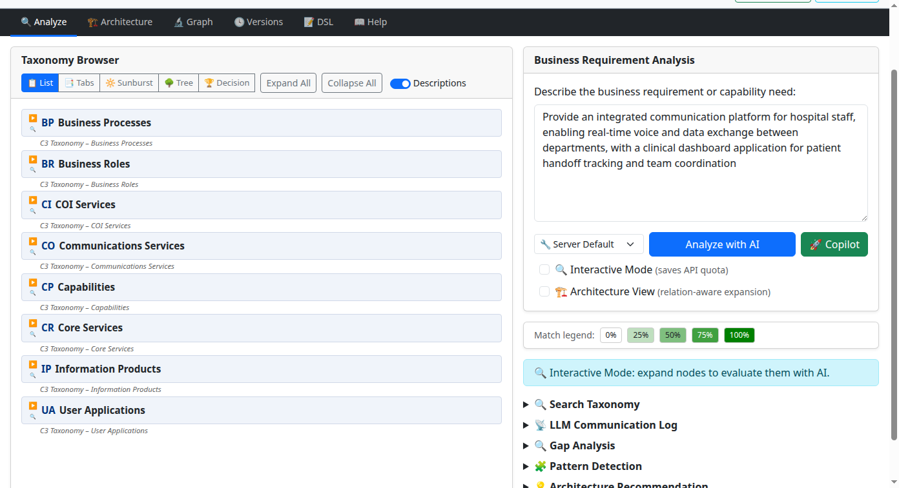

## 5. Exploring the Taxonomy

Use **List** for an indented catalogue and element actions; **Tabs** groups top-level roots. Expand/collapse applies where hierarchical expansion is supported, and descriptions provide context for similar-looking names. **Sunburst** gives a radial view with hover details and subtree zoom; hiding zero-relevance entries is a display filter, not a new assessment. **Tree** shows parent/child navigation with a root selector.

**Decision** presents scored decisions; an empty-state prompt before analysis is not missing catalogue data. **Summary** groups the derived architecture by capabilities, processes/roles, services, applications, information and communications. Selecting a summary element leads back to its catalogue context. Availability depends on the existing result and derivation mode.

View switches preserve the current result. A node absent from a filtered view may still exist in the catalogue. A displayed zero, an excluded descendant and an unvisited node must be read with status and provenance. Local navigation groups are not automatically official concepts or valid architecture endpoints; see [Grouping and scoring](TAXONOMY_SCORING.md).

Existing interface illustrations

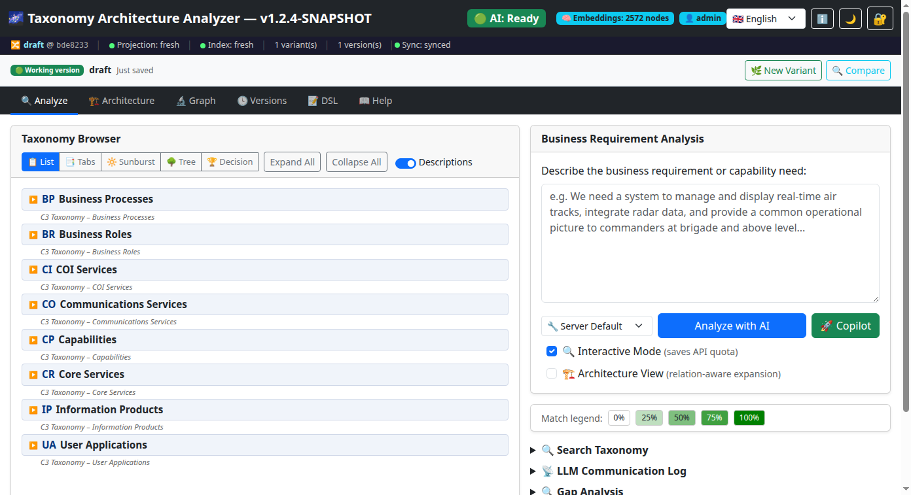

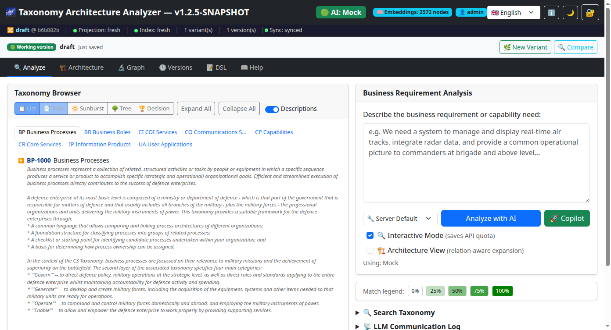

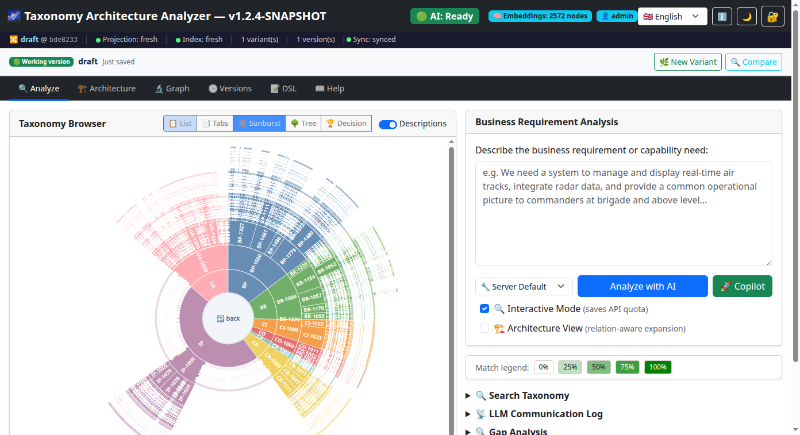

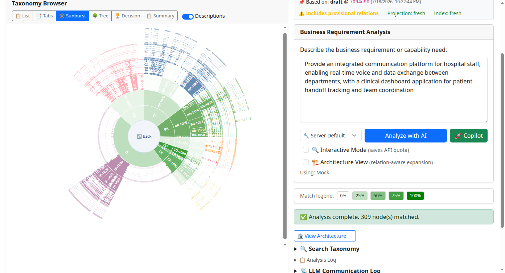

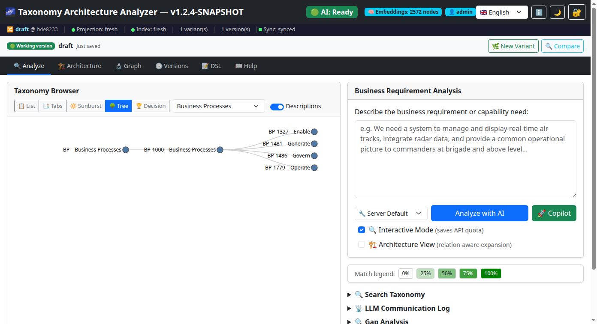

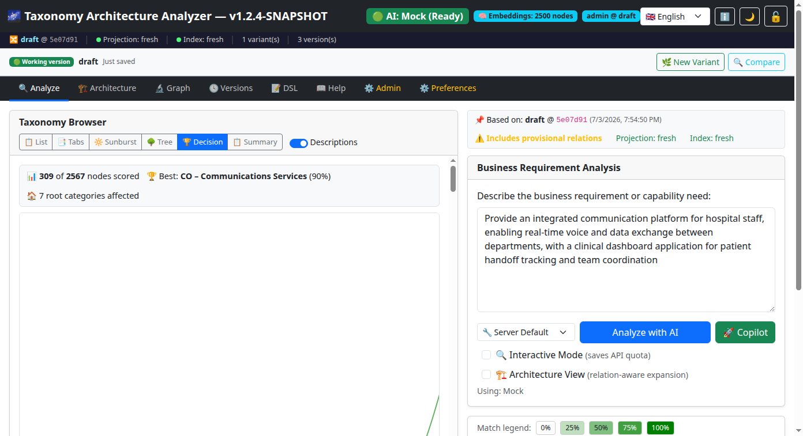

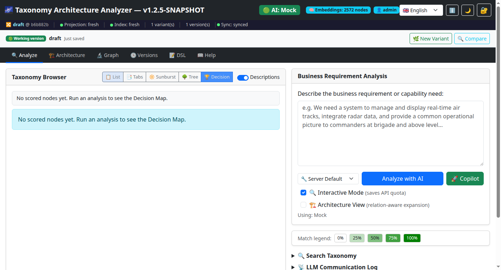

## 6. Working with Analysis Results

Read a score together with its reason, source, scope, transformation and status. Root relevance, child weight allocation, product suitability and embedding similarity are different contracts. The colour legend visualizes numerical values; it does not convert them into calibrated probabilities or approval.

Do not discard every node below 25 percent or accept every node above 50 percent. A small allocated child weight can still represent an indispensable contribution, while a large similarity score does not establish need. A missing or failed assessment is not evidence that the requirement is irrelevant. See [score semantics](TAXONOMY_SCORING.md).

Use the leaf-justification action on an eligible scored leaf to request an explanation, then review it critically. This can make an additional provider call. Its language and quality depend on configuration, not simply on the display language.

Editing the requirement can make displayed results stale. Check the stale warning and the source version before using them. Choose whether to retain the saved historical result, clear the working result or request a new analysis. Do not present a previously exported artifact as an analysis of newly edited text.

Existing interface illustrations

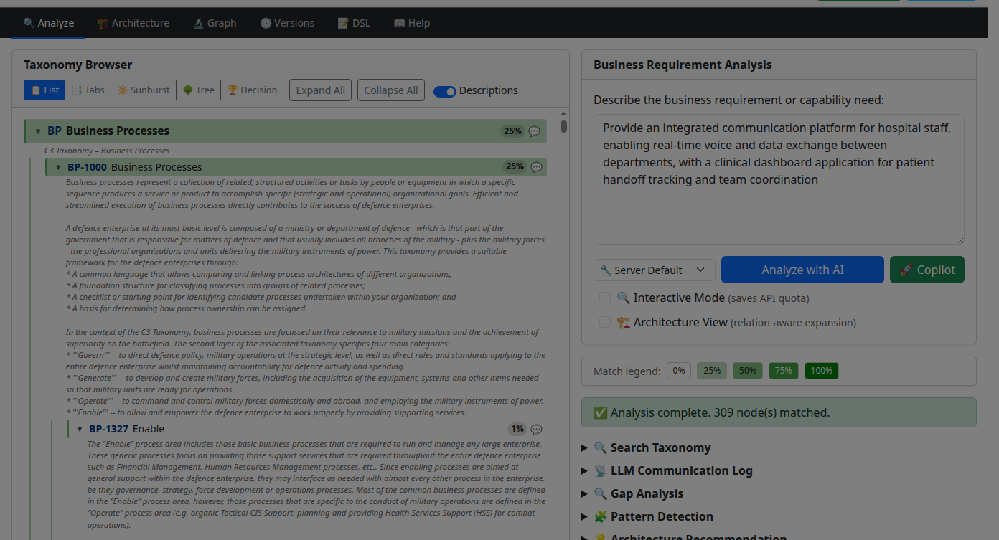

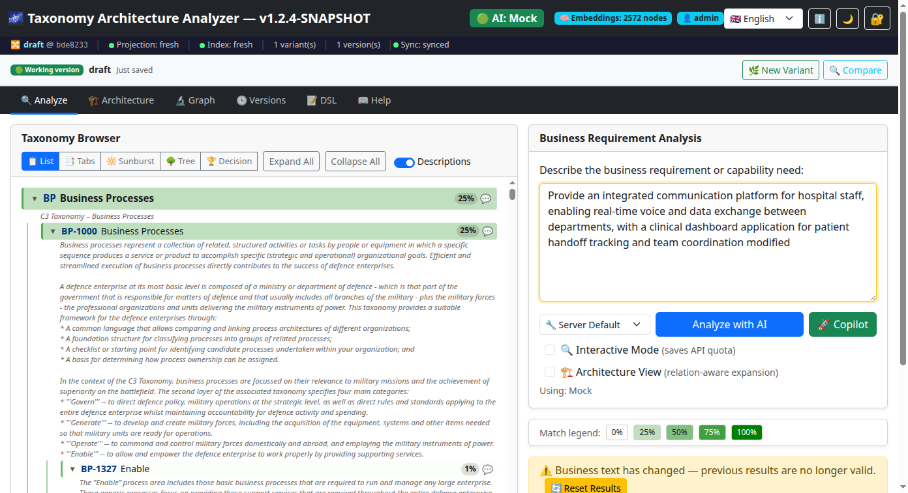

## 7. Architecture View — Requirement Impact Map

Enable the architecture-view option for the appropriate full analysis, then inspect selected elements, their layers, direct or propagated relevance and directed relationship labels. The impact map is a reviewed proposal surface, not proof that all relevant dependencies or concrete portfolio assets are present.

For a saved project, open the persisted architecture workbench and select the exact snapshot. Its source requirement, scope and evidence matter. An editable workspace revision, a transient score visualization and a snapshot-bound export are not interchangeable.

Check direction, contribution and optional/alternative conditions before accepting a relationship. The type compatibility matrix constrains permissible proposals but does not itself prove a dependency. [Decision pipeline](DECISION_PIPELINE.md), [decision rationale reports](DECISION_RATIONALE_REPORT.md) and the [export support boundary](FEATURE_MATRIX.md) give the detailed contracts.

Existing interface illustrations

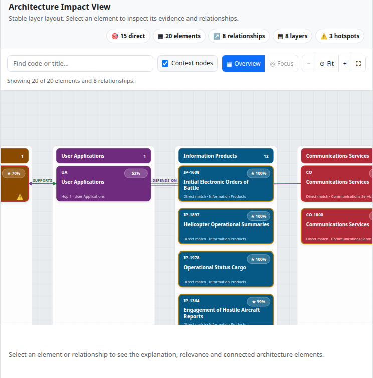

## 8. Using the Graph Explorer

Select a node through its graph action or enter a real catalogue identifier in Graph Explorer. Use upstream navigation to inspect incoming dependencies, downstream navigation for outgoing connections, and failure impact to explore reachable effects of removing or losing an element. Check the selected direction and hop limit; bounded traversal is not a complete business-impact assessment.

Read the result table alongside relation type, source and review state. A failure-impact result is a deliberate analysis view, not an application exception. Enriched impact additionally relates dependencies to recorded requirement coverage. Requirement impact can be requested from the explorer where exposed.

These queries describe the graph and evidence currently available in the selected context. Missing edges, incomplete coverage and unreviewed inputs limit the conclusions. For automation and detailed request parameters, use the [Graph Exploration API](API_REFERENCE.md#graph-exploration), rather than translating a visible count into an unsupported risk claim.

Existing interface illustrations

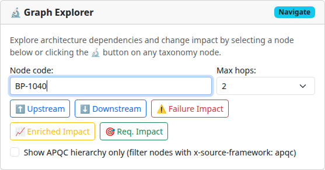

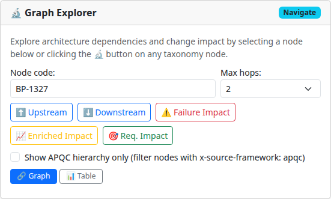

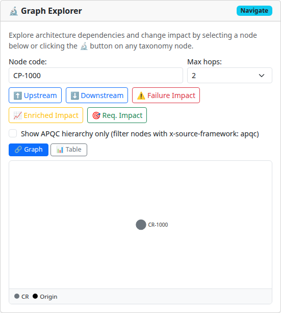

## 9. Working with Relation Proposals

Use **Propose Relations** for an eligible node, choose an allowed type and inspect the returned source, target, direction and rationale. Generating a proposal is not acceptance. Filter the review queue by pending, accepted or rejected state to distinguish suggested and reviewed relationships.

Accept a proposal only after checking its supporting requirement and evidence; reject it with an appropriate reason when the conclusion is unsupported. Bulk actions apply the same review responsibility to each selected item. A high reported confidence is not a calibrated guarantee, and compatibility between two roots is not enough to justify an edge.

Preserve contradictory human and source evidence rather than silently replacing the original. Refresh after a stale-revision conflict and review again before resubmitting. Accepted relations can affect later graph views, so check the repository/workspace context. [API reference](API_REFERENCE.md#relation-proposals) and [score semantics](TAXONOMY_SCORING.md) explain the supported actions and limits.

Existing interface illustrations

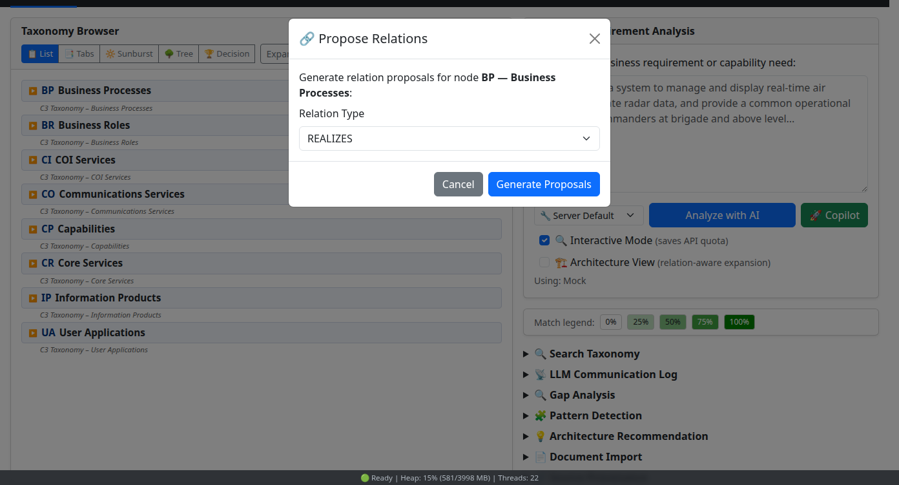

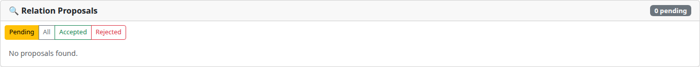

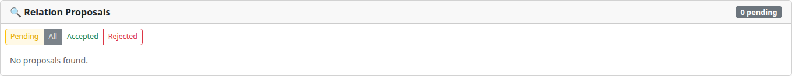

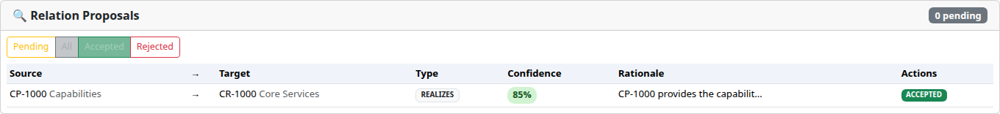

## 10. Exporting Results

Choose the output for its purpose and confirm which result it represents. Export controls on a transient analysis depend on available data; a selected persisted snapshot uses its own export path. A file extension alone does not prove semantic equivalence between endpoints.

| Output | Intended use and boundary |
|---|---|
| SVG / PNG | Share a visual representation; inspect whether the chosen action exports the full diagram or current view. |
| PDF / browser print | Human-readable presentation; browser print and a server-rendered vector PDF are different operations. |
| CSV | Tabular scores or a selected matrix; not a complete portable project history. |
| JSON | Save/load the supported analysis payload; it is not an installation backup or every format's common snapshot envelope. |
| Mermaid | Text diagram projection; review which semantics the serializer retains. |
| ArchiMate / VSDX | Experimental bounded exchange subsets, with documented mappings/losses and separate independent-tool acceptance limits. |

For supported snapshot-bound downloads, selecting the stored result does not invoke the LLM or reinterpret it with current preferences. Check the [feature matrix](FEATURE_MATRIX.md) before relying on editable exchange, general standards certification or lossless round trips. Neither schema validation nor opening a technical reader certifies every desktop tool.

Use **Load Scores** for the supported JSON analysis import. Review the restored source, scope and warnings; it does not restore every project, journal or Git history. Preserve the original download before further editing.

### 10a. Generating Reports (MD/HTML/DOCX)

Select the project or requirement report and its saved source before generating Markdown, HTML or Word. Review the preview, explanations, diagrams and outstanding decisions, not only the document's appearance. Saved reformulation revisions and adoption receipts have separate historical exports that exclude unsaved typing. [Portfolio reports](PROJECT_REQUIREMENT_PORTFOLIO.md), [decision reports](DECISION_RATIONALE_REPORT.md) and [document templates](DOCUMENT_TEMPLATES.md) describe those workflows.

Existing interface illustrations

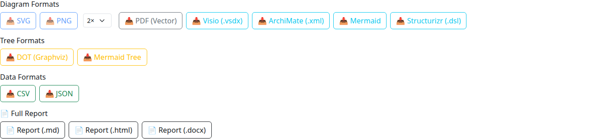

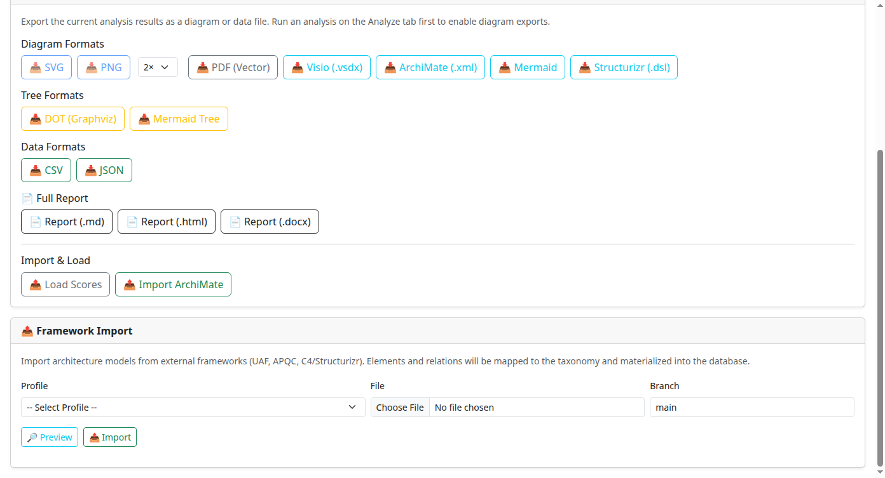

## 11. Search

Use the search panel to locate catalogue entries independently of running a full requirement analysis. Full-text search matches indexed text. Semantic search uses local embeddings when available. Hybrid search combines rankings; graph-semantic search adds graph-related context. Ranking is not approval or proof that an item satisfies a need.

Choose the available mode, enter a query and inspect the returned code, label and context. **Find Similar** starts from an existing node. Check embedding/index status when semantic results are missing; a usable text index does not prove the embedding index is ready. Local model and index preparation can require resources or downloads according to operator policy.

Compare results across languages and relevant domain vocabulary rather than assuming interface translation guarantees equivalent search quality. See [Search API](API_REFERENCE.md#search), [AI providers](AI_PROVIDERS.md) and [AI transparency](AI_TRANSPARENCY.md).

Existing interface illustrations

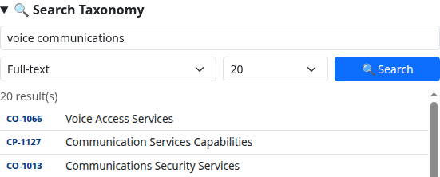

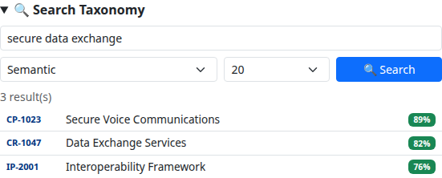

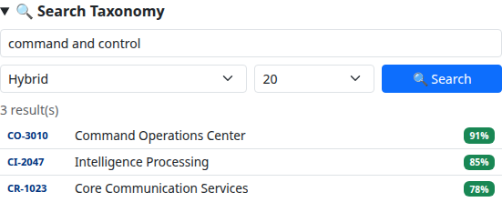

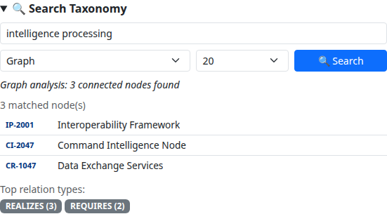

## 11a. Quality Dashboard

Open the Quality Dashboard to inspect proposal counts, review outcomes, relation-type breakdowns and frequently rejected candidates. Refresh after review actions when necessary. These are observations about recorded proposals and user decisions, not an independent benchmark of semantic accuracy, model fairness or complete architecture coverage.

Use a rejected pattern to investigate its evidence and prompt context. Do not improve the reported rate by hiding failed or unresolved cases. [API reference](API_REFERENCE.md) and [AI transparency](AI_TRANSPARENCY.md) describe the underlying operations and evaluation boundaries.

## 11b. Relations Browser

Use Relations Browser to inspect existing typed source/target links and their context. Creation and deletion require the relevant permission and affect later graph queries. Confirm both endpoints and type before submitting; a display label is not a stable identifier.

Inspect a dependency before deleting or replacing it and preserve required provenance. For precise parameters and role requirements, use [Relations API](API_REFERENCE.md#relations). A missing row in a filtered table does not establish that no relation exists anywhere in the repository.

## 11c. Requirement Coverage

Requirement Coverage connects recorded requirements with catalogue elements. Inspect summary metrics, covered nodes and candidate gaps, then drill into the contributing requirement and analysis. Record only the intended result and scope; a partial run must not become a claim of complete coverage.

Coverage means a recorded mapping under a particular contract. It does not by itself prove implementation, procurement, legal compliance or availability at the planned date. [Project portfolio](PROJECT_REQUIREMENT_PORTFOLIO.md) explains saved mappings, products, decisions and matrices.

Existing interface illustrations

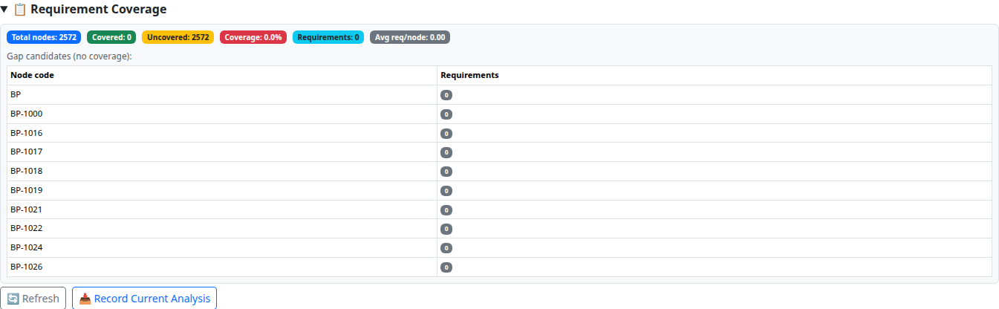

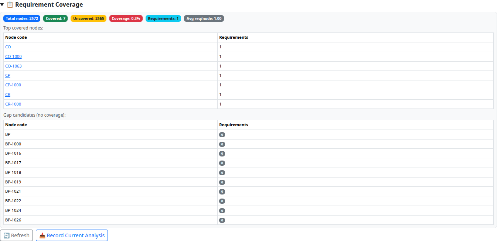

## 11d. Architecture Gap Analysis

Gap analysis examines missing expected relationships and candidate additions under the configured rules and available evidence. Distinguish an absent graph edge from a verified missing capability or product. Unassessed branches and incomplete relation searches cannot establish a negative finding.

Inspect each candidate's source, scope and rationale before deciding what to change. Dedicated API operations are documented in [Gap Analysis & Recommendations](API_REFERENCE.md#gap-analysis--recommendations); their existence does not imply every operation has a standalone GUI button. Use portfolio review for recorded solution/product decisions.

## 11e. Architecture Recommendation

Recommendations combine requirement context, selected elements, available dependencies and gap candidates. Treat them as suggestions to inspect, not an automatically approved implementation plan. Check whether elements are jointly required, optional or alternative before adopting a set.

Start the corresponding Copilot or supported API workflow and review the result status and evidence. Limits on a run also limit downstream recommendations. See [Copilot and Autopilot](COPILOT_AUTOPILOT.md) and the [API reference](API_REFERENCE.md#gap-analysis--recommendations).

## 11f. Architecture Pattern Detection

Pattern detection checks predefined chains of relation types against the available graph. A complete structural chain does not prove that the architecture fulfills the originating requirement; an incomplete chain may reflect missing evidence rather than a real operational defect.

Inspect the matched nodes, directions and absent links before using a pattern as a design recommendation. Use the supported node/scored-node API described in [API reference](API_REFERENCE.md#gap-analysis--recommendations); do not invent taxonomy identifiers or assume all integer suffixes exist.

## 11g. Architecture DSL

The textual architecture DSL stores model elements, typed relations, requirement mappings, views and evidence with stable identities. Source references and accepted architecture changes remain distinguishable from imported catalogue data. Local extension attributes do not acquire standard or official status merely because they survive serialization.

The DSL text editor supports its own draft and validation workflow. The private architecture editor instead presents synchronized forms, graph/list views and a read-only DSL projection. Do not describe those surfaces as the same editing mode. Use preview, validation and explicit acceptance before persisting an operation. Saving an editor operation does not automatically create a Git checkpoint.

Source provenance links imported content to the originating document/version/fragment. Preserve those identities and review authority when changing mappings. Do not invent catalogue entries for examples or replace canonical labels with convenient aliases.

Materialization derives working projections from an explicitly selected model state; hypotheses remain provisional until the relevant review. Commit-history search searches versioned evidence, not all transient state. [Architecture editor](ARCHITECTURE_EDITOR.md), [Git integration](GIT_INTEGRATION.md), [document import](DOCUMENT_IMPORT.md) and [DSL API](API_REFERENCE.md#architecture-dsl) are the maintained detailed references instead of a second grammar/API copy in this guide.

Existing interface illustrations

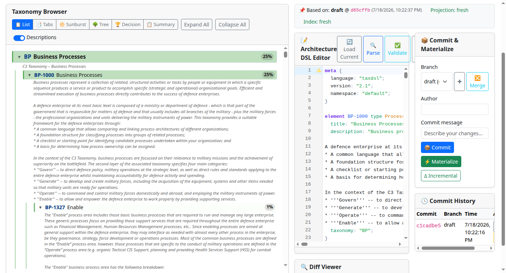

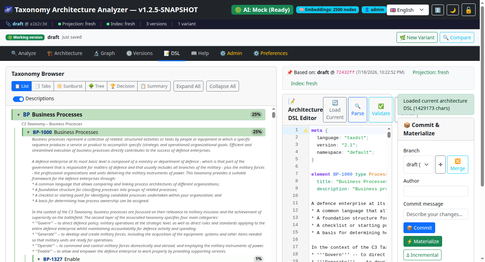

## 12. Versions Tab

Check the branch selector and workspace badge before using Versions. The history timeline lists Git checkpoints with author, message and commit identity; it is not the complete semantic editor-operation journal. View and compare an exact version, or create a named checkpoint for a stable accepted working state.

Use variants for alternative designs. Preview merges and cherry-picks, inspect added/removed/changed elements and resolve conflicts before confirmation. Copy Back transfers selected content from a read-only context into the working context; it is not automatic acceptance of an entire historical model. Delete a variant only after checking its identity and retained history.

Restore creates a new version from selected historical content; revert counteracts the selected commit's change. **Branch Undo is different:** it moves the branch to its parent and removes the latest commit from that branch's visible history. It is not the architecture editor's audited inverse operation. Review the confirmation and context; none of these actions substitutes for installation backup/restore.

Sync retrieves shared changes; Publish shares reviewed local changes through the repository workflow. Inspect ahead/behind/diverged state and resolve conflicts or rejected pushes explicitly. A success notification for one operation does not approve unrelated drafts. [Workspace and versioning](WORKSPACE_VERSIONING.md) gives step-by-step previews, conflict handling and recovery.

Existing interface illustrations

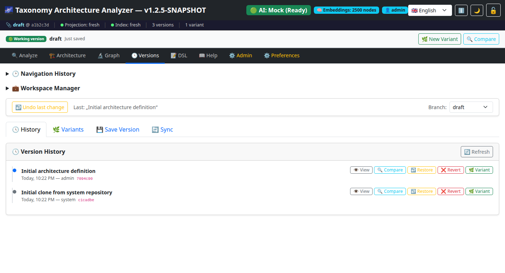

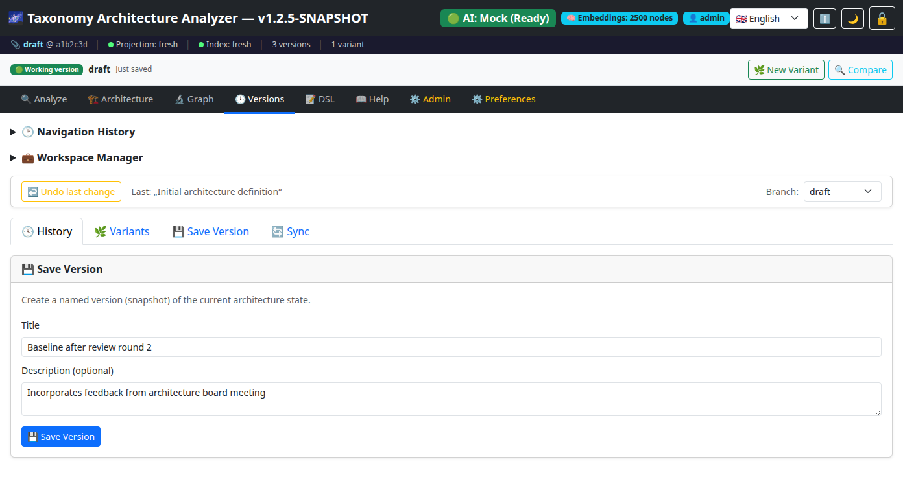

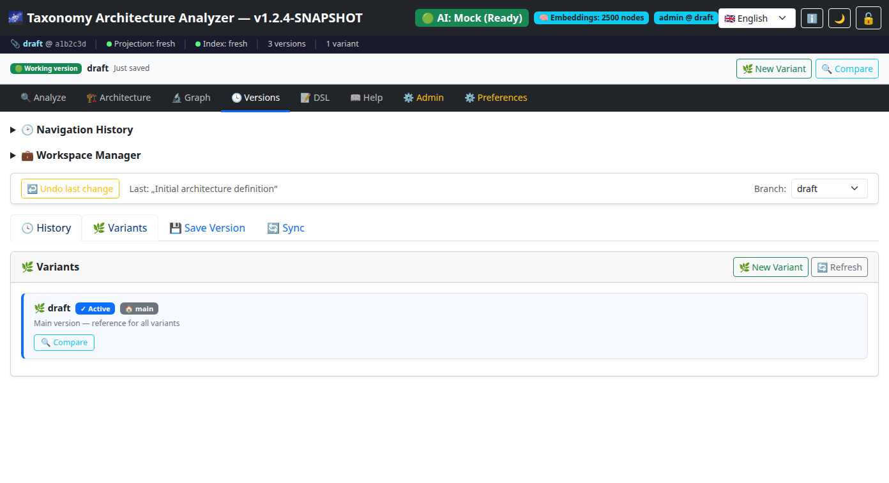

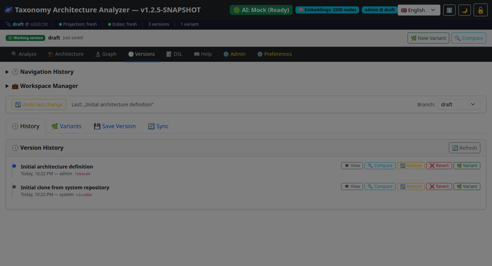

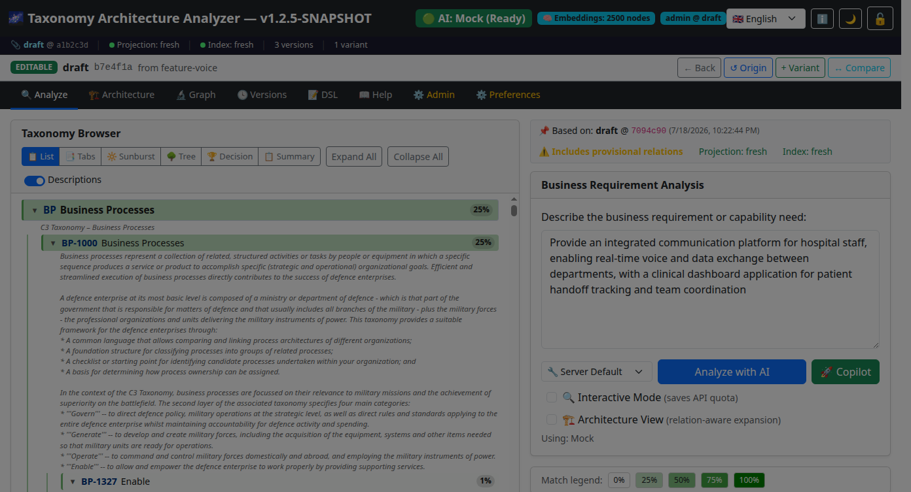

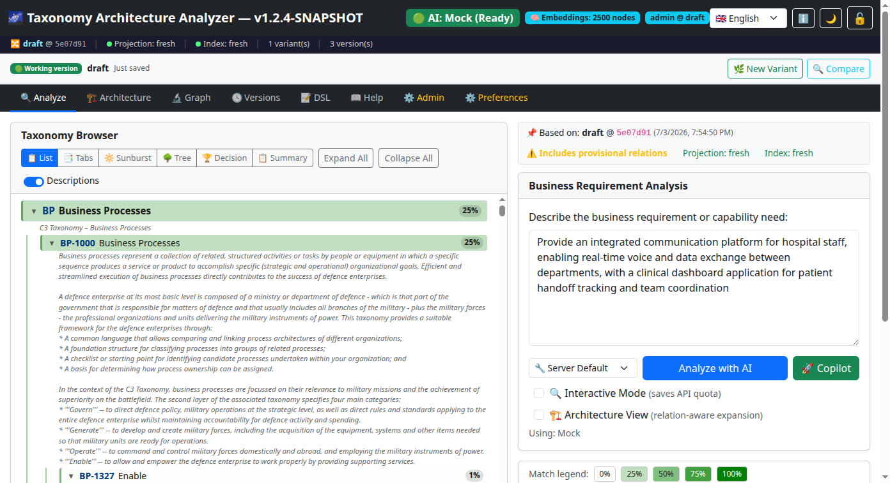

## 13. Git Status and Context Bar

The Git status and context bars identify repository, workspace, branch, checkpoint and working mode. Read-only/historical contexts are not editable simply because an editor exists elsewhere. Check origin and current selection before copying, comparing, branching or publishing.

Back returns through context navigation; Origin returns to the original context; Compare selects versions for a diff. These are distinct from the browser's history and from undoing a persisted operation. Pending working changes, stale projections and unpublished checkpoints are different conditions.

Do not discard a draft to clear a cosmetic warning without inspecting what it represents. [Repository topology](REPOSITORY_TOPOLOGY.md), [Workspace and versioning](WORKSPACE_VERSIONING.md) and [Architecture editor](ARCHITECTURE_EDITOR.md) explain the authority and recovery boundaries.

Existing interface illustrations

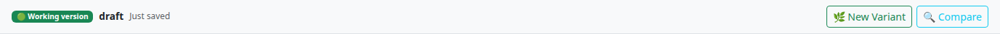

## 14. Administration

Use an administrator account only for authorized configuration tasks. A lock/unlock display control does not grant server-side permission. Local-user administration is optional and profile-dependent; Keycloak accounts and sessions have a different authority. Disabling a local account is not deletion of all its historical data or a promise that every existing session is immediately revoked.

Inspect AI availability and diagnostics to distinguish configuration, connectivity, provider errors and model capability. **Test Connection** can contact the provider. Communication logs can contain requirement text, prompts and answers; treat them as sensitive and do not paste keys or unreviewed business data into issue reports.

Edit prompt templates through the authorized editor, retain a reason and test changes on a suitable case. Changing a prompt does not silently change the response parser or validate the new language quality.

Preferences exposes supported runtime LLM/limit/diagram settings, with their documented scope and history. Historical repository/default-branch/auto-save keys are not necessarily active controls; branch and remote configuration belong to their repository context. Confirm the new value and audit result rather than assuming every deployment setting changes immediately without restart. [Preferences](PREFERENCES.md), [Configuration reference](CONFIGURATION_REFERENCE.md), [AI providers](AI_PROVIDERS.md) and [Data protection](DATA_PROTECTION.md) are the detailed references.

Existing interface illustrations

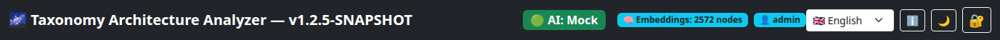

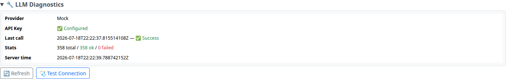

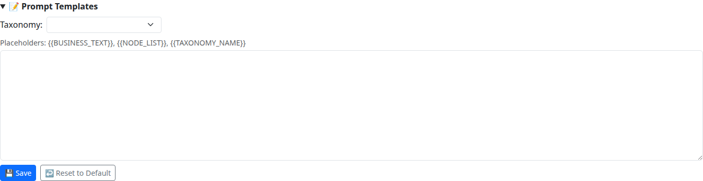

## 15. Relation Types Reference

Relations have an explicit source, type and target. Their meanings and permitted root combinations are defined by Taxonomy's model and compatibility rules; the labels are not a claim that every relation is certified against an external framework.

| Type | Reading aid; inspect actual direction and context |
|---|---|
| REALIZES / FULFILLS | Connect a contribution with an ability or need under the permitted direction. |
| SUPPORTS / USES | Express support or use between the allowed endpoints. |
| CONSUMES / PRODUCES | Distinguish reading/consuming information from creating it. |
| ASSIGNED_TO | Assign an actor or role in its modeled context. |
| DEPENDS_ON / REQUIRES | State a supported dependency or requirement, not one inferred from score alone. |
| COMMUNICATES_WITH | Describe the recorded communication relationship. |
| CONTAINS | Represent structural containment; it is not an arbitrary catalogue classification. |
| RELATED_TO | A general association, not a substitute for a missing specific justification. |

Read both endpoints and the explanation. Reversing a directed relationship can change its meaning. [Decision pipeline](DECISION_PIPELINE.md), [Relations API](API_REFERENCE.md#relations) and [scoring/provenance rules](TAXONOMY_SCORING.md) define the implementation boundaries.

## 15a. Document Import & Source Provenance

Open Document Import or the saved project's import workflow. Choose PDF/DOCX input, source metadata and the supported extraction mode. Rule-based candidate extraction does not require generative synthesis; AI-assisted extraction and direct architecture mapping use their configured provider and limits.

Review extracted passages before confirming them: headers, boilerplate, incomplete fragments and ambiguous obligations must not silently become accepted requirements. Select the intended candidates and confirm the import; then analyse the resulting requirements through the appropriate saved or ad-hoc workflow.

Check document identity, version and fragment references. Original sources, extracted candidates and accepted requirements have different lifecycles. Follow upload/page/archive/text limits and inspect explicit rejection rather than bypassing validation. [Document import](DOCUMENT_IMPORT.md), [import limits](DOCUMENT_IMPORT_LIMITS.md) and the [portfolio walkthrough](PROJECT_REQUIREMENT_PORTFOLIO.md) explain review and provenance.

## 16. Tips and Best Practices

Keep the original requirement and its conditions visible while evaluating proposals. Use domain knowledge to test whether a supposedly small contribution is essential, and distinguish alternatives from simultaneous requirements. Review incomplete coverage before declaring a gap.

Work on the intended saved source and workspace; create explicit variants/checkpoints for meaningful review boundaries. A browser draft, a saved proposal, a Git version and an analysis snapshot are not synonyms. Preserve human decisions and investigate conflicts instead of repeatedly asking the model until it agrees.

Choose export formats by documented support, not filename alone. Treat local-model operation, quality metrics and successful technical tests as separate evidence. No diagram, score or check mark automatically proves regulatory compliance, production readiness or superiority to another tool.

## 17. Glossary

| Term | Meaning in this workflow |
|---|---|
| Catalogue node | A reference entry; not automatically a concrete installed asset. |
| Score | A value under its relevance, allocation, suitability or similarity contract; not calibrated certainty. |
| Anchor / impact hotspot | An element selected/highlighted by derivation rules; inspect its evidence. |
| Relation / hypothesis | A typed link or provisional candidate with a separate provenance/review state. |
| Gap / coverage | An observed missing connection or recorded requirement mapping under a bounded context. |
| Proposal / decision | Generated or edited candidate content versus an explicitly recorded source/human resolution. |
| Requirement version | An identified saved wording/provenance state. |
| Snapshot | A retained analysis result tied to its source, not the latest editable workspace. |
| Working revision | The current durable editable state and semantic operation history. |
| Checkpoint / variant | A stable Git version or a named branch for alternative work. |
| Materialization / projection | Derived working/indexed representations of an authoritative saved state. |
| Sync / publish | Retrieve shared changes or submit reviewed local changes with conflict handling. |
| Stale | Evidence that no longer describes the current input/context; still historical evidence. |
| Local embeddings | Local vector search/scoring, not a complete generative LLM. |
| C3 / COI | Command, Control and Communications / Community of Interest in the catalogue. |

See [Concepts](CONCEPTS.md) for the extended terminology and [Git integration](GIT_INTEGRATION.md) for version semantics.

## 18. Troubleshooting

| Symptom | Check and action |
|---|---|
| Analysis is disabled | Read AI readiness, role and configuration; local embeddings do not unlock every generative feature. |
| Zero or missing scores | Inspect errors, scope and coverage before assuming no match. Do not merely replace all wording with catalogue terms. |
| A run stops | Read its outcome and retained evidence; use the supported retry/continue/cancel flow. |
| Export is unavailable/empty | Check the selected source, actual result, derivation mode and supported endpoint before rerunning costly analysis. |
| Requirement text changed | Keep historical evidence distinct and request a new analysis when needed. |
| Taxonomy or graph does not load | Check the connection and visible error, retain drafts, and report reproducible steps. |
| Administrative controls are absent | Verify assigned role and active profile with the operator; a frontend unlock cannot replace authorization. |
| Merge or revision conflict | Refresh, compare and explicitly review the new state before resubmitting. |
| Failure Impact is displayed | This is an intentional graph analysis, not an exception. Its completeness is bounded by available edges and limits. |
| A help link fails | Record source document, language and destination. Heading targets, authored links and cross-document browser routing have separate failure modes. |

Preserve exact version/context and relevant diagnostics for a bug report, without secrets or unapproved personal data. Do not wipe a database, rewrite Git history or refresh away unsaved work as a generic repair. The [operations guide](OPERATIONS_GUIDE.md) covers operator procedures.

Existing interface illustrations

## Saved reformulation offers and decision questions

Open a saved requirement with its exact source version and analysis snapshot. Create a separate offer and wait for its recorded synthesis outcome. An initial stored draft or a completed run is not approval. Original, proposal and questions remain separate; narrow layouts use their tabs.

Answer with the offered type, use Other only with an explanation, or explicitly defer/mark not applicable. Review conditional questions, source conflicts and existing decisions. Save text before switching offers. Regeneration must preserve intervening manual edits as reviewable candidates, not silently overwrite them.

Use **Review adoption…**, inspect the exact saved text and unresolved findings, acknowledge warnings and enter a rationale before confirming. Closing a preview does not adopt anything. Adoption makes a requirement draft active and marks analysis for refresh; request reanalysis separately. A later offer carries inherited decisions and their origins.

Export a selected saved revision or adoption receipt as JSON, Markdown, HTML or Word. Unsaved typing is excluded; the historical source and architecture are retained rather than resolved against today's catalogue. Use a separate explicit checkpoint for portable project history. See the [portfolio workflow](PROJECT_REQUIREMENT_PORTFOLIO.md) and [reformulation contract](../features/requirement-reformulation.md).
