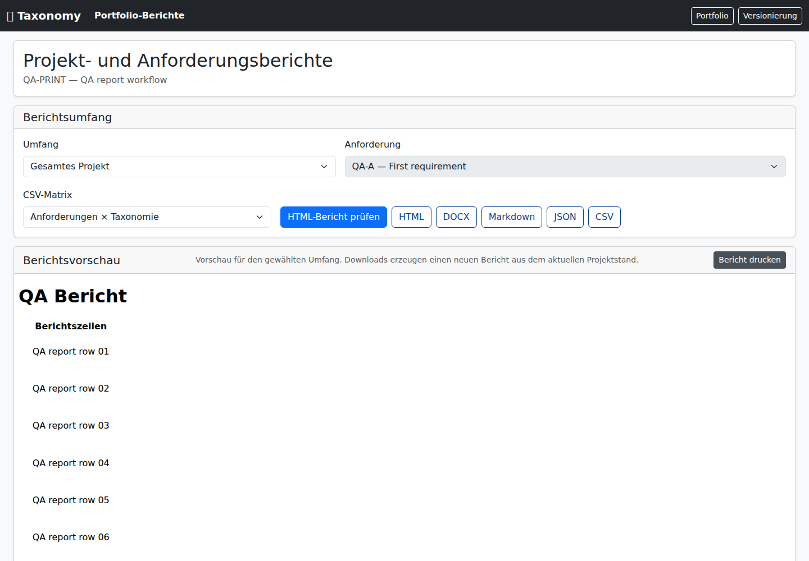
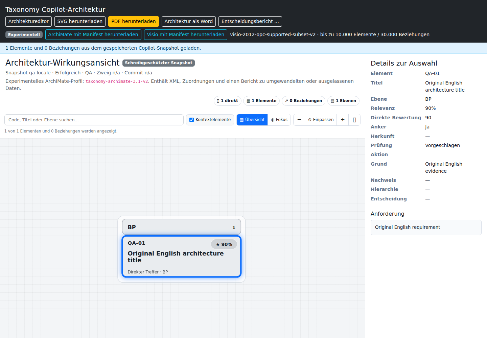

# QA: deutsche Oberfläche, Architektur und Bedienbarkeit — 6. Oktober 2026

## Ergebnis und Prüfstand

Die Prüfung hat konkrete Fehler in der deutschen Oberfläche, in asynchronen
Bedienabläufen und an der Grenze zwischen Datenbank und Nachrichtenbroker
gefunden. Diese Fehler sind in diesem Änderungsstand behoben. Die Prüfung ist
keine pauschale Bescheinigung, dass jede Seite vollständig übersetzt, jeder
Diagrammknoten barrierefrei oder jeder Betriebsfall ohne Fehler ist.

Ausgangspunkt ist `74b3d55082ddbb5b38c0c7309349e371bdc016ab` auf `main`
(zusammengeführte PR #1176). Die Arbeit liegt isoliert auf
`qa/de-ux-architecture-20261006`. Andere laufende QA-Arbeiten an Suchfehlern und
Logging wurden nicht überschrieben oder als eigene Korrekturen gezählt.

Die Untersuchung verbindet eine Bestandsaufnahme der Sprachressourcen,
unabhängige Prüfungen von Oberfläche, Ergonomie und Architektur,
Verhaltenstests, echte Datenbank-/Artemis-Tests und Browserprüfungen des gebauten
Spring-Boot-Pakets. Englische Originaltitel, Anforderungen und Nachweise sind
fachliche Inhalte; ihre Erhaltung wird ausdrücklich geprüft.

## 1. Deutsche Spracheinstellung

**Auf dem Ausgangsstand war die Antwort auf die Frage nach durchgängig deutschen
Bedienelementen: nein.** Die Sprachdateien waren vollständig gepaart, aber Teile
der Oberfläche verwendeten fest eingebaute englische Texte. Zusätzlich konnte
eine alte Browserpräferenz eine ausdrücklich deutsche Seite wieder auf Englisch
umstellen.

### Behobene Befunde

| Priorität | Befund und Auswirkung | Korrektur |
| --- | --- | --- |
| P2 | `/?lang=de` mit zuvor gespeichertem Englisch konnte nach dem Laden wieder `lang="en"` erhalten. Serverseitige Texte, dynamische Inhalte und zugängliche Namen liefen auseinander. | Der vom Server gerenderte Seiten-Locale hat Vorrang. Regionale Angaben wie `de-DE` werden normalisiert; blockiertes LocalStorage verhindert die Initialisierung nicht. |
| P2 | Architektur-Workbench: zahlreiche Titel, Schaltflächen, Suchhinweise, Details und dynamische Meldungen waren Englisch. | Statische und dynamische Bedientexte verwenden den gemeinsamen Nachrichtenbestand. Die Workbench wartet auf dessen Initialisierung. |
| P2 | Hauptansicht und Analyse: unter anderem Ansichtsbezeichnungen, Entscheidungstabelle, Filter und Beziehungsaktionen blieben teilweise Englisch. | Lokalisierung der betroffenen Beschriftungen, Tabellenüberschriften, Tooltips und ARIA-Texte. |
| P2 | Arbeitsbereichsverwaltung, Historie, Status-/Diagnoseoberflächen und Projektplatzhalter enthielten fest eingebaute englische UI-Texte. | Die geänderten Bedienelemente beziehen ihre Texte aus den Sprachressourcen; ursprüngliche Log- und Historieninhalte bleiben erhalten. |
| P2 | Portfolio-Import und Anforderungsdetails zeigten technische Enumwerte statt lesbarer deutscher Bezeichnungen. Die Kritikalität `CRITICAL` entsprach zudem keinem gültigen Serverwert. | Lokalisierte Enumdarstellung, Initialisierung nach I18n-Bereitschaft und gültiges `MISSION_CRITICAL`; alte Importkandidaten mit `CRITICAL` werden beim Anzeigen und Übernehmen normalisiert. |
| P2/P3 | Der Dialog zum Erstellen einer Anforderungsversion, Quellentypen beim Import, einige Navigationsnamen für Screenreader, Editor-Statusoptionen und der Titel des Berichts-Iframes waren trotz deutscher Hauptseite Englisch. | Die betroffenen Formulartexte, Schließen-/Abbrechen-Aktionen, Optionen und zugänglichen Namen werden serverseitig übersetzt. Technische Optionswerte bleiben unverändert; echte gerenderte Seiten werden darauf geprüft. |

### Umfang und Aussagekraft

Im Ausgangsbestand wurden 24 HTML-Templates einschließlich Fragmenten, 96
JavaScript-Dateien und 20 englisch-deutsche Bundle-Paare inventarisiert. Damals
existierten 2.174 eindeutige Schlüssel pro Sprache; nach den Korrekturen sind es
**2.474 pro Sprache**, ohne fehlende Gegenstücke oder abweichende nummerierte
Platzhalter. Die 636 beim ursprünglichen Scan gefundenen literalen
Template-Referenzen waren bereits auflösbar. Diese Zahlen zeigen gerade, warum
ein reiner Schlüsselvergleich nicht genügt.

Der Browser reproduziert den Locale-Fehler gegen das unveränderte Ausgangspaket:
erwartet `de`, tatsächlich `en`. Die neuen Node- und Browser-Regressionen prüfen
außerdem die deutschen Workbench-Texte, Beziehungsaktionen und Ansichtsbezeichnungen, die
Erhaltung englischer Originalinhalte und den gültigen Kritikalitätswert.

Es wurde keine automatische Übersetzung von Katalogtiteln, Nutzereingaben,
Nachweisen oder technischen Identitäten eingeführt. Eine vollständig deutsche
Bedienoberfläche setzt deshalb nicht voraus, dass jeder sichtbare fachliche
Inhalt deutsch ist. Für unveränderte Nebenfunktionen ersetzt diese Prüfung keine
vollständige redaktionelle Abnahme jedes Dialogzustands.

Relevante Implementierungen:
[I18n-Initialisierung](../../taxonomy-app/src/main/resources/static/js/taxonomy-i18n.js),
[Workbench](../../taxonomy-app/src/main/resources/static/js/architecture-workbench.js),
[deutsche Texte](../../taxonomy-app/src/main/resources/i18n/messages_de.properties),
[Lokalisierungsregressionen](../../.github/scripts/ui-localization-regression.test.mjs).

## 2. Architektur

### P1: Analyseabschluss konnte nach einem Zustellfehler unsichtbar bleiben

Ein Coordinator konnte das Ergebnis bereits dauerhaft in der Datenbank speichern,
während die Benachrichtigung anderer Instanzen scheiterte. Bei erneuter
Zustellung der Completion-Nachricht war das Ergebnis schon verarbeitet; der
bisherige Ablauf stellte die fehlende Benachrichtigung nicht zuverlässig wieder
her. Eine auf einer anderen Instanz noch verbundene Oberfläche konnte dadurch
auf einen Abschluss warten, der in der Datenbank bereits existierte.

Die Korrektur liest nach Annahme und Finalisierung das aktuelle gespeicherte
Fortschrittsereignis. Dessen Veröffentlichung und die Bestätigung der eingehenden
Completion verwenden dieselbe transaktionale JMS-Session. Scheitert die Sendung,
wird die Nachricht nicht erfolgreich bestätigt und kann erneut zugestellt
werden. Der Datenbankzustand wird dabei nicht künstlich fortgeschrieben.
Operation, Revision, Sequenz und vollständiger Autoritätskontext des Ereignisses
werden vor der Veröffentlichung geprüft.

Die fünf neuen Integrationstests verwenden einen echten persistenten
Artemis-Broker, eine echte HSQL-/JPA-Persistenz, das Completion-Ledger und eine
separate Beobachterverbindung. Gezielt ausgelöste Sendefehler prüfen:

- Wiederherstellung nach bereits gespeichertem Abschluss;
- temporären Sendefehler mit Rollback und erneuter Zustellung;
- anhaltenden Fehler mit Erhaltung der Nachricht und anschließender Erholung;
- Zurückweisung eines fremden Repository-Kontexts;
- Zurückweisung einer fremden Korrelationsidentität.

Vor der Korrektur scheiterten drei der fünf Fälle an den erwarteten Assertions;
die zwei Negativfälle bestanden bereits. Danach bestanden alle fünf. Die
abschließenden 162 ausgewählten Java-Tests umfassen zusätzlich die benachbarten
Cluster-, Transport-, Beobachter-, Dispatch-, Autoritäts- und Architekturregeln.

Quellen:
[gespeichertes Ereignis](../../taxonomy-analysis/src/main/java/com/taxonomy/analysis/cluster/ClusterAnalysisStore.java),
[Coordinator](../../taxonomy-app/src/main/java/com/taxonomy/composition/analysis/artemis/ArtemisClusterCoordinator.java),
[Broker-Regressionsprüfung](../../taxonomy-app/src/test/java/com/taxonomy/composition/analysis/artemis/ArtemisCoordinatorNotificationRecoveryTest.java).

### Verbleibende Architekturthemen

| Einordnung | Beobachtung | Bedeutung und sinnvoller nächster Schritt |
| --- | --- | --- |
| P2 bei größerer Last; statisch belegt, nicht vermessen | Die Liste jüngster Analysen lädt für bis zu 50 Einträge jeweils einen vollständigen Snapshot einschließlich Task-Liste und Ergebnis-JSON. Im untersuchten Pfad entspricht das bis zu etwa 101 Datenbanklesevorgängen. | Eine schlanke Statusprojektion prüfen und Abfragezahl, Datenmenge und Latenz mit realistischen großen Ergebnissen messen. Aus dem Codebefund wird keine bereits gemessene Langsamkeit abgeleitet. |
| Dokumentierte Betriebsgrenze | Die Wiederherstellung ausstehender Dispatch-Intents ist standardmäßig auf 5.000 je Lauf begrenzt. Weitere Einträge warten auf Start, Wiederverbindung oder manuellen Reparaturaufruf. | Bei größeren Rückständen Monitoring und Betriebsablauf vorsehen; gegebenenfalls kontrollierte Fortsetzung erweitern. Das Limit ist bereits dokumentiert und getestet, kein neu entdeckter Datenverlust. |
| Wartbarkeit | Große UI-Module und Inline-Skripte verteilen Zustand und Übersetzungsentscheidungen auf mehrere Stellen. | Weitere Änderungen schrittweise auf gemeinsame Locale-, Request- und Zustandsverträge umstellen. Die bestätigten Anschlussfehler zeigen den Nutzen von Integrationstests über Modulgrenzen hinweg. |

Die Bestandsaufnahme fand 12 registrierte Architekturausnahmen und 173 erfasste
Abhängigkeitskanten. Diese Inventarzahlen sind keine Fehleranzahl. Die
ausgeführten Architekturprüfungen zu Modulgrenzen, Zyklen, Ausnahmen und
Abhängigkeitsfortschreibung bestanden.

Quellen:
[Liste und Snapshot-Aufruf](../../taxonomy-analysis/src/main/java/com/taxonomy/analysis/cluster/DurableClusterAnalysisObservation.java),
[Recovery-Konfiguration](../de/CONFIGURATION_REFERENCE.md),
[Ausnahmen](../../.github/architecture-exceptions.json),
[Abhängigkeitsbaseline](../../.github/architecture-dependency-baseline.json).

## 3. Ergonomie und Benutzerfreundlichkeit

| Priorität | Reproduziertes Problem | Behobenes Verhalten |
| --- | --- | --- |
| P2 | Eine geleerte Suche konnte alte Ergebnisse oder eine noch laufende Anfrage behalten. Späte Antworten konnten die alte Ansicht wiederherstellen. | Sichtbares Suchfeld-Leeren, tatsächlicher Request-Abbruch, Rücksetzen von Ergebnissen und Markierungen, Fokus zurück ins Suchfeld; alte Erfolge und Fehler bleiben wirkungslos. Auch die Ähnlichkeitssuche wird berücksichtigt. |
| P2 | Nach Wechsel von Berichtsumfang oder Anforderung konnte eine alte Vorschau weiter angezeigt werden; eine verspätete Antwort konnte sie erneut aktivieren. | Auswahlwechsel invalidiert Vorschau und Druckfreigabe sofort, bricht die Anfrage ab und widerruft die alte Blob-URL. Nur die zur aktuellen Auswahl gehörende geladene Vorschau wird druckbar. |
| P2 | Während eines Entscheidungsbericht-Exports waren Abbrechen und Escape wirkungslos beziehungsweise nicht verfügbar. | Der Dialog bleibt abbrechbar. Abbruch beendet die HTTP-Anfrage, schließt den Dialog, stellt den Fokus wieder her und verhindert einen späteren Download, auch bei verzögerter Blob-Verarbeitung. |
| P2 | Der interaktive Workbench-Graph war als einzelnes Bild ausgezeichnet, obwohl er fokussierbare Schaltflächen enthält. Axe meldete `serious:nested-interactive`. | Der beschriftete SVG-Container verwendet `role="group"`. Knoten bleiben per Tastatur erreichbar; der Browser prüft Auswahl mit Enter und die danach angezeigten Details. |

Das unabhängige Abschlussreview fand zunächst einen zusätzlichen Anschlussfehler:
Der Live-Analyse-Export übergab sein Abbruchsignal an die falsche Position des
API-Clients. Ein Integrationstest mit dem tatsächlichen Browse-Handler,
Exportdialog und API-Client reproduzierte den Fehler. Das Signal wird jetzt als
drittes Request-Argument weitergereicht; der Test prüft den Abbruch am echten
Fetch-Anschluss und die Bereinigung des Request-Timers.

Ein abgebrochener HTTP-Request ist keine Zusage, dass jede bereits begonnene
serverseitige Rechenarbeit sofort stoppt. Geprüft sind der Transportabbruch und
das aus Nutzersicht sichere Ende des Exportvorgangs.

Quellen:
[Suchzustand](../../taxonomy-app/src/main/resources/static/js/shared/taxonomy-search.js),
[Berichtszustand](../../taxonomy-app/src/main/resources/static/js/portfolio/portfolio-reports.js),
[Exportdialog](../../taxonomy-app/src/main/resources/static/js/shared/decision-export-dialog.js),
[14 UX-Regressionen](../../taxonomy-app/src/test/js/ux-state-recovery.cjs).

## 4. Erwartete Standardbedienelemente und Druck

| Bereich | Ergebnis |
| --- | --- |
| Portfolio-Berichtsvorschau | Lokale Schaltfläche **Bericht drucken** ergänzt. Sie druckt das tatsächlich geladene Berichtsdokument im Iframe. Vor dem Laden, nach Auswahlwechsel und bei ungültiger Vorschau bleibt sie deaktiviert. |
| Entscheidungstabelle der Hauptansicht | Der Browserdruck blendet die Tabelle nicht mehr aus. Alle sichtbaren Ergebniszeilen bleiben erhalten; Tabellenköpfe wiederholen sich und der Drucktext bleibt auch aus einem dunklen Ausgangsthema schwarz auf weiß. |
| Diagrammexport | SVG-, PNG- und PDF-Exporte sind bereits vorhanden. Ein PDF-Export ist eine eigene Dokumenterzeugung und kein Beleg dafür, dass der Browserdruck derselben Ansicht vollständig funktioniert. |
| Architektur-Workbench | Suche, Leeren, Zoom, Einpassen und Vollbild sind vorhanden. SVG/PDF-Downloads sind vorhanden. Eine eigene vollständige Druckansicht der gesamten Workbench mit Graph und Details bleibt offen. |
| Taxonomie-Diagramme | Eine lokale Funktion zum Einpassen fehlt in einzelnen Ansichten; die Workbench besitzt sie bereits. |
| Asynchrone Aktionen | Suchreset, Berichtsaktualisierung und Exportabbruch sind jetzt gegen verspätete Antworten abgesichert. |

Die Browserprüfung verwendet für die Berichtsvorschau ein kontrolliertes
80-Zeilen-Dokument. Schaltfläche, Fetch-Pfad, Blob-Iframe, Auswahlwechsel und
`beforeprint`-Ereignis sind echte Produktabläufe. Das resultierende Test-PDF hat
sechs Seiten, enthält alle 80 Zeilen und wiederholt den Tabellenkopf. Dies prüft
den vollständigen Dokumentdruck des Iframes; der künstliche Bericht ist kein
zusätzlicher fachlicher Abnahmetest des serverseitigen Report-Renderers.

Zusätzlich wird die echte Decision-Ansicht mit 20 kontrollierten Ergebnissen
gerendert und mit dem produktiven Print-CSS als PDF ausgegeben. Das zweitseitige
Dokument enthält alle 20 Ergebnisse bis zur letzten Zeile. Die Browserprüfung
vergleicht außerdem Tabellenkopf-Anzeige und Textfarbe unter Print-Media.

Prüfartefakte:
[gedruckte Entscheidungsergebnisse](evidence/2026-10-06/german-ux-decision-results-print.pdf)
und [vollständiger Testbericht](evidence/2026-10-06/german-ux-report-frame-print.pdf).
Beide Dokumente enthalten ausdrücklich kontrollierte QA-Daten.





## 5. Offene Ergonomie- und Abnahmegrenzen

1. **Tastaturbedienung aller Taxonomie-Visualisierungen:** Einige SVG-/Canvas-
   Knoten sind hauptsächlich auf Mausbedienung ausgelegt. Die Listenansicht
   bietet einen zugänglichen alternativen Zugang, ersetzt aber keine direkte
   Tastaturbedienung jeder Visualisierung. Die Workbench hat bereits
   tastaturbedienbare Knoten und Beziehungen; die neue Semantikkorrektur darf
   nicht mit einer vollständigen Screenreader-Abnahme verwechselt werden.
2. **Einpassen in den Taxonomie-Diagrammen:** Ein sichtbarer lokaler Befehl zum
   Zurücksetzen beziehungsweise Einpassen würde die Orientierung verbessern.
3. **Workbench-Drucklayout:** Die eigene CSS-Datei enthält feste Viewport-Höhen
   und Overflow-Regeln, aber keine vollständige Print-Aufbereitung. Eine
   kombinierte Druckansicht für Diagramm, Herkunft und Details ist ein separater
   Ausbaupunkt. Die vorhandenen Diagramm-Downloads sind nutzbar.
4. **Weitere redaktionelle Spracharbeit:** Die behobenen Bedienpfade und
   Schlüsselparität sind geprüft. Unveränderte seltene Fehlerzustände,
   Fachterminologie und alle möglichen Laufzeitinhalte sind dadurch nicht
   pauschal abgenommen.

Diese Punkte werden als konkrete Folgearbeit dokumentiert. Es wurde keine
großflächige Neugestaltung ohne vorherige Anforderungen vorgenommen.

## 6. Verifikation und unabhängiges Review

| Nachweis | Ergebnis |
| --- | --- |
| Vollständige lokale UI-Vertragsprüfung auf dem Ausgangsstand | 846 Tests bestanden, keine Fehler oder Skips. |
| Abschließende vollständige UI-Vertragsprüfung | 866 Tests bestanden, keine Fehler oder Skips; darunter 6 neue Locale- und 14 neue UX-Regressionen. |
| Ausgewählte Java-/Architekturprüfung | 162 Tests in 19 Klassen bestanden, keine Fehler oder Skips. |
| Neue Broker-Regression vor der Korrektur | 5 Fälle: 3 erwartete Fehler, 2 bestandene Negativfälle. |
| Neue Broker-Regression nach der Korrektur | 5 von 5 bestanden; im abschließenden Java-Lauf erneut erfolgreich. |
| Unabhängiges Code-Review | Signal-Anschlussfehler und zwei Test-/Fallback-Unsauberkeiten gefunden und behoben; abschließend keine weiteren Critical-/Important-Befunde im geänderten Umfang. 20 neue Node-Regressionen unabhängig erfolgreich ausgeführt. |
| Browser gegen unverändertes Ausgangspaket | Locale-Fehler tatsächlich reproduziert: `lang="en"` statt `de`. |
| Erweitertes Workbench-Axe gegen Zwischenstand | Tatsächlicher Semantikfehler `serious:nested-interactive` reproduziert; keine Regel ausgeblendet. |
| Abschließende Paket-/Browserabnahme | 47 Checks einschließlich 15 Axe-Prüfungen bestanden, keine Axe-Verstöße. Vollständiges lokales Admin-Profil einschließlich der neuen Locale-/Druckfolge und gerenderter Formular-/ARIA-Texte. Ein Anwendungsstart, 55.891 ms gemessene Anwendungs-/Browserzeit. |

Die detaillierten Messwerte, Quell-/Paketprüfsummen, Checknamen und die
abgegrenzten Testdaten werden im zugehörigen
[maschinellen Nachweis](evidence/2026-10-06/german-ux-architecture.json) festgehalten.

Das abschließende Anwendungspaket hat SHA-256
`d731eecc2dcf3c2abfdfae72d0301ff24d6d0b7dd6989365a6db3c2571d3bbc8`.
Alle 22 geänderten Produktionsressourcen stimmen bytegenau mit dem Paket
überein; ebenso die beiden geänderten Java-Klassen mit den paketierten Klassen.
Die lokalen Browser-Timingfelder zur Commitbindung bleiben
leer. Die separat dokumentierten Quell- und Paketprüfsummen sind engerer lokaler
Nachweis und werden nicht als kanonisches CI-Zertifikat ausgegeben.

Reproduzierbare Einstiegspunkte mit Java 21 auf `PATH`:

```bash
npm --prefix .github ci --ignore-scripts --no-audit --no-fund
npm --prefix .github run verify:ui-contracts
./mvnw -B -pl taxonomy-app -am test \
  -Dtest=ClusterAnalysisStoreTest,DurableClusterAnalysisExecutionTest,DurableClusterAnalysisObservationTest,FrozenClusterAnalysisFinalizerTest,ClusterAnalysisSignalsTest,AnalysisDispatchServiceTest,ArtemisCoordinatorNotificationRecoveryTest,ArtemisProductionExecutionTest,ArtemisClusterExecutionConfigurationTest,ArtemisAnalysisTransportTest,ArchitectureTest,ArchitectureCycleBoundaryTest,ArchitectureExceptionLedgerTest,ArchitectureContextDependencyRatchetTest,I18nApiControllerTest,TemplateI18nLintTest,PortfolioReviewedImportServiceTest,ClusterAnalysisApiControllerTest,ClusterAnalysisUseCaseTest \
  -Dsurefire.failIfNoSpecifiedTests=false -Djacoco.skip=true \
  -Dmaven.build.cache.enabled=false
./mvnw -B -pl taxonomy-app -am package -DskipTests \
  -Djacoco.skip=true -Dmaven.build.cache.enabled=false
TAXONOMY_UI_SUITE=primary \
TAXONOMY_UI_PROFILE_FILTER=primary-admin-chromium \
node .github/scripts/run-ui-suite.mjs
```

Die Paketierung mit `-DskipTests` ist kein weiterer Testlauf. Der lokale Browser
verwendet Chromium und den Mock-Provider; er ist kein erneuter Lauf aller
18 Browserprofile, aller Datenbankvarianten oder externer KI-Anbieter. Frühere
grüne CI-Läufe der Basis-PR werden nicht als Nachweis dieses Änderungsstands
ausgegeben. Produktive Bereitstellung und ein Live-Rollout gehören nicht zu den
lokalen Ergebnissen dieser QA.
