# Actual native and publication browser captures

All 14 images were produced by [Civilian CI 35525893725](https://github.com/carstenartur/Taxonomy/actions/runs/35525893725)
and visually inspected by the controller. Capture source
`ca2e28dba4b258cf33db3261aa8449e832ebfb2f`, tree
`7c1ecbbf6aa564013f7469aff061d2305fbd7c69`; artifact `10610101827`.
The [byte manifest](images/conditional-publication/manifest.json) records every SHA-256,
artifact identity, recording time and actual control evidence. Images are copied
unchanged from that artifact.

**TEST ONLY / NUR TEST:** publication uses the genuine HTTP contract provider
`taxonomy-publication-contract-v1`. These images do not show enabled PCS writes or
certify Enterprise Architect. There is no request interception. The frozen Word
exports precede these actions; native/publication actions use separate private
workspaces. The flow uses real keyboard review, reload, recovery and reconciliation.

| State | English | Deutsch |
|---|---|---|
| Native package | 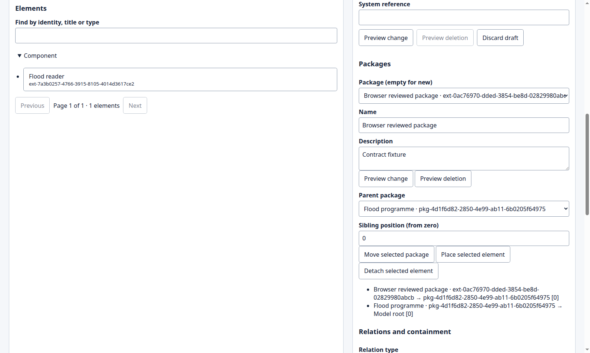 | 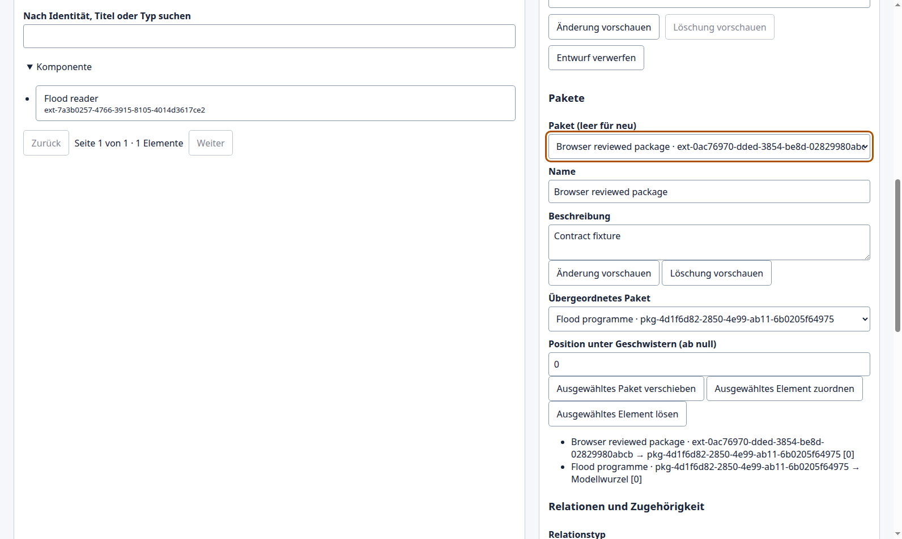 |
| Native endpoint review | 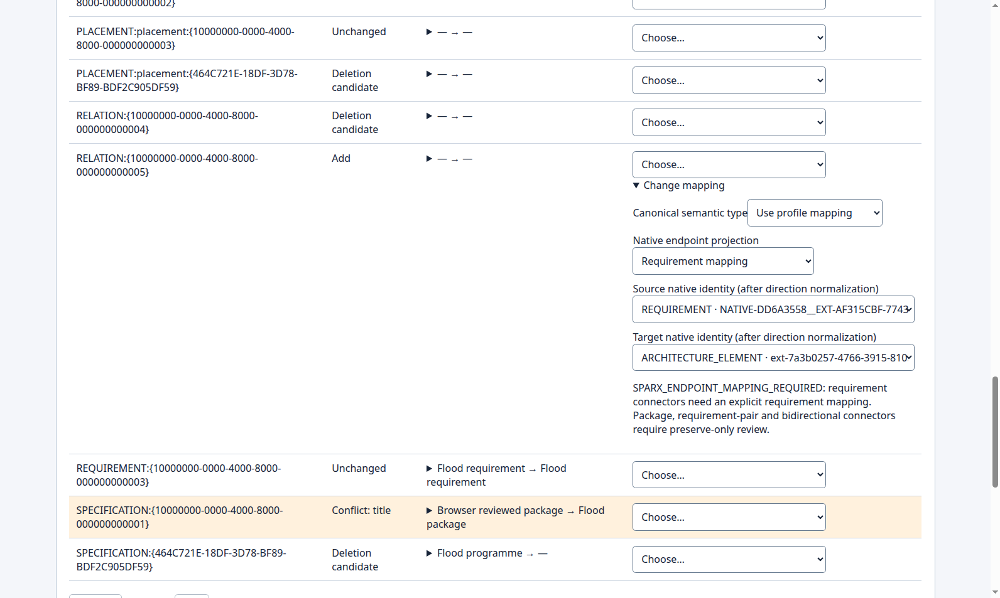 | 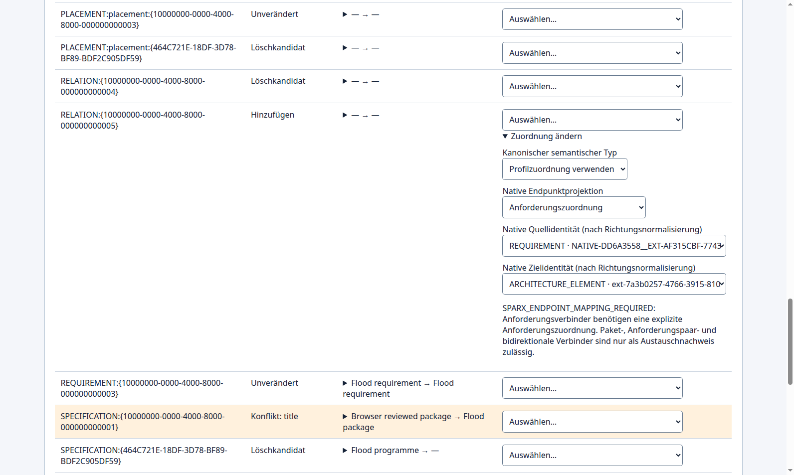 |
| Directed publication review | 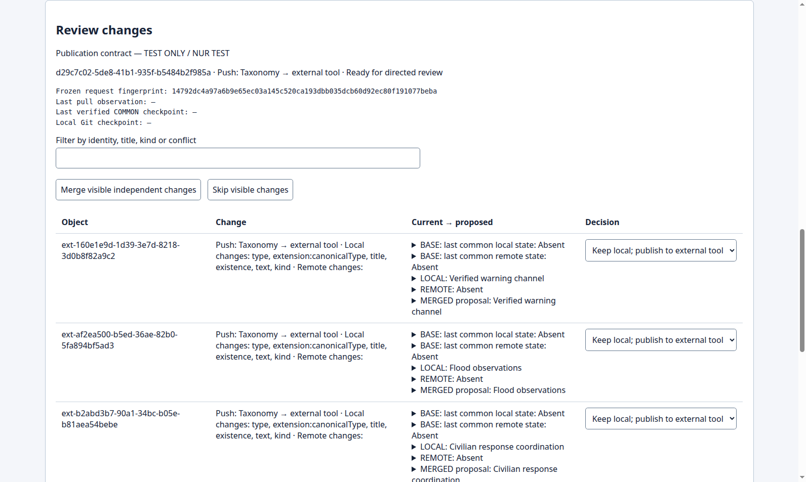 | 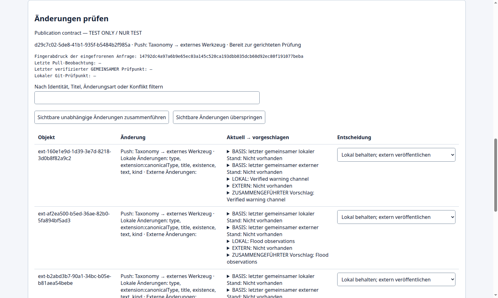 |
| Partial result with UNKNOWN | 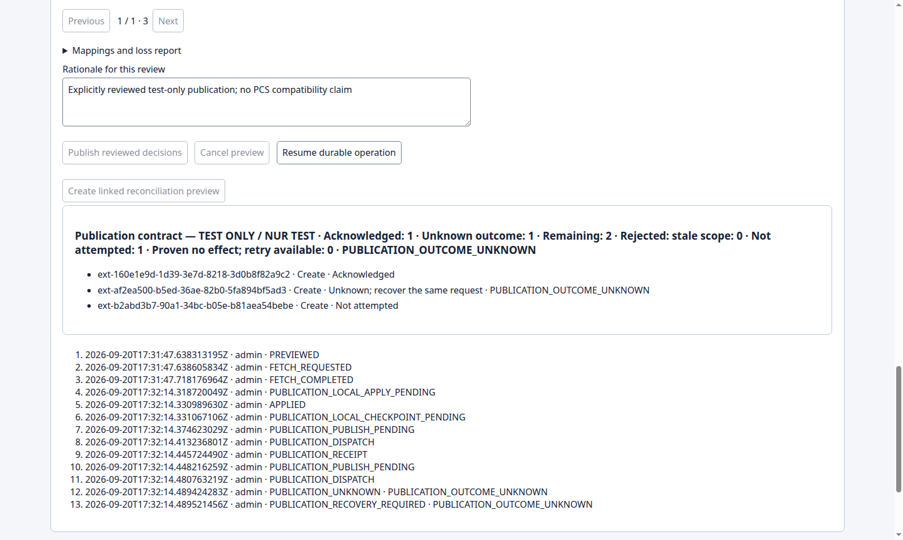 | 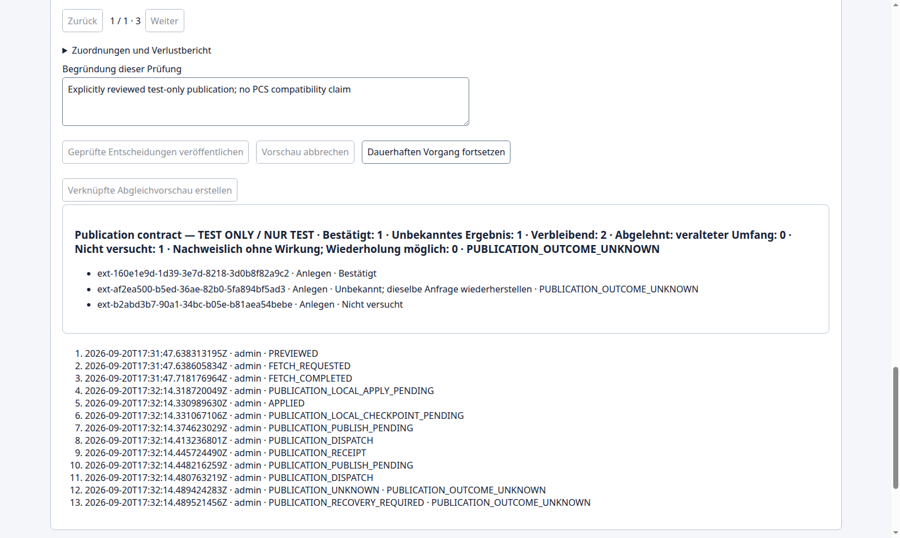 |
| Recovered result, COMMON and Git | 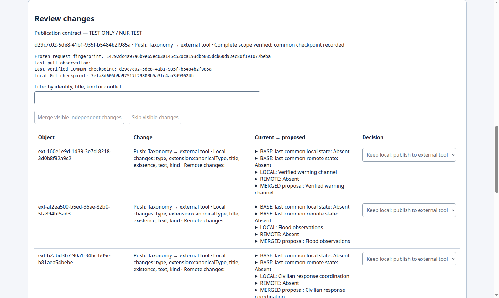 | 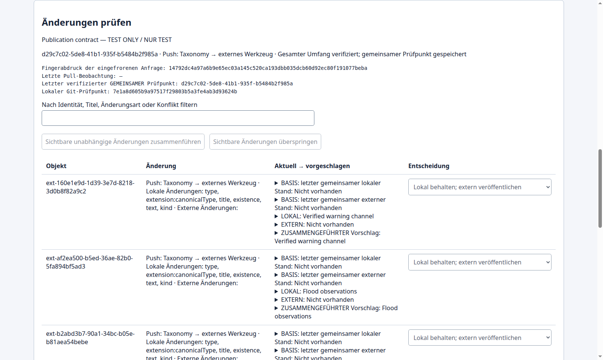 |
| Enabled reconciliation after explicit SKIP | 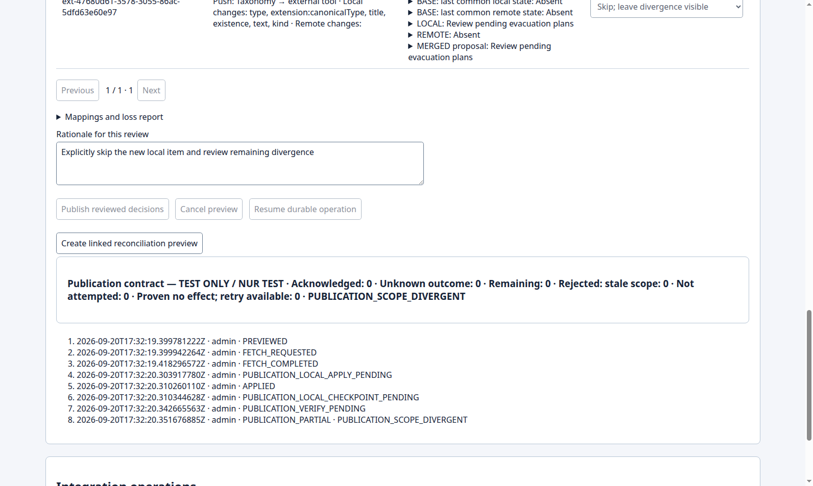 | 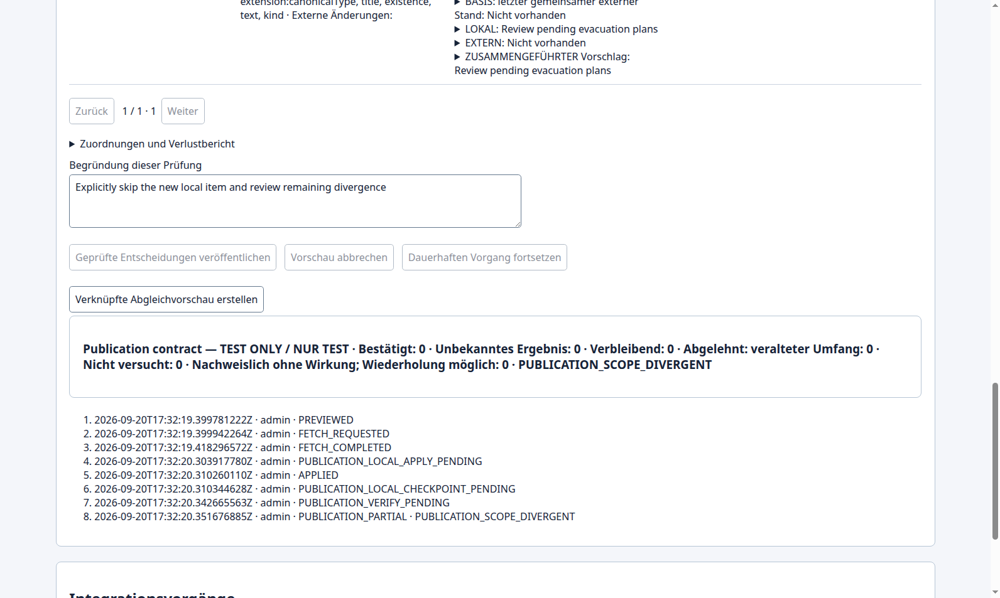 |
| New linked preview and predecessor link | 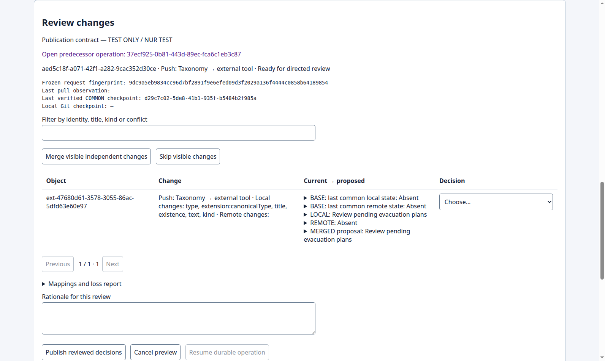 | 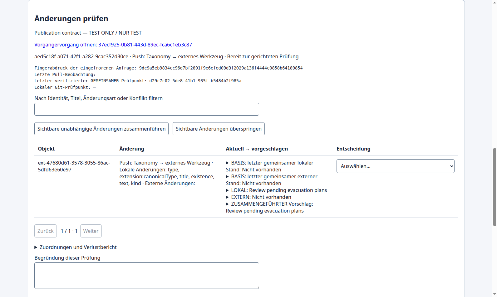 |
