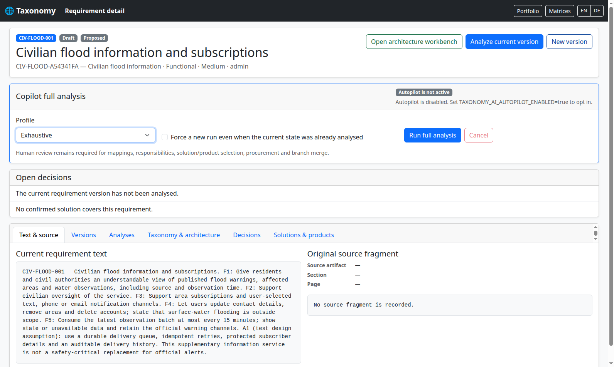
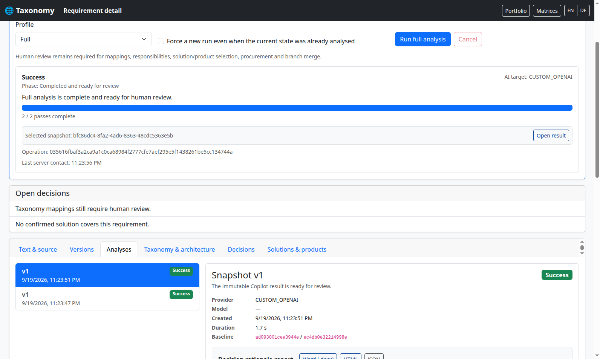
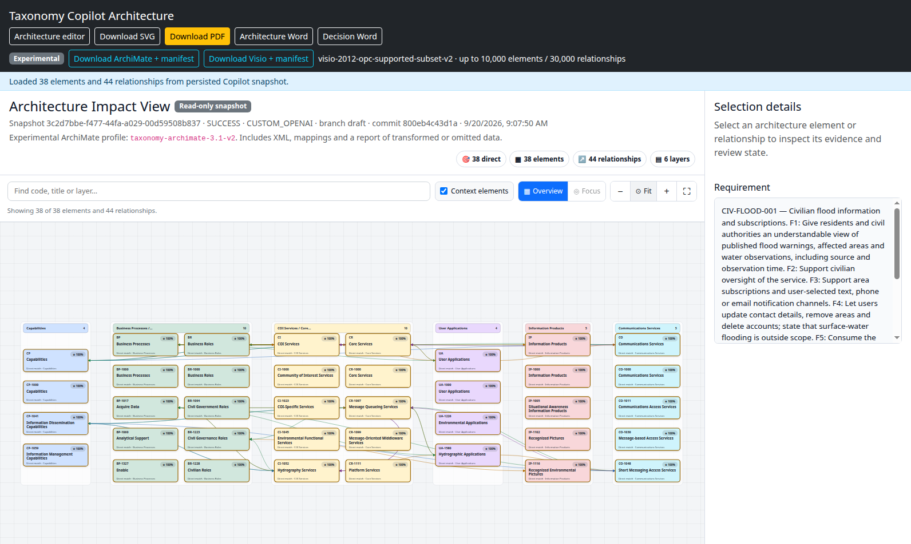
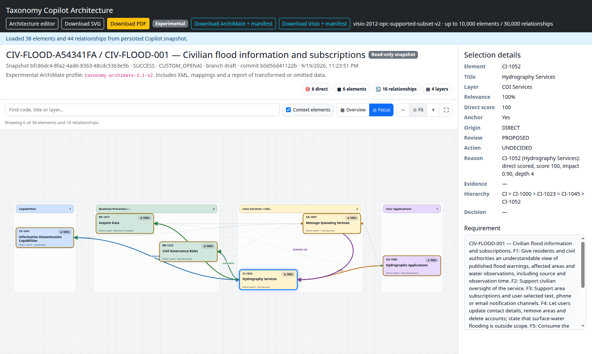
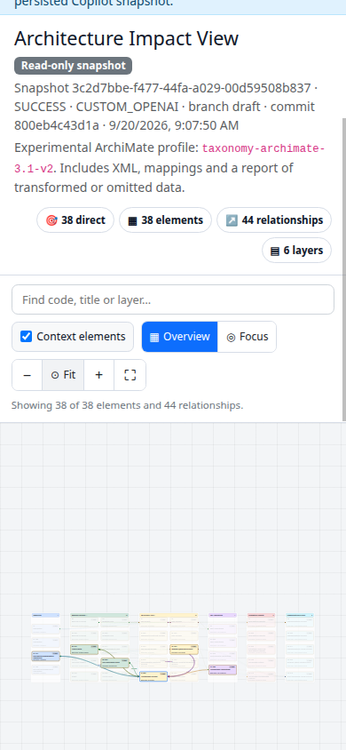

# Historische Bildschirmnachweise des Referenzszenarios

Die folgenden unveränderten Aufnahmen dokumentieren den damaligen Quellstand.
Sie sind keine aktuellen Produktabbildungen. Frühere Testbezeichnungen innerhalb
der Bilder und Nachweispfade werden nicht nachträglich retuschiert oder umgedeutet.
Der aktuelle Ablauf steht in der [Szenario-Abnahme](../testing/scenario-acceptance.md).

## Echte Bilder des Referenzlaufs

Diese unveränderten Browserbilder stammen aus dem erfolgreichen
[CI-Lauf 35475880662](https://github.com/carstenartur/Taxonomy/actions/runs/35475880662).
Ergebnis- und Architekturansichten verwenden Snapshot `bfc86dc4-8fa2-4ad6-8363-48cdc5363e5b`;
Anforderung und Projekt wurden zuvor in derselben Sitzung angelegt. Commit,
Browser-Version, Abmessungen und SHA-256-Werte stehen im
[Bildnachweis](../qa/civilian-acceptance-evidence.json).

Vor dem Start: der nachvollziehbare zivile Anforderungstext und das gewählte
Profil **Exhaustive**. Die Quellen stehen in der Szenariodatei, nicht in einem
nachträglich erfundenen Importfragment.

Nach dem Abschluss und Wiederöffnen: zwei erfolgreiche Durchläufe, der ausgewählte
Snapshot und die zugehörige Ergebnisansicht. Die Profilauswahl oben ist die Vorgabe
für einen nächsten Lauf; der abgeschlossene Auftrag belegt seine zwei Durchläufe
im Statusbereich.

Die vollständige Workbench zeigt 38 Elemente und 44 Beziehungen. Die Übersicht
bewahrt den Hierarchiekontext; für einzelne Bezeichnungen und Verbindungen sind
Zoom, Suche und Fokus vorgesehen.

Der ausgewählte Hydrografiedienst und seine fünf direkten Nachbarn bilden die
Fokusansicht mit sechs Knoten und 16 Beziehungen. Rechts bleiben Identität,
Herkunft und der noch offene Review-Status sichtbar.

Die gescrollte mobile Ansicht verwendet echte 390 × 844 CSS-Pixel in Chrome-
Geräteemulation. Die Bedienelemente umbrechen, und „Fit“ hält alle Knoten innerhalb
der Zeichenfläche. Die Gesamtübersicht ist dabei bewusst klein; zum Lesen einzelner
Elemente werden Zoom und Fokus benötigt. Dies ist kein Test auf einem physischen Telefon.

