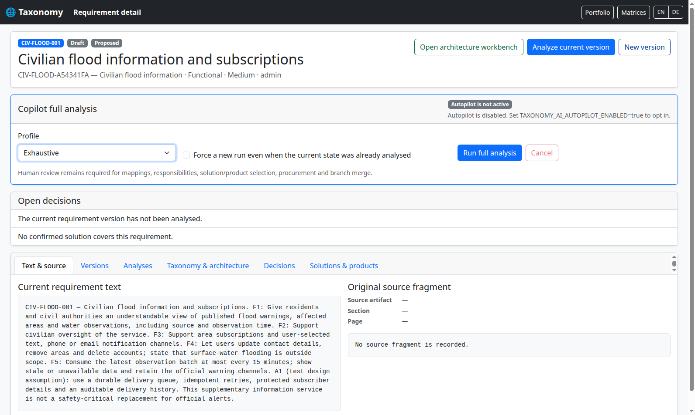
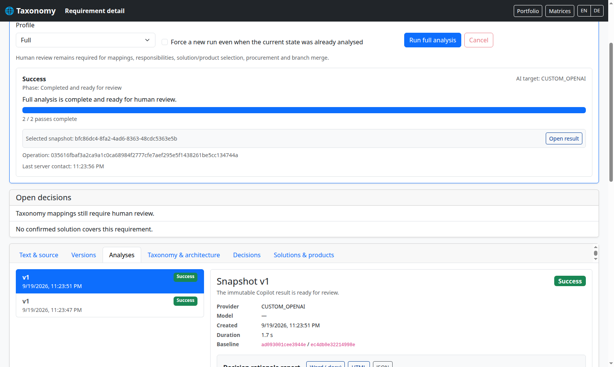
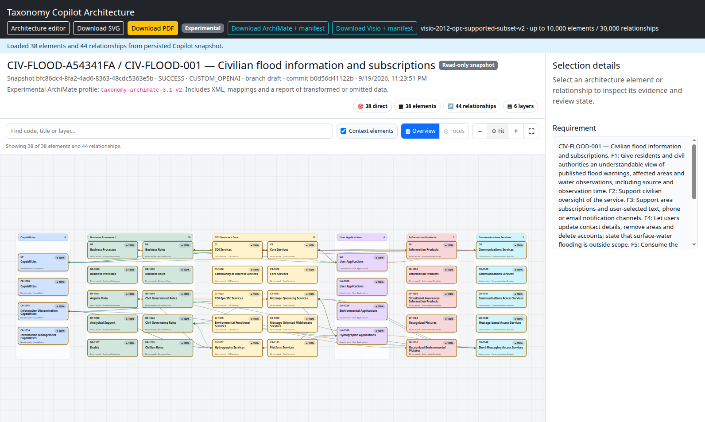
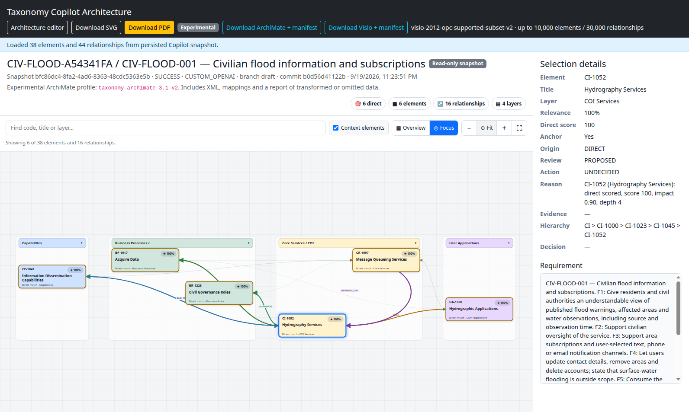
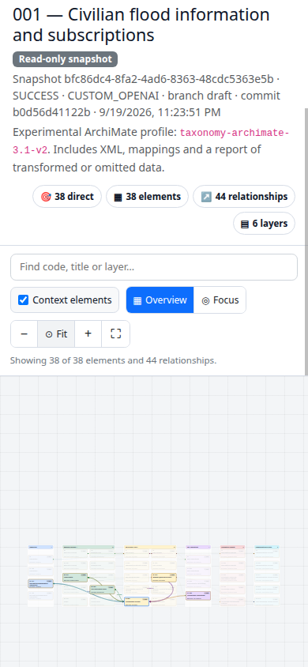

# Zivile Architektur als reproduzierbare Integrationsabnahme

Die Abnahme beginnt mit einer öffentlichen zivilen Anforderung und führt den echten
Taxonomy-Copilot bis zum gespeicherten Architektur-Snapshot und dessen Exporten aus.
Nur die HTTP-Antwort der entfernten LLM wird durch Spring ersetzt. Projektverwaltung,
Authentifizierung, Katalog, Prompts, Providerformat, Parser, Analyse, Verifikationsläufe,
Hypothesen, Datenbank, Git und Renderer bleiben echte Anwendungskomponenten.

## Nachvollziehbare Anforderung

`CIV-FLOOD-001` beschreibt einen ergänzenden Hochwasserinformationsdienst für England.
Die [GOV.UK-Dienstbeschreibung](https://www.gov.uk/get-flood-warnings) belegt
gebietsbezogene Warnungen, Kontaktkanäle und die Verwaltung eines Benutzerkontos.
Die [API-Dokumentation der Environment Agency](https://environment.data.gov.uk/flood-monitoring/doc/reference)
beschreibt Warngebiete, Messstellen, Beobachtungen, effiziente Abfragen und die Grenzen
der Verfügbarkeit. Beide Quellen wurden am 19. September 2026 geprüft.

Die Anforderung ist eine eigene, ausdrücklich gekennzeichnete Zusammenfassung dieser
Quellen. Warteschlange, idempotente Zustellung und Auditspur sind zusätzliche
Testannahmen (`A1`). Der öffentliche Datenzugang garantiert keine Verfügbarkeit und
ersetzt keine offiziellen sicherheitskritischen Warnkanäle. Es werden weder echte
Warnungen verschickt noch reale Abonnentendaten verwendet.

Die Datei
[`civilian-flood.json`](../../taxonomy-app/src/test/resources/scenarios/civilian-flood.json)
enthält Quellen, Anforderung, Katalogbindungen und 39 Antwortregeln auf rund 20 KB.
Die Antworten sind fachlich verfasste Testdaten, keine aufgezeichneten LLM-Ausgaben.

| Fachlicher Schwerpunkt | Tatsächlicher Katalog-Endpunkt |
|---|---|
| Eingang veröffentlichter Beobachtungen | BP-1017 — Acquire Data |
| Zivile Aufsicht | BR-1223 — Civil Governance Roles |
| Hydrografische Verarbeitung | CI-1052 — Hydrography Services |
| SMS-Zugang | CO-1048 — Short Messaging Access Services |
| Verbreitung von Informationen | CP-1041 — Information Dissemination Capabilities |
| Dauerhafte Zustellaufträge | CR-1097 — Message Queueing Services |
| Umweltlagebild | IP-1116 — Recognized Environmental Pictures |
| Oberfläche für Wasserinformationen | UA-1580 — Hydrographic Applications |

Alle Codes und Namen werden gegen `/api/taxonomy` geprüft, das den echten Workbook-
Katalog liefert. Die gewichteten Antworten konzentrieren jeden Taxonomiezweig auf
einen fachlichen Pfad. Ein Score von 100 ist hierbei eine Verteilung innerhalb dieses
Pfads; er bedeutet weder Vollständigkeit noch eine Freigabe der Architektur.

## Testgrenze und Ablauf

`CivilianLlmConfiguration` bindet `MockRestServiceServer` an das vorhandene
`RestTemplate`. `llm.mock=false` bleibt gesetzt. Der echte OpenAI-kompatible Gateway
sendet seine normalen Requests an `https://civilian.invalid/v1/chat/completions`;
der Spring-Server beantwortet sie im Prozess. Kein Netzwerk-Fallback ist möglich.
Unbekannte URLs, Modelle, Anfragen, Aufgaben, Budgets oder Kategorien führen zum Fehler.

`ScenarioLlmPlayback` erkennt die Anforderung, die Aufgabe und die vollständige Menge
der angefragten Kategorien. Aufrufreihenfolge und Wiederholungen verändern die Antwort
nicht. Doppelte Regeln werden schon beim Laden abgewiesen. Die Abnahme verlangt jede
Regel genau zweimal, einmal je Verifikationslauf; auch vom Anwendungscode abgefangene
Playback-Fehler lassen den Test scheitern.

1. Anmelden; Projekt und Anforderung anlegen.
2. Copilot mit Profil **Exhaustive**, zwei Verifikationsläufen und Lösungsvorschlägen starten.
3. Auf den tatsächlich gespeicherten erfolgreichen Auftrag warten.
4. Beide Snapshots auf gleiche Scores, Begründungen und Architektur prüfen.
5. Den ausgewählten Snapshot erneut über HTTP öffnen und dessen Identität prüfen.
6. Exporte aus diesem Snapshot bzw. seiner erzeugten Graphstruktur erstellen und prüfen.
7. Die erzeugte ArchiMate-Datei in einem per REST angelegten getrennten Repository prüfen
   und übernehmen; den unterstützten Anteil als Sparx-XMI ausliefern und wieder einlesen.
8. Optional denselben Ablauf im echten Browser ausführen, während der Analyse neu laden,
   Ergebnisse und Workbench öffnen, Bedienelemente ausführen und Screenshots speichern.

Der Test verwendet eine echte HSQLDB-Datenbank. Optionales ONNX-Embedding ist deaktiviert;
es wird nicht durch eine Attrappe ersetzt. Datenbankvarianten und reale Remote-LLMs
bleiben Aufgaben ihrer vorhandenen separaten Testreihen.
Während des Abschlusses lesen drei HTTP-Clients gleichzeitig den Auftragsstatus.
Jede Antwort muss erfolgreich sein; ein HTTP-500-Fehler wird nicht durch erneutes
Versuchen verdeckt.

## Ausführen

Normale Abnahme ohne Docker und ohne LLM-Schlüssel:

```bash
./mvnw -B -ntp -pl taxonomy-app -am test \
  -Pcivilian-acceptance -DgenerateScreenshots=false
```

Browserabnahme und Dokumentationsbilder mit Docker/Selenium:

```bash
./mvnw -B -ntp -pl taxonomy-app -am test -Pcivilian-acceptance
```

Alternativ kann ein lokal installiertes zusammenpassendes Chrome/ChromeDriver-Paar
mit `-Dwebdriver.chrome.driver=/absolute/path/chromedriver` und optional
`-Dcivilian.chrome.binary=/absolute/path/chrome` verwendet werden.
Das Profil `civilian-acceptance` setzt `generateScreenshots=true` und aktiviert damit
Browser und Screenshots. `-DgenerateScreenshots=false` schaltet beides aus.
Es werden keine HTML-Inhalte, erfolgreichen Antworten oder Ergebniszustände injiziert.
Der Container-Browser vertraut ausschließlich der dynamischen HTTP-Testadresse
`host.testcontainers.internal:<port>`, wie die vorhandene Container-Testinfrastruktur.
Damit blockiert Chrome die Anhänge nicht als unsichere Downloads. Die Ausnahme gilt
nur für diesen Browserlauf; produktive Bereitstellungen benötigen ihre reguläre
HTTPS-Konfiguration.

Die ergänzende CI
[`.github/workflows/civilian-acceptance.yml`](../../.github/workflows/civilian-acceptance.yml)
führt den Browserweg bei relevanten Pull Requests aus und bewahrt das gesamte
Abnahmepaket als Workflow-Artefakt auf. Sie benötigt keine Provider-Secrets und schreibt
nichts in den Branch zurück. Die allgemeine Pflichtprüfung bleibt:

```bash
./mvnw verify -DexcludedGroups="real-llm"
```

## Exporte und Prüftiefe

Die [Word- und Sparx-Abschlussprüfung](../qa/word-and-sparx-completion-review.md)
unterscheidet die beiden Word-Exporte und hält fehlende Graphen sowie den noch
implementierbaren Umfang von #1075 fest. Grüne Abnahmetests sind keine Aussage,
dass diese offenen Produktfunktionen bereits vorhanden sind.

| Ausgabe | Geprüfte Eigenschaften |
|---|---|
| Architektur-SVG | XML, Knotenidentitäten, kein Skript, Koordinaten innerhalb der Szene |
| Architektur-PDF | PDFBox liest das Dokument; Knoten, Anforderung und Snapshot im Text; mindestens 7 pt für sämtliche Zeichen; optional gerenderte Vorschau |
| ArchiMate XML + ZIP | Profil-Reader rekonstruiert denselben Graphen; Bundle-Inhalt und Hash stimmen überein |
| Visio VSDX + ZIP | XML-Paket, ursprüngliche Element-/Beziehungsidentitäten, vorhandene Connector-Endpunkte, gleicher Bundle-Inhalt |
| Entscheidungsbericht HTML, DOCX, JSON | Anforderung und Snapshot erhalten; Word-Dokument mit echtem POI-Parser gelesen |
| Diagrammadapter ArchiMate, Visio, Mermaid, Structurizr | Alle registrierten Adapter erhalten denselben erzeugten Graphen; Mermaid-Labels sowie offizieller Structurizr-Parser 6.2.3 und lokale Importparität |
| Allgemeiner Bericht Markdown, HTML, DOCX, JSON | Echte REST-Endpunkte erhalten die erzeugten Scores; Dokumente lesbar und der Anforderung zugeordnet |
| Unabhängiges Rendering | LibreOffice Writer/Draw öffnen DOCX/VSDX; Poppler prüft alle Begründungen und Knotenlabels, leere Seiten und Seitenumfang; PNGs für Sichtprüfung |
| Sparx-XMI über echte Integrations-API | Geprüfter ArchiMate-Import, natives Journal, Exportvorschau, Verlustentscheidungen, Dateiabruf und semantischer Vergleich der unterstützten Teilmenge |
| ArchiMate-Integrationscodec | Tatsächlich exportierte Datei wird eingelesen, erneut geschrieben und mit gleichen Identitäten eingelesen |

Das sind 17 Snapshot-/Berichtsdateien plus die geprüfte Sparx-XMI-Datei, zusätzlich zu Snapshot, Auftragsdaten, LLM-Aufrufprotokoll und
Qualitätsbericht in `taxonomy-app/target/civilian-acceptance/`. Die vier Diagrammadapter
werden direkt über ihre produktive Spring-Registrierung aufgerufen, da ihre älteren
REST-Endpunkte bewusst eine neue Analyse starten würden. Die Snapshot-Exporte dürfen
keinen zusätzlichen LLM-Aufruf auslösen.

Die [fachliche Referenzprüfung](../qa/civilian-reference-review.md) dokumentiert
F1–F5/A1 samt verbleibenden Abdeckungslücken. `integration-import-review.json` und
`integration-sparx-review.json` halten jede Annahme/Ablehnung fest; der ursprüngliche
Snapshot bleibt unverändert. Von 44 Beziehungskandidaten werden 36 nativ übernommen;
das Sparx-Profil v1 kann davon 8 liefern. Diese Grenze ist ein geprüftes Ergebnis.

Die CI rendert die tatsächlichen Dateien zusätzlich mit:

```bash
./mvnw -B -ntp -pl taxonomy-tooling -am compile -DskipTests
java -cp taxonomy-tooling/target/classes com.taxonomy.tooling.TaxonomyTooling check-civilian-documents --artifacts taxonomy-app/target/civilian-acceptance
```

Dafür werden LibreOffice Writer/Draw und Poppler benötigt. `document-qa/` enthält
PDFs, sämtliche Seiten-PNGs und `quality.json` mit Renderer-Version, Hashes und
Textprüfungen. Dies ersetzt keine Abnahme mit Microsoft Visio oder Sparx EA.

`quality.json` dokumentiert Prüfungen, Graphgrößen, isolierte Kategorien und Datei-Hashes.
`run.json` benennt Szenario, Fixture-Hash, Snapshot und in der CI den Commit und Run.
`controls.json` und `browser.json` entstehen nur bei erfolgreicher Browserabnahme.
Die vier Workbench-Downloads werden tatsächlich im Browser heruntergeladen und
anschließend derselben Inhaltsprüfung unterzogen; `browser.json` enthält ihre Hashes.
Der Fokus muss exakt den gewählten Knoten und seine direkten Nachbarn enthalten,
und „Fit“ muss die Knoten innerhalb der sichtbaren SVG-Fläche platzieren.
Der vollständige Snapshot bleibt ein generiertes Testartefakt; er wird nicht als
vorbereitete Eingabe in den nächsten Lauf geladen.

Die mobile Browserprüfung verwendet Chromes Geräteemulation mit 390 × 844 CSS-Pixeln
und prüft die tatsächliche Viewport-Breite. Eine bloße Fenstergrößenanforderung reicht
nicht aus: Chrome begrenzt normale Fenster in dieser Umgebung auf mindestens 500 Pixel.
Die Emulation verändert weder Anwendungsdaten noch Netzwerkantworten.

## Bedienelemente des dokumentierten Ablaufs

| Ansicht / Bedienelement | Funktion und erwartetes Ergebnis |
|---|---|
| Projects / neues Projekt / Save | Legt das Projekt über den echten Portfolio-Endpunkt an. |
| Neue Anforderung / Typ / Save | Speichert den Text und eine erste Anforderungsversion. |
| Anforderung / Portfolio / Matrices | Öffnet die Projektübersicht bzw. die Matrizen des Projekts. |
| Anforderung / EN / DE | Wechselt die Sprache der Seite. |
| Anforderung / Open architecture workbench | Öffnet die Architektur des ausgewählten gespeicherten Ergebnisses. |
| Anforderung / Analyze current version | Startet die einzelne Analyse der aktuellen Anforderungsversion. Der Referenzablauf verwendet den vollständigen Copilot darunter. |
| Anforderung / New version | Öffnet den Dialog für einen neuen Textstand; Create version speichert ihn, Cancel schließt den Dialog. |
| Anforderung / Text & source | Zeigt Anforderungstext und gegebenenfalls das importierte Quellfragment. Die Quellen dieses manuell angelegten Falls stehen in der Szenariodatei. |
| Anforderung / Versions / Analyses | Zeigt gespeicherte Textstände bzw. Analysen und deren auswählbare Snapshots. |
| Anforderung / Taxonomy & architecture | Zeigt Zuordnungen und Architekturinformationen des Ergebnisses. |
| Anforderung / Decisions / Solutions & products | Zeigt offene fachliche Entscheidungen bzw. Lösungs- und Produktvorschläge. Diese erfordern menschliche Prüfung. |
| Copilot / Profile | Standard, Full oder Exhaustive wählen; die Referenz verwendet Exhaustive für zwei Verifikationsläufe. |
| Copilot / Force | Erzwingt einen neuen Lauf, auch wenn ein verwendbares Ergebnis existiert. |
| Copilot / Run full analysis | Startet den persistenten Auftrag; Status und Verifikationsläufe erscheinen. |
| Copilot / Cancel | Fordert den Abbruch aktiver Läufe an; nach dem Abschluss ist der Knopf deaktiviert. Abbruch-Fehlerszenarien besitzt `CompleteCopilotSessionIT`. |
| Copilot / Ergebnisaktionen | Öffnen den ausgewählten Snapshot bzw. die Architektur, keine neue Analyse. |
| Ergebnis / Berichtsformate | Laden den Entscheidungsbericht des ausgewählten Snapshots als HTML, DOCX oder JSON. |
| Workbench / Suche | Markiert Knoten nach Code, Titel oder Schicht; die Referenz sucht CI-1052. |
| Workbench / × | Leert die Suche und entfernt die Suchmarkierung. |
| Workbench / Knoten auswählen | Zeigt Identität, Herkunft, Begründung und Review-Status im Detailbereich. |
| Workbench / Context elements | Schaltet zusätzliche Kontextknoten ein oder aus. Die Referenz enthält nur Ankerknoten; hier wird die unveränderte Ankersicht geprüft, kein Ausblenden zusätzlicher Kontextknoten nachgewiesen. |
| Workbench / Overview | Zeigt wieder die vollständige sichtbare Übersicht. |
| Workbench / Focus | Zeigt den gewählten Knoten und seine Nachbarn; benötigt eine Auswahl. |
| Workbench / − und + | Verkleinern bzw. vergrößern den Ausschnitt. |
| Workbench / Fit | Passt die Darstellung an die verfügbare Zeichenfläche an. |
| Workbench / Fullscreen | Wechselt in den Vollbildmodus und zurück. |
| Workbench / Architecture editor | Öffnet den separaten Editor; die angezeigte Workbench selbst bleibt eine schreibgeschützte Snapshot-Ansicht. |
| Workbench / Download SVG / PDF | Lädt die serverseitige Architektur; die Datei ist kein Screenshot der Seite. |
| Workbench / Download ArchiMate + manifest | Lädt Austausch-XML mit Profil- und Verlustinformationen. |
| Workbench / Download Visio + manifest | Lädt VSDX mit stabilen Identitäten und Verlustinformationen. |

Ansichtsfilter und Zoom verändern den gespeicherten Snapshot nicht. Die Download-
Endpunkte verwenden dessen vollständigen Graphen. Das vollständige DOM-Inventar
enthält zusätzlich sichtbare, versteckte und deaktivierte Steuerelemente; die Tabelle
beschreibt die für diesen Ablauf relevanten Aktionen, keine vollständige Anleitung
aller Verwaltungsseiten der Anwendung.

## Echte Bilder des Referenzlaufs

Diese unveränderten Browserbilder stammen aus dem erfolgreichen
[CI-Lauf 35475880662](https://github.com/carstenartur/Taxonomy/actions/runs/35475880662).
Ergebnis- und Architekturansichten verwenden Snapshot `bfc86dc4-8fa2-4ad6-8363-48cdc5363e5b`;
Anforderung und Projekt wurden zuvor in derselben Sitzung angelegt. Commit,
Browser-Version, Abmessungen und SHA-256-Werte stehen im
[Bildnachweis](../qa/civilian-acceptance-evidence.json).

Vor dem Start: der nachvollziehbare zivile Anforderungstext und das gewählte
Profil **Exhaustive**. Die Quellen stehen in der Szenariodatei, nicht in einem
nachträglich erfundenen Importfragment.



Nach dem Abschluss und Wiederöffnen: zwei erfolgreiche Durchläufe, der ausgewählte
Snapshot und die zugehörige Ergebnisansicht. Die Profilauswahl oben ist die Vorgabe
für einen nächsten Lauf; der abgeschlossene Auftrag belegt seine zwei Durchläufe
im Statusbereich.



Die vollständige Workbench zeigt 38 Elemente und 44 Beziehungen. Die Übersicht
bewahrt den Hierarchiekontext; für einzelne Bezeichnungen und Verbindungen sind
Zoom, Suche und Fokus vorgesehen.



Der ausgewählte Hydrografiedienst und seine fünf direkten Nachbarn bilden die
Fokusansicht mit sechs Knoten und 16 Beziehungen. Rechts bleiben Identität,
Herkunft und der noch offene Review-Status sichtbar.



Die gescrollte mobile Ansicht verwendet echte 390 × 844 CSS-Pixel in Chrome-
Geräteemulation. Die Bedienelemente umbrechen, und „Fit“ hält alle Knoten innerhalb
der Zeichenfläche. Die Gesamtübersicht ist dabei bewusst klein; zum Lesen einzelner
Elemente werden Zoom und Fokus benötigt. Dies ist kein Test auf einem physischen Telefon.



## Qualitätsbefunde und Grenzen

Die zivile Abnahme hat eine reale Vervielfachung abgeleiteter Beziehungen aufgedeckt:
auch gleich bewertete Vorfahren wurden als konkrete Impact-Endpunkte behandelt.
Die Auswahl unterdrückt nun einen Vorfahren, wenn ein qualifizierter Nachfolger
seinen Pfad repräsentiert. Andere Zweige und schwach bewertete Nachfolger bleiben
korrekt unterscheidbar. Im Referenzfall sinkt die Zahl von 334 auf 44 Beziehungen.

Zwei weitere Befunde betreffen die Ausgabe: Ein interner Übersetzungsschlüssel wurde
als Titel übernommen; jetzt wird dafür der lesbare Anforderungstitel verwendet.
Die breite Szene wurde zuvor auf A3 bis auf 5 pt verkleinert, und lange Typnamen
ragten aus dem Knoten. Der PDF-Renderer vergrößert jetzt die Seite bis zur natürlichen
Szenengröße, trennt Typ und Score und prüft deren Positionen in einer Regression.
A3 bleibt die Mindestgröße. Breite Diagramme sind damit Poster-PDFs; ein Ausdruck
mit „auf A3 verkleinern“ würde die Schrift erneut verkleinern. Extrem große Szenen
oberhalb der PDF-Seitengrenze von 14.400 pt werden weiterhin skaliert.

Parallele Statusabfragen deckten außerdem einen Schreibkonflikt beim Abschluss des
Copilot-Auftrags auf. Die Auswahl des aktuellen Snapshots sperrt jetzt die betroffene
Anforderung innerhalb ihrer Transaktion; wiederholte Abschlussversuche bleiben
idempotent. Die Regression verwendet drei gleichzeitige echte HTTP-Abfragen.

„Fit“ berücksichtigt nun auch Ansichten unter 20 % Zoom. Die frühere Untergrenze
schnitt breite Diagramme auf einem Telefon und sehr hohe Diagramme ab. Die
Geometrieprüfung reproduziert beide Fälle und verlangt vollständig sichtbare Grenzen
mit Rand; die Browserabnahme prüft zusätzlich die tatsächliche mobile SVG-Fläche.

Der Copilot liefert weiterhin eine **Taxonomie-basierte Kandidatenarchitektur**.
Kontoverwaltung, Zustellgarantien, konkrete Datenmodelle und die vollständige Umsetzung
sämtlicher Anforderungssätze werden dadurch nicht bewiesen. Hierarchiekontext und
abgeleitete Hypothesen bleiben erkennbar; sie sind keine fachlich bestätigten
Komponenten oder Schnittstellen. Fachliche Vollständigkeit, Lesbarkeit bei gewünschtem
Druckmaßstab und echte Zielprodukt-Kompatibilität sind zusätzliche Abnahmekriterien.
Der lokale Structurizr-Importer ist keine unabhängige Prüfung der vollständigen DSL.
Sparx EA und Microsoft Visio werden durch diese Tests nicht als Desktop-Produkte gestartet.

Für eine visuelle Freigabe sind die echten Browserbilder und die gerenderte PDF-Seite
zu prüfen: lesbare Bezeichnungen, keine Überdeckungen, nachvollziehbare Verbindungen,
kein abgeschnittener Text, verständliche Hinweise auf Hypothesen und Exportverluste.
Ein erfolgreicher Parser-Test allein ist keine visuelle Freigabe.

Die erste tatsächliche Word-Renderprüfung hat einen offenen Befund geliefert:
Der Entscheidungsbericht umfasst 87 Seiten, darunter eine Seite ohne Inhalt
zwischen Titelseite und Zusammenfassung. Wiederholte Begründungen in schmalen
Tabellenspalten erschweren die kompakte Darstellung. Diese Datei ist daher trotz
bestandener Strukturprüfung noch nicht visuell freigegeben. Aktueller Stand und
Prüfgrenzen stehen im [Validierungsnachweis](../qa/civilian-acceptance-validation.md).
